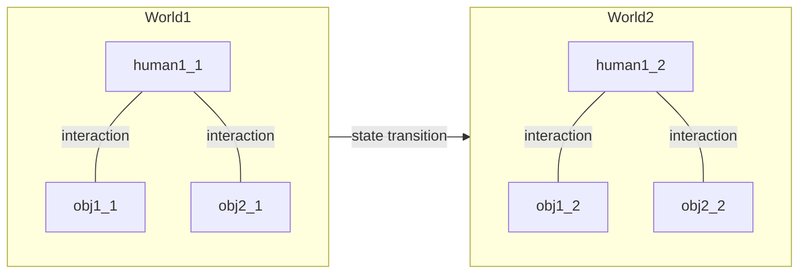

<style>
h1 {
  background-color: rgb(66,185,131);
  color: white;
  text-align: center;
  font-family: YouYuan;
}
div.cols-2 {
  overflow: visible;
  display: grid;
  gap: 1rem;
  grid-template-columns: 50% 50%;
  grid-template-rows: 10% 90%;
  grid-template-areas:
      "slideheading slideheading"
      "leftpanel    rightpanel";
}
div.cols-2 .ldiv { 
  grid-area: leftpanel; 
  margin-top: -2%;
}
div.cols-2 .rdiv { 
  grid-area: rightpanel; 
  margin-top: -2%;
}

</style>


_最近更新：2025-03-24_
- - -



<details>
<summary>human状态更新</summary>

> 认识更新
>> nature: obj $\lrarr$ obj  
>> society: human $\lrarr$ human  

> 工具更新
>> 表示工具: lang符号和math逻辑  
>> 实践工具: human $\lrarr$ obj

```markmap
- human
  - 工具
    - 表示工具(符号和逻辑)
      - [语言学](#/README?id=lang)
      - [数学](#/README?id=math)
    - 实践工具(生产)
      - 采掘
      - 化工
      - 工业生产
        - 能源生产(化石/核工业/太阳能/风能/水电)运输存储
        - 电气电机
        - 机械工程
        - 轻工(纺织/食品/日化)
        - 生物工程
        - 材料
        - 测控感知仪器
        - 移动载具(船艇/车辆/航空航天)
        - 机器人
        - 装备及兵器
      - 建筑规划
      - 交运工程
      - 农、林、环境工程
      - 医学
      - 信息
        - 电子工程
        - 通信工程
        - 计算机系统工程
        - 软件工程
        - 传媒(新闻传播/互联网)
  - 认识
    - 自然obj(微观粒子/宏观物质) 
      - 物理学
      - 化学
      - 生物学
      - 地球物理学(地球物理/地理/地质/海洋/大气/生态)
      - 天文学
    - 社会obj(个人/家庭/企业/国家机构)
      - 心理学
      - 教育学
      - 艺术学
        - 文学
        - 音乐与舞蹈学
        - 戏剧与影视学
        - 美术学
        - 设计学
      - 商管(Business Administration)
        - 精算
        - 会计
        - 市场营销
        - 工商管理
        - 公共管理
        - 金融学
        - 经济学
      - 法学
      - 政治学
      - 社会学
      - 哲学
      - 历史学
```
</details>

<details>
<summary>obj状态更新</summary>

> obj类型
>> 自然对象  
>> 社会对象

> 状态类型
>> 量: 分析范围改变——隔离的边界改变状态迁移函数不变  
>> 质: 分析方法改变——抽象的方法改变状态迁移函数改变
</details>

<br>


# Practice
<div class="cols-2">

- [Overview](/practice/practice.md)
- [Thoughts](/practice/thoughts/thoughts.md)
- [Simulation](/practice/simulation/simulation.md)
- [Communications](/practice/communications/communications.md)

<r>

- [Software](/practice/software/software.md)
  - [常用](/practice/software/tools/general.md)
  - [Database](/practice/software/database/database.md)
  - [App](/practice/software/app/app.md)
  - [E-Game](/practice/software/egame/egame.md)
  - [Python](/practice/software/python/python.md)
  - [C++](/practice/software/cpp/cpp.md)
  - [JS](/practice/software/js/javascript.md)
  - [Markdown](/practice/software/tools/markdown.md)
  - [Tex_math](/practice/software/tools/tex_math.md)
  - [md2ppt](/practice/software/tools/md2ppt.md)


</div>

# Lang
<div class="cols-2">

</div>

# Math
<div class="cols-2">

- [Overview](/math/math.md)
- [Category](/math/category/category.md)
- [Algebra](/math/algebra/algebra.md)

<r>

- [Statistics](/math/statistics/statistics.md)
- [Modeling](/math/modeling/modeling.md)

</div>

# Nature
<div class="cols-2">

</div>

# Society
<div class="cols-2">

- [Overview](/society/society.md)
- [Art]()
  - [Writing](/society/art/writing/writing.md)

<r>

- [Economics](/society/economics/economics.md)
  - [MacroFin](/society/economics/macrofinance/macrofinance.md)
- [History](/society/history/history.md)

</div>