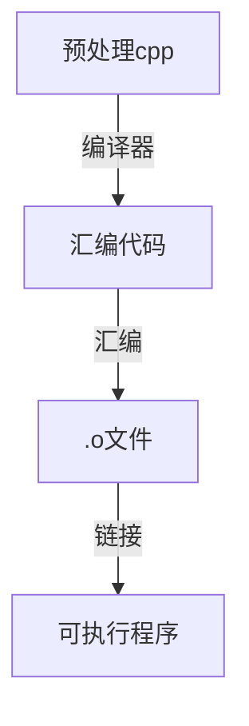

# 基础
## 基础
- 符号说明
    |符号|说明|
    |-|-|
    |`->`|成员访问运算符，用于通过指针访问对象的成员（变量或函数）。|
    |`.`|成员访问运算符，对象成员直接访问|
    |`::`|作用域解析运算符，<域名>::<函数或类型>；::<函数或类型>表示调用全局的函数或类型|

## 运行


    各文件独立编译，然后链接编译结果
    .h头文件里统一声明变量和函数

- 头文件
    - .h头文件中，只能存在变量或者函数的声明，而不要放定义：一个符号在整个程序中可以被声明多次，但却要且仅要被定义一次，编译器在编译的时候会生成一个符号表（symbol table），看不到定义的符号会被存放在这个表中，进行链接的时候，编译器会在别的目标文件中去寻找符号的定义。
    - 可包含的内容
        - 声明：extern int a; void f();
        - 定义：const对象; static对象; 内联函数（inline）的定义; 类（class）的定义.
        > const int a; 全局的 const 对象默认是没有 extern 的声明的，所以它只在当前文件中有效。把这样的对象写进头文件中，即使它被包含到其他多个 .cpp 文件中，这个对象也都只在包含它的那个文件中有效，对其他文件来说是不可见的，所以便不会导致多重定义。
        > static同const对象。
        > inline函数是需要编译器在遇到它的地方根据它的定义把它内联展开的，而并非是普通函数那样可以先声明再链接的（内联函数不会链接），所以编译器就需要在编译时看到内联函数的完整定义才行。 C++ 规定，内联函数可以在程序中定义多次，只要内联函数在一个 .cpp 文件中只出现一次，并且在所有的 .cpp 文件中这个内联函数的定义是一样的，就能通过编译。
        > 在程序中创建一个类的对象时，编译器只有在这个类的定义完全可见的情况下，才能知道这个类的对象应该如何布局，所以关于类的定义的要求跟内联函数是基本一样的。类的定义中包含着数据成员和函数成员，数据成员是要等到具体的对象被创建时才会被定义（分配空间），但函数成员却是需要在一开始就被定义的，这也就是我们通常所说的类的实现。一般，我们的做法是，把类的定义放在头文件中，而把函数成员的实现代码放在一个 .cpp 文件中。这是可以的，也是很好的办法。另一种办法是直接把函数成员的实现代码也写进类定义里面。在 C++ 的类中，如果函数成员在类的定义体中被定义，那么编译器会视这个函数为内联的。因此，把函数成员的定义写进类定义体，一起放进头文件中，是合法的。注意一下，如果把函数成员的定义写在类定义的头文件中，而没有写进类定义中，这是不合法的，因为这个函数成员此时就不是内联的了。
    - 头文件中的保护措施：通过 #define 定义一个名字，并且通过条件编译 #ifndef...#endif 使得编译器可以根据这个名字是否被定义，再决定要不要继续编译该头文中后续的内容。
    - 源文件如何根据 #include 来关联头文件：源文件如何根据 #include 来关联头文件；用户自定义的文件用双引号括起来，编译器首先会在用户目录下查找，然后在到 C++ 安装目录（比如 VC 中可以指定和修改库文件查找路径，Unix 和 Linux 中可以通过环境变量来设定）中查找，最后在系统文件中查找。
    - 头文件如何来关联源文件：编译的时候 .h 头文件并不会去找 .cpp 源文件中的定义实现，只有在 link 的时候才进行这个工作。在 link 的时候，需要在 makefile 里面说明需要连接哪个 .o 或 .obj 文件（在这里是 .cpp 生成的 .o 或 .obj 文件），连接器会去这个 .o 或 .obj 文件中找在 .cpp 中实现的函数，再把他们 build 到 makefile 中指定的那个可以执行文件中。在 VC 中，一帮情况下不需要自己写 makefile，只需要将需要的文件都包括在 project中，VC 会自动帮你把 makefile 写好。通常，C++ 编译器会在每个 .o 或 .obj 文件中都去找一下所需要的符号，而不是只在某个文件中找或者说找到一个就不找了。因此，如果在几个不同文件中实现了同一个函数，或者定义了同一个全局变量，链接的时候就会提示 "redefined"。
    - .h文件中能包含：
        static 普通变量和普通函数的定义
        类的内联函数的定义
        类成员数据的声明，但不能赋值
        非类成员函数的声明
    - .h文件中不能包含：
        非静态变量（不是类的数据成员）的声明
        static 成员函数和成员变量的定义：static 关键字是为了限制可见性，用于仅本文件可见。而 static 修饰类的成员变量时，该成员是属于类本身，所有类的实例对象共享。static 成员变量并不限制仅本文件可见，所以头文件中不能包含static 成员函数和成员变量的定义，只能声明。
        默认命名空间声明不要放在头文件，using namespace std;等应放在.cpp中，在 .h 文件中使用 std::string

## 指针
- 普通指针：不会自动释放内存，需要手动调用 `delete` 或 `delete[]` 来释放。
- 智能指针：会自动管理所指向的对象的内存，当智能指针超出作用域或被显式释放时，它会自动调用 `delete` 或 `delete[]` 来释放内存，从而避免内存泄漏。
    |指针类型|指针|说明|
    |-|-|-|
    |强智能指针|unique_ptr|unique_ptr对象不能被复制到另一个对象，但可以被移动，从而保证了资源的唯一所有权。|
    |强智能指针|shared_ptr|shared_ptr基于引用计数，允许多个shared_ptr对象共享同一个资源。当最后一个shared_ptr被销毁时，资源才会被释放。循环引用可能导致内存泄漏。|
    |弱智能指针|weak_ptr|weak_ptr用于观察shared_ptr管理的资源，但不拥有资源。当shared_ptr的引用计数降到零时，即使有weak_ptr指向资源，资源也会被释放。|

    > 注意事项：
    > - 不要将原生指针赋给多个智能指针。
    > - 避免使用get()方法返回的原生指针初始化另一个智能指针。
    > - 注意shared_ptr的循环引用问题，它可能导致资源无法释放。

## 工厂

# 应用
## UE
### 基础
- IDE选择和设置
    - [VSC](https://dev.epicgames.com/documentation/zh-cn/unreal-engine/setting-up-visual-studio-code-for-unreal-engine): 
        > 1.下载并安装VSCode以及针对VSCode的官方C/C++扩展包和C#扩展。
        > 2.安装Microsoft Visual C++ (MSVC)编译器工具集
        > 3.将VS Code设置为默认IDE: 虚幻编辑器（Unreal Editor）>编辑（Edit）>编辑器偏好设置（Editor Preferences）>通用（General）>源代码（Source Code），然后将你的源代码编辑器（Source Code Editor）设置为 Visual Studio Code 。重启编辑器，使更改生效。
        > 4.为VS Code设置IntelliSense： 按照官网`c_cpp_properties.json`实例编辑.vscode文件
        > 5.在VS Code中编译和启动项目
        > 6.生成VSCode工作区: 三种方法
        >> 方法一 虚幻编辑器（Unreal Editor）>工具（Tools）>刷新Visual Studio Code项目（Refresh Visual Studio Code Project）。
        >> 方法二 右键点击项目的 .uproject 文件并点击生成项目文件（Generate Project Files）。完成后，你应该会在项目的文件夹中看到.code-workspace 文件。
        >> 方法三 在命令行中，运行 /GenerateProjectFiles.bat -vscode 。添加 -vscode 参数将创建 .vscode 工作区而不是Visual Studio .sln 。如果你使用此方法，则不需要更改默认源代码编辑器。
        - 安装VSC及Unreal Engine 4 Snippets插件，该插件同样适用于UE5; 
        - UE source code设置为VSC; 
        - VSC IntelliSense设置参考4.; 
        - 默认命令行设置为powershell: VSC>terminal.integrated.default; 
        - 设置VSC的Run为develop editor: 启动UE编辑器运行调试.
    - VS2022
- UE运行逻辑：Unreal 启动流程的定义 是在 Launch.cpp中。引擎的启动流程以各个平台的main函数作为入口，最终会进入到GuardedMain函数中。GuardedMain 函数定义了引擎的启动流程和主循环(但这些函数只是一个壳，核心的实现都是FEngineLoop 这个类来实现的)，可分4个环节。
    ```mermaid
    flowchart TD
    EnginePreInit --> c["EditorInit|EngineInit"] --> EngineTick --> EditorExit
    ``` 
    |GuardedMain|执行|说明|
    |-|-|-|
    |EnginePreInit|GuardedMain会解析随程序启动一起传进来的命令行参数和其他参数，参数解析会下发到引擎层面去解析，这个步骤对应的是EnginePreInit。|创建引擎公共的组件部分，是大多数模块加载的位置，从低级模块到更高级别的引擎模块。|
    |EditorInit\|EngineInit|1.根据当前运行环境是Editor还是Game来创建一个UEngine对象，并初始化UEngine的基本对象GameInstance, GameViewportClient和LocalPlayer。2.UEngine确定并Browse到使用的地图，进行loadmap，加载地图后将拥有一个UWorld，其中包含保存到地图中的所有Actor，它们构成了GameFramework的核心，如AGameMode, AGameState, APlayerController, APlayerState等等。|根据当前的运行环境来创建Editor或者是Game特有的部分，屏幕显示百分比、定时器逻辑等。|
    |EngineTick||驱动引擎按帧执行各种各样的任务：在GEngineLoop层tick会处理各种Profiler的数据统计，渲染线程的驱动逻辑，消息输入，Slate等，而后会进入到GEngine层的tick中，处理网络，无缝世界，导航，物理，相机，风场，特效粒子，GC，渲染，后处理，UI，视频，线程管理等等。|
    |EditorExit||是否结束动画，是否是服务器需要进行关闭和存储，释放音频设备的占用，销毁运行期间创建的线程，正确处理缓存，保存运行时更改的引擎配置，unload各种组件等。|

- 基本创建流程：项目基本create操作只能用蓝图无法用C++做，或者C++很难做
    - UE项目创建
        > 创建C++项目>Raytracing取消选择

    - UE编辑器基本设置
        > General-Appearence>assets open location: main windows
        > 右下角状态扩展 $\vdots$ 将Living Coding设置为False：以IDE为主
    
    - 游戏内容创建和设置：工具栏或content browser右键
        ```mermaid
        flowchart BT
        c1(创建level) -->|设置map|c0(游戏/gamemode/level/actor组合)
        c2(创建C++角色类) -->c3(创建蓝图角色类) -->|设置default pawn class| c0
        c4(创建蓝图gamemode) -->|设置gamemode|c0
        ``` 
        > 创建level: file>newlevel>emptymap，file>savecurrentlevel>保存到content下的目录
        > 设置map: projectsettings>maps & modes>default maps
        > 创建C++角色类: tools>NewC++Class>Character，保存自动生成对应source文件
        > 创建蓝图角色类: content右键BPclass>AllClass选择上面的C++角色类
        > 设置default pawn class: 蓝图角色类
        > 创建蓝图GameMode: content右键BPclass>AllClass选择GameMode基类
        > 设置gamemode: GameMode>gamemodeoverride或project>maps & modes, Gamemode建议不要再C++里写死，在蓝图里设置会更灵活.

    - 游戏内容的删除
        > 1. VS2022中删除头文件和源文件
        > 2. 文件夹中删除头文件和源文件
        > 3. 关闭IDE和UE，在文件夹中删除项目目录中的Binar和Intermediate文件夹
        > 4. 右键.uproject，选择generate vs project files
    
    - 编译：在VSC里编译`VSCode...Development Editor Build`
        - 编译器选择：VS2022；VSC需要重复删除创建操作。
        - 编译快捷键：`Ctrl+Shift+B`
        - 编译报错处理：[源码修改](https://www.bilibili.com/video/BV1af421R7BD?p=1&vd_source=2a823ce6073f9ac24d39aaa3c97831d4)
    
    - debug：在UE里运行查看编译后运行时的output_log
        - 法1：查看日志。UELOG宏是UnrealEngine中用于日志记录的标准方式。它可以输出日志信息到控制台和日志文件，支持多种日志级别（如、Log、warning、Error）
        - 法2：GEngine->AddOnScreenDebugMessage，可以在游戏屏幕上显示调试信息，通常用于快速查看和调试。
        - 法3(推荐)：启动UE创建项目时勾选Editor symbols for debugging，debug时候切换development editor为debug editor

- 基类
    |类|说明|
    |-|-|
    |UObject|UE中所有对象的基类：用于UE自动化功能的继承，如回收、映射、默认变量的自动更新、网络复制等|
    |Actor|继承UObject：可挂载组件，如渲染组件、移动组件等|
    |Pawn|相对Actor于Pawn可被操控|
    |Character|继承自Pawn：多了一个Character Movement组件，实现骨骼和动画|
    |Controller|玩家或AI操纵Pawn的行为|

- 游戏控制类：GameMode以及
    |类|说明|
    |-|-|
    |Game Session Class|网络连接、权限控制|
    |Game State Class|得分、模式、时间等游戏全局状态|
    |Player Controller Class|APlayerController处理玩家输入| 
    |Player State lass|得分、生命值、成绩等玩家状态|
    |HUD Class|AHUD界面显示得分、生命值等信息|
    |Default Pawn Class|无玩家控制时的默认角色|

- 类名前缀：Unreal Header Tool会在编译前检查类名，如果有错则警告并停止编译
    |类前缀|说明|对象新建|对象销毁|
    |-|-|-|-|
    |F-|纯c++类|new|非new对象函数调用后自动释放；new对象且直接传递类的指针，必须手动删除；new对象且TSharedPtr/TShared+Ref则智能指针自动管理|
    |U-|继承自UObject|NewObject<T>()|自带垃圾回收机制，可以通过AddToRoot函数让一个UObject一直不被回收|
    |A-|继承自Actor|GetWorld()->SpawnActor<AYourActorClass>()|可调用Destory函数请求销毁，仅从世界中销毁，内存的回收仍然由系统决定|
    |S-|Slate控件相关类||
    |H-|HitResult相关类||

    - 获取对象：获取一个类对象的唯一方法，就是通过某种方法传递到这个对象的指针或者引用。 特别地，获取一个场景中某个Actor的全部实例，借助Actor迭代器：TActorIterator
    - 构造类的对象：在UE5中，我们如果想创建一个对象要么通过蓝图、要么通过C++。不管使用哪个，都没有办法给构造函数传参数。可以在类里定义一个用来初始化的函数（但不是构造函数），然后在创建对象之后把需要初始化的内容作为参数传进这个函数。如果使用带参数的构造函数的话，带参数的构造函数可能导致引擎报错或者崩溃。
        - 如果是用蓝图的话，可以用SpawnActorFromClass来生成一个对象。这个节点有三个参数，Class表示我们创建哪个类的对象；SpawnTransform包含了对象的位置、旋转和尺寸信息；CollisionHandlingOverride用来处理生成对象时的碰撞问题。在调用这个节点的时候时没有办法给构造函数传参数。
        - 如果使用C++的话，可以使用NewObject或者SpawnActor，在创建对象的时候使用的变量类型须是指针，这是因为UE5中绝大多数情况都只支持用指针储存对象。NewObject适用于生成一些不需要显示在场景中的内容。而SpawnActor适用于需要展示在场景中的内容。
    - `UObject::CreateDefaultSubobject`：创建组件的模板函数，这个函数只能在构造函数中调用。
        > CreatedefaultSubObject更多是为了用于结合Editor进行便捷的修改编辑时使用的初始化实例方式并可由Editor进行序列化保存（配合各种UPROPERTY的宏）当没有使用Editor对对象进行编辑修改的预期，请不要轻易使用CreateDefaultSubObject来创建对象(例如C++CreateDefaultSubObject引用资源的发生删除时，可能导致打开时Level导致无法定位)会有可能导致在你修改代码时，令你得对象实例的数组容器之类的Value发生不符合你预期的变更.如果希望代码全控制完全可以使用OnConstruction中使用NewObject才是更好的选择蓝图类的数组的改变，即使是默认无改动的实例也会意想不到的影响已经拖拽到场景的实例。

- 声明宏
    - UPROPERTY
        - UPROPERTY是UnrealEngine中用于声明属性的宏，它用于标记某个属性是一个UnrealEngine托管的属性，并且可以在编辑器中进行访问和操作。
        - UPROPERTY提供了一系列参数，用于定义属性的属性和行为，例如是否可编辑、是否可序列化等。
    - UFUNCTION
        - 是UnrealEngine中用于声明函数的宏，它用于标记某个函数是一个UnrealEngine托管的函数，并且可以在编辑器中进行访问和操作。
        - UFUNCTION提供了一系列参数，用于定义函数的属性和行为，例如是否是蓝图可调用的、是否可在网络中复制等。

### 插件GAS

### 插件PaperZD

### 注意
- 如果是通过`FirstPerson、ThirdPerson、TopDown`等有默认的代码生成的模板生成的项目，推荐将头文件中的属性的指针`(*)`改为`TObjectPtr<T>`：在UE5中，新增了对象指针类型`FObjectPtr/TObjectPtr`，以提供编辑器下动态解析和访问追踪功能。很多引擎类的`UPROPERTY的UObject*`的裸指针也被替换成了`TObjectPtr<UObject>`（例如AActor的RootComponent成员）。而在非编辑器下，`TObjectPtr<UObject>`会退化为`UObject*`，从而避免额外的运行时开销。
- C++头文件
    - 在UnrealEngine（虚幻引擎）开发中，通常建议在源文件(.cpp文件)中包含头文件，而不是在头文件(.h文件)中包含其他头文件。这种做法有几个重要原因
        - 减少编译时间
        - 避免循环依赖
        - 增强可维护型
- 组合和继承
    - 功能实现尽量用组合而不是继承：更灵活、低耦合，从而更易于维护。
- 资源引用
    - 避免从C++类引用资源：可以使用 FObjectFinder 和 FClassFinder 从C++构造函数引用资源，但应尽量避免。以这种方式引用的资源将在项目启动时加载，因此如果实际上不需要引用，将导致加载时间和内存方面的问题。此外，从构造函数引用的资源无法方便地删除或重命名。通常，建议创建一些 "游戏数据" 资源或蓝图类型，并使用资源管理器或配置文件加载它们，而不是从C++引用特定的静态网格体。
    - 避免使用字符串引用资源：为了避免从C++类加载资源时出现问题，可使用C++函数中的 LoadObject 等函数在磁盘上手动加载特定资源。但是，烘焙程序完全不会跟踪这些参考，因此可能会导致封装游戏出现问题。相反，你应该在C++类中使用 FSoftObjectPath 或 TSoftObjectPtr 类型，从ini或蓝图类设置这些类型，然后根据需要或通过异步加载进行加载。
- 注意用户结构体和枚举值
    - C++和蓝图都可以使用C++中定义的枚举值和结构体，但是用户结构体/枚举值不能在C++中使用，也不能按照保存游戏部分中的描述手动修复。你可能希望随着时间的推移将更多的游戏逻辑移至C++，因此我们建议在C++中实现关键的枚举值和结构体。基本上，如果不止一两个蓝图使用某些项，这些项应该在本机Native C++中实现。
- 考虑网络架构：游戏的特定网络架构将对构建类的方式产生重大影响。一般来说，在构建原型时并不是心中已有成型的网络，所以当开始重构内容使其变得"真实"时，需要考虑哪些Actor将要复制什么数据。为了使复制数据的流程更为良好，你可能需要做出会增加迭代难度的决策。
- 考虑异步加载：随着游戏日益庞大，需要按需加载资源，而不是在游戏加载时预先加载所有内容。一旦实现这一点，需要开始对内容进行转换，以使用 软性引用（Soft references） 或 PrimaryAssetIds，而不是 硬性引用（Hard references）。AssetManager 提供了多种函数，可以更方便地异步加载资源，还可公开提供低级函数的 StreamableManager。