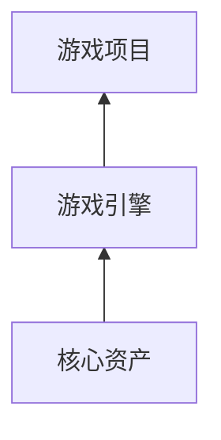

# 开发方案
## 策划
1. 游戏定位
    - 游戏类型：2.5D/3D；ARPG/FPS；风格；
    - 市场定位：市场大小、特点；典型游戏对比；开发收益成本分析，资源需求/收益预期/进程规划/可行性。
2. 游戏设定
    - 世界观：背景/规则/元素；
        - 元素：天空、地图、动植人物、技能、属性、装备；
3. 游戏内容
    - 目标：积分/等级/排名/成就；
    - 玩法
        - 操作：主线任务/副本任务；
        - 社交；
4. 游戏系统设计
    - 注册登陆模块；
    - 网络模块；
    - 游戏内容模块
        - 地图场景设计
        - 元素设计：角色创建/NPC/动植物/道具；
        - UI交互：提示、触发
        - AI交互
        - 玩家网络交互
        - 交互规则：数值系统设计

## 实现

- 核心资产：美术、音乐、剧情
    - 美术：Blender是一款免费开源三维图形图像软件，提供从建模、动画、材质、渲染、音频处理、视频剪辑等一系列动画短片制作解决方案。
    - 动画：Spine和DragonBones是专门用于制作2D骨骼动画的软件。这些动画可以用于游戏中的角色动作和特效。
    - 音效：Audacity是一款免费的音频编辑软件，可用于录制、编辑和混合游戏中的音效。
    - 其他
        - Tiled:开源的2D地图编辑器。
        - Krita:数字绘图软件,适合2D游戏绘制与动画。
        - Aseprite:开源像素动画制作。
- 技术：渲染、网络
    - UE

# UE
## 2D
- 插件：PapeP2D、PaperZD
- 基本概念
    |概念|本质|释义|
    |-|-|-|
    |Sprites|本质上是一种映射了纹理和相关材质的平面网格体，可以在场景中渲染，并且完全在虚幻引擎中创建。||
    |FIipbooks||FIipbooks are sprite sheet animations.|
    |Tilemaps||Tilemaps let us paint levels using a texture.|
### 资产导入
- 图片创建sprites
    > 1. 拖入并保存
    > 2. 右键图片>sprites actions>apply paper2d...settings, 并保存
    > 3. 右键texture>sprites actions>create sprites, 并保存
- 创建sprites然后导入纹理

## 多线程

# 美术
## 纹理贴图
### 基本概念
|英文|中文|本质|释义|
|-|-|-|-|
|picture|图片|数据|保存图形或图像的信息，包括大小、颜色等；有位图格式、矢量图格式。|
|Texture|纹理|数据|显卡能够直接进行采样的纹理数据。|
|Texture mapping|纹理贴图|图像映射规则|把存储在内存里的位图，通过 UV 坐标映射到渲染物体的表面|
|Material|材质|数据集|表现物体对光的交互，供渲染器读取的数据集，包括贴图纹理、光照算法等|
|Shading|底纹、阴影|光影效果|根据表面法线、光照、视角等计算得出的光照结果|
|Shader|着色器|程序|编写显卡渲染画面的算法来即时演算生成贴图的程序|
|GLSL||程序语言|OpenGL 着色语言|

[Blender](http://blender.org/)
Cycles 

作者：Mr__Kin https://www.bilibili.com/read/cv2350089/

## 其他工具
[图片一键变成无缝平铺纹理](https://www.uisdc.com/unity-grenoble#:~:text=1.%20%E5%B0%86%E5%9B%BE%E7%89%87%E7%9A%84%E8%87%AA)
[Unity](https://unity-grenoble.github.io/website/demo/2020/10/16/demo-histogram-preserving-blend-make-tileable.html)

# spine
## 2D动作

# 开放地图
## UE5流送

## 地球
uber h3-0