# python常用代码

## 首行注释

指定解释器：
```
#!/usr/bin/python3 
表示python3解释器所处的绝对路径就是/usr/bin/python3
#!/usr/bin/env/python3
表示从"PATH环境变量"中查找python3解释器的位置，路径没有被写死，而是在"环境变量"中寻找python3解释器的安装路径，再调用该路径下的解释器来执行脚本
```

指定字符编码：coding和=之间、coding和:之间不能有空格。
```
#coding=utf-8或者#! -- coding:utf-8
Python2默认使用ASCII编码(不支持中文)，Python3默认使用UTF-8编码(万国码，支持中文)。所以Python2中为了支持中文，都会在开头指定字符编码。
```

## 变量信息查询

dir() 函数：dir([object]) 会返回object所有有效的属性列表和方法。

vars() 函数：vars([object])返回object对象的__dict__属性，其中object对象可以是模块，类，实例，或任何其他有__dict__属性的对象。

help() 函数：help([object])调用内置帮助系统。

type() 函数：type(object)返回对象object的类型。

hasattr() 函数：hasattr(object,name)用来判断name（字符串类型）是否是object对象的属性，若是返回True，否则，返回False。

getattr()、setattr()以及hasattr()

callable()函数：callable(object)：若object对象是可调用的，则返回True，否则返回False。注意，即使返回True也可能调用失败，但返回False调用一定失败。

## 重要问题
### 异步
- yield/yield from
    - send_info = yield i # next()执行到yield i, 不执行赋值给send_info=; 下一次next()从赋值给send_info=开始往下执行, 直到执行完yield i; 没有sent(send_info_t), 则send_info一直是None.
    - return_info = yield from gen # return_info获取的不是gen的yield, 是gen的return.

- async/await

### 函数
- 基本概念
    - 定义默认参数：默认参数必须指向不变对象，否则会引发一些错误。例如空列表[]可以用None代替，这就是一个不可变对象。
    - 可变参数：可变参数传入的参数个数是可变的，可以是1个、2个到任意个，还可以是0个。*p2可变元组，\*\*p3为可变字典；调用时func直接接收可变元素，如果元素在元组list1和字典dict1里则可用func(p1,*list1,\*\*dict1)
    ```
    def func(p1,*p2,**p3):
        expression
    ```
    - 函数名赋值给变量：此时变量可以指向该函数。
    - 传入函数：一个函数可以接收另一个函数作为参数，这种函数称之为高阶函数。例如内置的map()、reduce()、filter()、sorted()
    ```
    def func(p1,func1):
        expression
    ```
    - 返回函数：高阶函数除了可以接受函数作为参数外，还可以把函数作为结果值返回。
    - 匿名函数：lambda

- 装饰器：decorator通常用于在函数执行前后添加额外的功能，常用于日志记录、权限控制、性能分析等场景，它们可以让代码更加清晰和模块化。允许在不修改函数本身的情况下，动态地增加或修改函数的行为。

- 回调函数：回调函数是一种在某个事件发生后被调用的函数。通常，回调函数作为参数传递给另一个函数，并在该函数内部触发。常用于异步编程、事件处理、GUI应用等领域，它们允许在特定事件发生时执行自定义操作。

- 偏函数：当函数的参数个数太多，需要简化时，使用functools.partial可以创建一个新的函数，这个新函数可以固定住原函数的部分参数，从而在调用时更简单。

- 闭包：闭包是一个包含函数及其在定义时的环境的对象。闭包允许函数保留对其定义时的作用域中变量的访问权。闭包可用于封装数据、实现私有变量、创建工厂函数等，它们提供了更高的灵活性和封装性。

- hook函数
    - hook函数是流程中预定义好的一个步骤，没有实现
    - 挂载或者注册时， 流程执行就会执行这个钩子函数
    - 回调函数和hook函数功能上是一致的
    - hook设计方式带来灵活性，如果流程中有一个步骤，你想让调用方来实现，你可以用hook函数。

- 常用公共函数
    - f"str{}"
    - map(int,"str")

## 指针和引用
- 要实现类似指针的行为并修改指针的目标，可以将目标作为列表或字典的元素传递，因为它们是可变的对象。

- 引用
    - 可变对象a：b = a，b和a指向同一个内存空间，改变a中的值（a的内存空间地址不变），则b跟着改变（b的内存空间地址不变）;同样的，改变b中的值，则a跟着改变。
    - 不可变对象a：b = a，b和a指向同一个内存空间，改变a中的值（a的内存空间地址改变），这时b不跟着改变（因为b的内存空间地址不变）;同样的，改变b中的值，这时a不跟着改变。

- copy.copy()和copy.deepcopy()
    - 浅拷贝：对于简单的对象（不可变），深浅拷贝都是一样的。如果拷贝的对象中即有可变对象，又有不可变对象，则深浅拷贝两者就有区别。
    - 深拷贝：深贝会完全复制原变量相关的所有数据，在内存中生成一套完全一样的内容，在这个过程中我们对这两个变量中的一个进行任意修改都不会影响其他变量。

- python中向函数传递参数只能是引用传递，表示把它的地址都传进去了，会带来以下的现象：
    - 可变对象作为参数传入时，在函数中对其本身进行修改，是会影响到全局中的这个变量值的，因为函数直接对该地址指向的内存值进行了修改。
    - 对于不可变对象来说，虽然函数中的a值变了，但是全局中的a值没变，因为函数中的a值已经对应了另外一个地址，而全局中的a值指向的原来地址的值是没有变的。

- 全局可变变量传入类中变量：类中的变量和全局变量地址依然是共用的，无论在哪里修改都会影响对方，利用这一点可以进行一些很方便的操作，比如两个线程同时操作一个队列，我们不用设置一个global队列，只要将队列这个可变对象传入类之中，修改就会自动同步。减少了同步通信操作。

- 函数形参默认值：需为不可变对象，否则会引起一些不可控问题。

## 类

- 方法
    - 静态方法：@staticmethod，静态方法不需要实例化可以直接调用，实例化后也能调用，可以理解成函数。一些辅助函数常写成类的静态方法。
    - 类方法：@classmethod，类方法的第一个参数约定名为cls，它代表的是当前类相关的信息的对象（类本身也是一个对象，有的地方也称之为类的元数据对象），通过这个参数我们可以获取和类相关的信息并且可以创建出类的对象。
    - 实例方法：self

- 属性
    - 类属性 vs 实例属性：相同名称的实例属性将屏蔽掉类属性，但是当你删除实例属性后，再使用相同的名称，访问到的将是类属性。
    - 私有变量：以\_\_开头命名的变量默认为私有变量，外部无法直接访问和修改。双下划线开头的实例变量\_\_a2不能直接访问是因为Python解释器对外把\_\_a2变量改成了_c1\_\_a2，所以，仍然可以通过_c1\_\_a2来访问\_\_a2变量。
    ```
        Class c1(c0):
            '''
            doc
            '''
            a1='s'
            __a2=4
            def __init__(self,a3): #初始化方法，创建实例时调用，a3为实例属性
                self.a3=a3
            def func(self,p1):
                expression
    ```

- 特殊类属性

    C.\_\_name\_\_ 类Ｃ的名字（字符串）

    C.\_\_doc\_\_ 类Ｃ的文档字符串

    C.\_\_bases\_\_ 类Ｃ的所有父类构成的元组

    C.\_\_dict\_\_ 类Ｃ的属性

    C.\_\_module\_\_ 类Ｃ定义所在的模块（1.5 版本新增）

    C.\_\_class\_\_ 实例Ｃ对应的类（仅新式类中）

- 定义一个不允许修改属性的类：创建一个不可变对象，这就要使用python的魔法方法，主要有两种方法
    - 设置__setattr__直接抛出异常，即只要想设置属性值，就会抛出异常
    - 设置__slot__限制属性的访问，如果属性都不能访问了，那就肯定不能修改

- 继承和多态：子类继承父类的类型、属性、方法，且子类方法覆盖父类同名方法。子类的数据类型既是子类也是父类。只要参数传入的对象的方法名一致，子类、父类、和其他任意类型的对象均适用该函数。

## 模块导入

最好按照这样的顺序导入，有助于减少每个模块需要的import语句数目。

Python标准库模块

Python第三方模块

应用程序自定义模块

## 多进程
- python多进程中子进程的运行机制：每个子进程中，由于不同的进程之间有独立内存，不会共享，所以每个子进程是通过分别导入所在的脚本模块来实现目标函数的运行的。对于这个机制，有以下两点需要特别注意。
    - 1、由于每个子进程是通过导入所在脚本的模块实现模块中函数的调用的，所以，为了避免将创建子进程的语句也被导入（因为这样就会造成无限循环创建子进程，这显然是不允许的，因此python禁止了在子进程中再创建子进程，否则会报错），创建子进程的语句必须在```if __name__=='__main__'```语句之后定义，或者如果创建子进程的语句是定义在一个函数中的，那么这个函数调用必须在```if __name__=='__main__'```语句之后，这是python多进程中的强制性语法规则。
    - 2、由于子进程可直接调用的是被导入模块中的属性，因此，子进程中的目标函数应该是被导入的，这样子进程才可以调用到需要的目标函数，因此，目标函数必须在```if __name__=='__main__'```语句之前定义，如果是在该语句之后定义，那么由于被导入时这部分是不会被导入的，所以运行时就会报"被导入的主模块没有目标函数属性"这样的错误。
- map、map_async、apply_async、imap、imap_unordered、
    |pool类型|函数|参数|执行|结果|
    |---|---|---|---|---|
    |map|函数统一|iterable|阻塞并发执行：通过将改可迭代的对象统一转换为列表，并分解为块，将块发送到池中的工作进程中，因此整个列表可能会产生非常高的内存成本。执行完map任务后才会继续执行后续代码。|有序列表：需要等待全部Task执行完毕才返回list。|
    |map_async|函数统一|iterable|异步并发执行：map任务执行不阻塞后续代码的执行|有序列表：会立即返回AsyncResult，但是在完成所有对象之前无法实际检索该对象的结果。此时它将返回映射所执行的相同列表，没有办法得到部分结果，在这个点上来说，它和map返回的情况相同。|
    |apply_async|函数可变|可传入多参数|一次执行一个任务，通过异结果对象的get()方法以检索结果。该get()方法将阻塞直到功能完成。也可在函数完成时调用回调方法来代替get()。|
    |imap|函数统一|iterable|一个个调用：一次遍历iterable的一个元素，并将它们分别发送到工作进程，因此不需要将整个iterable转换为列表存在内存中，但缺少分块也导致大型迭代的性能较慢，可以通过传递大于默认值1的chunksize参数来减轻这种情况。|结果有序：按顺序等待Task的执行结果，且可以尽快返回执行完的iterable元素的结果，而不必等待所有进程完成工作。|
    |imap_unordered|函数统一|iterable|一个个调用|结果无序：无论输入可迭代的顺序如何，会优先迭代到先执行完成的Task。|
    |starmap、starmap_async|与map和map_async的区别是，starmap和starmap_async 可以传入多个参数|
    - AsyncResult
        > Pool.apply_async() 和 Pool.map_async() 返回对象所属的类。
        get([timeout])：用于获取执行结果。如果 timeout 不是 None 并且在 timeout 秒内仍然没有执行完得到结果，则抛出 multiprocessing.TimeoutError 异常。如果远程调用发生异常，这个异常会通过 get() 重新抛出。
        wait([timeout])：阻塞，直到返回结果，或者 timeout 秒后超时。
        ready()：返回执行状态，是否已经完成。
        successful()：判断调用是否已经完成并且未引发异常。 如果还未获得结果则将引发 ValueError。

- [子进程print无法打印](https://stackoverflow.com/questions/29629103/simple-python-multiprocessing-function-doesnt-output-results/29632397#29632397)：spyder使用的stdout和windows不支持forking，所以无法打印子进程内容。替代方案
    - 返回值替代打印
        ```
        # 全部任务执行完一起打印
        def func():
            return r
        results=pool.map()
        pool.close()
        pool.join()
        for result in results:
            print(result) #print func返回的r

        # 执行完一个打印一个
        def func():
            return r
        results=pool.imap_unordered()
        for result in results:
            print(result)  #print func返回的r
        pool.close()
        pool.join()
        ``` 
    - 将各个进程日志打印到文件
    - callback和error_callback
        - 自定义error_callback的报错捕捉调用函数；
        - 使用traceback：multiprocessing.get_logger().error()+multiprocessing.log_to_stderr()

- 进程间通信
    - pipe比queue快
    - 共享内存Manager：Pipe、Queue把需要通信的信息从内存里深拷贝了一份给其他线程使用（需要分发的线程越多，其占用的内存越多）。而共享内存会由解释器负责维护一块共享内存（而不用深拷贝），这块内存每个进程都能读取到，读写的时候遵守管理（因此不要以为用了共享内存就一定变快）。

## IO
###  文件操作
Python的os模块封装了操作系统的目录和文件操作，要注意这些函数有的在os模块中，有的在os.path模块中。

### 文件读存

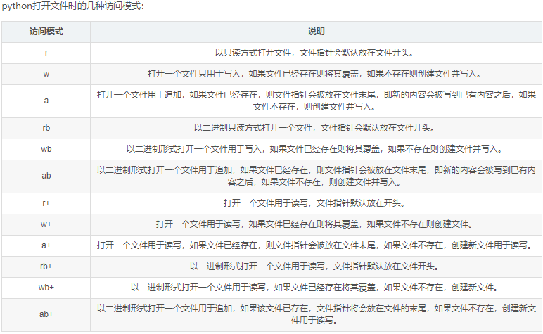

-   文件开关
    ```
    #第一种

    f = open(\"data.txt\",\"r\") #设置文件对象

    f.close() #关闭文件

    #第二种：为了方便，避免忘记close掉这个文件对象，可以用下面这种方式替代

    with open(\'data.txt\',\"r\") as f: #设置文件对象

    str = f.read() #对文件的操作
    ```

-   按行读取方式readline()：readline()每次读取文件中的一行，需要使用永真表达式循环读取文件。但当文件指针移动到文件的末尾时，依然使用readline()读取文件将出现错误。因此程序中需要添加1个判断语句，判断文件指针是否移动到文件的尾部，并且通过该语句中断循环。
    ```
    file =open('/Users/april_chou/test.txt','r')

    contextLines =''

    while True:

        context = file.readline()

        contextLines = contextLines + context

        if len(context) ==0:

        break

    file.close()
    ```

-   多行读取方式readlines()：需要通过循环访问readlines()返回列表中的元素。函数readlines()可一次性读取文件中多行数据。
    ```
    file =open('/Users/april_chou/Desktop/test.txt','r')

    context = file.readlines() #直接将文件中按行读到list里

    file.close()
    ```
-   一次性读取方式read()，并赋值给1个字符串变量。
    ```
    file =open('/Users/april_chou/Desktop/test.txt','r')

    context = file.read()

    file.close()
    ```
-   简单的将字符串写入txt中
    ```
    with open('data.txt','w') as f: #设置文件对象

        f.write(str) #将字符串写入文件中
    ```
-   列表写入文件

    -   单层列表
        ```
        data = ['a','b','c']

        #单层列表写入文件

        with open("data.txt","w") as f:

            f.writelines(data)
        ```
    -   双层列表
        ```
        #第一种方法，每一项用空格隔开，一个列表是一行写入文件

        data =[['a','b','c'],['a','b','c'],['a','b','c']]

        with open("data.txt","w") as f: #设置文件对象

            for i in data: #对于双层列表中的数据

            i = str(i).strip('[').strip(']').replace(',','').replace('\','')+'\n'
            #将其中每一个列表规范化成字符串

            f.write(i) #写入文件

        #第二种方法，直接将每一项都写入文件
        data =[['a','b','c'],['a','b','c'],['a','b','c']]
        with open("data.txt","w") as f: #设置文件对象

            for i in data: #对于双层列表中的数据

                f.writelines(i)
        ```
-   写入excel
    ```
    class pandas.ExcelWriter(path, engine=None, date_format=None, datetime_format=None, mode='w', **engine_kwargs)；mode : {‘w’, ‘a’}, default ‘w’
    with ExcelWriter('path_to_file.xlsx') as writer:
        df1.to_excel(writer, sheet_name='Sheet1')
    with ExcelWriter('path_to_file.xlsx', mode='a') as writer:
        df.to_excel(writer, sheet_name='Sheet2')
    ```
### txt

pandas读入输出

-   读入：table和csv两个方法，文件名不能有中文；sep=可以是正则式，此时要指定engine=\'python\'。
    ```
    df=pd.read_csv('test.txt',sep='sep='\s+|,' ,engine='python')
    # 加载test.txt，sep: str, default ‘,’，sep='sep='\s+|,'指定了它的分隔符是1个以上的空字符或者逗号。
    df=pd.read_table('test.txt',sep='\t')
    # 加载test.txt, sep: str, default ‘\t’ (tab-stop)
    
    converters: dict, default None. Dict of functions for converting values in certain columns. Keys can either be integers or column labels. 例如：用pandas的pd.read_excel()方法或pd.read_csv()读取文件时，遇到某一列的数据前面包含0（如010101）的时候，pd.read_excel()方法返回的DataFrame会将这一列视为int类型，即010101变成10101，如果想要保持数据的完整性，可以以str类型来读取这一列。
    df = pd.read_excel ("test.xlsx" , converters={'类别编码':str})
    ```
-   输出
    ```
    df.to_csv(test.txt, sep='\t',index=False, header=None)
    # sep指定分隔符；index=False 不保存行标签；header=None不保存列标签。
    ```
### xlsx

-   读入
    ```
    file = r'C:\Users\Administrator.SC-201809231855\Desktop\micro.xlsx'
    df=pd.read_excel(file, sheet_name=0, header=None, names=None, index_col=None, skiprows=None)
    创建DataFrame对象df，参数说明：
    sheet_name: str, int, list, or None, default 0，默认0对应第一张表，读入多张表返回的是多个df键值的OrderedDict.
    header: 整型，或者整型列表，默认为0。选择行(0-索引)用于解析的DataFrame的列标签，该行以上会被忽略。如果一个整数列表被传递，那么这些行位置将被合并成一个多索引。如果没有标题，使用None。
    names: 类似数组，默认无。指定序列为列标签。如果文件没有标题行，那么应该显式地通过header=None。
    index_col: 整型, 整型列表, 默认 None。指定int列（0索引）用作DataFrame的行标签，左侧列不会被忽略。如果传递一个列表，这些列将被组合成一个MultiIndex。如果使用usecols选择数据子集，则index_col基于该子集。
    skiprows : list-like, Rows to skip at the beginning (0-indexed).
    skip_footer : 整型, 默认为0
    usecols : 整型或者列表, 默认为 None. 如果为None，则解析所有列；如果为int，则某列将被解析；如果为ints，则列表要解析的列号列表将使用；如果为字符串表示逗号分隔的Excel列字母和列范围列表（例如“A：E”或“A，C，E：F”），范围包括边界两个。
    converters: dict, default None. Dict of functions for converting values in certain columns. Keys can either be integers or column labels. 例如：用pandas的pd.read_excel()方法或pd.read_csv()读取文件时，遇到某一列的数据前面包含0（如010101）的时候，pd.read_excel()方法返回的DataFrame会将这一列视为int类型，即010101变成10101，如果想要保持数据的完整性，可以以str类型来读取这一列。
    ```
-   输出
    ```
    file= r'C:\Users\Administrator.SC-201809231855\Desktop\a.xlsx'
    df.to_excel(file, sheet_name='Sheet1', na_rep='', index=False)
    输出df到a.xlsx：na_rep=''指定缺失值的填充；指定开始行startrow=0；指定开始列startcol=0；index=False 不保存行标签；header=None不保存列标签。
    ```
### CSV

-   读入：sep=可以是正则式
    ```
    file = r'C:\Users\Administrator.SC-201809231855\Desktop\micro.csv'
    df=pd.read_csv(file, sep=',',header='infer', skip_blank_lines=True, names=None)
    创建DataFrame对象df，参数说明：
    sep: str, default ‘,’. 间隔符；
    sheet_name: str, int, list, or None, default 0. 默认0对应第一张表，读入多张表返回的是多个df键值的OrderedDict；
    header : int or list of ints, default ‘infer’. 指定行数用来作为列名，数据开始行数。如果文件中没有列名，设置为header=None。如果明确设定header=0 就会替换掉原来存在列名。header参数可以是一个list，表示将文件中list的这些行作为列标题，介于中间的行将被忽略掉，例如：header=[0,1,3]，数据文件的1,2,4行将被作为多级标题出现，第3行数据将被丢弃，dataframe的数据从第5行开始。
    names指定序列为列属性；index_col指定int列为行属性, 左侧列不会被忽略。
    ```

-   输出
    ```
    file= r\'C:\Users\Administrator.SC-201809231855\Desktop\a.csv\'
    df.to_excel(file)
    #输出df到a.csv：na_rep=''指定缺失值的填充；index=False不保存行标签；header=None不保存列标签；指定开始行startrow=0；指定开始列startcol=0。
    ```
### 内存读存
    ```
    # StringIO和BytesIO是在内存中操作str和bytes的方法，使得和读写文件具有一致的接口。
    from io import StringIO, BytesIO
    ```
- 序列化：把变量从内存中变成可存储或传输的过程称之为序列化，Python语言特定的序列化模块是pickle，但如果要把序列化搞得更通用、更符合Web标准，就可以使用json模块。

### sql读取
- sqlite3
    - 自己操作读取
        ```
        conn = sqlite3.connect(path.db)
        cur = conn.cursor()
        sql = f"""select * from bs_t where c1 in {v_tuple} and REPORT_DATE>='{v_string}' and REPORT_DATE<='{v_string}';"""
        cur.execute(sql)
        result = cur.fetchall()
        df=pd.DataFrame(result,columns=["c1","c2","c3","c4"])
        cur.close()
        conn.close()
        ``` 
    - with读取
        ```
        with sqlite3.connect(path.db) as conn:
            df = pd.read_sql(f"""select * from bs_t where c1 in {v_tuple} and REPORT_DATE>='{v_string}' and REPORT_DATE<='{v_string}';""", con=conn)
        ```


## pandas
- tips
    - 大内存数据读取防溢出：read_csv()
        - usecols限制列
        - iterator=True;chunksize=1000000;然后concat各个chunk
    - 文本搜索
        - df[df['cols'].str.contains('xxx|yyy')]
    - between
        - df[df.cols.between(2,4)]
    - 统计值
        - df.describe(percentiles=np.arange(0,1,0.05))
    - 索引重排序：df.reindex(['a','b','c'])

- 矢量化的字符串方法
    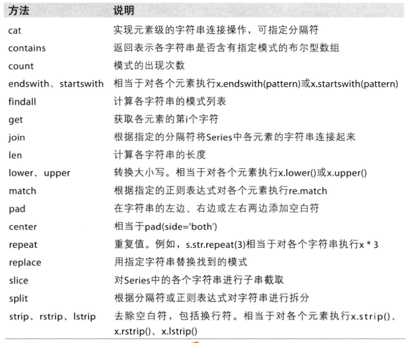

- 视图和副本：视图可以极大地提高我们对数据的操作效率，因为只需要对原始数据的一部分进行操作即可。而在使用副本时，会产生额外的内存开销，并且对副本的更改不会影响原始数据。避免链式索引上进行赋值操作引起异常警示，对切片赋值则直接指明对切片的.copy()，或在原df上用.loc，。
    - 视图（view）是一个指针或索引：指向原始数据的一部分，并提供了对原始数据的访问。
        - 切片、.loc、.iloc选择数据时返回一个视图
    - 副本（copy）是完全复制原始数据的一份副本：修改一个不会对另一个产生影响。
        - groupby、pivot_table等会返回一个副本
    - dataframe切片修改会影响原始df，深拷贝df.copy()可一定程度避免，但有可变对象嵌套时依然会相互影响。
    - 避免链式索引：避免使用链式索引。如果要更改原始数据，则使用单一索引赋值操作。如果想要一个副本，确保显式调用copy()函数强制让Pandas创建副本。


- Series
    - 创建s = pd.Series(p1) # p1可以是列表、字典，可用index指定索引
    - 命名
        ```
        # 通过s.name、s.index.name为series值列、索引列命名

        # 重置默认整数索引reset_index()；rename({})修改特定索引名；对index赋值批量修改s.index
        ```
    - 数据操作
        ```
        s.drop()

        # map：arg : function, dict, or Series；na_action : {None, 'ignore'}, default None，If 'ignore', propagate NaN values, without passing them to the mapping correspondence.
        s.map(arg, na_action=None)
        ```

    - 计算类：s.mean()、s.max()、s.min()、s.sum()

- dataframe
    - 创建：从xls、csv直接导入；使用字典；使用数组
    - 命名：rename、reset_index、set_index: 注意inplace参数的作用
    - 数据提取：提取的值若要独立于df进行修改，则需要进行深度拷贝.copy()
        - df.columns #列索引名称
        - df.index #行索引名称
        - loc；iloc；布尔索引筛选
    - 数据操作
        - 列赋值、添加新列
            ```
            df.insert() 
            df=df.append() #废弃
            df.loc['new']=[......] #添加新行
            ```
        - 作用函数df.apply()，如果设置axis参数为1则每次函数每次会取出DataFrame的一行来做处理，如果axis为0则每次取一列。使用lambda函数、functools.partial函数或args和kwargs参数来传递多个参数的函数到DataFrame.apply方法中。
            ```
            def func(x,p1,**kwargs):
                kwargs["p2"]
                expression
            df =df.apply(func,args=(p1=p1,),p2=p2,axis=0) #轴广播
            df.applymap(func) #元素广播
            ```
        - 其他：drop()、dropna()、join、merge、concat；update、assign等等
    - 运算
        ```
        #s、df和标量运算会按元素广播
        #s之间、df之间运算会自动对齐索引，对不齐的填充nan
        #df对s的行广播：df-s、df+s、......会将二者的列属性进行匹配，然后沿行广播运算
        #df对s的列广播：需要使用算数运算方法，df.sub(s,axis=0)、add、mul、div
        #其他：value_counts()、describe()、sum()、min()、mean()、max()、T、sort_values()
        多层索引和penal转换：reset_index和
        ```

## statsmodels

- 因子相关性检验，对列
a=df.corr()
- OLS回归得到因子系数
    ```
    pd.set_option('mode.use_inf_as_na', True)
    Stre2_li2=Stre2.columns.tolist()
    paras=pd.DataFrame()
    ts=pd.DataFrame()
    ps=pd.DataFrame()
    R2=pd.DataFrame()
    for i in Stre2_li2[0:]:
        y1=Stre2[i]
        fac_n.insert(0,i,y1)
        z=fac_n.dropna(axis=0,how='any')
        fac_n=fac_n.drop([i], axis=1)
        y=z[i]
        x=z.drop([i], axis=1)
        x=sm.add_constant(x) 
        est=sm.OLS(y,x)
        results=est.fit()

        para=results.params
        paras.insert(0,i,para)
        
        t=results.tvalues
        ts.insert(0,i,t)

        p=results.pvalues
        ps.insert(0,i,p)

        r=results.rsquared
        R2.insert(0,i,[r])   
    ```
## re

### 通配符

反斜线进行转义；

^、$、b、B 字符串的开头或结尾或单词边界开始匹配

[]匹配方括号里的任何一个字符；在[]里用-指定范围，用^放在[]头部取反

()匹配成功时取出特定的字符串或子字符串

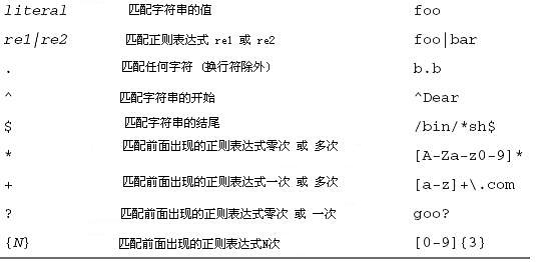
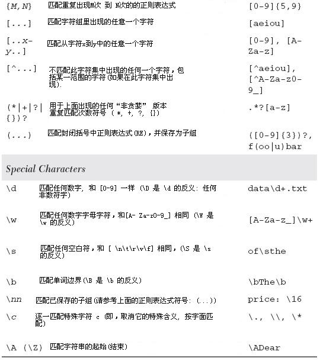
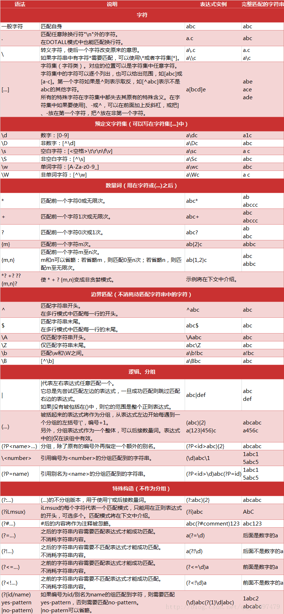

-   贪婪与非贪婪模式

    -   贪婪匹配：贪婪匹配在匹配字符串时总是尝试匹配尽可能多的字符。

    -   非贪婪匹配：非贪婪匹配在匹配字符串时总是尝试匹配尽可能少的字符。Python里数量词默认是贪婪模式的，在"*","?","+","{m,n}"后面加上？，可使贪婪模式变成非贪婪模式。

-   常用
    ```
    表示匹配大小写字母或者数字1-9	[a-zA-z1-9]
    数字	^[0-9]*$
    n位的数字	^\d{n}$
    至少n位的数字	^\d{n,}$
    零和非零开头的数字	^(0[1-9][0-9]*)$
    有两位小数的正实数	^[0-9]+(.[0-9]{2})?$
    非零的负整数	^-[1-9]\d*$
    非负浮点数	^\d+(\.\d+)?$
    浮点数	^(-?\d+)(\.\d+)?$
    特殊场景的表达式:
    Email地址	^\w+([-+.]\w+)*@\w+([-.]\w+)*\.\w+([-.]\w+)*$
    域名	[a-zA-Z0-9][-a-zA-Z0-9]{0,62}(/.[a-zA-Z0-9][-a-zA-Z0-9]{0,62})+/.?
    手机号码	^(13[0-9]|14[5|7]|15[0|1|2|3|5|6|7|8|9]|18[0|1|2|3|5|6|7|8|9])\d{8}$
    身份证号	^\d{15}|\d{18}$(15位、18位数字)
    日期格式	^\d{4}-\d{1,2}-\d{1,2}
    空白行的正则表达式	\n\s*\r (可以用来删除空白行)
    IP地址提取	\d+\.\d+\.\d+\.\d+ (提取IP地址时有用)
    腾讯QQ号	[1-9][0-9]{4,} (腾讯QQ号从10000开始)
    ```

### re方法

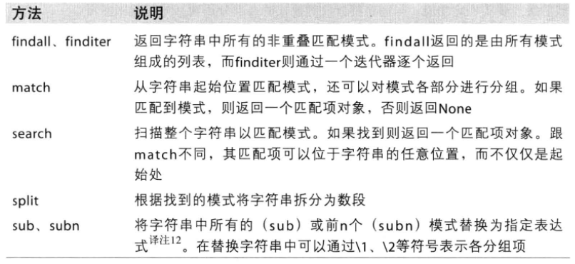

-   group(num=0)

    -   返回全部匹配对象(或指定编号是num 的子组)

-   groups()

    -   返回一个包含全部匹配的子组的元组(如果没有成功匹配，就返回一个空元组)

## 爬虫

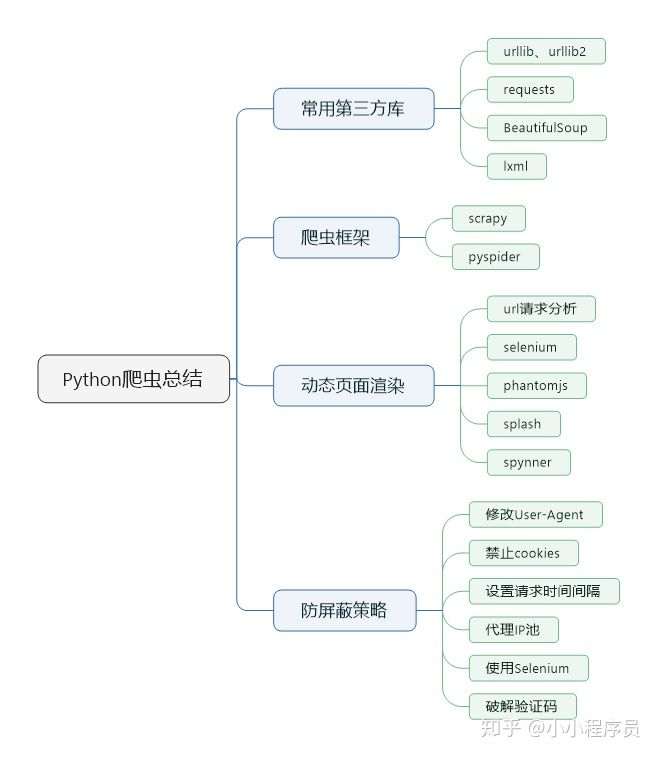

-   常用工具

    -   抓包工具：fiddler

    -   页面动作模拟工具：selenium，web自动化测试工具

    -   无界面的浏览器：phantomjs，使用selenium调用浏览器进行抓取页面时，由于要执行打开浏览器并渲染页面的操作，当进行大规模数据抓取时效率较低，这时可以选择使用phantomjs。

    -   其他：Splash是一个实现了HTTP API的轻量级浏览器，提供Javascript渲染服务；spynner，spynner是一个QtWebKit的客户端，它可以模拟浏览器，完成加载页面、引发事件、填写表单等操作。

-   常用库

    -   requests

    -   解析：lxml(XPath)、pyquery(CSS Selector)、arsel

    -   转码：json、js2py

    -   连接splash：scrapy-splash，scrapy-splash使用的是Splash HTTP API，所以需要一个splash instance，一般采用docker运行splash，所以需要安装docker。

-   爬虫框架：scrapy和pyspider

### 爬虫防屏蔽策略

1. 修改User-Agent

User-Agent是一种最常见的伪装浏览器的手段。

2. 禁止cookies

cookie其实是储存在用户终端的一些被加密的数据，有些网站通过cookies来识别用户身份，如果某个访问总是高频率地发请求，很可能会被网站注意到，被嫌疑为爬虫，这时网站就可以通过cookie找到这个访问的用户而拒绝其访问。

通过禁止cookie，这是客户端主动阻止服务器写入。禁止cookie可以防止可能使用cookies识别爬虫的网站来ban掉我们。

在scrapy爬虫中可以设置COOKIES_ENABLES= FALSE，即不启用cookies
middleware，不向web server发送cookies。

3. 设置请求时间间隔

大规模集中访问对服务器的影响较大，爬虫可以短时间增大服务器负载。这里需要注意的是：设定下载等待时间的范围控制，等待时间过长，不能满足短时间大规模抓取的要求，等待时间过短则很有可能被拒绝访问。

设置合理的请求时间间隔，既保证爬虫的抓取效率，又不对对方服务器造成较大影响。

4. 代理IP池

其实微博识别的是IP，不是账号。也就是说，当需要连续抓取很多数据的时候，模拟登录没有意义。只要是同一个IP，不管怎么换账号也没有用，主要的是换IP。

web server应对爬虫的策略之一就是直接将IP或者整个IP段都封掉禁止访问，当IP被禁封后，转换到其他IP继续访问即可。方法：代理IP、本地IP数据库（使用IP池）。

5. 使用Selenium

使用Selenium来模拟人工点击访问网站，是种很有效的防止被ban的方式。但是Selenium效率较低，不适合大规模数据抓取。

6. 破解验证码

验证码是现在最常见的防止爬虫的手段。有能力的小伙伴可以自己写算法破解验证码，不过一般我们可以花点钱使用第三方打码平台的接口，轻松实现验证码的破解。

### 爬取步骤

①右键源代码，ctrl+f搜索渲染结果中的某些关键词，判断是否能直接拿到数据，如果能拿到则可直接通过requests库访问当前url进行抓取、筛选、保存。

②如果在源码中无法直接取到数据，则右键"审查元素查看"。多数页面的真实数据并不是最原始的页面返回的，而是后来执行JavaScript后再次向后台发送了Ajax请求，浏览器获取数据后再进一步渲染出来的，因此可根据Ajax请求获取真实url然后爬取。

③Clear当前监控记录，测试触发新请求：通过Network-xhr筛选是否有ajax或者是javascript进行渲染的。

④确定自己需要的Ajax请求并得到url：选定请求，在preview的结果中查找关键字判断该Ajax请求是否是自己需要的。进一步的可在headers查看Request
URL、Request Headers、Response Headers、Response
Body等内容，也可在name列右键copy link address得到URL。

⑤分析Ajax请求规律：不断测试触发操作，会不断有Ajax请求发出，对比多个Ajax请求的URL参数信息分析规律。

⑥根据Ajax请求规律直接进行批量访问、抓取。注意查看请求的具体信息，包括方法、headers、参数，需要复制到程序里使用。请求方法是GET还是POST，GET和POST传递参数的方法不一样。常用的headers包括
user-agent、host、referer、cookie 等。其中cookie
是用来识别请求者身份的关键信息，对于需要登录的网站需要该参数。

⑦数据筛选、保存：根据preview得到的json格式分析数据特征或者直接利用response得到的源码文本分析数据特征，response.json()会得到preview里看到的处理过的json数据；利用这些特征提取相关数据并保存。

⑧模拟浏览器行为抓取：若JavaScript难以分析出有效规律，则采用selenium模拟浏览器进行爬取，首先在Elements中可以通过左上的选择元素控件选择页面中的元素，即可定位代码位置；也可悬停在代码上，定位该段代码指向的页面中的元素。然后确定我们需要的数据的url、属性、结构等特征。最后利用这些特征从selenium访问得到的Elements源码中提取相关数据。

### requests

-   会话保持：有一些操作需要登录之后才操作的，你得先登录，然后才能做其他的操作。那咱们做的时候怎么做，先发送登陆的请求，获取到登录的cookie信息，（因为登录之后它的身份验证信息都是放在cookie里面的），然后把cookie传给下一个你要请求的url，这样就ok了，看下面代码。

使用requests.session方法，它会自动管理cookie，不需要咱们自己再获取到登陆的cookie，传给创建文件的请求。

### Selenium+webdriver

selenium是浏览器测试自动化工具，很容易完成鼠标点击、翻页、确定等动作，一次只能加载一个页面，无法异步渲染页面，也就限制了selenium爬虫的抓取效率。splash可以实现异步渲染页面，可以同时渲染几个页面，缺点是在页面点击、模拟登陆方面没有selenium灵活。

-   Selenium支持的浏览器：

    -   Chrome、Firefox、Edge等

    -   Android、Black.Berry等手机端的浏览器

    -   无界面浏览器PhantomJS

-   配置

    -   安装Chrome浏览器，并配置ChromeDriver

    -   安装Selenium库

### 网站级爬取

-   Scrapy

### APP爬取

-   爬取方案

    -   抓包软件分析直接爬取：App端常用的抓包软件有Wire Shark、Filddler、Charles、mitmproxy、Any Proxy等，通过设置代理的方式将手机处于抓包软件的监听之下，便可看到App在运行过程中发生的所有请求和响应，相当于在network里进行Ajax分析。找到这些请求URL参数的规律的，直接用程序模拟爬取。局限是当请求参数复杂，甚至有加密参数时，如果只用Charles探测到这个接口链接和参数，还是无法直接构造请求的参数，构造的过程涉及一些加密算法，也就无法直接还原抓取过程。

    -   Appium方案：Appium作为一个自动化测试工具可以直接模拟App的操作并可以获取当前所见的内容，可以做到App的可见即可爬。但是Appium的解析比较烦琐，而且速度要加以限制。如果内容没有显示出来解析就会失败，而且还会导致重复提取的问题，更重要的是，它只可以获取在App中看到的信息，无法直接提取接口获取的真实数据，而接口的数据往往是最易提取且信息量最全的。

    -   mitmdump+Appium方案：用mitmdump监听App数据实时处理，Appium负责自动化驱动，提高爬取效率和解析效率。这种方式对于大多数App来说是奏效的，是抓取一般App数据的最佳方式，某些特殊情况除外，如微信朋友圈数据又经过了一次加密无法解析，而只能用Appiurn提取。

-   工具介绍：Charles；mitmproxy (mitmdump)；Appium

    -   Charles：是一个网络抓包工具，我们可以用它来做App的抓包分析，得到App运行过程中发生的所有网络请求和响应内容，和Web端浏览器的开发者工具Network部分看到的结果一致。相比Fiddler来说，Charles的功能更强大，而且跨平台支持更好。

        -   原理：1、首先Charles运行在自己的PC上，Charles运行的时候会在PC的8888端口开启一个代理服务，这个服务实际上是一个HTTP/HTTPS的代理。2、确保手机和PC在同一个局域网内，我们可以使用于机模拟器通过虚拟网络连接，也可以使用手机真机和PC通过无线网络连接。3、设置手机代理为Charles的代理地址址，这样手机访问互联网的数据包就会流经Charles。

        -   第一步配置：安装Charles并开启代理服务，手机和Charles处于同一个局域网下，Charles代理和CharlesCA证书设置。

        -   第二步抓包：Charles会一直监听PC和手机发生的网络数据包。

        -   第三步分析：如果我们可以直接分析得到请求的URL和参数的规律，直接用程序模拟即可批量抓取。Charles可以将捕获到的请求加以修改并发送修改后的请求，可以方便地使用Charles来做调试，可以通过修改参数、接口等来测试不同请求的响应状态，就可以知道哪些参数是必要的哪些是不必要的，以及参数分别有什么规律，最后得到一个最简单的接口和参数形式以供程序模拟调用使用。

    -   mitmproxy：mitmproxy是一个支持HTTP和HTTPS的抓包程序，有类似Fiddler、Charles的功能，只不过它是一个控制台的形式操作。mitmproxy还有两个关联组件，一个是mitmdump，它是mitrnproxy的命令行接口，利用它我们可以对接Python脚本，用Python实现监听后的处理；另一个是mitmweb，它是一个Web程序，通过它我们可以清楚观察mitmproxy捕获的请求。

        -   安装配置：正确安装mitmproxy，并且手机和PC处于同一个局域网下，同时配置好mitmproxy的CA证书。

        -   mitmdump的使用：mitmdurnp是mitmproxy的命令行接口，可以直接对接Python脚本对抓取的数据包进行处理，用Python脚本对请求和响应直接进行处理，这是相比Fiddler、Charles等工具更加方便的地方，有了它我们可以不用手动截获利分析HTTP请求和响应，只需写好请求和响应的处理逻辑即可。但是这个过程并不是自动化的，抓取App的时候实际需要人工进行App操作获得响应。

    -   Appium：Appium是一个跨平台移动端向动化测试工具，可以非常便捷地为iOS和Android平台创建自动化测试用例。它可以模拟App内部的各种操作，如点击、滑动、文本输入等，只要我们手工操作的动作Appium都可以完成。

        -   自动化测试工具：Selenium是一个网页端的自动化测试工具，Appium实际上继承了Selenium，Appium也是利用WebDriver来实现App的自动化测试。对iOS设备来说，Appium使用UIAutomation来实现驱动；对于Android来说，它使用UIAutomator和Selendroid来实现驱动。

        -   可见即可爬：用Selenium可以抓取JavaScript渲染的页面；Appium同样也可以。

### Html基础

- 基本元素
    ```    
    <!DOCTYPE html>
    <html>
    <head>
    <meta charset="utf-8">
    <title>菜鸟教程(runoob.com)</title>
    </head>
    <body>
    <h1>我的第一个标题</h1>
    <p>我的第一个段落。</p>
    </body>
    </html>
    
    <!DOCTYPE html>：声明为HTML5文档；
    
    <html>元素：HTML页面的根元素；
    
    <head>元素：包含文档的元（meta）数据，在大部分浏览器中直接输出中文会出现中文乱码的情况，这时候就需要在头部将字符声明为UTF-8或GBK。因此对于中文网页使用<meta charset="utf-8">声明编码，有些浏览器(如 360 浏览器)会设置GBK为默认编码，要设置为<meta charset="gbk">。
    
    <title>元素：描述了文档的标题
    
    <body>元素：包含了可见的页面内容
    
    <h1>元素：定义一个大标题，<h1> - <h6>定义了不同级别的标题
    
    <p>元素：定义一个段落
    
    <a>元素：定义一个链接，在href属性中指定链接的地址。<a href="https://www.runoob.com">这是一个链接</a>
    
    元素：定义一个图像，图像的名称和尺寸是以属性的形式提供的。
    
    <br>元素：换行
    
    <table>标签：定义表格。<tr>定义表格的行；<td>定义表格单元。
    
    列表：<ol>定义有序列表；<ul>定义无序列表；<li>定义列表项；<dl>定义列表；<dt>自定义列表项目；<dd>定义自定列表项的描述。
    
    区块元素组合起来：<div>定义了文档的区域，块级(block-level)；<span>用来组合文档中的行内元素，内联元素(inline)。
    
    <form>：表单是一个包含表单元素的区域。表单元素是允许用户在表单中输入内容，比如：文本域(textarea)、下拉列表、单选框(radio-buttons)、复选框(checkboxes)等等。
    
    <iframe>框架：定义一个内联的iframe，通过使用框架可以在同一个浏览器窗口中显示不止一个页面。
    
    <script>：<script>标签用于定义客户端脚本，比如JavaScript。<script>元素既可包含脚本语句，也可通过src属性指向外部脚本文件。JavaScript最常用于图片操作、表单验证以及内容动态更新，使HTML页面具有更强的动态和交互性。
    
    HTML样式-CSS：内联样式-在HTML元素中使用"style"属性；内部样式表-在HTML文档头部 <head>区域使用<style>元素来包含CSS；外部引用<link>-使用外部CSS文件。
    
    css选择器：一条css样式定义由两部分组成，形式为[code]选择器{样式}[/code]，在{}之前的部分就是“选择器”。“选择器”指明了{}中的“样式”的作用对象——“样式”作用于网页中的哪些元素。https://www.runoob.com/cssref/css-selectors.html：
    ```
    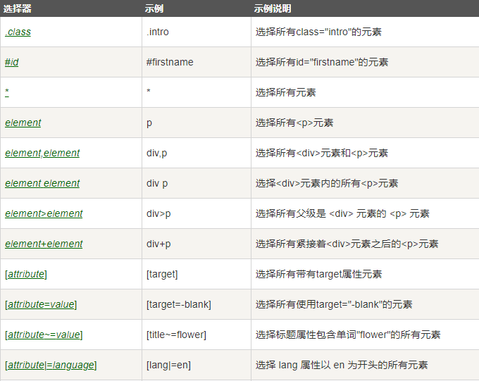

-   请求方式：GET/POST两种类型常用，另外还有HEAD/PUT/DELETE/OPTIONS

    -   GET和POST的区别就是：请求的数据GET是在url中，POST则是存放在请求体里面。

    -   GET:一般向服务器获取数据用get请求，get请求的数据都是放在url中的，实质上和post请求没有太大的区别，当然也可以用来向服务器发送数据。

    -   POST:一般向服务器发送数据用post请求，post请求的数据放在请求体里。

    -   HEAD：与GET方法一样，都是向服务器发出指定资源的请求。只不过服务器将不传回资源的本文部分。它的好处在于，使用这个方法可以在不必传输全部内容的情况下，就可以获取其中"关于该资源的信息"（元信息或称元数据）。

    -   PUT：向指定资源位置上传其最新内容。

    -   OPTIONS：这个方法可使服务器传回该资源所支持的所有HTTP请求方法。用'*'来代替资源名称，向Web服务器发送OPTIONS请求，可以测试服务器功能是否正常运作。

    -   DELETE：请求服务器删除Request-URI所标识的资源。

-   URL：统一资源定位符——网址，统一资源定位符是对可以从互联网上得到的资源的位置和访问方法的一种简洁的表示，是互联网上标准资源的地址。互联网上的每个文件都有一个唯一的URL，它包含的信息指出文件的位置以及浏览器应该怎么处理它。URL的格式由三个部分组成：

    -   第一部分是协议(或称为服务方式)。 http/https

    -   第二部分是存有该资源的主机IP地址(有时也包括端口号)。
        www.nnzhp.cn/192.168.1.1:8888

    -   第三部分是主机资源的具体地址，如目录和文件名等。 /index

-   请求组成：请求头和请求体。

    -   请求头：包含请求时的头部信息，如User-Agent,Host,Cookies等信息，user-agent就是你请求用的是什么浏览器，host就是服务端的地址，还有很多信息，服务端是如何分辨你是用的什么浏览器，你的ip地址就是从请求头里面获取到的。下面就是在请求我博客的时候，发送的头信息。

    -   请求体：请求体就是发送数据的时候，数据放在请求体里面。get请求是没有请求体的，从上面的截图也能看到，下面是没有这个请求体的。post请求才有请求体。下面的截图可以看到登陆博客的这个请求是一个post请求，登陆的账号密码就是放在请求体里面的。

-   http响应

    -   响应包含2个部分：响应头------响应的状态码，返回数据的类型，类型的长度，服务器信息，Cookie信息等等；响应体------具体返回的数据。

    -   响应状态码：有很多响应状态，不同的状态码代表不同的状态，常见的状态码：200代表成功，301跳转，404找不到页面，502服务端错误

-   元素审查

    -   Elements里看到的代码不等于请求网址拿到的返回值。它是网页经过浏览器渲染后最终呈现出的效果，包含了异步请求数据，以及浏览器自身对于代码的优化改动。Elements有几个功能：

        -   选择元素：通过鼠标去选择页面上某个元素，并定位其在代码中的位置。

        -   模拟器：模拟不同设备的显示效果，且可以模拟带宽。

        -   代码区：显示页面代码，以及选中元素对应的路径

        -   样式区：显示选中元素所受的 CSS 样式影响

    -   Network可以监听、查看原始请求的源代码。

        -   找到包含所需数据的请求：点击"搜索"功能，直接对内容进行查找；选中Preseve
            log，这样页面刷新和跳转之后，列表不会清空；Filter栏可以按类型和关键字筛选请求。Network还可以右键点击列表，选择"Save
            as HAR with
            content"，保存到文件。这个文件包含了列表中所有请求的各项参数及返回值信息，以便查找分析。（实际操作中，经常有直接搜索无效的情况，只能保存到文件后搜索）

        -   过滤：xhr即XMLHttpRequest，代表的是ajax请求，显示的是JS代码发起的异步网络请求。js代表直接请求的js文件，显示的是从服务器上获取的JS文件。

        -   Headers：Headers中可查看Request Headers、URL和Response
            Headers等信息，其中Request
            Headers中有一个信息为X-Requested-With:XMLHttpRequest，标记了此请求是Ajax请求。如果出现403类的错误代码可以在requests.get()方法里加上headers。在请求网页爬取的时候，输出的text信息中会出现抱歉，无法访问等字眼，这就是禁止爬取，需要通过反爬机制去解决这个问题。headers是解决requests请求反爬的方法之一，可以设置一些headers信息，模拟成浏览器取访问网站。headers中有很多内容，主要常用的就是user-agent和host，他们是以键对的形式展现出来，如果user-agent键对形式作为headers的内容就可以反爬成功，就不需要其他键对；否则需要加入headers下的更多键对形式。

        -   Preview：查看响应的内容，它是JSON格式的，Chrome会自动做解析。

        -   Response：查看真实的返回数据。

-   图片、音频、视频这些文件本质上都是由二进制码组成的，由于有特定的保存格式和对应的解析方式，我们才可以看到这些形形色色的多媒体。所以，想要抓取它们，就要拿到它们的二进制码。

-   response.json()：把返回响应的json字符串转换成字典。

    -   response.json()等同于json.loads(response.text)，text/plain是无格式正文，意思是将文件设置为纯文本的形式，跟接口返回什么类型的数据并没有直接的关系。

## 金融系列

- 合并

    ```
    pd.merge

    pd.concat

    df.join

    df.merge
    ```

- 重塑
    ```
    df.stack() #转为多层次索引，列属性变为行属性

    df.unstack() #stack的逆运算

    df.pivot() #长格式转为宽格式

    df.reset_index() #多层索引转为列属性
    ```

- 清洗
    ```
    df.duplicated() #识别重复bool

    df.drop_duplicates()、df.drop_duplicates(['A']) #去重

    df.dropna() #去空

    df.describe() #统计特征，检测异常

    df.drop([],axis=1) #删除任意索引行列
    ```
    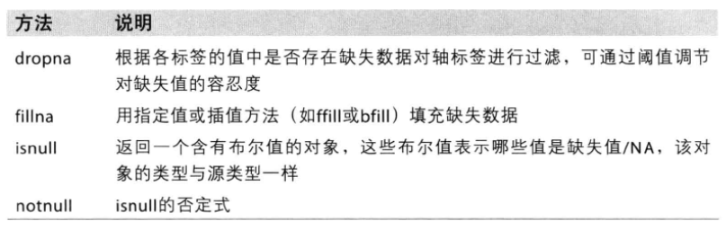

- 数据修改、面元离散化、哑变量
    ```
    df[‘New’]=df[‘A’].map(func) #Series的map方法
    df[‘A’].replace([-999,-1000], np.nan) #将属于列表的数字替换为nan，也可用字典
    df.index.map() #map方法修改索引
    pd.cut() #根据面元边界进行离散化划分；根据面元数量记性离散化划分
    pd.qcut() #根据样本分位数进行面元划分
    pd.get_dummies(df[‘A’]) #设置关于A列的分类的哑变量
    ```
- 分组运算
    ```
    df[‘A’].groupby(df[‘B’]) #根据B列对A列分组
    分组迭代、选取部分组、通过字典或Series分组、通过函数（其返回值）分组、根据索引级别分组

    grouped.agg(func1,func2,func3)
    #分组后，各组运用sum、mean、min、max、describe等方法会自动聚合。
    ```
    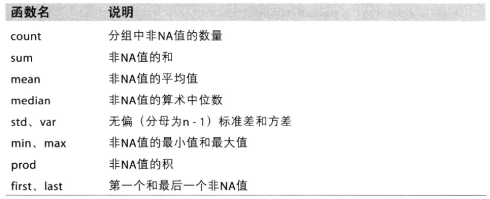
    ```
    df.groupby('A').transform(func) #transform会对各组使用func

    df.groupby('A').apply(func) #apply会对各组使用func

    #cut或qcut结合groupby进行bucket和quantile分析

    cut1=pd.cut( )

    df.groupby(cut1).apply(func)
    ```
-   透视表和交叉表
    ```
    #透视表：pivot_table

    #交叉表计算分组频率：crosstab
    ```

-   金融运用问题——规整
    ```
    #pandas在算数运算中自动对齐数据（时间序列以及截面对齐）

    #时间序列低频转高频时，用resample；相逆的操作是重对齐，用reindex。都支持填充逻辑

    #df的update方法填充缺失序列，有时直接使用索引机制更简单

    #分组技术：排名rank()、标准化zscore；分组因子暴露pd.ols().beta；分位数分析pd.qcut()和groupby()；
    ```
## pytorch
## 安装
gpu版本训练时可以选择gpu或者cpu进行训练，cpu版本只能选择cpu进行训练。推荐在conda虚拟环境中安装cuda、cudnn、pytorch(https://zhuanlan.zhihu.com/p/367740437、https://blog.csdn.net/m0_61102347/article/details/120922915)。
- 安装顺序
    - 安装annaconda
    - 安装cuda、cuDNN
        > 1、cuda版本：打开NVIDIA控制面板，查看当前驱动所支持的最高CUDA版本；在pytorch官网确定当前支持哪些cuda版本。
        2、[下载安装cuda](https://developer.nvidia.com/cuda-toolkit-archive)：CUDA Toolkit版本不能高于最高驱动支持的版本以及必须在pytorch支持的范围内。cmd验证CUDA是否安装成功，输入nvcc –V
        3、[下载安装cuDNN](https://developer.nvidia.com/cudnn)：cuDNN版本和cuda版本对应。cmd验证cuDNN是否安装成功，Result = PASS即成功
        > > cd C:\Program Files\NVIDIA GPU Computing Toolkit\CUDA\v12.0\extras\demo_suite
        bandwidthTest.exe
        deviceQuery.exe
    - 安装pytorch
        - annaconda创建并激活虚拟环境
            ```
            conda create -n pytorch-gpu-cuda117 python=3.9
            conda activate pytorch-gpu-cuda117
            ```
        - [推荐安装教程](https://www.bilibili.com/video/BV1eg411v7fK?p=2&vd_source=2a823ce6073f9ac24d39aaa3c97831d4)
            > [torch和torchvision whl下载](https://download.pytorch.org/whl/torch_stable.html)放到pytorch-gpu-cuda117/Scripts
            cmd进入pytorch-gpu-cuda117/Scripts，执行pip install torch-xxx.whl
        - [(不推荐)pytorch官网选择和cuda版本对应的安装代码](https://pytorch.org/get-started/locally/)：在运行安装命令时注意去掉后边的 -c pytorch（-c 的意思是去哪个地方下载安装文件，使用-c pytorch意思去pytorch官网下载好像，安装anaconda并换源之后，去掉这个可以下载的快一些 ）https://blog.csdn.net/qq_36944952/article/details/109460760
            ```
            conda install pytorch torchvision torchaudio pytorch-cuda=11.7 -c pytorch -c nvidia
            ```
            - [更换下载源方法](https://blog.csdn.net/opencv_fjc/article/details/106186785)
        - 验证是否安装成功：.py
            ```
            import torch
            print(torch.__version__)
            print(torch.cuda.is_available())
            ```

# 常用库

## 基本库

-   1、os：文件、目录、路径、系统环境处理

-   2、sys：命令行参数List，第一个元素是程序本身路径；退出程序，正常退出时exit(0)；获取Python解释程序的版本信息；返回模块的搜索路径，初始化时使用PYTHONPATH环境变量的值；操作系统平台名称。sys.path是python的搜索模块的路径集，是一个list。

-   3、subprocess：执行系统命令

-   4、json 和 pickle： 用于序列化的两个模块。json，用于字符串 和
    python数据类型间进行转换；pickle，用于python特有的类型 和
    python的数据类型间进行转换。

-   5、shutil：压缩包zip、tar；类似于高级API，主要强大之处在于其对文件的复制与删除操作；

-   6、time、datetime：时间和日期处理；

-   7、re：正则

-   8、random：随机

-   9、TuShare：开源财经数据接口包

-   10、numpy、scicy、pandas、matplotlib / seaborn（推荐）、Statsmodels：数据包

    -   numpy：矩阵运算、随机数

    -   SciPy：构建于NumPy之上的科学计算工具集，不是完整的包含NumPy、Matplotlib的SciPy技术栈；它专为科学和工程设计，包括统计,优化,整合,线性代数模块,傅里叶变换,信号和图像处理,常微分方程求解器等等。如：数值计算的算法、一些功能函数，可以方便的处理数据。

    -   pandas：数据整理

    -   matplotlib / seaborn：数据可视化，推荐后者

    -   Statsmodels：统计计量

-   11、xlrd、xlwt：专门用于xlsx文件的读写

## PDF识别

pdfminer：提取文本

tabula：提取表格不太规范

pdfplumber：提取表格且规范

## 文本分析

-   中文分词jieba、自然语言处理nltk：nltk处理语言数据，为像WordNet这样的词汇资源提供了简便易用的界面。具有为文本分类(classification)、文本标记(tokenization)、词干提取(stemming)、词性标记(tagging)、语义分析(parsing)和语义推理(semantic
    reasoning)准备的文本处理库。

-   其他：Pattern、TextBlob

## 机器学习

StatsModels：基本统计库，提供包括描述性统计、评估和推断等操作在内的统计模型。

Scikit-learn：用于机器学习，建立在Scipy之上。

PyTorch：简洁的深度学习算法包。Sklearn和PyTorch的文档教程有公式原理、参考论文，利于学习。

Tenseflow：sklearn是机器学习算法包，pytorch和TensorFlow是深度学习算法包。sklearn有很多数据处理方法，目前在使用tf或者pytorch的过程中都会结合sklearn进行数据处理。在工业界用tf的比较多，学术界基本都是pytorch，入门的话，肯定pytorch简单好用，如果只是服务端部署，建议pytorch，移动端部署tflite还是支持的比较好一些。sklearn做机器学习，pytorch搞实验室研究，tf搞部署。

mxnet：类似tensorflow进行框架部署，但社区生态上处于劣势。

Keras：用Python编写的神经网络的高阶API，支持TensorFlow、CNTK和Theano，Keras可以最快的开发速度将想法转化为实际成果。

XGBoost：高效、灵活、移植的分布式梯度提升库，使用机器学习算法中的梯度提升框架。XGBoost提供了并行树提升方法，代码还可以在主流分布式环境（Hadoop、SGE、MPI）下运行，借助分布式技术XGBoost可以处理十亿量级的数据。

## 绘图

-   静态：matplotlib，基础可视化库；seaborn，基于matplotlib的高级可视化效果库，针对数据挖掘和机器学习中的变量特征选取，能够用短小的代码去绘制描述更多维度数据的可视化效果图。

-   交互：plotly，可在线导入数据做可视化并保存内容在云端server；Bokeh，做浏览器端交互可视化的库；Pyecharts，基于百度echarts的一个开源项目，相比bokeh和plotly，pyecharts的语法更简单效果更佳；Geoplotlib和Mapbox做地图可视化库。

-   实时动态交互：pyqtgraph、vispy。

-   kepler.gl：功能强大的开源地理空间可视化探索工具，适用于大规模数据集。

- 地图：forlium+shapely

## FAQ

### OSError: Initializing from file failed

pandas读入文件名有中文

### takes no parameters

内置函数写错：一般两边都是双下划线，例如：__init__

### 中文编码错误，指定编码问题
```
Python2中默认的编码格式是ASCII格式，在没修改编码格式时在读取中文时会报错。解决方法为只要在文件开头加入# -*- coding: UTF-8 -*-或者# coding=utf-8。注意：# coding=utf-8 的 = 号两边不要空格。
#!/usr/bin/python
# -*- coding: UTF-8 -*-
print "你好，世界";

注意：Python3.X源码文件默认使用utf-8编码，所以可以正常解析中文，无需指定UTF-8编码。
```
### 判断nan和null不能用==或者！=

数据处理时，经常会遇到处理数据中的空值，涉及几个常用函数，pd.isnull()，pd.notnull()，np.isnan()，pd.notna()，pd.isna()，pd.fillna()、pd.dropna()等等.

总结： np.isnan()和pd.isnull()都可以对不论是DataFrame、Python
list还是仅仅一个数值进行空值检测。但一般在实际应用中，np.isnan()多用于单个值的检验，pd.isnull()用于对一个DataFrame或Series（整体）的检验。

### OSError: [Errno 22] Invalid argument:

路径是从文件属性里的安全模块直接复制出来的，会在路径首部填充一个空格，直接从word复制的路径会出现错误，一般在结尾空按delete

### if __name__=='__main__':
    ```
    当在模块A运行“if __name__=='__main__':”语句时，模块A的__name__的值就是__main__，条件判断的结果为True，“if __name__=='__main__':”下面的代码块就会被执行。如果模块A被导入模块B，在模块B运行时，模块A的__name__的值就是模块A的真实名称，模块A中“if __name__=='__main__':”下面的代码块不会被执行。
    因此加入该条件可以使部分代码导入到其他模块时不被执行。
    ```
### ?:、?=、?!

在正则表达式匹配的过程中，其实存在"消耗字符"的过程，也就是说，一旦一个字符在匹配过程中被检索（消耗）过，后面的匹配就不会再检索这一字符了。

(?=abc) 捕获，但不消耗字符，且匹配abc

(?!abc) 捕获，不消耗，且不匹配abc

其他：(?...)、(?:...)、(?P<name>...)、(?P=name)、(?#...)、(?=...)、(?!...)、(?<=...)、(?<!...)、(?(id/name)yes-pattern|no-pattern)

### yield

-   一般和循环搭配使用：yield的作用就是把一个函数变成一个generator，带有yield的函数不再是一个普通函数，Python解释器会将其视为一个generator，调用带有yield的函数时不会执行该函数，而是返回一个iterable对象。

    -   在所搭配的循环执行时，每次循环都会执行该函数内部的代码，执行到yield时，该函数就返回一个迭代值。

    -   下次迭代时，代码从yield的下一条语句继续执行，而函数的本地变量看起来和上次中断执行前是完全一样的，于是函数继续执行，直到再次遇到yield。

    -   也可以手动调用带有yield的函数的next()方法，因为该函数是一个generator对象，该对象具有next()方法。

    -   一个带有 yield 的函数就是一个
        generator，它和普通函数不同，生成一个 generator
        看起来像函数调用，但不会执行任何函数代码，直到对其调用
        next()（在 for 循环中会自动调用
        next()）才开始执行。虽然执行流程仍按函数的流程执行，但每执行到一个
        yield 语句就会中断，并返回一个迭代值，下次执行时从 yield
        的下一个语句继续执行。看起来就好像一个函数在正常执行的过程中被
        yield 中断了数次，每次中断都会通过 yield 返回当前的迭代值。

    -   yield 的好处是显而易见的，把一个函数改写为一个 generator
        就获得了迭代能力，比起用类的实例保存状态来计算下一个 next()
        的值，不仅代码简洁，而且执行流程异常清晰。

### 元素格式错误

函数直接对元素、行、列广播可能会因元素出现空值、数据类型问题报错。

# python学习日志

## python基础笔记

### 概念

-   浅拷贝、深拷贝

    -   1.赋值是将一个对象的地址赋值给一个变量，让变量指向该地址（旧瓶装旧酒）。

    -   2.浅拷贝是在另一块地址中创建一个新的变量或容器，但是容器内的元素的地址均是源对象的元素的地址的拷贝。也就是说新的容器中指向了旧的元素（新瓶装旧酒）。

    -   3.深拷贝是在另一块地址中创建一个新的变量或容器，同时容器内的元素的地址也是新开辟的，仅仅是值相同而已，是完全的副本。也就是说（新瓶装新酒）。

-   文件扩展名：python源文件通常用.py扩展名。当源文件被解释器加载或者显式地进行字节码编译的时候会被编译成字节码。由于调用解释器的方式不同，源文件会被编译成带有.pyc或.pyo扩展名的文件。模块的文件名就是模块的名字加上扩展名.py。

-   print字符变量，语句调用str()函数显示对象；而交互式解释器则调用repr()函数来显示对象。

-   python变量名大小写敏感；因为下划线对解释器有特殊的意义，而且是内建标识符所使用的符号，建议程序员避免用下划线作为变量名的开始。一般来讲，变量名_xxx被看作是"私有的"，在模块或类外不可以使用；当变量是私有的时候，用_xxx来表示变量是很好的习惯。因为变量名\_\_xxx\_\_对python来说有特殊含义，对于普通的变量应当避免这种命名风格。

    -   \_xxx不用\'from module import \*\'导入

    -   \_\_xxx\_\_系统定义名字

    -   \_\_xxx类中的私有变量名

-   变量相关问题

    -   无须事先声明

    -   变量无须指定类型

    -   程序员不用关心内存管理

    -   变量名会被"回收"

    -   del语句能够直接释放资源

-   python通过传递引用来处理对象：在python中，一切皆对象，变量也不再具有类型，变量仅仅是对象的一个引用。对于不可修改变量修改后引用的实际操作？？？

    -   标准不可变类型：数字、字符串、元组。

    -   等号(=)是主要的赋值运算符，在Python语言中，对象是通过引用传递的。在赋值时，不管这个对象是新创建的，还是一个已经存在的，都是将该对象的引用（并不是值）赋值给变量

    -   python支持增量赋值，也就是运算符和等号合并在一起，增量赋值相对普通赋值的变化是第一个对象仅被处理一次。可变对象会被就地修改（无修拷贝引用），不可变对象则和普通赋值无异

### 语法基础

井号(#)表示之后的字符为Python注释

换行(\n)是标准的行分隔符（通常一个语句一行）

反斜线(\)继续上一行

分号(;)将两个语句连接在一行中

冒号(:)将代码块的头和体分开

语句（代码块）用缩进块的方式体现

不同的缩进深度分隔不同的代码块

Python文件以模块的形式组织

符号>>用来重定向输出

带逗号的print语句（print item,）输出的元素之间会自动添加一个空格，抑制自动生成换行符号

-   布局总结：
```
#(1)起始行(Unix)

#(2)模块文档

#(3)模块导入

#(4)变量定义

#(5)类定义

#(6)函数定义

#(7)主程序
```
-   异常：为了避免异常没有被截获，导致后面的代码就不会再被执行，效果和没有try一样，最后都要加上万能的Exception（或者用except:），这样就可以捕获所有的异常信息，保证程序不会被中断。

-   上下文管理with：它会完成准备工作,比如试图打开一个文件,如果一切正常,把文件对象赋值给f.然后用迭代器遍历文件中的每一行,当完成时,关闭文件.无论的在这一段代码的开始,中间,还是结束时发生异常,会执行清理的代码,此外文件仍会被自动的关闭.
    ```
    with context_expr [as var]:

        with_suite

    例如：

    with open(\'/etc/passwd\', \'r\') as f:

        for eachLine in f:

        ......# \...do stuff with eachLine or f
    ```
-   序列：字符串、列表、元组

    -   字符串

        -   原始字符串操作符( r/R )

        -   len()、max()、min()、enumerate()、zip()、raw_input()、str() and unicode()、chr(), unichr(), and ord()

    -   字典：keys()方法返回一个列表，包含字典中所有的键；values()方法返回一个列表，包含字典中所有的值；items()返回一个列表，包含所有(键,值)元组对。

    -   操作：

        -   成员关系操作符 (in, not in)，返回布尔值

        -   连接操作符(+)，把一个序列和另一个相同类型的序列做连接

        -   重复操作符(*)

        -   切片操作符([],[:],[::])

-   range([start,]stop[,step])返回一个整数列表。起始值为start,结束值为stop-1;start默认值为0，step默认值为1。range()函数经常和len()函数一起用于字符串索引

-   单元素元组：在唯一的元素后面加个逗号可以防止因括号()重载导致的单元素元组创建失败

-   只需要用字典的名字就可以在 for
    循环里遍历字典，要得到字典中某个元素的值，可以用你所熟悉的字典键加上中括号来得到

-   python函数是通过引用调用的。这意味着函数内对参数的改变会影响到原始对象。不过事实上只有可变对象会受此影响，对不可变对象来说，它的行为类似按值调用。

-   当一个类实例被创建时，\_\_init\_\_()方法会自动执行，它的目的是执行一些该对象的必要的初始化工作。通过创建自己的\_\_init\_\_()方法，你可以覆盖默认的\_\_init\_\_()方法（默认的方法什么也不做），从而能够修饰刚刚创建的对象。

## 字符串转变量

-   eval('A+B')方法只能计算一个表达式的值，字符串不能是赋值表达式。不安全，慎用。

-   exec('A=值')方法执行储存在字符串或文件中的代码段。即可以执行动态代码。

-   globals()['A']=值 #将字符串'A'转化为变量A并赋值。

这个方法通过修改全局命名空间，巧妙地"定义"出了新的变量。globals()方法取出来的是一个字典，字符串'A'是其中一个键值（key），而这个键值恰恰是全局命名空间中的一个变量，这就实现了从常量到变量的转化。

-   对于class，推荐使用setattr()方法

setattr给对象添加属性或者方法，给对象的属性赋值，若属性不存在，先创建再赋值。

-   vars()函数返回对象object的属性和属性值的字典对象。Return the
    \_\_dict\_\_ attribute for a module, class, instance, or any other
    object with a \_\_dict\_\_attribute.

## 字符串的BIFs

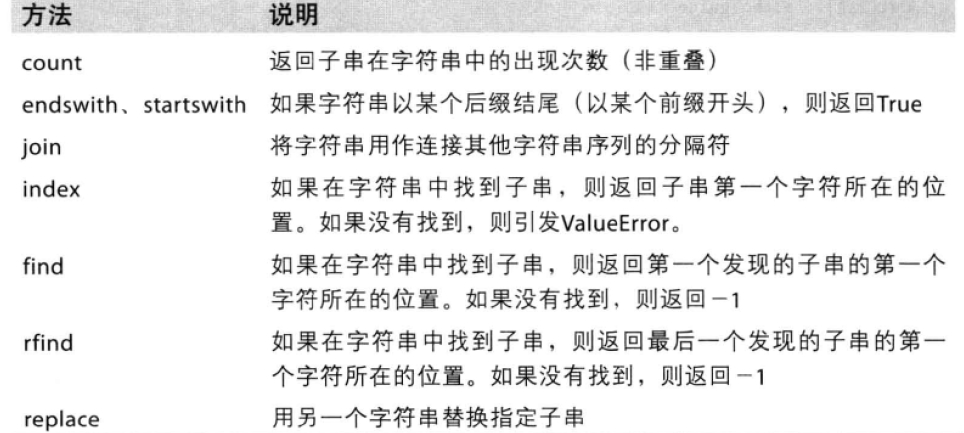

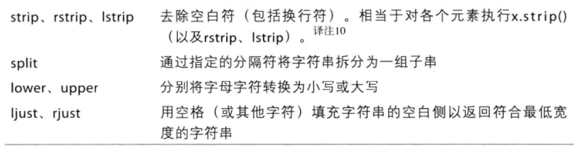

## 运算符

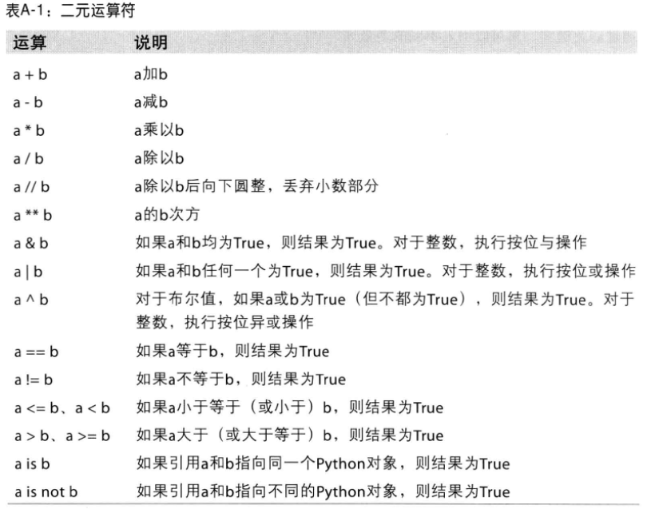

## 类型转换

-   str()、int()、long()、float()、complex()
    用来将其它数值类型转换为相应的数值类型。这些函数也接受字符串参数，返回字符串所表示的数值。

    -   函数 int()直接截去小数部分。（返回值为整数）

    -   函数 floor()得到最接近原数但小于原数的整数。（返回值为浮点数）

    -   函数 round()得到最接近原数的整数。（返回值为浮点数）

-   list(),str()和tuple()被用做在各种序列类型之间转换

-   type()返回对象类型

## 序列常用

str.join(list) list中的元素必须为str

list[0:4:2]从索引位置0开始，到索引位置3结束，中间间隔数位2，间隔为-1时倒序

list.append(obj) 向列表中添加一个对象obj

list.count(obj) 返回一个对象obj在列表中出现的次数

list.extend(seq) 把序列seq的内容添加到列表中，可用+号；另有\*法，类似字符串

list.index(obj, i=0, j=len(list)) 返回list[k] == obj 的k 值,并且k的范围在 i<=k<j;否则引发ValueError异常.

list.insert(index, obj) 在索引量为index的位置插入对象obj.

list.pop(index=-1) 删除并返回指定位置的对象,默认是最后一个对象

list.remove(obj) 从列表中删除对象obj

list.reverse() 原地翻转列表

序列类型提供以下可操作BIFs：字符串''、列表[]、元组()
len(list)、sum(list)、max(list)、min(list)

## 字符串格式化操作

- f-string: f"xxx{}xxx"
- string.format()：'{1} {a} {4}'.format(1='dd',a=变量1,4=变量2)

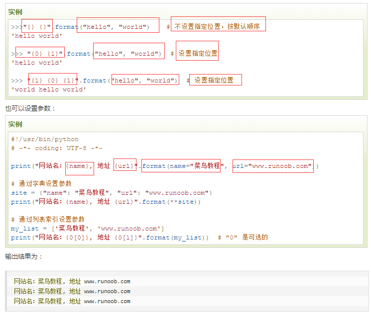

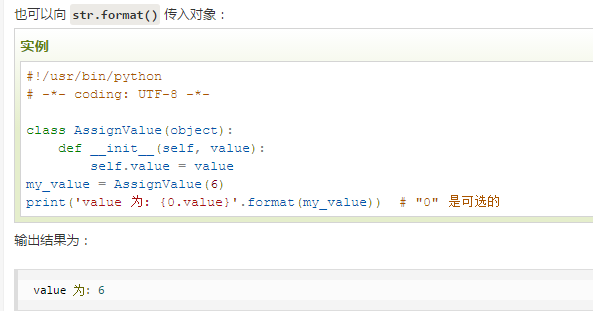

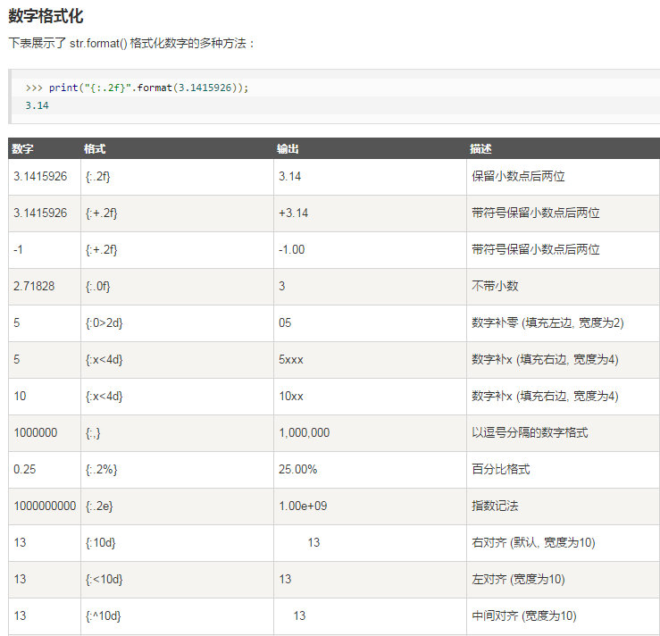

- 格式化表达式%：
    ```
    换行符(\n)、tab符(\t)、空字符Nul(\0)、回车(\r)、换页(\f)

    实例：print("I'm %s. I'm %d year old" % ('String', 99))
    ```
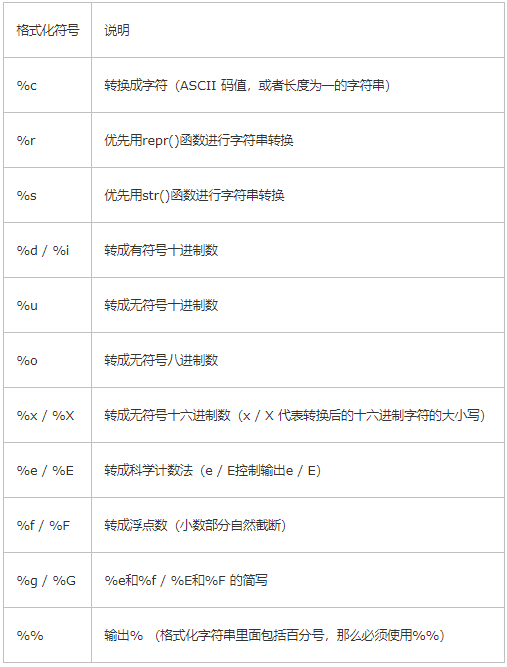

通过"%"可以进行字符串格式化，但是"%"经常会结合下面的辅助符一起使用
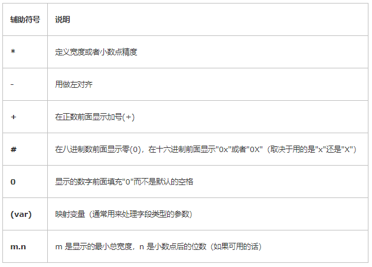

## 函数式编程

v=true_expr if condition else false_expr #三元表达式

lambda x, y: x + y

apply()

filter()

map()

reduce()

## 创建字典
```
#创建一个空字典
empty_dict = dict() 

#用**kwargs可变参数传入关键字创建字典
a = dict(one=1,two=2,three=3) 

#用zip()打包传回的元组列表传入可迭代对象，zip(['one','two','three'],[1,2,3])→[('one', 1), ('two', 2), ('three', 3)]
b = dict(zip(['one','two','three'],[1,2,3]))

#传入可迭代对象
c = dict([('one', 1), ('two', 2), ('three', 3)])
c1 = dict([('one', 1), ('two', 2), ('three', 3),('three', 4),('three', 5)])   #如果键有重复，其值为最后重复项的值。 

#传入映射对象，字典创建字典  
d = dict({'one': 1, 'two': 2, 'three': 3}) 
```