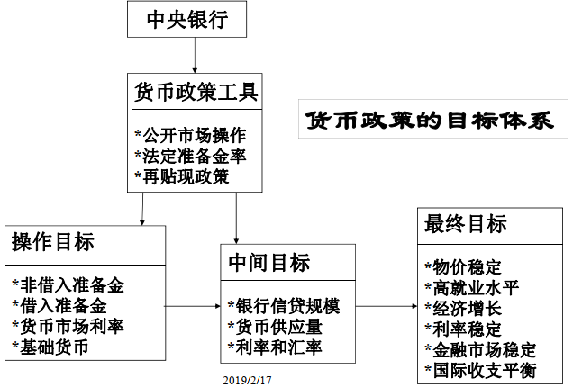
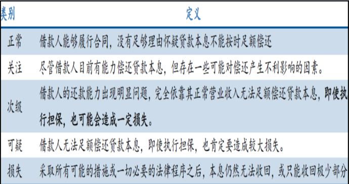
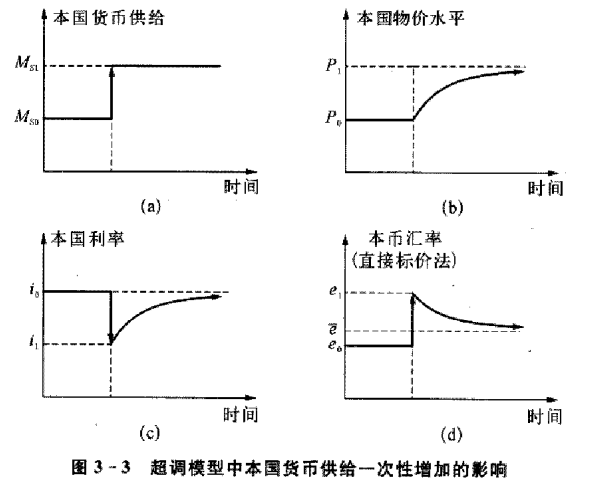

# 前言ZSP

-   关注过程：货币运行和货币政策传导中涉及的各"场所"的特征和各主体的行为与动机。

-   课程目标

    -   正确理解货币、信用、利息、风险、流动性等概念的内涵以及在现代经济体系中的作用

    -   理解金融系统在提供风险分担、流动性和信息等金融服务方面的功能

    -   了解金融市场的特征以及中国金融市场历程，如资产证券化、影子银行、金融"乱象"。

    -   掌握商业银行的主要业务、资产负债分析及其风险管理原理。

    -   掌握金融监管理论观点，巴塞尔协议的演进及其理念和主要内容。

    -   理解货币供给与需求的主要理论观点。

    -   掌握货币政策的目标、体系和理论工具及货币政策传导机制，特别是中国的情景。

    -   学会阅读分析货币政策执行报告。

    -   **掌握非对称信息条件下分析问题的基本框架，能够分析现实货币政策的意图、传导渠道和实施效果。**

# 导论

-   微观经济学

    

-   不确定性和风险

    -   不确定性：行为者对未来状态的认识是"只知道自己对什么也不知道"。

    -   风险：知道未来状态的全集和状态发生的概率分布。

-   两个假设

    -   无套利假设：市场的资源配置效率

    -   有效市场假设：市场的信息效率

-   金融学：跨时的资源配置（收益和风险管理）

    
    
-   供求价格

    -   需求：市场购买力来自金融资产；

    -   供给：商品与服务的供给来实体经济的自存量和增量。存量资产(设施)肩负提供"效用"的重任；存量由增量逐渐形成；增量的质量至关重要。

-   金融系统

    -   市场分类

        -   宽泛的金融市场：借贷市场、证券市场、保险市场

        -   货币市场和资本市场
            ```
            -   货币市场：期限在一年内的短期债务工具的交易市场。

            -   资本市场：长期证券交易市场。
            ```
        -   债权市场和股权市场

            -   债券：契约协定，一般有到期日，还本付息。权益要求优先，不能从企业价值升值中获益。

            -   股票： 企业权益凭证，有股息收入和资本收益。

        -   衍生品市场： 期货、期权、利率互换、货币互换

    -   金融系统的功能

        -   1\. Savings Function 储蓄

        -   2\. Wealth Function 财富

        -   3\. Liquidity Function 流动性

        -   4\. Credit Function 信用

        -   5\. Payment Function 支付

        -   6\. risk-sharing Function 风险分担

        -   7\. Policy Function 政策等功能

        -   8\. Information Function 信息

    -   中国主要服务机构

        -   中央国债登记结算有限责任公司

        -   中国证券登记结算有限公司

        -   银行间市场清算所股份有限公司

        -   中国外汇交易中心：境内人民币相关产品交易主平台和定价中心，每日生成人民币汇率中间价、上海银行间同业拆放利率(Shibor)、贷款基础利率(LPR)、回购定盘利率、债券指数、收益率曲线等系列市场基准。

        -   期货交易所：上海期货交易所、郑州商品交易所、大连商品交易所、中国金融期货交易所。

-   分析框架

    -   金融市场的微观供求因素分析

    -   总供求分析及均衡

    -   交易成本和信息不对称的影响分析

    
    
    

# 货币供给

-   货币是由三种基本要素构成的"社会型技术"：价值单位、信用记录体系、可转让债务

-   持有货币的原因：流动性(liquidity)是指一种资产转变成交易媒介的难易和快慢程度。它涉及三方面的因素：变现的难易和快慢、变现成本、自身价格的稳定性和可预测性。

-   货币供给量指标------流动性标准

    -   M0 =流通中现金

    -   M1=M0+活期存款

    -   M2 =M1+定期存款+储蓄存款。

-   基础货币：现金＋准备金

-   广义的货币可以划分为货币和准货币。货币是指M1，准货币是指M2中不属于M1的部分。我国的货币供应分3个层次：

    -   M0＝流通中货币

    -   M1=M0+单位活期存款

    -   M2=M1+单位定期存款+个人存款+其他存款

-   社会融资规模

    -   社会融资规模是指实体经济（即非金融企业和个人）从金融体系获得的资金量。这里的金融体系是整体金融的概念。从机构看，包括银行、证券、保险等金融机构；从市场看，包括信贷市场、债券市场、股票市场、保险市场以及中间业务市场等。

    -   社会融资规模增量：指一定时期内(每月、每季或每年)获得的资金总额；存量是指一定时期末(月末、季末或年末)获得的资金余额。

        -   社会融资规模增量＝人民币各项贷款＋外币各项贷款＋委托贷款＋信托贷款＋银行承兑汇票＋企业债券＋非金融企业股票融资＋保险公司赔偿＋投资性房地产＋其他（注："其他"主要包括小额贷款公司贷款和贷款公司贷款余额。）

    -   社会融资规模存量＝人民币各项贷款＋外币各项贷款＋委托贷款＋信托贷款＋银行承兑汇票＋企业债券＋非金融企业股票融资＋投资性房地产＋其他

        -   社会融资规模存量统计中不包括保险公司赔偿，因为赔偿是指一定时期内因履行赔偿义务而发生的金额，它没有存量或余额的概念。

    -   四个部分：一是金融机构表内业务；二是金融机构表外业务；三是直接融资；四是其他项目。

    -   分项解释：

        -   1\. 人民币贷款：金融机构向非金融企业、个人、机关团体以贷款、票据贴现、垫款等方式提供的人民币贷款；是实体经济部门传统的主要融资工具；不包含银行业金融机构拆放给非银行业金融机构的款项和境外贷款。

        -   2\. 外币贷款：金融机构向非金融企业、个人、机关团体以贷款、票据贴现、垫款、押汇、福费廷等方式提供的外币贷款；不包含银行业金融机构拆放给非银行业金融机构的款项和境外贷款。外币贷款余额根据期末汇率折合成人民币后计入社会融资规模总量。

        -   3\. 委托贷款：由企事业单位及个人等委托人提供资金，由金融机构（即贷款人或受托人）根据委托人确定的贷款对象、用途、金额、期限、利率等代为发放、监督使用并协助收回的贷款；不包含现金管理项下的委托贷款。现金管理项下委托贷款是指商业银行在现金管理服务中，受企业集团客户委托，以委托贷款的形式，为客户提供的企业集团内部独立法人之间的资金归集和划拨业务。

        -   4\. 信托贷款：信托投资公司在国家规定的范围内，运用信托投资计划吸收资金，对信托投资计划规定的单位和项目发放的贷款。信托贷款不列入信托投资公司自身的资产负债表。

        -   5\. 未贴现的银行承兑汇票：企业签发的银行承兑汇票未到金融机构进行贴现融资的部分。

        -   6\. 企业债券：由非金融企业发行的各类债券，包括企业债、超短期融资券、短期融资券、中期票据、中小企业集合票据、非公开定向融资工具、资产支持票据、公司债、可转债、可分离可转债和中小企业私募债等券种。

        -   7\. 非金融企业股票融资：非金融企业通过正规金融市场的股票融资。目前计入社会融资规模的是非金融企业在境内沪、深两市的股票融资，主要是A股融资。

        -   8\. 保险公司赔偿：保险公司在保险合同有效期内履行赔偿义务而提供的各项资金，具体包括财产险赔偿、健康险赔款和意外伤害险赔款。

        -   9\. 投资性房地产：金融机构为赚取租金或资本增值，或者两者兼有而持有的房地产，包括出资的土地所有权、持有的土地使用权、已出租的建筑物等。目前纳入社会融资规模的投资性房地产，包括银行业金融机构投资性房地产和保险公司投资性房地产两项。

        -   10.其他：实体经济从小额贷款公司、贷款公司等获得的资金。

        -   2018年7月起,人民银行完善社会融资规模统计方法，将"存款类金融机构资产支持证券"和"贷款核销"纳入社会融资规模统计，在"其他融资" 项下反映。2018年9月起，人民银行将"地方政府专项债券"纳入社会融资规模统计，地方政府专项债券按照债权债务在托管机构登记日统计。

-   社会融资规模vs货币供应量

    -   货币供应量从银行资产负债表负债方统计；社融与之对应，从资产方和金融机构发行方统计。

    -   从货币持有部门角度构建一个描述整体金融与实体经济之间资金供求的指标，丰富货币政策的二元传导机制。

    -   社融指标有助于解释不同主体、市场的资金往来的特点，可以直观反映金融及资金供给结构对实体经济的影响。

    

-   中央银行与基础货币

    

-   中央银行发行和回笼"基础货币"的途径

    -   再贴现

    -   再贷款

        -   常备借贷便利(StandingLendingFacility，SLF)：抵押贷款1-3月，满足金融机构期限较长的大额流动性需求，对象主要为政策性银行和全国性商业银行。合格抵押品包括高信用评级的债券类资产及优质信贷资产等。

        -   抵押补充贷款(Pledged Supplemental
            Lending，PSL)：政策性银行。支持国民经济重点领域、
            薄弱环节和社会事业发展而对金融机构提供的期限较长的大额融资，采取质押方式发放，合格抵押品包括高等级债券资产和优质信贷资产。

        -   中期借贷便利(Medium-term Lending Facility，
            MLF)：对象为符合宏观审慎管理要求的商业银行、政策性银行，可通过招标方式开展。中期借贷便利采取质押方式发放，金融机构提供国债、央行票据、政策性金融债、高等级信用债等优质债券作为合格质押品。

        -   定向中期借贷便利（ Targeted Medium-term Lending Facility，
            TMLF），根据金融机构对小微企业、民营企业贷款增长情况，向其提供长期稳定资金来源。
            支持实体经济力度大、符合宏观审慎要求的大型商业银行、股份制商业银行和大型城市商业银行，可向中国人民银行提出申请。定向中期借贷便利资金可使用三年，操作利率比中期借贷便利（
            MLF）利率优惠15个基点，目前为3.15%。

        -   "支农再贷款"、"支小再贷款"、"扶贫再贷款"

    -   中央国库现金管理商业银行定期存款

    -   公开市场业务(48家一级交易商)

        -   外汇交易； 现券交易； 央行票据

        -   正回购与逆回购

        -   短期流动性调节工具(SLO)： 7天短期回购为主(部分交易商)

        -   央行票据互换工具（ Central Bank Bills Swap，
            CBS），公开市场业务一级交易商可以使用持有的合格银行发行的永续债从中国人民银行换入央行票据。将主体评级不低于AA级的银行永续债纳入中国人民银行中期借贷便利（
            MLF）、定向中期借贷便利（ TMLF）、常备借贷便利（
            SLF）和再贷款的合格担保品范围。提高银行永续债的流动性，支持银行发行永续债补充资本。

-   中央银行调整货币供给：

    -   数量调整：基础货币、法定存款准备金

    -   价格控制：利率

    -   结构控制：特定目的和手段

-   货币形式演变的动因

    -   交易费用的节约；

    -   信用制度的发展：货币是信用的载体，货币的本质是信用，国家信用是最大的信用。

-   格雷欣(Greshams)法则

    -   复本位： 金、银两种本位货币。

    -   Greshams' Law：劣币驱逐良币。因金银法定比率与市场比率不同所致。

```
社会融资规模包括ABS吗？
答：不一定，ABS的支持资产如果本身就是房地产等实体资产，那么这部分的社会融资会被重复计算。
```

# 利率及其决定

## 利率

-   利率不是货币的价格或价值，是借贷资本的价格。

-   interest-rate risk： the risk level associated with an asset's return that results from interest-rate changes。

-   利率分类

    

## 利率理论

-   Determinants of Asset Demand

    -   1\. Wealth, the total resources owned by the individual, including all assets

    -   2\. Expected return (the return expected over the next period) on one asset relative to alternative assets

    -   3\. Risk (the degree of uncertainty associated with the return) on one asset relative to alternative assets

    -   4\. Liquidity relative to alternative assets

- Theory of Portfolio Choice

    
    
    

- 流动性偏好利率理论：货币供求决定利率

    -   货币供给M：由中央银行选择（外生变量）

    -   货币需求L：交易动机 、预防性需求 、投机性需求

    -   特点：货币市场均衡决定利率

        -   利率的决定与实际变量无关，是纯粹的货币现象；

        -   是一种存量理论；

        -   利率的变动使货币供求而不是储蓄－投资趋于均衡；

        -   是一种短期利率理论。

    -   Demand for money in the liquidity preference framework:

        -   As the interest rate increases:
            ```
            -   The opportunity cost of holding money increases...

            -   The relative expected return of money decreases...
            ```
        -   ...and therefore the quantity demanded of money decreases.

            

    -   Effect of higher rate of money growth on interest rates is ambiguous

        -   1\. Liquidity Effect: Ms ↑, Ms shifts right, i ↓

        -   2\. Income Effect: Ms ↑, Income ↑, Md ↑, Md shifts right, i ↑

        -   3\. Price Level Effect: Ms ↑, Price level ↑, Md ↑, Md shifts right, i ↑

        -   4\. Expected Inflation Effect: Ms ↑, πe ↑, Bd ↓, Bs ↑, Fisher effect, i ↑

- IS-LM模型的利率决定

    -   产品市场的均衡决定IS曲线，货币市场均衡：决定LM曲线，两市场同时均衡确定利率

## 期限结构理论

-   风险、流动性及税收待遇相同的债券，其回报(利)率会因到期日的不同而有差异。

-   利率期限结构理论要解释如下三个事实：

    -   1\. Interest rates on bonds of different maturities move together over time

    -   2\. When short-term interest rates are low, yield curves are more likely to have an upward slope; when short-term rates are high, yield curves are more likely to slope downward and be inverted

    -   3\. Yield curves almost always slope upward

-   预期理论(expectations Theory)

    -   1\. 基本假设前提：

        -   投资者追求持有期内收益最大；

        -   投资者不偏好特定的期限，各种期限可以完全替代；

        -   债券交易没有交易费用；

        -   投资者依据对未来利率的预期指导投资行为。

    -   2\. 命题：在预期理论中，如果投资者认为将来的短期利率看涨，则现在的收益曲线向上倾斜；反之，向下倾斜。

    -   3\. Expectations Theory

        -   Explains why the term structure of interest rates changes at different times

        -   Explains why interest rates on bonds with different maturities move together over time (fact 1)

        -   Explains why yield curves tend to slope up when short-term rates are low and slope down when short-term rates are high (fact 2)

        -   Cannot explain why yield curves usually slope upward (fact 3)

-   分割市场理论(Segmented markets theory)

    -   投资者对债券的期限有强烈的偏好，不同期限债券之间替代性很差。

    -   任何期限的收益率仅仅由该期限债券的供给关系决定。其收益曲线的形状也是如此决定。

    -   收益曲线上的不同点是由不同投资者群体的行为形成。

    -   If investors generally prefer bonds with shorter maturities that have less interest-rate risk, then this explains why yield curves usually slope upward (fact 3)

-   期限选择与流动性升水理论(Prefered habitat and liquidity premium theories)

    -   期限选择：投资者有自己的期限偏好，但也关心非偏好债券的收益率，只是此债券有较大的收益率时投资者才放弃偏好的债券转向此债券，故不同期限的债券是替代品但不是完全替代品。

    -   Investors are likely to prefer short-term bonds over longer-term
        bonds

    -   流动性升水：承认期限结构的预期理论但有一重大修正：因长期债券比短期债券负担更大的市场风险（价格波动风险），长期债券收益应包括对承担市场风险的补偿。这种补偿的收益报酬称为期限升水。

    -   Interest rates on different maturity bonds move together over
        time： Explained by the first term in the equation

    -   Yield curves tend to slope upward when short-term rates are low
        and to be inverted when short-term rates are high： Explained by
        the liquidity premium term in the first case and by a low
        expected average in the second case

    -   Yield curves typically slope upward： Explained by a larger
        liquidity premium as the term to maturity lengthens

## 长期债利率的决定因素

-   长期债利率的决定因素

    -   实体经济因素Real Component

        -   1.真实无风险利率：货币时间价值

        -   2.风险补偿：违约风险，反映实体经济的不确定性

    -   虚拟经济因素Inflation Component

        -   1.预期通货膨胀

        -   2.通货膨胀风险补偿

-   央行决定短期利率，市场决定长期利率

-   传统地，平坦的收益曲线意味经济萧条

-   1\. 正常的上扬的凸性收益曲线，随期限的增加，期限溢价（流动性溢价）的增长速度会减慢；市场对较远期的未来短期利率及其不确定性的预期趋于稳定。

-   2\. 凹性上扬的收益曲线，存在短期流动性陷阱的危险；市场对未来短期利率的预期或者不确定性，随期限的延伸而增加，且增加速度随之变大。

-   3\. 美国的扭转货币政策意味着什么？

## 中国的利率市场化

-   中国的利率结构：本币利率、外币利率；存款利率、贷款利率；同业拆借利率、债券市场利率、贴现利率......

-   中国利率市场化进程

    -   利率市场化是一个从利率管制到重新找寻市场化均衡利率的过程

    -   存贷款利率市场化的思路是"先外币、后本币；先贷款、后存款；先长期、大额，后短期、小额"。

    -   存贷款利率：由央行调整存贷款基准利率、扩大利率浮动区间，到逐步放开，由市场定价。对不同金融机构的不同业务有区别对待。

# 金融市场：工具与机构

## 市场传导看利率

-   按货币政策传导的层次：

    -   1\. 央行货币政策操作利率：再贷款、再贴现利率，公开市场操作的正、逆回购利率， SLO、 SLF、 MLF、TMLF等新型货币政策工具的操作利率，中央国库现金管理商业银行定期存款。

    -   2\. 货币市场利率：银行间存款类机构质押式回购利率、银行间质押式回购利率、金融机构同业之间的拆借利率。已经实现了市场化。

    -   3\. 央行规定的存贷款基准利率： 2015年10月以后至今没变。

    -   4\. 信贷市场利率：商业银行向企业和个人等实体发放贷款的利率，商业银行在贷款基准利率的基础上有一定幅度的浮动。

-   长短期收益率经济含义不同

    -   短期反映货币政策利率走向，长期反映市场对实体经济和长期通货膨胀的预期。

    -   ~~错误：如果市场预期长期通货膨胀高于短期通货膨胀，则倾向锁定长期收益，购买长期债而导致长期收益率下降，收益曲线可能倒挂。~~

-   长短期收益率展示差异期限的市场需求

    -   经济可能衰退时，利率即将下行。长期投资者会锁定长期收益而购买长期债；短期投资者可能换期限，卖出短期债而提高其收益率。

-   长短期收益率反映经济周期阶段

    -   经济低迷时，倒挂的曲线会延续。因为发行利率低的长期债，可以以低成本融资，走出经济困境。

## 票据融资


-   票据融资：中小企业为主体，制造业、批发和零售业(供应链融资)

-   直贴利率高于转帖利率；直贴是信贷业务，转贴是银行同业业务。银行利用票据调节信贷规模，贴现利率受影响，商业银行利用票据烫平贷款波动

-   票据信用风险低、期限短、流动性强，可以满足银行的流动性管理需求和风险偏好。

-   由于票据承兑和贴现的主要参与主体为中小企业，银行加大票据贴现力度有助于增加对中小企业授信，响应政策要求。

-   票据签发过程中企业缴纳的保证金是商业银行存款的直接来源之一，能满足银行的揽储需求。按照票据协议，保证金存款的利率可以是活期、定期、挂牌利率和协议存款利率。银行在提供承兑汇票开票签发的服务中，一方面赚取手续费，一方面又能获得低成本存款，对银行而言，票据业务有足够强的吸引力。

-   票据贴现联结了存贷款市场和银行间市场，两个市场的利率目前未完全并轨，存在利差，某些管制手段导致套利空间一直无法消除。央行给的便宜资金不一定惠及企业贷款。

    

## 利率互换(swap)协议

-   两公司之间达成的协议，以按照事先约定的方式在将来交换现金流，以减少融资成本。

    -   互换的动因：比较优势

    -   利率互换：固定利率和浮动利率的互换(本金不动)

    -   货币互换：不同货币间的互换。

-   期权等其他工具

# 金融市场：繁荣与风险

## 加杠杆的本质是增加负债

-   加杠杆动因：

    -   实体经济信用扩张、债务增加，实体部门杠杆率增加。实体经济杠杆率攀升，实体部门资产规模不断扩大。在杠杆率达到合意规模前，有利于经济的增长；而随着杠杆率进一步增加，边际报酬递减规律，经济运行的效率也随之下降。

    -   金融机构靠杠杆率生存实体经济资金回报下降，金融机构会转向内部加杠杆，脱实向虚，通过同业存单、同业理财、委外投资等渠道形成内部空转，资金淤积在金融体系内部。

    -   监管滞后的套利空间激励金融机构加杠杆：2013年前，银行资产端主要通过"通道业务"：银行信托合作、银行保险合作、买入返售等通道，通过转让受益权实现资产出表。2013 年银监会出台了《关于规范商业银行理财业务投资运作有关问题的通知》 (8号文)对非标资产投向进行了总量限制，挤压这一渠道。所谓非标准化债权资产是指未在银行间市场及证券交易所市场交易的债权性资产，包括但不限于信贷资产、信托贷款、委托债权、承兑汇票、信用证、应收账款、各类受(收)益权、带回购条款的股权性融资等。

    -   银行杠杆增加由非标转向同业业务、委外投资

    

-   杠杆之抬杠者

    -   央行基础货币扩张：央行资产端增加"对金融企业负债"：

        -   主要通过短期流动性调节工具(SLO)、常备借贷便利(SLF)、中期借贷便利(MLF)、抵押补充贷款(PSL)等新兴货币政策工具。

        -   央行负债端释放基础货币："储备货币"。

    -   货币政策宽松，银行存款、理财规模增加

    -   中小型商业银行发行同业存单，资金从大型商业银行流向中小型商业银行：

        -   同业存单会扩大发行方的资产负债表，但对投资方资产负债表没有影响。中小型商业银行总资产扩张增速大于大型商业银行。

        -   同业存单在银行负债端计入"债券发行"，不算作同业负债，规避了同业负债规模不超过总负债规模三分之一的监管约束。

    -   商业银行理财资金与自营资金通过委外投资，流向非银金融机构

        -   同业理财与同业存单构成了资金在银行系统内以存量形式"空转"。

        -   商业银行主要通过同业存单---同业理财---委外投资的方式实现了绕表，委外的杠杆主要加到了非银金融机构之上。

        -   银行委外资金增加了资产管理规模。

    -   委外资金部分进实体经济，部分淤积于金融体系。

        -   中小银行空转套利：一方面大量发行同业理财筹集资金，委托券商、基金和私募等代为管理，通过加杠杆、加久期和降信用，以牺牲流动性和信用来增加利润（委外套利）+杠杆投资。另一方面，部分银行通过发行成本更低的同业存单吸收表内资金，再投资他行同业理财，空转套利。

            

        -   同业存单套利链条

            

        -   银行空转套利的表现：空转套利是指银行业金融机构通过多种业务使资金在金融体系内流转而未流向实体经济或通过拉长融资链条后再流向实体经济来获取收益的套利行为。

            
            
            
            

-   同业存单

    -   同业存单是存款类金融机构在全国银行间市场上发行的记账式定期存款凭证，发行后可以进入二级市场流通，也可作为质押品进行质押式回购交易，是利率市场化的一个重要试点工具。

    -   同业存单的特点：

        -   1\. 同业存单既不属于同业存款，也不属于债券，而是一种货币市场工具。作为一种特殊的银行同业业务的方式，
            2013 年同业存单首次在市场上出现。

        -   2\. 同业存单是同业存款的一种替代品，线上即可交易。

        -   3\. 按照《关于规范金融机构同业业务的通知》上对同业业务的定义，同业存单并不属于银行同业业务，因此不受各项关于银行同业业务的监管政策约束。但由于其本质上仍属于银行间业务。

## 通道烟云

-   "通道业务"的含义

    -   通道业务是指资金方借助通道方设置载体，由其自身或委托第三方进行尽职调查及存续期管理，进而实现投资目标。

    -   资金方： 银行自有资金、理财资金、保险资金等。

    -   通道方：信托公司、证券公司、基金公司及其子公司、期货公司、保险公司、私募机构等，需要承担清算分配、账户管理等相关事项。

    -   通道载体：资管产品、信托计划、私募基金等。

-   "通道业务"的特点

    -   资金和资产"两头在外"，通道方（即受托方）的资产管理业务仅作为委托资金流向委托方指定资产的"管道"。

    -   通道方（受托方）按照委托方的投资指令开展业务，通常不承担主动管理责任。

    -   投资风险通常由委托方承担。

    -   管理费相对较低。信托公司通道费用普遍在 0.1%至0.5%，基金公司的费用为 0.1%，券商通道费用为 0.05%。

-   通道业务的兴起

    -   原因：

        -   商业银行面临着利率管制、信贷额度管控、资本充足率约束等多重监管，业务发展与监管之间矛盾突出。

        -   理财产品对接资金+通道加杠杆，买优质资产开展表外业务，成为商业银行规避监管、实现有效负债扩张的途径。

    -   "理财资金-通道业务-非标资产"的模式：影子银行投向非标准化债权资产，即未在银行间及证券交易所市场交易的债权型资产，包括但不限于信贷资产、信托贷款、委托贷款、委托债权、承兑汇票、信用证、应收账款、各类收益权、带回购条款的股权型融资等。

    -   从投资行业看，地方融资平台和房地产行业由于较高的回报率和政府隐形担保，成为了非标资产的融资方。

    -   "同业链条-委外投资-标准化资产(债券)"模式：2013 年银监会发布 8号文，全面限制理财资金通过通道业务的投资。受托主动管理开始逐渐取代通道业务成为非银金融机构的改革方向。

## 银信合作

-   信托机构是银行理财资金的主通道方，合作方式包括信贷资产转让和信托贷款。

    -   信贷资产转让：银行通过发行理财产品募集资金，委托信托公司投资于银行自身或他行的信贷资产，这种模式主要用于盘活银行信贷资产存量。

        

    -   信托贷款： 2010 年信托贷款类银信合作理财产品迎来爆发性增长。

        -   1\. 由银行委托信托公司就信贷项目发起集合或单一资金信托计划，银行再以自有资金全额或部分购买此信托计划；

        -   2\. 由银行委托信托公司就信贷项目发起单一资金信托计划，银行与投资人、信托公司签署三方协议，约定如借款人到期不能及时还本付息，由银行到期购买投资人所持的信托收益权。这一模式下，由于信贷资产转表外，银行无需按信贷业务计提风险准备金，对融资客户并未按信贷业务要求进行贷前调查、贷后审查降低风险。

            
            

-   信托受益权投资------银行自营资金投资

    -   银信合作的监管主要是对融资类信托，并未规定银行理财资金不能投资信托受益权或此类投资需要入表。为解决银信合作通道监管问题，信托行业推出了受益权理财产品。银行运用自有资金向过桥银行购买信托受益权(以投资同业资产的形式):银行A根据融资企业需求设立信托计划，并将信托受益权转让给过桥企业，过桥企业将信托受益权转让给B银行的理财资金，最后由C银行以自营资金受让。

        

    -   银行理财资金投资信托受益权，并非直接发放信托贷款、受让信贷资产和票据资产，不在转表范围内。

        -   1\. 过桥模式:这之中需要寻找过桥企业以改变银行理财资金投向标的，但实质仍是将银行资金对接到了融资企业之中；

            

        -   2\. 财产信托计划受益权模式:其中融资企业以类似质押融资的方式将财产委托给信托公司设立信托计划，再以银行通过理财资金投资这一信托计划并获取信托收益权.

            

## 证券行业通道业务

-   背景

    -   银证合作主要以定向资产管理业务为载体，根据投资标的不同划分为票据类、特定收益权类、委托贷款类、信托产品类等。而《证券公司资产管理业务实施细则》中，定向资产管理产品的投资范围几乎不存在限制。

-   银证合作方式：

    -   银行用自己的钱买自己的资产：银行通过与证券公司成立定向资管计划，以"委托人"名义将资金投资到资管计划中，再通过资管计划购买自身资产，既不转移资产又控制规模的要求。

    -   银行用自己的钱买别人的资产：A 银行资金较充裕， C银行愿意出资产，由 A 出资购买 C 银行资产， B 银行充当过桥银行。

        
        
        
        
        
        

## 通道业务总结

-   通道业务主要有两种功能：一是将银行表内资产转表外，规避信贷规模和资本约束；二是将资金投向限制性行业企业，规避政策管制。

-   使资金影子化，风险并未有效过手给投资者，当市场波动、信用风险爆发时，整个金融体系都将面临挤兑风险。各类资管机构通过层层嵌套、杠杆叠加来吸引资金，通过期限错配来赚取期限利差，资管产品复杂化、通道化严重。

-   风险： 1）社会融资成本提升：资金脱实向虚，嵌套与杠杆抬升实体企业融资成本；2）监管失效：大量资金在金融体系内部循环且业务主体分属不同监管机构，加大监管与风险控制难度；3）系统性金融风险：原始资产在不同金融机构、不同金融监管体系间嵌套传导，产品投向不明晰，放大整个金融体系风险。

# 资产证券化与次贷危机

## 定义

-   资产证券化：以基础资产未来所产生的现金流作为偿付支持，通过结构化设计进行信用增级，在此基础上发行资产支持证券(Asset-based
    Securities, ABS)的过程。

-   资产证券化的特征

    -   1\. 构建一个以现金或资产组合为基础的资产池；

    -   2\. 将资产转移给"破产隔离"的特殊目的机构或信托(SPV);

    -   3\. 将以资产池为基础的证券分成不同层级予以销售。

-   重要的关注：

    -   1\. 偿付来源不有利于募集资金的公司(发起人)，证券购买者看重的是被"隔离"资产产生的现金流，而非发起人的信用。

    -   2\. 保证资产转移的"真实销售"，实现破产隔离。

    -   3\. SPV按照破产可能性极低的方式进行组织。

    -   4\. 增信：内部分层增信、外部保证、保留权益增信

    -   5\. 证券化能够节约融资成本：分层证券增信、资产出售募集资金节约资本

-   参与者

    

## 资产证券化对银行业的影响

-   1

    -   降低了融资成本

    -   转移了部分信用风险

    -   信贷资产移除资产负债表

    -   增加了表外业务

    -   增加了流动性

    -   改变了商业银行业务模式："发起持有"到"发起分销"。

    -   融资短期化。

-   2

    -   放松贷款标准

    -   弱化银行贷后管理

    -   增加银行风险偏好

    -   道德风险vs逆向选择

    -   对经济社会的影响

        -   投资者分享收益

        -   信用价值链变长

        -   社会信用网络变得复杂

## 次贷危机


## 教训

-   结构化金融产品之复杂

    -   抵押贷款支持证券MBS：

        -   住房抵押贷款支持证券RMBS

        -   商业抵押贷款支持证券CMBS

    -   资产支持证券ABS： 汽车贷款、助学贷款、信用卡贷、非住房抵押贷款

    -   信用违约互换CDS： CDS2， CDSn

    -   担保债务凭证CDOs： CDOs2， ......

    -   衍生深、分层多的结构化金融产品

-   原因探究

    -   风险特征：

        -   流动性风险

        -   违约风险：
            ```
            -   抵押贷款大量违约才波及衍生证券

            -   需要有系统性不利事件

            -   风险发生概率小，但社会损失巨大
            ```
    -   场外交易：巨大风险隐患

-   经验教训

    -   贪婪和傲慢的人性弱点&利用和不考虑人性弱点：监管者&CEO

    -   政府：监管缺失，应对危机措施前后矛盾

    -   公司：公司治理&风险管理失误：高管薪酬&数学模型

    -   市场：缺乏透明 场外交易

    -   评级机构失误

-   启示

    -   系统重要性金融机构监管

    -   公司治理 高管薪酬

    -   流动性管理

    -   杠杆率管理

    -   集中交易 市场透明性

-   对信用评级的批评

    -   在金融监管中运用信用评级是基于这样的前提：某个信用等级有着恒定的、不随时间变化的内在含义。尽管这个假设显然难以成立，但监管者已经习惯于信用等级膨胀及不同评级机构的平均评级水平之间的差异。

    -   证券发行者被迫要获得一个信用等级，因为如果没有评级，可能就没有机构投资它的证券。这样，发行者为信用评级付费不是为了确定它的可信度来服务于投资者，而是从监管者那里获得一张许可证。

    -   评级机构对市场的反应似乎过于缓慢。

    -   评级机构与被评公司关系过于密切。

    -   评级结果可能带来恶性循环(vicious cycle)

    -   垄断的信用评级机构

    -   对金融创新工具的信用评级易于犯错。

# 商业银行经营管理

《中华人民共和国商业银行法》：

-   商业银行以安全性、流动性、效益性为经营原则，实行自主经营，自担风险，自负盈亏，
    自我约束。

-   设立全国性商业银行的注册资本最低限额为十亿元人民币。设立城市商业银行的注册资本最低限额为一亿元人民币，设立农村商业银行的注册资本最低限额为五千万元人民币。

-   商业银行贷款，应当遵守下列资产负债比例管理的规定：

    -   （一）资本充足率不得低于8%；

    -   （二）贷款余额与存款余额的比例不得超过75%；

    -   （三）流动性资产余额与流动性负债余额的比例不得低于25%；

    -   （四）对同一借款人的贷款余额与商业银行资本余额的比例不得超过10%；

    -   （五）国务院银行业监督管理机构对资产负债比例管理的其他规定。本法施行前设立的商业银行，在本法施行后，其资产负债比例不符合前款规定的，应当在一定的期限内符合前款规定。具体办法由国务院规定。

## 业务：负债、资产、表外

-   商业银行基本业务：资产转换

    -   出售负债、 购买资产:利用 "借短贷长" 实现"资产转换"，获得利润。

    -   作为整体的银行业： 创造信用货币

    

-   负债：指商业银行获得资金来源(bank sources of funds)的业务。

    -   负债业务主要包括自有资本和吸收的外来资金

    -   （1）活期存款（checkable deposits）

    -   （2）定期存款（time deposits）

    -   （3）储蓄存款（savings）

    -   （4）各种借款（borrowings）

    -   （5）银行资本 (bank capital)

    -   其中1、 2、 3称为被动负债， 4称为主动负债

-   结构性存款

    -   **结构性存款指金融机构吸收的嵌入金融衍生工具的存款，通过与利率、汇率、指数等的波动挂钩或与某实体的信用情况挂钩，使存款人在承担一定风险的基础上获得更高收益的业务产品**。简单来说，结构性存款资金投向有两个部分:存款、衍生品工具（挂钩的标的包括了利率、汇率、指数、信用等等），由于衍生品工具投资风险高于存款，收益存在不确定性，投资者在承担一定风险的前提下可以获得比存款利率更高的投资收益。

    -   结构性存款的要素包括了挂钩标的、计息方式、是否保本、期限情况以及赎回条件。通过对结构性存款产品的梳理可知，现下银行发行的产品多由"固收资产+衍生交易工具"两部分组成，差异主要体现在挂钩标的、收益类型、能否保本、期限、赎回条件等。

    

-   资产业务

    -   资产业务是指银行运用负债业务所筹集的资金获取收益的业务，即银行的资金运用。

        -   --主要资产业务：发放贷款、投资业务和其他资产业务。

        -   --商业银行的资产按流动性进行分类主要有：现金资产，长期投资，固定资产，无形资产，和其他资产。

    -   商业银行业务受金融监管、自身风险管理的约束与影响，业务创新与盈利模式不断变化发展。

    -   因业务范围以及历史的原因，商业银行的资产负债业务的结构有所不同。

-   表外（中间）业务

    -   中间业务是指不构成商业银行表内资产、表内负债，形成银行非利息收入的业务。

    -   大体分类如下：

        -   一、支付结算类中间业务 二、银行卡业务 三、代理类中间业务

        -   四、担保类中间业务 五、承诺类中间业务 六、交易类中间业务

        -   七、基金托管业务 八、咨询顾问类业务 九、其他类中间业务

    -   中国人民银行根据商业银行开办中间业务的风险和复杂程度，分别实施"审批制"和"备案制"。

        -   适用审批制的业务主要为形成或有资产、或有负债的中间业务，以及与证券、保险业务相关的部分中间业务；

        -   适用备案制的业务主要为不形成或有资产、或有负债的中间业务。

## 资本管理

-   资本充足率管理
    1. Bank capital is a cushion that helps prevent bank failure
    2. Higher is bank capital, lower is return on equity
    ROA = Net Profits/Assets
    ROE = Net Profits/Equity Capital
    EM = Assets/Equity Capital
    ROE = ROA × EM
    Capital ↑, EM ↓, ROE ↓
    3. Tradeoff between safety (high capital) and ROE
    4. Banks also hold capital to meet capital requirements
    5. Managing Capital:
        A. Sell or retire stock
        B. Change dividends to change retained earnings
        C. Change asset growth

    

## 风险管理

-   安全性、流动性、赢利性

    -   1\. 安全性：银行业是经营风险的行业，安全性是银行经营理念中的重要原则。安全性并不是要求银行业务不能承担风险，而是控制好风险暴露的头寸。银行面临的风险主要有：信用风险、利率风险、流动性风险、市场风险、操作风险、国家风险、法律风险、信誉风险等。

    -   2\. 流动性：持有足够的流动性资产以随时履行对储户的偿付义务。

    -   3\. 赢利性：获取利润的能力。

-   1、信用风险管理

    -   Solving Asymmetric Information Problems

        -   Screening and Monitoring
            ```
            -   Screening

            -   Specialization in lending

            -   Monitoring and enforcement of restrictive covenants
            ```
        -   Long-term Customer relationship
            ```
            -   减少信息成本，易于识别信用风险

            -   防范客户的道德风险（主办银行制）
            ```
        -   Loan Commitments

            ```-   有利于建立长期联系、搜集信息```

        -   Collateral and Compensating balances

            ```
            -   担保抵押，减少损失

            -   补偿余额有利于银行监控客户行为
            ```

        -   Credit Rationing: 拒绝发放贷款，限额贷款

    

-   2、利率风险管理

    -   Duration Analysis

    -   Strategies to Manage Interest-rate Risk

        -   1\. Rearrange balance-sheet

        -   2\. Interest-rate swap

        -   3\. Hedge with financial futures

-   3、流动风险管理

    -   流动性比率=流动资产/流动负债；流动性比率按照中国人民银行及银监会的相关规定计算。

    -   人民币超额备付率=（超过法定存款准备金的备付金+库存现金）
        /（存款余额+应解汇款）

    -   外币超额备付率=（超过法定存款准备金的备付金+库存现金+存放同业与海外联行）
        /存款余额

    -   拆入资金比例=在短期融资市场上拆入的人民币资金余额/各项人民币存款

    -   拆出资金比例=在短期融资市场上拆出的人民币资金余额/各项人民币存款

-   4、操作风险管理

    > 《商业银行操作风险管理指引》

    -   操作风险是指由不完善或有问题的内部程序、员工和信息科技系统，以及外部事件所造成损失的风险。

    -   本定义所指操作风险包括法律风险，但不包括策略风险和声誉风险。

    -   法律风险包括但不限于下列风险：1.商业银行签订的合同因违反法律或行政法规可能被依法撤销或者确认无效的；2.商业银行因违约、侵权或者其他事由被提起诉讼或者申请仲裁，依法可能承担赔偿责任的；3.商业银行的业务活动违反法律或行政法规，依法可能承担行政责任或者刑事责任的。

-   5、声誉风险管理

    -   声誉风险是指由商业银行经营、管理及其他行为或外部事件导致利益相关方对商业银行负面评价的风险。

    -   声誉事件是指引发商业银行声誉风险的相关行为或事件。

-   Camel考核体系

    

# 金融监管与金融稳定

## 市场不稳定

-   有效市场

    -   投资者被认为是理性的，所以他们能对证券做出合理的价值评估；

    -   在某种程度上某些投资者并非理性，但由于他们之间的证券交易是随机进行的，所以他们的非理性会相互抵消，所以证券价格不会受到影响；

    -   在某些情况下，非理性的投资者会犯同样的错误，但是他们在市场中会遇到理性的套利者，后者会消除前者对价格的影响。

    

-   理性预期和有效市场

    -   理性预期是信息分散市场(证券市场)实现均衡的必要条件

    -   理性预期均衡的稳定性 ：信息的角度

    -   同质性信念使交易者对股票未来收益的现金流及其折现因子具有相同的估计，从而形成了通常说的证券的"基本价值(fundamental value)"或"内在价值(intrinsic value)"。

-   同质性共同知识信念假定

    -   假定的不足

        -   交易者在均衡时均持有"市场组合"

        -   "无交易现象"

    -   放松共同知识信念才产生证券市场的"内在不确定性"，市场操纵、泡沫、跟风行为常常源于投资者风险偏好、信念、信息等方面多维度的不确定性。

    -   启示："共同知识"是一个重要概念，某些信息的共同知识性是理性推理的逻辑起点；一种理论、一个结论的成立与否往往取决于某些事件（信息）的共同知识性。从整体的社会资源配置和福利看，有些信息或知识成为共同知识是好事，有些则不然。

-   理性假设受到挑战：大多数的投资者并不遵循理性预期要求的理性，其信念的更新不遵守贝叶斯理性，风险偏好不遵循传统的期望效用最大化，投资者的心态对投资决策产生显著影响等等。

    -   Beliefs

        -   -- 过度自信 Overconfidence: Optimism and wishful thinking

        -   -- Anchoring: people "anchor" too much on the initial value.

        -   -- 可利用性Availability

        -   -- 代表性Representativeness

    -   Preferences

        -   前景理论Prospect theory: Tversky and Kahneman

        -   模糊厌恶Ambiguity aversion， 后悔厌恶

        -   心理帐户Mental accounting

        -   情景依赖Framing

        -   从众行为Herd behavior

    -   当非理性投资者之间的交易不能相互抵消而对市场价格产生影响时，如果套利者的理性受到限制，就不能修正他们的错误，有效市场假说就遭遇破坏。套利者的理性受到限制，可能是由于市场不完全导致没有合适的套利工具以构建套利策略；也可能是激励问题引起。

-   行为金融的心理基础

    -   心理帐户Mental accounting

        -   根据金钱的来源、保存方法与花费方法来处理与区分金钱种类的一种心理状态。

        -   非替代性：不同来源、不同支出以及不同存储方式的心理账户之间是不可替代的

        -   运算规则与前景理论相吻合

    -   归因偏差 (Self‐attribution)

        -   人们常常将好的结果归功于自己的能力，而将差的结果归罪于外部的环境。

        -   对别人和对自己，双重标准地使用"归因偏差"

    -   信念偏差：直觉推断

        -   代表性法则(Representativeness)：代表性法则指人们在不确定性的情形下，会抓住问题的某个特征直接推断结果，而不考虑这种特征出现的真实概率以及与特征有关的其他原因。如果人们不知道数据的产生过程，他们根据非常少的数据尽快地进行推断(Hot
            Hand Fallcy)

        -   锚定效应(Anchoring):个体的判断常常以一个初始值——"锚"为依据，然后进行并不充分的调整。

    -   偏好偏差：框架依赖

        -   后悔厌恶 (Regret aversion)
            ```
            -   后悔是由于放弃某种机会而错过好的结果带来的伤害。

            -   心理学研究表明：人在犯错误之后都会感到后悔，并且后悔带来的痛苦可能比由于错误引起的损失还要大。
                决定后后悔(postdecision regret)

            -   人们在决策时倾向于避免将来可能的后悔，即决策的目标可能是最小化未来的后悔。
                预期性后悔(anticipated regret)

            -   影响后悔的因素：作为与不作为、一步之差、责任感
            ```

    -   从众

        

-   导致金融危机的因素

    -   1\. Asset Markets Effects on Balance Sheets

    -   2\. Deterioration in Financial Institutions' Balance Sheets

    -   3\. Banking Crisis

    -   4\. Increases in Uncertainty

    -   5\. Increases in Interest Rates

    -   6\. Government Fiscal Imbalances

-   一般过程：

    -   Stage One: Initiation of Financial Crisis

    -   Stage two: Banking Crisis

    -   Stage three: Debt Deflation

    

## 金融监管：经济学分析

-   金融监管的必要性

    -   理想的市场结构：无需监管(Pareto效率，有效市场)，有效市场理论遇到挑战：

        -   理论逻辑：金融市场信息传递"失灵"，有必要"干预"。

        -   实践的现实：弥补市场缺陷：不确定性、集体与个体理性、市场传染、防范金融危机、维护良好的支付体系

    -   金融机构与银行的内在原因：银行有持有低资本金的动机，保护小储蓄者利益。

-   银行监管的目标

    -   Prudential： to reduce the level of risk bank creditors are
        exposed to

    -   Systemic risk reduction： to reduce the risk of disruption
        resulting from adverse trading conditions for banks causing
        multiple or major bank failures

    -   Avoid misuse of banks： to reduce the risk of banks being used
        for criminal purposes, e.g. laundering the proceeds of crime

    -   To protect banking confidentiality

    -   Credit allocation： to direct credit to favored sectors

-   Asymmetric Information as a Rationale for Financial Regulation (美国)

    -   Government Safety Net ： Deposit Insurance (FDIC)

        -   Prevents bank runs due to asymmetric information: depositors
            can't tell good from bad banks
            ```
            -   Payoff method

            -   Purchase and assumption method (typically more costly for the FDIC)
            ```
        -   Other form of government safety net: Lending from the central
        bank to troubled institutions (lender of last resort)

    -   Drawbacks of the Government Safety Net

        -   A. Creates moral hazard incentives for banks to take on too
            much risk

        -   B.Creates adverse selection problem of crooks and
            risk-takers wanting to control banks

        -   C.Too-Big-to-Fail increases moral hazard incentives for big
            banks

-   Types of Financial Regulation (美国)

    -   1\. Restrictions on Asset Holdings

    -   2\. Bank Capital Requirements

    -   3\. Prompt Corrective Action

    -   4\. Bank Supervision: Chartering and Examination

    -   5\. Assessment of Risk Management

    -   6\. Disclosure Requirements

    -   7\. Consumer Protection

    -   8\. Restrictions on Competition to Reduce Risk-Taking

## 美国经验

-   银行业发展与银行监管：美国经验

    -   Financial Innovation

        -   Innovation is result of search for profits
            ```
            -   Response to Changes in Demand

            -   Major change is huge increase in interest-rate risk
                starting in 1960s
            ```
        -   Response to Change in Supply
            ```
            -   Major change is improvement in computer technology

            -   1\. Increases ability to collect information

            -   2\. Lowers transaction costs
            ```
    -   Regulations Behind Financial Innovation

        -   1.Reserve requirements

        -   2.Deposit-rate ceilings (Reg Q)

    -   银行分支监管、银行和其他金融业务分离......

-   次贷危机之后的金融监管

    -   Regulation should focus on limiting the agency problems created
        by the "originate-to-distribute" business model

    -   Increased regulation of mortgage brokers

        -   Tighten licensing requirements

        -   Require to disclose information

    -   Fewer subprime mortgage products

    -   Regulation of compensation

    -   Higher capital requirements

    -   Additional regulation of privately owned government sponsored
        enterprises

        -   Fully privatize them

        -   Completely nationalize them

        -   Leave them as privately owned government sponsored
            enterprises and
            ```
            -   Strengthen regulation

            -   Reduce their size
            ```
    -   Heightened regulation to limit financial institutions' risk
        taking

    -   Increased regulation of credit-rating agencies

        -   Restrict conflicts of interest

    -   Additional regulation of derivatives

    -   The danger of overregulation

## 《巴塞尔协议》与金融监管

-   当前BCBS的纲领： The BCBS is the primary global standard setter for
    the prudential regulation of banks and provides a forum for
    cooperation on banking supervisory matters. Its mandate is to
    strengthen the regulation, supervision and practices of banks
    worldwide with the purpose of enhancing financial stability.

-   BASEL I：1988年7月，G10通过《统一资本计量与资本标准的国际协议》，统一了对资本组成的认识；标志着以资产大小为实力象征的传统监管理念，转向了"资本至上"的新理念。

    -   确立监管资本的范围

    -   将表外项目纳入资本监管框架

    -   提出与风险挂钩的风险加权资本

    -   同意最低资本充足率要求

-   BASEL II构建的全面风险管理框架

    

    -   第一支柱：资本充足率：将市场风险、操作风险纳入最低资本要求

    -   第二支柱：监督检查。监督检查的四项主要原则

        -   银行应具备一整套程序，用于评估与其风险轮廓相适应的总体资本水平，并制定保持资本水平的战略.

        -   监管当局应检查和评价银行内部资本充足率的评估情况及其战略，监测并确保银行监管资本比率的能力。若对检查结果不满意，监管当局应采取适当的监管措施。

        -   监管当局应鼓励银行资本水平高于监管资本比率，应该有能力要求银行在满足最低资本要求的基础上，另外持有更多的资本。

        -   监管当局应尽早采取干预措施，防止银行的资本水平降至防范风险所需的最低要求之下；如果银行未能保持或补充资本水平，监管当局应要求其迅速采取补救措施。

    -   第三支柱：市场纪律

        -   A.
            总体考虑：第三支柱的目的------市场纪律，是对最低资本要求（第一支柱）和监督检查（第二支柱）的补充。委员会通过建立一套披露要求以达到促进市场纪律的目的，披露要求将便于市场参与者评价有关适用范围、资本、风险、风险评估程序以及银行资本充足率的重要信息。委员会认为，披露十分重要，特别是考虑到新协议银行采用内部方法论，这使银行在评估资本要求方面有了更大的自主权。

        -   B.
            披露要求：总体披露原则，银行应具备一套经董事会批准的披露政策，政策应涉及银行决定披露内容的方法和对于披露过程的内部控制。另外，银行应有专门的程序评估披露的适当性，包括对有效性和频率的评估。

-   《有效银行监管的核心原则》

    -   有效银行监管的前提条件

        -   稳健且可持续的宏观经济政策：
            货币政策、财政政策、政府债务、流动性、将金融机构视为政策工具。

        -   健全的金融稳定政策体系： 监管部门职责及协调合作机制

        -   完善的公共基础体系：
            法律、司法、会计准则、独立外部审计、专业人士、市场规则、支付与清算系统、征信、公众基础统计信息的透明与可获得性。

        -   清晰的危机管理、恢复和处置架构： 部门授权、分工、协作

        -   适度的系统性保护机制（公共安全网）：
            维护对金融系统的信心、减少市场信号的扭曲、防止风险扩散、存款保险制度。

        -   有效的市场约束： 充分的信息披露

-   BASEL III 特点

    -   Basel
        III体现了微观审慎监管与宏观审慎监管有机结合的监管新思维，按照资本监管和流动性监管并重、资本数量和质量同步提高、资本充足率与杠杆率并行、长期影响与短期效应统筹兼顾的总体要求，确立了国际银行业监管的新标杆。主要特点有：

    -   一、强化资本充足率监管标准

        -   (1)提高监管资本的损失吸收能力。

        -   (2)扩大资本覆盖风险的范围。

        -   (3)提高资本充足率监管标准。为缓解银行体系的亲周期效应，打破银行体系与实体经济之间的正反馈循环，巴塞尔委员还建立了两个超额资本要求：一是要求银行建立留存超额资本（capital conservationbuffer），用于吸收严重经济和金融衰退给银行体系带来的损失。留存超额资本全部由普通股构成，最低要求为2.5％。二是建立与信贷过快增长挂钩的反周期超额资本（counter-cyclical buffer），要求银行在信贷高速扩张时期积累充足的经济资源，用于经济下行时期吸收损失，保持信贷跨周期供给平稳，最低要求为0～2.5％。

    -   二、引入杠杆率监管标准

        -   金融工具创新以及低利率的市场环境导致银行体系积累了过高的杠杆率，使得资本充足率与杠杆率的背离程度不断扩大。危机期间商业银行的去杠杆化过程显著放大了金融体系脆弱性的负面影响。

    -   三、建立流动性风险量化监管标准

        -   一是流动性覆盖率(LCR)，用于度量短期压力情境下单个银行流动性状况，目的是提高银行短期应对流动性中断的弹性。

        -   二是净稳定融资比率(NSFR)，用于度量中长期内银行解决资金错配的能力，它覆盖整个资产负债表，目的是激励银行尽量使用稳定资金来源。

    -   四、强化风险管理实践

        -   建立集团层面的风险治理框架、加强对各类表外风险的管理、重视对各类集中度风险的管理等；推动商业银行提升风险治理有效性和风险管理能力。

## 中国金融监管

-   《商业银行资本管理办法》

    -   主要内容：一是建立统一配套的资本充足率监管体系，二是严格明确了资本定义，三是扩大了资本覆盖风险范围，四是强调科学分类，差异监管，五是合理安排资本充足率达标过渡期。

    -   全面引入了巴塞尔III确立的资本质量标准及资本监管最新要求，涵盖了最低资本要求、储备资本要求和逆周期资本要求、系统重要性银行附加资本要求等多层次监管要求，促进银行资本充分覆盖银行面临的系统性风险和个体风险。

    -   坚持资本计量的审慎性，扩大了风险覆盖范围，提高了监管资本的风险敏感性，合理设计各类资产的风险权重体系，允许符合条件的银行采取内部评级法计量信用风险资本要求，要求所有银行必须计提市场风险和操作风险资本要求。

-   《关于规范金融机构资产管理业务的指导意见》基本原则：

    -   一是立足主业，服务实体经济。非金融企业应围绕自身主业发展需要，科学布局对金融机构投资，审慎稳健经营，强化资本约束，控制杠杆率，避免盲目扩张和脱实向虚。

    -   二是分类监管，防范风险。对金融机构股东按照类型不同实施差异化监管，明确不同的准入和资质要求：对一般性财务投资，不作过多限制；对于主要股东特别是控股股东，建立规范的股东资质、资金来源真实性、公司治理、关联交易等监管制度，不得对金融机构不当干预。

    -   三是规范市场秩序与激发市场活力并重。

-   关于存款保险制度的优缺点

    -   优点：给储户信心保证，降低信息不对称性，防止银行挤兑和金融风险蔓延
        存款保险不是单纯的"付款箱"，而是一种保持金融稳定的重要政策措施，存款保险制度有助于增强储户对银行体系的信心，夯实金融体系的稳定性。银行机构一旦发生倒闭，存款保险制度的存款清偿机制可以增强储户资产的安全性，防止部分银行危机肆意蔓延形成系统性金融风险。

    -   缺点：可能产生逆向选择和道德风险
        在显性存款保险体制下，由于储户存款保险受到保护，储户不必根据银行资质来选择存款银行，存款保险制度保证了其存款的安全性，存款利率高低就成为储户选择银行的唯一标准。逆向选择表现在经营更冒险的银行自然愿意提供更高利率，能够吸收更多的存款，而稳健经营的银行反而会被市场淘汰。道德风险表现在存款保险制度的存在使得银行几乎不会受到储户的监督，因而将大量信贷资产配置于高风险投资之中，以获取高额的回报。

# 中央银行与货币政策

## 中央银行体制

-   为什么需要中央银行？

    -   统一货币

        -   非统一货币的缺陷

        -   统一货币对政府的好处------ 铸币税(seignorage)

    -   建立全国统一清算系统

    -   银行的最后贷款者:应对银行危机

    -   统一的金融管理、监督(监测)

-   中央银行的性质和职能

    -   性质：特殊的金融机构

        -   经营对象：商业银行、金融机构、政府财政

        -   金融管理机构：不以盈利为目的制定、实施货币政策

    -   职能：

        -   发行的银行：垄断银行券(货币)的发行

        -   银行的银行：①集中存款准备金；②最后贷款人；③票据结算中心。

        -   政府的银行：①代理国库；②代理国家发行债券；③给予政府信用支持：购买国家公债、向财政短期透支；④管理黄金和外汇；⑤制定执行金融政策、法规；⑥代表政府从事对外金融活动。

-   欧洲中央银行基本任务：

    -   确定和实施欧洲共同体的货币政策

    -   按照条款规定从事外汇交易

    -   拥有和管理成员国的官方外汇储备

    -   促进国际收支体系的正常运行

-   中国中央银行的主要业务

    

    -   中央银行的资产业务

        -   再贴现与再贷款

        -   证券买卖

        -   国际储备

    -   中央银行的负债业务

        -   存款业务

        -   货币发行：通过再贴现、贷款、购买债券、收购金银和外汇

        -   发行中央银行债券

        -   对外负债

        -   资本业务

        

-   中央银行的独立性

    -   独立性的含义：中央银行与政府间保持一定的独立性，免受政府的政治压力。

    -   独立性的类型：工具独立，中央银行使用货币政策的能力；目标独立，中央银行设定货币政策目标的能力。

-   Central Bank Independence

    -   Factors making Fed independent

        -   1\. Members of Board have long terms

        -   2\. Fed is financially independent: This is most important

    -   Factors making Fed dependent

        -   1\. Congress can amend Fed legislation

        -   2\. President appoints Chairmen and Board members and can
            influence legislation

    -   Overall: Fed is quite independent

    -   Other Central Banks Independence

        -   1\. Bank of England least independent: Govt. makes policy
            decisions

        -   2\. European Central Bank: most independent---price
            stability primary goal

        -   3\. Bank of Canada and Japan: fair degree of independence,
            but not all on paper

        -   4\. Trend to greater independence: New Zealand, European
            nations

-   Explaining Central Bank Behavior

    -   Theory of bureaucratic behavior

        -   1\. Is an example of principal-agent problem

        -   2\. Bureaucracy often acts in own interest

    -   Implications for Central Banks:

        -   1\. Act to preserve independence

        -   2\. Try to avoid controversy: often plays games

        -   3\. Seek additional power over banks

    -   Should Fed be Independent?

        -   Case For:

        -   1\. Independent Fed likely has longer-run objectives,
            politicians don\'t: evidence is independence produces better
            policy outcomes throughout the whole

        -   2\. Avoids political business cycle

        -   3\. Less likely deficits will be inflationary

        -   Case Against:

        -   1\. Fed may not be accountable

        -   2\. Hinders coordination of monetary and fiscal policy

        -   3\. Fed has often performed badly

## 货币政策的目标体系

-   货币政策指中央银行为实现特定的经济目标而采用的各种**控制和调节货币、信用、利率等变量的方针和措施**的总称。广义货币政策范围很广，狭义货币政策主要是指影响货币供求的措施。一个完整的货币政策体系三部分：目标体系工具体系 操作程序

-   按照中央银行对货币政策的影响力、影响速度、影响方式等，货币政策目标可分为三个层次：最终目标、中介目标、操作目标。

### 最终目标

-   最终目标：最终目标着眼于一个国家长期的宏观经济发展

    -   物价稳定：物价波动特别是通货膨胀会造成不确定性，引发不同利益集团间的冲突，使个体理性行为与社会整体理性的资源配置不一致，资源配置扭曲，价格机制配置资源的效率降低。

    -   高就业水平：货币政策通过影响社会总支出或总产出水平来作用于失业率。劳动市场均衡即为充分就业状态，此时的失业率称为自然失业率。自然失业率是动态变化的。

    -   经济增长：与就业水平密切相关

    -   利率稳定：利率的波动导致经济中的不确定性，扰乱人们的既定计划、影响人们的预期

    -   金融市场稳定：与利率稳定关系密切

    -   国际收支平衡(外汇市场稳定)：开放经济条件下，本币升值不利于出口产品的国际竞争力，本币贬值可能引发通货膨胀。

-   "三元经济悖论"：本国货币政策的独立性、汇率的稳定性、资本的完全流动性不能同时实现。

-   最终目标间的相互关系：最终目标都是针对长期经济社会发展，谋求社会福利。但除经济增长与高就业水平基本一致外，目标之间常常存在冲突。

    -   充分就业与物价稳定：菲利浦斯曲线表明：失业率与物价变动率之间存在此消彼长的相互替代关系。

    -   经济增长与物价稳定：经济增长源于劳动生产率，增长与物价稳定不矛盾；适度通货膨胀刺激经济增长。

    -   经济增长与国际收支：经济增长产出和需求都增加，对外出口可能增加但也可能导致进口增加及外资流入。是否冲突要看各影响"力量"的相互作用。

    -   物价稳定与国际收支：在开放经济条件下，中央银行稳定国内物价的努力常常影响该国的国际收支平衡。

-   我国货币政策的目标："保持货币币值的稳定，并以此促进经济增长"。

### 中介目标

-   中介变量，既是货币政策的调控对象又是货币政策效果的体现。

-   中介目标的选择标准：相关性 可控性 可测性

-   主要中介目标：

    -   货币供应量：

    -   银行信贷规模：

    -   利率：

    -   汇率：特别是与某外币挂钩的开放资本市场的发展中国家。

    -   通货膨胀

### 操作目标

-   近期目标，距央行政策工具最近，是中央银行的直接调控对象。

    -   1\. 短期货币市场利率：同业拆借利率：货币市场的基准利率

    -   2\. 银行准备金：与同业拆借利率相联系，总准备金、法定准备金、超额准备金；基础货币；MB=R+C，作为超额准备金的贴现贷款不容易控制。

    

## 货币政策的工具体系：

工具体系：公开市场业务、存款准备金、中央银行贷款、利率政策、常备借贷便利

-   法定准备金率

    -   准备金制度目的和作用

        -   保证银行的流动性和现金兑付能力。

        -   控制货币供应量。

        -   有助于中央银行进行结构调整。

    -   准备金制度基本内容：

        -   法定准备金率的确定。

        -   对作为法定准备金的资产种类的限制。

        -   法定准备金的计提，包括存款余额的确定和缴存基期的确定。

        -   法定准备金率的调整幅度。

    -   法定准备金率不是主要的货币政策工具：威力太大，不宜作为日常操作工具；扰乱存款机构正常的财务计划、管理和准备金的可测性、稳定性。

-   再贴现、再贷款政策：贴现率是官方利率。

    -   再贴现、再贷款政策的作用：

        -   影响存款机构的准备金和借入资金成本，从而影响货币供给量。影响信贷结构。告示效应。防范金融恐慌。

    -   再贴现、再贷款政策的局限性：

        -   中央银行的被动地位使之不是理想的控制工具。

        -   告示效应的相对性和负作用。利率与市场利率的不一致。

-   公开市场业务(48家一级交易商)

    -   分类：保卫性操作和主动性操作

    -   作用：调整银行准备金和货币供应量；影响利率水平和结构。

    -   优点：

        -   中央银行掌握主动权。

        -   规模和操作比较灵活，可进行连续性、经常性的货币供给微调。

        -   具有可逆转性，操作迅速。

    -   局限性：技术性强，告示效应不确定；以发达的发证券市场为前提。

    -   具体包括：

        -   外汇交易； 现券交易； 央行票据

        -   正回购与逆回购

        -   短期流动性调节工具(SLO)： 7天短期回购为主(部分交易商)

        -   央行票据互换工具（ Central Bank Bills Swap， CBS），公开市场业务一级交易商可以使用持有的合格银行发行的永续债从中国人民银行换入央行票据。将主体评级不低于AA级的银行永续债纳入中国人民银行中期借贷便利（MLF）、定向中期借贷便利（ TMLF）、常备借贷便利（SLF）和再贷款的合格担保品范围。提高银行永续债的流动性，支持银行发行永续债补充资本。

-   选择性货币政策工具

    -   1\. 直接信用控制：

        -   信用配额管理；

        -   直接干预；

        -   利率最高限额；

    -   2\. 间接信用控制： 道义劝告； 窗口指导。

    -   3\. 消费者信用控制： 耐用消费品分期购买和贷款管理。

    -   4\. 不动产信用控制： 不动产抵押贷款管理。

    -   5\. 证券市场信用控制： 对证券交易保证金的限额。

    -   6\. 优惠利率：对重点发展的部门、行业、产品之贷款给予低利率；相关票据的贴现施行较低的再贴现率。

-   资产泡沫

    -   价格泡沫的类型

        -   Credit-driven bubbles信用驱动的泡沫：Subprime financial crisis

        -   Bubbles driven solely by irrational exuberance：非理性繁荣驱动的泡沫

    -   泡沫破灭：会损害金融体系、社会信用、经济下滑、失业上升、社会混乱等

    -   中央银行是否应该对泡沫做出反应?

        -   格林斯潘的立场：不必反应。泡沫无法确认；央行不比投资者聪明；非理性繁荣。

        -   央行可以反应：当资产价格与信用同时增加时，官员明白其中的内情。

    -   Monetary policy should not be used to prick bubbles.

        -   是否能通过加息抑制泡沫？如何认识资产泡沫？

        -   利率巨大升幅，会严重影响整体经济。

    -   宏观审慎监管Macropudential regulation: regulatory policy to
        affect what is happening in credit markets in the aggregate.
        要防止"信贷繁荣"与"资产价格"的反馈；应采用一些逆周期的政策。

    -   Central banks and other regulators should not have a
        laissez-faire attitude and let credit driven bubbles proceed
        without any reaction.不应采用放任自流的方针

## 货币政策的传导机制


## 中国的货币政策及其传导机制

-   1\. 高度集中的计划管理体制下

    

-   2\. 1984－1993年的货币政策：直接调控为主并辅以间接调控，开始实施存款准备金制度。

    -   ①直接调控：信贷规模和再贷款

        -   统一计划、划分资金、 实贷实存、相互融通

        -   再贷款是基础货币的主要发放渠道

    -   ② 间接调控：实施准备金制度和利率

    -   ③ 效果和特征：

        -   信贷计划"软约束"；信用扩张"倒逼机制"；一放就乱，一收就死；经济增长大起大落；通货膨胀。

        

-   3\. 1994－1997年的货币政策：直接调控为主并辅以间接调控，增加外汇市场操作。

    -   ① 措施：
        1994年汇率并轨、经常项目下可兑换、结售汇制度、再贷款对冲外汇占款。政策性银行同商业银行分离；规范同业拆借市场，
        1996年建立统一的同业拆借市场。

    -   ② 商业银行管理原则： 总量控制、比例管理、分类指导、市场通融。

    -   ③ 特征和效果：

        -   适度从紧的货币政策

        -   通货膨胀得到控制，实现经济的"软着陆"。

        
        > **"适度从紧"货币政策的内涵：1.基本思想：不在于迅速制止通货膨胀，更不在于刺激经济的高速增长，而是旨在抵御经济波动，实现并维持经济的稳定增长。**2."从紧"体现着始终将稳定货币的币值放在首位，盯住物价水平目标。3."适度"体现着在货币政策实施过程中，以维护货币的基本稳定为前提，兼顾经济增长目标。

-   4\. 1998－2003年货币政策：转向间接调控。

    -   ① 措施：

        -   公开市场＋"窗口指导"＋再贷款

        -   取消贷款限额控制

        -   1998年法定准备金率降至8％， 1999年为6％。

    -   ② 商业银行管理原则： 计划指导、比例管理、自求平衡、间接调控

    -   ③ 特征和效果：

        -   亚洲金融危机的"干扰"

        -   稳健的货币政策

        -   通货紧缩

    -   2003年创立银监会监督， 参与货币政策的传导

        
        > **"稳健货币政策"的内涵：**1.稳健的货币政策不是保守消极的政策，更不是收缩货币供应。2.它包括以下积极的内容：一是适当增加货币供应量。二是引导商业银行调整贷款结构。三是维护人民币汇率稳定。四是疏导货币政策传导机制。3. 1)灵活运用货币政策工具，保持货币供应量适度增长；2)调整信贷政策，引导贷款投向，促进经济结构调整；3)执行金融稳定工作计划， 发挥货币政策保金融稳定的作用； 4)在发展货币市场的基础上，推进货币政策工具改革，基本实现了货币政策直接调控向间接调控的转变。

-   5\. 2003-2008年第三季度：适度从紧

    -   加入WTO后外汇急速增加： 2000年外汇储备1656亿美元，2006年过万亿， 2008年达到1.95万亿。

    -   银行间流动性过剩、信贷过度膨胀、通货膨胀压力

-   6\. 2008年第四季度到2010年：适度宽松

    -   次贷危机带来的后果：各国货币政策争相宽松

-   7\. 2001年至今： 回归稳健

    -   2011适应"新常态" ，回归稳健；

    -   2012-2016兼顾增长、防风险，适时微调；

    -   2017至今，防范系统性金融风险：稳健中性

-   量化宽松


-   宏观审慎政策框架

    -   宏观审慎管理的核心，是从宏观的、逆周期的视角采取措施，防范由金融体系顺周期波动和跨部门传染导致的系统性风险，维护货币和金融体系的稳定。

    -   2016年IMF、FSB、BIS给出定义：宏观审慎政策利用审慎工具防范系统风险，降低金融危机发生的频率及其影响程度。

    

-   "货币政策+宏观审慎"双支柱调控框架：

    -   传统央行政策框架以货币政策为核心，主要关注的是经济周期和货币政策。经济周期一般指经济活动水平扩张与收缩的交替波动。传统宏观经济学侧重考虑资本、劳动等实际经济变量对经济周期波动的影响，**认为市场竞争环境下价格有足够的灵活性来实现资源有效配置，因此物价稳定即可在较大程度上代表宏观经济稳定。**在这样的背景下，货币政策的主要目标就是通过逆周期调节来平抑经济周期波动，维护物价稳定，这种框架对应对高通胀确实起到良好的作用。

    -   以CPI为锚的货币政策框架存在缺陷，即使 CPI较为稳定，资产价格和金融市场的波动也可能很大。国际金融危机促使国际社会更加关注金融周期变化，各国央行也认识到只关注以物价稳定等为表征的经济周期来实施宏观调控显然已经不够。

-   货币政策执行报告解读

    -   《货币政策执行报告》结构

        -   第一部分 货币信贷概况

        -   第二部分 货币政策操作

        -   第三部分 金融市场分析

        -   第四部分 宏观经济分析

        -   第五部分 货币政策趋势

    -   最近货币政策思路：

        -   总基调： 稳中求进

        -   主线：供给侧结构性改革。

-   如何理解"稳健的货币政策"

    -   "稳健"强调了货币政策应始终坚持稳中求进的总基调，面对复杂严峻的内外部环境，货币政策要松紧适度，增强前瞻性、灵活性、针对性，强化逆周期调节，同时把握好宏观调控的度，保持货币条件与经济平稳增长及物价稳定的要求相匹配，既不能多，也不能少。

    -   稳健的货币政策，并不意味着货币条件维持不变，而是要根据形势发展变化动态优化和逆周期调节，适度熨平经济的周期波动，在上行期防止经济过热和通货膨胀，在下行期对抗经济衰退和通货紧缩。

    -   稳健的货币政策要松紧适度，既要防止货币条件过紧引发风险，也要防止大水漫灌加剧扭曲和继续累积风险，其核心是服务好实体经济。

# 附录：基础知识

## 利率-货币-汇率

### 利率定义

-   总收益率：$r_f(T)=P(T)/P(0)-1$，P(0)为0期时的支出，P(T)为T期时的收入。

-   有效年利率：effective annual rate，EAR
$$1+EAR=[1+r_f(T)]^{1/T}$$

-   年化百分比利率：annual percentage rate：APR
$$APR=[(1+EAR)^T-1]/T$$

### 利率理论

-   期限结构

    -   市场分割理论

    -   预期理论基础上的流动性偏好理论

    -   转换理论：流动性偏好理论+期限转换成本（长短期资产的转换成本）

    -   有限信息的转换理论

-   决定理论

    -   IS-LM model

    -   IS-LM model 属于当期均衡理论，动态发展的围绕均衡IS-LM model的波动型IS-LM model

### 货币理论

-   货币供给：基础货币变化的根本原因

    -   政府的财政收支

        -   收支恶化时，增发通货、向央行透支、财政部持有现金和在央行的存款的减少都会增加基础货币

        -   收支出现盈余，财政部持有现金数和在央行的存款的增多，财政部在外通货和央行的政府债券的减少，都会减少货币供应

    -   黄金存量变化和国际收支状况

        -   黄金存量增加，等值的通货被投放

        -   国际收支持续顺差或者央行为了调控汇率而购入外汇时，相应的通货被投放

    -   技术和制度性因素

        -   结算中的票据是央行为结算而向存款机构提供的短期信用，由于央行不能立即借记出票存款机构的准备金账户，因此一方面收款机构已经贷记了该支票，而出票机构尚未进行借记，总的准备金会暂时增加；这种在途结算的票据和经济活动总量及资金结算技术有关。

        -   政府在央行的存款增加，存款机构的准备金相应减少，降低基础货币的供应。

    -   央行的行为：公开市场操作，需要活跃的政府债券二级市场

-   货币供给的外生论和内生论

    -   外生论

        -   货币政策有效，货币当局能有效调节货币供应量，进而调控经济

    -   内生论

        -   货币供给被动地决定于客观经济过程，货币当局不能有效调节货币供应量，货币政策受限

        -   货币供给受利率和货币需求影响，强调非银行中介机构对货币供给的影响

    -   中国的货币供给

        -   超额准备率、货币乘数顺经济周期波动，反映了货币乘数的内生性质

        -   基础货币的内生性：过去信贷规模控制下存在的"倒逼机制"；出口导向的经济增长模式与人民币汇率保持相对稳定下外汇占款成为基础货币投放的重要途径；随着开放度提高，货币政策的独立性削弱。

        -   货币乘数和基础货币互动，以满足货币需求

-   货币需求

    -   中国货币需求影响因素

        -   规模变量：收入、财富等表现经济活动规模的变量，与货币需求正向关系。

        -   机会成本变量：利率、通胀、交易成本；在中国，由于利率调控机制落后于市场化改革进程，货币需求的利率弹性不大；刚性利率政策下物价水平变动测度持币成本；交易成本直接影响资产组合收益率从而影响货币需求；预期外国利率和汇率变动。

        -   制度变量：货币化进程、软预算约束、价格管制和被迫储蓄

-   货币理论：通胀

    -   需求拉上型：认为根源在总需求方面

        -   凯恩斯学派过度需求论
            ```
            -   就业不充分：货币增加，有效需求增加，就业增加，成本单位和产量都提高；属于半通胀

            -   就业充分：货币增加后有效需求增加，成本单位随有效需求同比例上涨，产量不再增加

            -   总需求增加的因素：货币增加、私人储蓄倾向降低、消费倾向提高、政府支出增加
            ```
        -   货币学派数量说
            ```
            -   货币数量增长率超过产量增长率，产生通胀；人们的通胀预期又使整个经济陷入"工资-物价"循环上升的过程
            ```
    -   成本推动型：认为根源在总供给方面

        -   成本上升，总供给曲线向上移动，产量下降，价格水平上升

        -   供给曲线上移的因素：工资成本上升、原料价格上升、间接成本推动（技术改进费、广告费）、垄断价格带动其他商品价格上涨

    -   结构性通胀：需求在部门间移动

        -   短期中需求在部门间大规模转移

        -   资源缺乏流动性，不能从需求下降部门流向需求扩张部门

        -   工资和价格缺乏下降的弹性

    -   实际情况：需求和供给因素互动，混合型通胀

    -   通胀和产出：短期内，通胀降低失业率并提高产出；长期内，通胀对产出影响甚微，甚至起反作用

-   通胀治理

    -   需求政策：紧缩财政和紧缩货币

    -   收入政策：制定工资与物价管制，主要针对成本推动型通胀

    -   供给政策：减税、改善劳动力市场结构的人力资本政策等提高生产和供给

    -   结构调整：针对供求结构失调导致的物价上涨，如税收结构政策、公共支出结构政策，利率结构、信贷结构

    -   理性预期：在政府可信、预期理性的条件下，通过降低通胀的预期可实现通胀降低的自我实现

## 金融体系

- 金融机构的价值

    - 解决信息不对称问题：解决逆向选择和道德风险问题

    - 降低成本：规模经济和范围经济可以降低信息搜寻与核实成本、降低交易成本

    - 分散风险：专业性和规模性来识别并分散投资风险

    - 管理风险：为客户的特殊风险提供避险和增值工具

    - 参与成本：由于专业性所限，普通人要考虑机会成本，金融机构参与成本较低；降低普通人的参与成本和提供金融服务。

### 现代金融业三大支柱：银行信贷、保险、信托

-   主体层：中央银行+商业银行+各类金融中介（保险、养老、投行、信托、金融公司、金融资产管理公司）

-   监管层：央行、银保、证券、外汇


### 商业银行

负债业务取得资金，资产业务取得高于取得成本的收益。

-   负债业务

    -   存款

    -   借款

        -   拆借

        -   向央行借款

        -   回购协议

        -   发债

        -   向国际金融市场发券借债

-   资产业务

    -   现金

    -   证券投资

    -   贷款

-   表外业务：承担风险；只影响损益，不影响资产和负债总额

    -   担保业务

    -   票据发行便利

    -   衍生工具交易

    -   贷款承诺

    -   贷款出售

-   中间业务：作为代理收取服务费，基本不承担风险

    -   结算业务

    -   代收业务

    -   信托：财产权从委托人转移至受托人，不同于代理

    -   租赁

    -   信息咨询业务

经营方针：盈利性、安全性、流动性。

### 中央银行

-   资产负债表

    > 资产总额=负债+资产项目

-   职能

    -   发行货币

    -   银行的银行：管理准备金、提供信贷、银行间清算

    -   政府的银行

-   货币政策传导

    

-   货币政策的传导机制

    -   利率传导机制：货币政策工具→M→r→I→Y

        > 影响消费者和企业的是实际利率r而非名义利率，而且常常是实际的长期利率而非短期利率被认为对投资支出I有主要影响。
        >
        > 当名义利率i达到0时，货币政策依然可以刺激经济：
        >
        > $货币政策工具→M→P^e→π^e→r→I→Y$
        >
        > $P^e和π^e$为预期物价和预期通胀

    -   资产价格机制：货币政策工具→M→>E→Y

        -   汇率渠道：货币政策工具→M→r→e→NX→Y

        -   股价渠道：P_e,股价; q,托宾q。
            货币政策工具→M→P_e→q→I→Y
            货币政策工具→M→P_e→财富→消费→Y

    -   信贷渠道

        -   银行贷款渠道：货币政策工具→M→银行存款→银行贷款→I→Y

        -   资产负债表（企业表、家庭表）渠道
            ```
            -   货币政策工具→M→P_e→净值→贷款→I→Y

                净值增加，逆向选择和道德风险下降，贷款增加。

            -   货币政策工具→M→r→现金流→贷款→I→Y

                现金流增加，逆向选择和道德风险下降，贷款增加。

            -   货币政策工具→M→P→净值→贷款→I→Y

                P：未预期的物价水平，通胀降低负债实际价值，不会降低企业资产的实际价值，所以实际净资产增加，逆向选择和道德风险下降，贷款增加。
            ```

## 金融抑制、深化、创新

### 抑制


### 深化------自由化

取消利率限制、放松汇率管制

-   理论

    
    
    
    

### 创新

-   创新金融工具满足规避各种风险的需求

-   规避金融监管（利率限制、准备金要求）

-   运用高新技术：大数据、智能时代的创新、人们的理财需求

## 国际收支

### 不平衡口径

-   贸易收支差额：反应产业结构、产品质量和劳动生产率状况，反映了国际上的分工地位和竞争能力。

-   经常项目收支差额：综合反应了进出口状况和第一二三产业的综合竞争力，是指定国际收支政策和产业政策的重要依据。

-   基本账户差额：包括经常账户和长期资本账户

-   综合账户差额：将国际收支中官方储备账户剔除后的余额，衡量国际收支对一国储备造成的压力，是全面衡量和分析国际收支状况的指标

-   外汇收支差额

    

### 调节机制

调节机制发挥作用要假设汇率不变，或者直接以汇率发生正向变动为手段。

-   货币-价格自动调节机制

    
    或者
    

-   收入自动调节机制

    

-   利率自动调节机制

    逆差-本国货币存量相对减少-利率上升-金融资产收益率上升-金融资产需求相对上升-资金内流增加-逆差改善

-   政策调节工具：从需求、供给、融资政策角度划分

    -   支出转换型政策：总支出不变，但支出构成改变；通过汇率政策、补贴、关税政策、管制等将需求和支出从国外传导国内商品

    -   支出增减性政策：改变总需求或总支出水平，有财政政策（财政收入、财政支出、公债政策）和货币政策（货币供应量影响利率，进而影响宏观经济）；总需求变动通过边际进口倾向影响进口，利率又可以直接影响资金流动

    -   融资型政策：官方储备和国际信贷便利的使用，适用于临时性不平衡

    -   供给型政策：产业政策和科技政策，增加出口、调高质量、降低成本；具有长期性、短期难以有显著效果

    -   道义与宣示型政策

### 国际收支不平衡调节路径和条件

-   弹性分析法

    -   贬值改善收支条件：进口需求价格弹性和出口需求价格弹性和大于1

    -   贬值后收支改善的时滞反应——J曲线效应

-   吸收分析法

    -   支出增减政策调节总收入，支出转换政策改变边际吸收倾向，最终达到总收入等于总吸收，收支平衡

-   货币分析法：假设较为严苛不切实际，包括货币需求是收入和利率的稳定函数；货币需求在长期稳定，且货币供给不影响实物产量；贸易品价格有世界市场决定

    -   国际储备变动dR=名义货币需求变动dM-名义货币供应量变动dD

    -   逆差本质是国内名义货币供应量超过了名义货币需求量

    -   减少逆差政策：货币政策（dD，紧缩），贬值、进口限制、关税、外汇管制等贸易和金融措施（dM，提高货币需求）

### 汇率调节

-   汇率对贸易收支调节的条件

    -   弹性条件（弹性分析法）

    -   国内总供给数量和结构适应进出口替代品生产要求

    -   存在进出口替代品的闲置生产资源

-   汇率对资本和金融账户收支的调节

    -   贬值后本国生产要素等实物资产相对便宜，导致外国长期资本流入

    -   贬值后预期未来汇率升值回归，外国短期资本流入

### 汇率理论

-   影响汇率的经济因素：根本在于劳动生产率的相对快速增长，单位货币代表的价值相对增加，升值。

    -   国际收支：逆差-贬值

    -   相对通胀：通胀较高-贬值

    -   相对利率：利率上升幅度相对较高-升值

    -   总需求与总供给：通过进口的相对较快增长导致贬值

    -   预期：自我实现

    -   财政赤字：通过货币供给增加和需求增加导致贬值，若伴随着利率上升则结论不定

    -   国际储备：储备增加-市场对本国货币相信增加-升值

-   购买力平价（PPP）

    -   e=本国价格水平/外国价格水平

    -   以价格弹性假设为前提，属于中长期汇率决定理论：货币供应数量-购买力（商品价格）-汇率

    -   实际汇率（产品国际竞争力）改变，则名义汇率与购买力平价产生长久性的偏离，实际因素有

        -   生产率变动

        -   消费偏好变动

        -   自然资源发现

        -   各国自然禀赋和经济禀赋的不同

        -   各国经济政策的不同

        -   本国对外国资产的积累

        -   垄断性市场结构

        -   对国际贸易管制的变动

-   利率平价说（IRP）

    -   短期汇率决定理论：货币供求数量-利率（资产价格）-汇率

    -   套补利率平价：汇率的远期升水率等于两国利率之差，用远期交易规避风险

        -   本国利率高于外国利率，远期汇率升水（本币远期贬值）

        -   实际中基本比较好的成立，偏离的原因：交易成本、外汇管制、风险因素

    -   非套补利率平价：预期的汇率远期升水等于两国利率之差，根据汇率变动预期获利，承担一定的汇率风险

        -   本国利率高于外国利率，市场预期本币未来将贬值

        -   在非套补利率平价已经成立时，如果当局提高利率，则当期市场预期未来的即期汇率并不因之发生变动时，本币的即期汇率将升值

    -   投机者的存在使远期升水和预期远期升水见见趋于一致，最终非套补利率平价和套补利率平价同时成立

    -   汇率和利率互为因果的联系是其他基本因素（货币供求等）作用的外在表现，是其他汇率决定理论中的基本关系

-   国际收支说（Balance of Payment Theory of Exchange Rate）

    -   假设汇率自由，根据国际收支（经常账户和资本与金融账户）确定外汇供求，进而决定汇率

    -   因素分析

        -   国民收入的变动

            -   本国国民收入增加-通过边际进口倾向带来进口上升-经常账户恶化-外汇需求上升-本币贬值

            -   外国国民收入增加-出口上升-本币升值

        -   价格水平的变动

            -   本国价格水平上升-本国产品竞争力下降-经常账户恶化-外汇需求上升-本币贬值

            -   外国价格水平上升-本国产品竞争力上升-经常账户改善-本币升值

        -   利率的变动

            -   本国利率提高-吸引更多资本进入-本币升值

            -   外国利率提高-本币贬值

        -   未来汇率预期的变动

            -   预期本币未来贬值-资本流出以避免汇率损失-本币即期贬值

            -   预期本币未来升值-本币即期就将升值

-   汇兑心理说

    -   属于短期汇率变动的影响理论，不是长期汇率的决定基础

    -   支付、投资、投机等原因导致对外币的需求，外汇供给增加，单位外汇边际效用递减，外汇汇率下降。根据外币心理价值的高低决定持有量，外汇供求决定汇率

    -   能够解释外汇投机、资金逃避、国际储备下降及外债累积对未来汇率的影响

-   汇率的资产市场分析法

    -   基本要点

        -   决定汇率的是存量因素，而不是流量因素；属于存量决定理论

        -   汇率是一种资产价格，由资产市场预期决定外汇的当前价格；在供求关系没有发生变化时，由于市场改变了外汇资产价值的预期，也会导致其价格（汇率）发生变化

        -   假设前提：外汇市场有效；资产市场包括本币、本币资产、外币资产；资金完全流动，套补利率平价成立。

    -   理论划分：货币分析法（本币资产和外币资产可完全替代）、资产组合分析法（本币资产和外币资产不可完全替代）；其中货币分析法又分弹性价格货币分析法和黏性价格货币分析法

    -   超调模型

        -   长期购买力平价成立，产出不变，处于充分就业状态

        -   短期价格水平不变，利率和汇率叙述调整，利率平价在短期和长期均成立，因此利率可作为分析出发点

        

        -   超调模型难以做计量检验，一般只能做定性分析

-   汇率理论的最新发展

    -   宏观均衡分析方法：汇率应然问题

    -   微观结构方法：不仅仅是供给，还包括供给之间的交易黑箱（交易路径、方式、条件等），引进了预期、信息等非基本因素

-   汇率的影响

    -   货币贬值会恶化本国的贸易条件（更多的本国商品出口才能换到一定的外国商品进口，意味着实际资源损失）

    -   贬值会导致国内物价水平上涨

    -   汇率变化对总需求的影响是双重的：一方面通过刺激出口和增加进口替代品生产扩张经济；另一方面通过贬值税效应、收入再分配效应、货币资产效应、外债效应使总需求下降。实证中扩张情况占多数

    -   贬值一般扩张总需求，带来就业；但使本国工业偏消费品生产结构

    -   贬值若只刺激落后企业扩大规模，则不利于本国劳动生产率的提高和经营结构的改善

    -   汇率的比价属性和杠杆属性

        -   比价属性：汇率由其他宏观经济变量决定

        -   杠杆属性：汇率变动会带来其他宏观经济变量的变动
