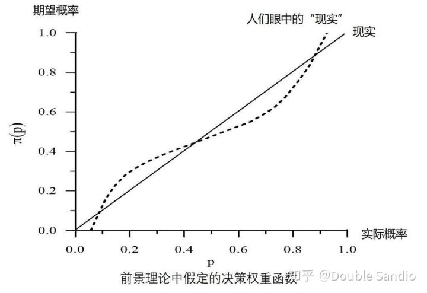

# Study Map
## Target
### 消费者
- 基本模型
    - 属性：事实、认知
        - 事实
            > 财富：当前存量、未来收入
            价格：稳定性；透明性
            效用：稳定性；透明性
        - 认知
            > 财富：未来收入的预期
            价格：当前价格是否为公识；历史价格是否为公识；未来价格预期
            效用：商品效用信息是否为公识；效用预期(框架效应、锚点效应、其他心理效应)

    - 行为：策略制定和实际行动
        - 理性
            > 决策：效用最大化
            行动：一致
        - 有限理性
        - 非理性
- 现有理论
    - 理性人理论
    - 前景理论
        - 研究方法：展望理论从实证研究出发，从人的心理特质、行为特征揭示了影响选择行为的非理性心理因素。
        - 消费者决策行为
            > 个体凭借“框架”参照点等采集和处理信息：参考点是一种主观评价标准，人们在评价事物时总要与一定的参考物相比较，当对比的参考物不同时，即使相同的事物也会得到不同的比较结果。由于参考点的动态变化，因此，投资者在收益区也可能表现出风险偏好，在损失区也可能表现出风险厌恶。框架即对问题的表征形式，同一个问题可以有多种表征形式，不同的框架导致决策产生不同的结果。框架影响因素包括
            > > 框架维度：框架维度不完备，有效的决策思路就可能被遗漏在决策框架之外。
            框架焦点：框架的焦点因每个人的知识经验、价值观的不同而不同。
            框架边界：框架边界以外的信息通常被忽略，边界以外的信息是决策的盲点。
            框架固化：不同的知识经验、生活环境、价值观可以为不同的人设定不同的框架，决策框架一旦形成，就倾向于稳定和固化。

            > 依赖价值函数和权重函数对信息予以判断，进行决策：前景理论的一个重要特性是，价值载体是财富或福利的变化而不是最终状态。这个假设符合人类感知和判断的基本原则。我们的感知器官适合评价变化或差异，而不适合评价绝对的量值。当我们反应如亮度、音量或温度等这些属性时，过去和现在的经验背景定义了一个适应水平或参照点，刺激相对于这个参照点被感知。因此，在给定的温度下，一个对象通过触摸可能会被认为是热的也可能被认为是冷的，这取决于我们之前已经适应的温度。同样的原则也适用于非感官特性，如健康、声望和财富等。例如，同样一笔财富，对一个人来说可能是微不足道的，对另一个人来说可能是巨大的财富——这取决于他们目前的资产。价值函数有三个特征
            > > 大多数人在面临收益时是风险规避的；
            大多数人在面临损失时是风险偏好的；
            人们对损失比对收益更敏感。

            > 权重函数：卡尼曼和特沃斯基认为决策权重是决策者根据结果出现的概率做出的某种主观判断，它们不服从概率公理，它们不应该被解释为对程度或信仰的测量。
            > > 

        - 基本结论
            > 确定效应：大多数人在面临获利的时候是风险规避的。在确定的收益和“赌一把”之间，多数人会选择确定的好处。
            反射效应：大多数人在面临损失的时候是风险喜好的。在确定的损失和“赌一把”之间，做一个抉择，多数人会选择“赌一把”。
            参照依赖：大多数人对得失的判断往往根据参考点决定。举例来说，在“其他人一年挣6万元你年收入7万元”和“其他人年收入为9万元你一年收入8万”的选择题中，大部分人会选择前者。
            损失规避：大多数人对损失比对收益更敏感。白捡的100元所带来的快乐，难以抵消丢失100元所带来的痛苦。
            
            > 迷恋小概率事件：心存侥幸搏小概率事件。

            ||收益|损失|
            |---|---|---|
            |小概率|风险追逐(买彩票)|风险规避(买保险)|
            |大概率|风险规避|风险追逐|

### 生产者
- 企业
    - 人：企业家、董监高、员工
    - 资产：财务、土地、厂房、无形
    - 文化：人和资产的结合方式，战略、制度、策略
- 行为
    - 利润最大化
    - 逆向选择和道德风险
- 约束
    - PEST：技术约束
### 政府
- 福利经济学定理
    - 福利经济学第一定理(效率问题)：在完全竞争的市场条件下(完全竞争、无外部性、无交易成本、完全信息、无规模经济)，市场竞争能够通过价格机制有效调节经济活动，从而达到帕累托最优的资源配置。
    - 福利经济学第二定理(公平问题)：完全竞争市场可以使资源配置达到帕累托最优状态，每个人的福利状态取决于他初始资源拥有状态。政府要想调节社会间的福利水平，应该对每个人的原始资源配置状态进行干预和调整。
- 政府经济干预的理论基础
    - 市场失灵：信息不完全与不对称；垄断；外部效应；公共物品；金融约束；
    - 再分配：完全平等不一定是最优制度，因为有可能大大削弱激励机制，降低所有人福利；放任自由(即使在完全信息、充分竞争下)一定不是最优制度，因为经济机会将变得不平等。
        > 最公平的制度：罗尔斯“无知之幕”，大家聚集到一个幕布下，约定好每一个人都不知道自己将会在走出这个幕布后将在社会/组织里处于什么样的角色，然后大家讨论制度。

### 金融
受益和经营分离$\rArr$金融和实体分离

## Method
### Math
- Mode
    - S-Curve
        - 常见形式：$\ln\dfrac{P}{1-P}= \alpha X \ or \ P=\dfrac{1}{1+e^{-\alpha X}}$
            

            
Note

            
            1 基本性质：假设渗透率P跟其剩余的市场潜力1-P的比率，会保持一个固定的变化速度。产品渗透率增速会由慢变快再变慢，同时存在一个渗透率上限值。

            $\dfrac{\mathrm{d}\dfrac{P}{1-P}}{\dfrac{P}{1-P}}=\alpha \mathrm{d}X \\ \ \\
            \mathrm{d}P=\alpha P(1-P)\mathrm{d}X
            $

            2 人口饱和度$P_t=\dfrac{N_t}{N_m}$的推导：人口增量同时受基数和环境容量制约

            $\dfrac{\mathrm{d}N_t}{\mathrm{d}t}=r(t)N_t=r\dfrac{N_m-N_t}{N_m}N_t \\ \ \\
            \rArr P_t=\dfrac{N_t}{N_m}=\dfrac{1}{1+\dfrac{N_m-N_0}{N_0}e^{-rt}}
            $
            
            3 其他形式的S-Curve
            
            

        

$
C=h(P,S)=f(P)^{g(S)}=a_0P^{a_1+a_2S}  \\ \ \\
\ln(C)=\ln(a_0)+a_1\ln(P)+a_2S\ln(P)  \\ \ \\
C=h(P,S)=f(P)(1+g(S))=a_0P+a_1SP  \\ \ \\
\dfrac{C}{P}=a_0+a_1S  \\ \ \\
P=\dfrac{Order}{Order_c}=\dfrac{1}{1+e^{-\alpha \dfrac{Bike}{Popu}}}
$

# Common Sense
