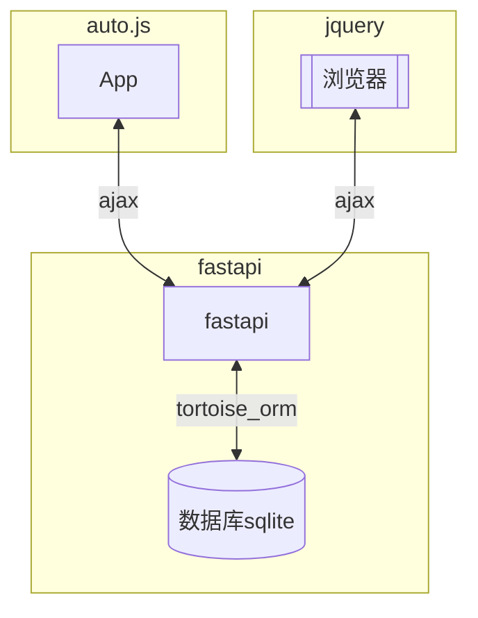
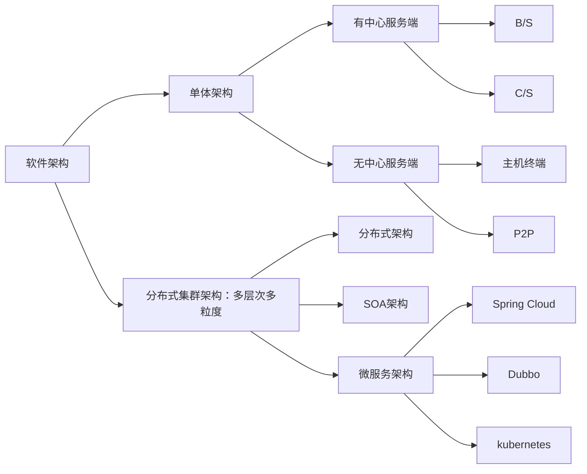

# 方案
## 架构
|端点|微型|中型|大型|微服务|
|-|-|-|-|-|
|后端:服务器+数据库|Fastapi/Fastify/Gin+Sqlite|Nest.js+MySQL+Redis|Spring boot+Hadoop|微后端|
|前端:web/app|jquery/Uniapp|Vue|angular+flutter|微前端Qiankun|

- fastapi
    - [基础](https://www.yuque.com/gengdiniu/vt4aq6/gygwu471ql38nzaq?singleDoc#)
    - [基础2](http://www.yuan316.com/post/FastAPI%E6%A1%86%E6%9E%B6/)
    - [awesome-fastapi](https://github.com/mjhea0/awesome-fastapi)
    - [fastapi-best-practices](https://github.com/zhanymkanov/fastapi-best-practices?tab=readme-ov-file)

- 部署
    - 本地部署
    - 云上部署：cloudfare

### 通讯方案
- [实时传输流媒体协议](https://zhuanlan.zhihu.com/p/496823042)：RTMP/WebRTC/HLS/DASH/Smooth
- 数据、文件、实时音视频: 开源webRTC
    - B/C: Jitsi Meet 、Nextcloud Talk
    - P2P: Jami(原Ring messenger)，一个 GNU 项目。

### 其他
- 微信的python方案
  - 方案一：uiautomation
  - 方案二：wechaty
  - 方案三：WeChatApi

## 自动化爬取方案
Autojs/RPA+Mitmproxy：兼容性强、扩展性强并且免费的代理工具mitmproxy。使用Playwright与mitmproxy进行中间人拦截并修改网络请求。利用此类技术进行网络性能监控、安全审计、API自动化测试等任务。

## 网络
|模式|技术|特点|
|-|-|-|
|http|单向响应|先请求再响应；响应后断连；一次请求即结束|
|http+cookie|浏览器请求服务器，服务器设置cookie返回给浏览器，浏览器保存cookie到本地，下次浏览器携带cookie发起请求，服务器可根据cookies识别浏览器|识别浏览器，可维持对话；|
|http+cookie+session|||

## 其他
- PRA开发框架
    - PRA产品：UiPath、影刀RPA、八爪鱼RPA、Automation Anywhere、Blue Prism
    - pytest自动化测试框架

- CMS
    - node.js: Strapi
    - Django-CMS

# 应用架构

- [技术栈参考](https://github.com/TeamStuQ/skill-map)
    - 后端技术：MVC架构或MVVM架构
        - 服务器
        - 数据库
    - 前端
        - web
        - 桌面
        - 移动
        - IoT
    - 网络通信

## 服务器(S)
- Python
    - [ ] Flask: 不推荐
    - [x] FastAPI: fastapi+tortoise_orm方案适合高性能API服务和数据密集型应用，异步特性和自动生成文档大大提升了开发效率。
    - [x] Django-ninja: Django适合快速构建中小型项目和需要全面功能的场景，但在性能和灵活性上不如FastAPI。
- Node.js: 占用内存小，启动迅速，不用处理多线程问题，非阻塞高并发，少了Setter Getter和Java各种List/ArrayList/HashMap等...代码编写更简易。适合构建依赖于大量I/O的应用程序（FinTech，预订系统，媒体应用程序等）。
    - [ ] Koa: 类似python的flask，不推荐。
    - [ ] Express: Express框架 + Prisma的ORM。不推荐，express多数是用来当前端的dev server。
    - [x] Fastify: 适合快速构建 API、微服务等 Web 应用程序。具有丰富的插件库，而且具有非常良好的文档支持。
    - [x] Nest.js(nestjs里也可以使用Fastify): 基于 Express、socket.io 封装的 nodejs 后端开发框架，对 Typescript 开发者提供类型支持，也能优雅降级供 Js 使用，拥有诸多特性。
    - [ ] 其他: Swagger 是用于描述、生成、使用、测试和可视化 RESTful API的规范。
- Java: 后端微服务体系
    - [x] Spring Boot: 适合执行大量的计算场景（物联网，电子商务平台，大数据）。
- go: 分布式网络、云原生
    - [x] gin
- 其他
    - [ ] PHP: Laravel、ThinkPHP
    - [ ] react: Next.js
    - [ ] Vue.js: Nuxt.js
## 数据库(db)
- 关系型: 小型可嵌入sqlite、大型独立MySQL和PostgreSQL
- Nosql: MongoDB、基于内存的高性能Redis
- 大数据: 基于Hadoop架构的HDFS-HBase、Yearn-MR、Hive/Spark
    
## 前端(B&C)
- web: 用`<template>、<view>、<canvas>`比较多，其它的，都是用框架封装好的视图组件，uni-ui 啥的，很方便，效率高，传统的元素块淘汰？
    - [x] 基础: html+css+JavaScript < +jQuery+Bootstrap >，UI可参考jQueryUI、Bootstrap。
    - [x] Vue.js: Vue3、Nuxt.js
    - [ ] React.js
    - [x] Angular: 代码相对冗余，文件体积较大；提供完整的MVC框架，适用于大型企业级应用。
- 移动app
    - [ ] jQuery Mobile: 用于创建移动端web应用的的前端框架
    - [ ] React Native
    - [ ] Flutter
- 桌面app
    - [ ] Qt: QT、PyQt、Pyside
    - [ ] Electron: 基于web、js
- 跨端
    - [x] uniapp

## 通信
- web基本通信
    |类型|技术|通信方向|适用场景|
    |-|-|-|-|
    |http|通过httpRequest对象请求服务器接受请求返数据|单向（客户端到服务端）|需要刷新页面|
    |ajax|通过xmlHttpRequest对象，在浏览器与服务器之间使用异步通信机制进行数据通信：是多种技术的综合，Javascript、Html、Css、Dom、Xml、XMLHttpRequest等技术按照一定的方式在协作中发挥各自的作用就构成了Ajax。|单向（客户端到服务端）|允许浏览器向服务器获取少量信息而不是刷新整个页面|
- web即时通讯
    > - [ ] Ajax短轮询
    > - [ ] Comet技术：通过Ajax长轮询或者HTTP流实现
    > - [x] SSE: 服务器到客户端的单向实时数据推送，例如新闻更新、实时股票报价、天气预报等。
    > - [x] WebSocket: 双向通信和低延迟的场景，例如在线游戏、实时聊天应用等。
    > - [x] Socket.IO: 基于websocket协议进行的上层封装，同时在websocket不可用时，提供长轮询作为备选方式获取数据。Socket.IO不是Websocket的实现，Socker.IO有自己的协议说明，因此和websocket的server不兼容。
- Open System Interconnection
    |层级|处理设备|功能|数据格式|协议|
    |-|-|-|-|-|
    |应用层|终端设备-PC/手机|网络和应用程序之间的接口|ATPU|HTTP、FTP、SMTP、POP3、P2P|
    |表示层|终端设备-PC/手机|数据解码加密压缩|PTPU|LPP、NBSSP|
    |会话层|终端设备-PC/手机|建立维护管理应用间的会话连接|DTPU|SSL、TLS、DAP|
    |传输层|终端设备-PC/手机|标识应用程序端口号|数据段Segment|TCP、UDP|
    |网络层|网关、路由器|基于IP的路由和寻址|分割重组数据包Packet|IP、RIP|
    |数据链路层|网桥、交换机|基于物理层的寻址、建立撤销标识链接|比特信息封装成的数据帧Frame|以太网、PPTP|
    |物理层|网卡、光纤电缆、中继器|物理连接|0-1比特流Bit||
    > Websocket: 建立在 TCP 之上的应用层双向通信协议。
    > Socket: 工作在OSI模型会话层的TCP/IP网络的API。
    > MQTT: 构建于TCP/IP协议上，基于客户端-服务器的消息发布/订阅传输协议。轻量、简单、开放和易于实现，这些特点使它适用范围非常广泛，包括受限的环境中，如：机器与机器（M2M）通信和物联网（IoT）。
    > 物联网: 需要芯片模组硬件支持的物理层协议，NB-IoT，LORA，WIFI，蓝牙，zigbee，4G。需要服务器软件支持的应用层协议，MQTT，COAP，HTTP。

## AI
### 数据处理
- ffmpeg: 音视频处理
- Pillow：图像处理

### CV
- OpenCV：图像处理和机器学习库
- YOLO：位置和类别
- SAM

### NLP
