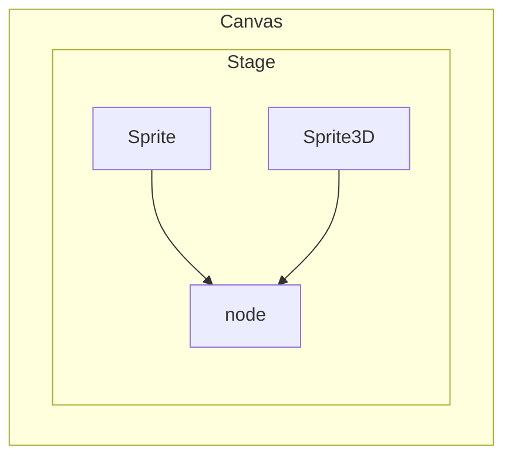

# 基础

显示列表用于管理 LayaAir运行时显示的所有对象。需要注意的是，继承自Node的两个子类Sprite与Sprite3D分别是2D的基础显示对象和3D的基础显示对象。两者不能混合添加，也就是说Sprite及其子节点不能作为Sprite3D的子节点，Sprite3D及其子节点不能作为Sprite的子节点。

3D节点的根节点是Scene3D，2D节点的根节点是Scene2D。2D与3D节点之间不可以混合形成父子层级关系。

3D UI