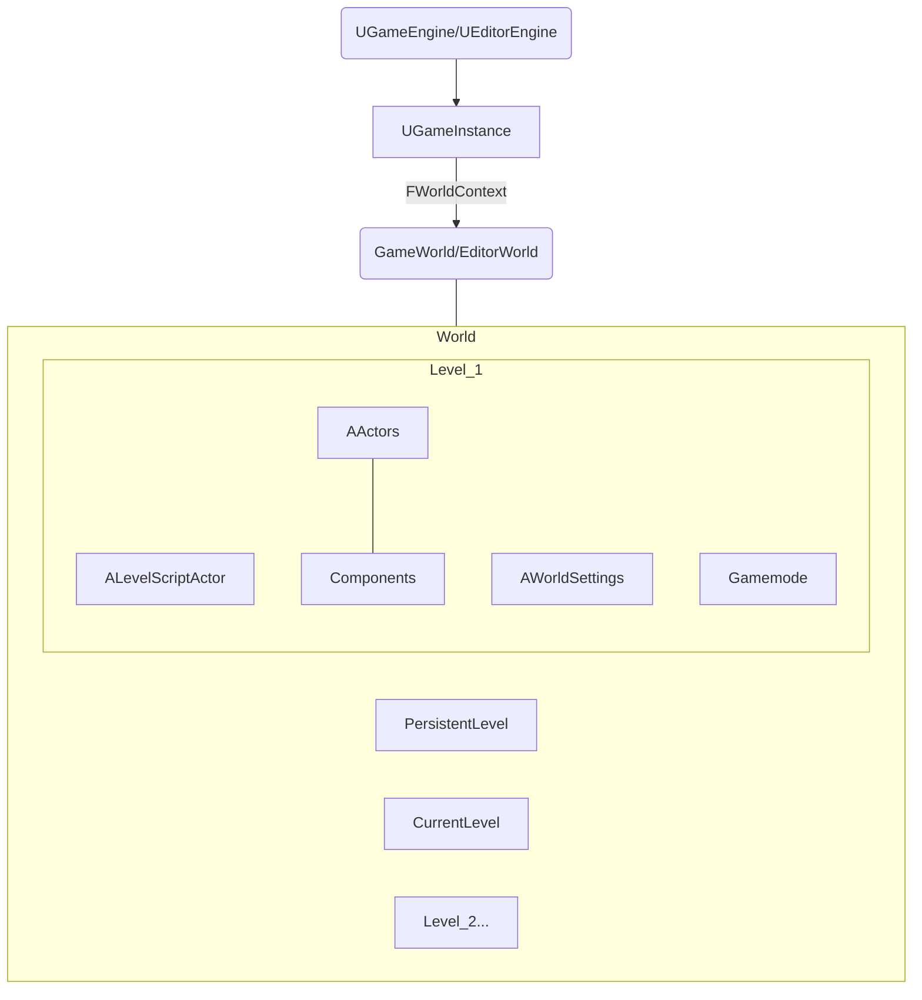

# 基础
## 基本概念
- 绘图
    |英文|中文|本质|释义|
    |-|-|-|-|
    |picture|图片|数据|保存图形或图像的信息，包括大小、颜色等；有位图格式、矢量图格式。|
    |Texture|纹理|数据|显卡能够直接进行采样的纹理数据。|
    |Texture mapping|纹理贴图|图像映射规则|把存储在内存里的位图，通过 UV 坐标映射到渲染物体的表面|
    |Material|材质|数据集|表现物体对光的交互，供渲染器读取的数据集，包括贴图纹理、光照算法等|
    |Shading|底纹、阴影|光影效果|根据表面法线、光照、视角等计算得出的光照结果|
    |Shader|着色器|程序|编写显卡渲染画面的算法来即时演算生成贴图的程序|
    |GLSL||程序语言|OpenGL 着色语言|
    > UVmap: UV坐标为纹理坐标，在纹理空间中，任意一个二维坐标都在`[0,1]`内。UVmap是将3D模型的表面映射到2D纹理坐标系的过程，用于决定纹理贴图的位置。

- 动画: 骨骼蒙皮动画SkinnedMesh。在骨骼控制下，通过顶点混合动态计算蒙皮网格的顶点，而骨骼的运动相对于其父骨骼，并由动画关键帧数据驱动。一个骨骼动画通常包括骨骼层次结构数据，网格(Mesh)数据，网格蒙皮数据(Skin Info)和骨骼的动画(关键帧)数据。
    |英文|中文|本质|释义|
    |-|-|-|-|
    |Bone|骨骼|||
    |Mesh|网格|用于描述物体的形状: 使用三角面来存储，包括每个三角形的三个顶点、每个三角形的边、每个三角形为一个面。||
    |Skinned Mesh|蒙皮|蒙皮不是模型的贴图，而是Mesh本身。|蒙皮是指将Mesh中的顶点附着（绑定）在骨骼之上，而且每个顶点可以被多个骨骼所控制，这样在关节处的顶点由于同时受到父子骨骼的拉扯而改变位置就消除了裂缝。|


# 流程
## IDE设置(VSC)
[官方参考](https://dev.epicgames.com/documentation/zh-cn/unreal-engine/setting-up-visual-studio-code-for-unreal-engine)、[参考2](https://www.bilibili.com/video/BV1PF4m1j72Z/?spm_id_from=333.337.search-card.all.click&vd_source=2a823ce6073f9ac24d39aaa3c97831d4)、[参考3](https://www.bilibili.com/read/cv26583186/#:~:text=%E6%89%93%E5%BC%80%20%E8%99%9A%E5%B9%BB%E7%BC%96%E8%BE%91%E5%99%A8%EF%BC%88Unreal%20Editor%EF%BC%89%20%E5%B9%B6%E8%BD%AC%E8%87%B3%20%E7%BC%96%E8%BE%91%EF%BC%88Edit%EF%BC%89%20%3E%20%E7%BC%96%E8%BE%91%E5%99%A8%E5%81%8F%E5%A5%BD%E8%AE%BE%E7%BD%AE%EF%BC%88Editor%20Preferences%EF%BC%89,%E6%BA%90%E4%BB%A3%E7%A0%81%E7%BC%96%E8%BE%91%E5%99%A8%EF%BC%88Source%20Code%20Editor%EF%BC%89%20%E8%AE%BE%E7%BD%AE%E4%B8%BA%20Visual%20Studio%20Code%20%E3%80%82)
    
1. 安装VSCode及插件
   > MS官方C/C++扩展
   > MS官方C#扩展
   > Unreal Engine 4 Snippets插件，该插件同样适用于UE5 
2. 安装Microsoft Visual C++ (MSVC)编译器工具集
3. 将VSCode设置为虚幻默认IDE: 虚幻编辑器（Unreal Editor）>编辑（Edit）>编辑器偏好设置（Editor Preferences）>通用（General）> 源代码（Source Code），然后将你的源代码编辑器（Source Code Editor）设置为 Visual Studio Code 。重启编辑器，使更改生效。
4. 为VS Code设置IntelliSense： 按照官网`c_cpp_properties.json`示例编辑.vscode文件
5. 在VS Code中编译和启动项目
   > 默认命令行设置为powershell: VSC>terminal.integrated.default;
   > 设置VSC的Run为develop editor: 启动UE编辑器运行调试.
6. 生成VSCode工作区: 三种方法
    > 方法一 虚幻编辑器（Unreal Editor）>工具（Tools）>刷新Visual Studio Code项目（Refresh Visual Studio Code Project）。
    > 方法二 右键点击项目的 .uproject 文件并点击生成项目文件（Generate Project Files）。完成后，你应该会在项目的文件夹中看到.code-workspace 文件。
    > 方法三 在命令行中，运行 /GenerateProjectFiles.bat -vscode 。添加 -vscode 参数将创建 .vscode 工作区而不是Visual Studio .sln 。如果你使用此方法，则不需要更改默认源代码编辑器。


## 项目操作
1. UE项目创建
    > 创建C++项目>Raytracing取消选择
2. UE编辑器基本设置
    > General-Appearence>assets open location: main windows
    > 右下角状态扩展按钮$\vdots$>Living Coding设置为False：以IDE为主
3. 内容生产
4. 删除类
    1. IDE中(VS2022)删除头文件和源文件
    2. 关闭IDE和UE，项目Source文件夹中删除类头文件和源文件，项目根目录删除Binar文件夹和Intermediate文件夹
    3. 右键.uproject，选择generate vs project files

5. 编译：在VSC里编译`VSCode...Development Editor Build`
    - 编译器选择：VS2022；VSC需要重复删除创建操作。
    - 编译快捷键：`Ctrl+Shift+D`，最左侧`Run and Debug`按钮
    - 编译报错处理：[源码修改](https://www.bilibili.com/video/BV1af421R7BD?p=1&vd_source=2a823ce6073f9ac24d39aaa3c97831d4)

6. debug：在UE里运行查看编译后运行时的output_log
    - 法1：查看日志。UELOG宏是UnrealEngine中用于日志记录的标准方式。它可以输出日志信息到控制台和日志文件，支持多种日志级别（如、Log、warning、Error）。参数TEXT() 是 const char*类型，所以需要传入FString首地址的值才行，否则会报错`将类 “FString“ 作为可变参数函数的参数的不可移植用法`。
    - 法2：GEngine->AddOnScreenDebugMessage，可以在游戏屏幕上显示调试信息，通常用于快速查看和调试。
    - 法3(推荐)：启动UE创建项目时勾选Editor symbols for debugging，debug时候切换development editor为debuggame editor

7. 打包发布

## 内容生产
### 步骤

|模块|继承|存续|说明|
|-|-|-|-|
|UGameEngine|||创建出唯一的一个GameWorld，直接保存了GameInstance指针。|
|GameInstance||引擎启动时创建，引擎关闭后销毁或更换，因此可以跨关卡存在。|保存特定类型的临时数据——当前的WorldConext和其他整个游戏的信息(如用户账户信息)。GameInstance是比GameWorld更高的层次，所以那些独立于Level的逻辑或数据要在GameInstance中存储。可以通过指定GameInstanceClass来让UE创建使用我们自定义的GameInstance子类，然后在里面编写应用于整个游戏范围的逻辑。|
|FWorldContext|||保存着ThisCurrentWorld来指向当前的World。|
|World|||支持一个PersistentLevel和多个SubLevels。SubLevels共享着World的一个PhysicsScene。World至少得有一个Level，PersistentLevel指向初始Level，是玩家进入游戏的入口。|
|PersistentLevel和CurrentLevel|||只是个快速引用: 在编辑器里编辑的时候，CurrentLevel可以指向其他Level，但运行时CurrentLevel只能是指向PersistentLevel。|
|AWorldSettings|Actor||Level里的Actors[0]位置。WorldSettings类继承于AInfo类，在对AInfo类的介绍中说到，AInfo用于保存游戏世界中的设置数据，以便于实现对游戏世界的管理。|
|ALevelScriptActor|||ALevelScriptActor类实例对象存在于关卡中，能够执行level范围内的逻辑操作（操作level内的特定actor实例对象）并且在关卡中是被隐藏起来的。|
|gamemode||Level关卡加载时生成，销毁时一起销毁。|gamemode是整个关卡的控制器，用来编写整个关卡的业务逻辑，存储客户端不需要明确知道的游戏信息，如玩家数、玩家生成进入方式、暂停处理等。|

1. Level创建和设置
   1. 创建
      1. file>newlevel>emptymap，file>savecurrentlevel>保存到content下的目录
      2. 设置: projectsettings>maps & modes>default maps
      3. C++创建和设置？
         - [dynamic level instance](https://www.quodsoler.com/blog/using-dynamic-level-instances-to-create-procedural-levels-in-unreal-engine-5)
         - [ALevelInstance](https://forums.unrealengine.com/search?q=ALevelInstance)
         - [2](https://forums.unrealengine.com/t/how-to-clone-the-levelinstance-in-c/585832)
   2. [Level的world设置](https://dev.epicgames.com/documentation/zh-cn/unreal-engine/world-settings-in-unreal-engine)
      1. 新建gamemode类: Gamemode只在服务器存在，不会复制到客户端。存储玩法。
      2. 新建gamemode中使用的类
         - default pawn: 默认玩家.可以在Pawn中设计自己的移动逻辑或其他游戏逻辑，这些功能也可以在Controller中设计。一个Controller可以是从人类玩家获得输入的PlayerController，也可以是由电脑自动控制的AIController。
         - HUD: 交互UI
         - player controller: Pawn与玩家控制他之间的接口。其代表了玩家的意志。服务器上每个玩家都有PlayerController，但本地客户端只有本地玩家的PlayerController。 客户端和服务器之间传达信息，而不必将该信息复制到其他客户端.
         - game state: Gamestate在服务器存在，并且会复制到每个客户端，与整场比赛相关的数据放在Gamestate中并复制，客户端可以很方便的获取到整场比赛的数据。
         - player state: 与一个特定玩家有关的信息，如玩家的分数。
         - spectator: 第三方视角
      3. gamemode.h：include其他类.h。
      4. 设置: level粒度或全局默认
         - level gamemode: UE编辑器打开Level>worldsettings>gamemode>mygamemode
         - default gamemode: projec settings>maps modes>default modes>mygamemode
      5. instance
         1. 创建
         2. 设置：UEEditor>projec settings>maps modes>game instance>mygameinstance

2. 控制
   1. 平移和转向
      1. 类内定义: 增强系统引入；mapping context和移动函数的绑定。
      2. UE Input控件创建和设置：UE>P Settings>Input>Action Mappings
      3. level的characte details>auto possess player>player0
   2. 动作
      1. 创建类anim instance: ABP，绑定动作并loop
      2. 状态切换
      3. 飞行？

在虚幻引擎中，玩家出生点（PlayerStart） 是一个用于标记玩家在游戏开始时生成位置的对象。它继承自 AActor，因此可以被放置到场景中。游戏开始后，程序会查找玩家出生点的位置，并生成一个 GameMode 中配置的 APawn，放置到该处。如果关卡里没有 PlayerStart，系统会在世界坐标 (0,0,0) 处生成一个 APawn 。

### UE动画
- 在蓝图的组件（Components）面板中，选择网格体（Mesh）组件，然后在细节（Details）面板中导航到骨骼网格体（Skeletal Mesh）属性。
- 动画序列可以在骨骼网格体的骨架资产上播放。 要播放动画，可以将角色蓝图的"网格体（Mesh）"组件的 动画模式（Animation Mode） 属性指定给 使用动画资产（Use Animation Asset），然后在 要播放的动画（Anim to Play） 属性的下拉菜单中选择一个动画序列资产。
- 静态网格体: 用于在关卡中创建场景几何体。这些3D模型在外部建模程序（如3dsMax、Maya、Blender等）中创建，并通过内容浏览器导入到虚幻编辑器中。使用虚幻引擎制作的关卡中，绝大部分内容都是由静态网格体组成；这些内容通常以静态网格体Actor的形式存在。
- SkeletalMesh比StaticMesh多了骨骼

### UE运行逻辑
- Unreal 启动流程的定义 是在 Launch.cpp中。引擎的启动流程以各个平台的main函数作为入口，最终会进入到GuardedMain函数中。GuardedMain 函数定义了引擎的启动流程和主循环(但这些函数只是一个壳，核心的实现都是FEngineLoop 这个类来实现的)，可分4个环节。
    ```mermaid
    flowchart TD
    EnginePreInit --> c["EditorInit|EngineInit"] --> EngineTick --> EditorExit
    ``` 
    |GuardedMain|执行|说明|
    |-|-|-|
    |EnginePreInit|GuardedMain会解析随程序启动一起传进来的命令行参数和其他参数，参数解析会下发到引擎层面去解析，这个步骤对应的是EnginePreInit。|创建引擎公共的组件部分，是大多数模块加载的位置，从低级模块到更高级别的引擎模块。|
    |EditorInit\|EngineInit|1.根据当前运行环境是Editor还是Game来创建一个UEngine对象，并初始化UEngine的基本对象GameInstance, GameViewportClient和LocalPlayer。2.UEngine确定并Browse到使用的地图，进行loadmap，加载地图后将拥有一个UWorld，其中包含保存到地图中的所有Actor，它们构成了GameFramework的核心，如AGameMode, AGameState, APlayerController, APlayerState等等。|根据当前的运行环境来创建Editor或者是Game特有的部分，屏幕显示百分比、定时器逻辑等。|
    |EngineTick||驱动引擎按帧执行各种各样的任务：在GEngineLoop层tick会处理各种Profiler的数据统计，渲染线程的驱动逻辑，消息输入，Slate等，而后会进入到GEngine层的tick中，处理网络，无缝世界，导航，物理，相机，风场，特效粒子，GC，渲染，后处理，UI，视频，线程管理等等。|
    |EditorExit||是否结束动画，是否是服务器需要进行关闭和存储，释放音频设备的占用，销毁运行期间创建的线程，正确处理缓存，保存运行时更改的引擎配置，unload各种组件等。|

### 项目文件说明
- Build.cs: 模块设置信息
- Target.cs: 目标平台设置信息
- UBT: 编译模块处理依赖
- UHT: 头文件收集，并存储在generated.h中
- CoreMinimal.h: UE核心变量模块

### 主要类
- 基类
    |类|说明|
    |-|-|
    |UObject|UE中所有对象的基类：用于UE自动化功能的继承，如回收、映射、默认变量的自动更新、网络复制等|
    |Actor|继承UObject：可挂载组件，如渲染组件、移动组件等|
    |Pawn|相对Actor于Pawn可被操控|
    |Character|继承自Pawn：多了一个Character Movement组件，实现骨骼和动画|
    |Controller|玩家或AI操纵Pawn的行为|

- 游戏控制类：GameMode以及
    |类|说明|
    |-|-|
    |Game Session Class|网络连接、权限控制|
    |Game State Class|得分、模式、时间等游戏全局状态|
    |Player Controller Class|APlayerController处理玩家输入| 
    |Player State lass|得分、生命值、成绩等玩家状态|
    |HUD Class|AHUD界面显示得分、生命值等信息|
    |Default Pawn Class|无玩家控制时的默认角色|

- 类名前缀：Unreal Header Tool会在编译前检查类名，如果有错则警告并停止编译
    |类前缀|说明|对象新建|对象销毁|
    |-|-|-|-|
    |F-|纯c++类|new|非new对象函数调用后自动释放；new对象且直接传递类的指针，必须手动删除；new对象且TSharedPtr/TShared+Ref则智能指针自动管理|
    |U-|继承自UObject|NewObject<T>()|自带垃圾回收机制，可以通过AddToRoot函数让一个UObject一直不被回收|
    |A-|继承自Actor|GetWorld()->SpawnActor<AYourActorClass>()|可调用Destory函数请求销毁，仅从世界中销毁，内存的回收仍然由系统决定|
    |S-|Slate控件相关类||
    |H-|HitResult相关类||

    - 获取对象：获取一个类对象的唯一方法，就是通过某种方法传递到这个对象的指针或者引用。 特别地，获取一个场景中某个Actor的全部实例，借助Actor迭代器：TActorIterator
    - 构造类的对象：在UE5中，我们如果想创建一个对象要么通过蓝图、要么通过C++。不管使用哪个，都没有办法给构造函数传参数。可以在类里定义一个用来初始化的函数（但不是构造函数），然后在创建对象之后把需要初始化的内容作为参数传进这个函数。如果使用带参数的构造函数的话，带参数的构造函数可能导致引擎报错或者崩溃。
        - 如果是用蓝图的话，可以用SpawnActorFromClass来生成一个对象。这个节点有三个参数，Class表示我们创建哪个类的对象；SpawnTransform包含了对象的位置、旋转和尺寸信息；CollisionHandlingOverride用来处理生成对象时的碰撞问题。在调用这个节点的时候时没有办法给构造函数传参数。
        - 如果使用C++的话，可以使用NewObject或者SpawnActor，在创建对象的时候使用的变量类型须是指针，这是因为UE5中绝大多数情况都只支持用指针储存对象。NewObject适用于生成一些不需要显示在场景中的内容。而SpawnActor适用于需要展示在场景中的内容。
    - `UObject::CreateDefaultSubobject`：创建组件的模板函数，这个函数只能在构造函数中调用。
        > CreatedefaultSubObject更多是为了用于结合Editor进行便捷的修改编辑时使用的初始化实例方式并可由Editor进行序列化保存（配合各种UPROPERTY的宏）当没有使用Editor对对象进行编辑修改的预期，请不要轻易使用CreateDefaultSubObject来创建对象(例如C++CreateDefaultSubObject引用资源的发生删除时，可能导致打开时Level导致无法定位)会有可能导致在你修改代码时，令你得对象实例的数组容器之类的Value发生不符合你预期的变更.如果希望代码全控制完全可以使用OnConstruction中使用NewObject才是更好的选择蓝图类的数组的改变，即使是默认无改动的实例也会意想不到的影响已经拖拽到场景的实例。


### 宏和方法
- 宏
    - GENERATED_BODY()//表示我们不直接使用父类的造函数，如果我们要在我们自定义的类中做一些初始化操作，需要在.h中声明，.cpp中实现。
    - GENERATED_UCLASS_BODY()//表示我们使用父类的构造，如果我们在在自定义类中做一些初始化操作，可以直接在.cpp中实现，不需要.h声明。
    - UCLASS()//告知虚幻引擎生成类的反射数据。类必须派生自UObject.
    - UPROPERTY()//叫做属性声明宏，虚幻c++在标准c++基础之上实现了一套反射系统(ReflectionSystem)，反射系统负责垃圾回收、引用更新、编辑器继承等。
    - UFUNCTION函数声明宏。//反射系统可识别的C++函数
    - USTRUCT()结构体声明宏。//反射系统可识别的C++结构体
    - UENUM()枚举声明宏。//反射系统可识别C++枚举

- 常用方法
    - GetWold()
    - XXX::StaticClass() 方法来获取到XXX类的对象
    - GetClass() //生成一个UObject实例后，去获取这个实例的UClass
    - GetStaticClass() //没有UObject实例，去获取某个类的UClass，通过`::StaticClass()`调用。
    - ClassDefaultObject() //类默认对象，可以获得UObject初始化时的值。
    - FString::Printf() //用于将两个不同类型的变量，通过占位符%+类型（例如%s代表字符串，%d代表整型）进行组合，生成FString类型。
    - UE_LOG()  //`UE_LOG(LogTemp, Warning, TEXT("Your String: %s" ), *fstr);`FString 类型的变量，在UE_LOG中使用时，需要解引用符 `*` 。
    - `Cast<UXXComponent>(RootComponent)` //Cast只能将指针转换到其自身或父类类型，在UE中经常会使用继承自SceneComponent的对象作为Actor的RootCompoent的情况，因此就需要使用Cast在使用时进行转换
- 常用模板
    - 硬引用: 对象 A 引用对象 B，并导致对象 B 在对象 A 加载时加载；
        ```
        //直接属性引用
        //构造时引用，使用特殊类 ConstructorHelpers 完成，例如ConstructorHelpers::FObjectFinder<>
        ```
    - 软引用: 对象 A 通过间接机制（例如字符串形式的对象路径）来引用对象 B。
        ```
        //间接属性引用，控制何时加载资源的一种简单方法是使用 TSoftObjectPtr。使用 IsPending() 方法可检查资源是否已准备好可供访问。请注意，使用 TSoftObjectPtr 要求在您想要使用资源时手动加载该资源。您可使用模板化 LoadObject<>() 方法、StaticLoadObject() 或 FStreamingManager 来加载对象（有关更多信息，请参阅 异步资产加载 for more information)）。前两个方法以同步方式加载资源，这可能会导致帧速率突增，因此，仅当您知道不会影响游戏时，才应使用这些方法。
        //查找/加载对象，如果您希望在运行时构建字符串并使用该字符串来引用对象，情况将会如何？您可使用两个选项。如果您仅在 UObject 已加载或已创建时才使用它，那么正确的选择是使用 FindObject<>()。如果您希望对象未加载时将其加载，那么正确的选择是使用 LoadObject<>()。
        ``` 
    - 模板类
        ```
        TSubclassOf<AActor> MyActorClass; //TSubclassOf引用AActor子类. TSubclassOf 提供了在运行时动态引用并实例化类的便捷方法。
        ```
    - 创建对象
        ```
        //创建Actor对象
        UWorld* World = GetWorld();  
        FVector pos(150, 0, 20);  
        AMyActor* MyActor = World->SpawnActor<AMyActor>(pos, FRotator::ZeroRotator);  

        //创建组件，UObject::CreateDefaultSubobject()模板函数只能在构造函数中调用，TEXT(“MyComponent”)的名字不能重复。
        //CreateDefaultSubobject必须写在Actor的无参构造函数中，否则crash； 
        //CreateDefaultSubobject中的TEXT或者FName参数在同一个Actor中不能重复，否则crash；
        MyComponent = CreateDefaultSubobject<UMyActorComponent>(TEXT("MyComponent"));  
        
        //加载资源对象，加载项目资源可以使用“UObject::StaticLoadObject()”函数，其中重要的参数为对象的Name，而不是文件路径。
        UStaticMesh* SM_Vase = Cast<UStaticMesh>(StaticLoadObject(UStaticMesh::StaticClass(),  
        NULL,  
        TEXT("/Game/Assets/StaticMeshes/SM_Vase"))  
        );  
        StaticMeshComponent = CreateDefaultSubobject<UStaticMeshComponent>(TEXT("StaticMeshComponent"));  
        StaticMeshComponent->SetStaticMesh(SM_Vase);
        
        //创建UObject对象(UObject的派生类——非Actor、非ActorComponent)
        MyObject = NewObject<UMyObject>();
        ```
- [路径名称](https://www.cnblogs.com/shiroe/p/14743901.html)
```
GetPathName() //获得的是对象的路径也就是ObjectPath
GetFullName() //获得的是ObjectPath前面会加一个类型(例如Blueprint)，也就是ObjectFullPath
ObjectPath和PackageName：PackageName不包含后缀
GetPathName()
GetSystemPath()
```

### 变量
- 基本变量
```
//布尔类型变量声明
bool varBool;
//整型32位的变量声明
int32 varInt32;
//整型64位的变量声明
int64 varInt64;
//字节类型的变量声明
BYTE varByte;
//FString类型的变量声明字符串的类型，可以修改以及相关字符串操作
FString varString;
//FName名称类型的变量声明，不能修改，引擎中的资源名称都是FName(有自己的hash索引)
FName varName;
//FText文本类型的变量声明，不能修改，用于本地化(可以多种语言的处理)和显示(玩家能直接看到的信息)
FText varText;
//FVector向量类型的变量声明: xyz轴的坐标
FVector varVector;
//FRotator旋转类型的变量声明: 这个就是x轴的旋转Roll，y轴的旋转Pitch，z轴的旋转Yaw
FRotator varRotator;
//FTransform类型的变量声明: 这个就是既有FVector也有FRotator,还有缩放Scale三者的集合类型
FTransform varTransform;

//TArrayTArray是UE C++中的动态数组TArray特点：速度快，内存消耗小，安全性高。并且TArray所有元素均完全为相同类型，不能进行不同元素类型的混合
TArray<int32>MyArray;
```
- 字符串变量转换
```
//创建FString
FString MyString=TEXT("Iamstring");
//Fstring转化成FName
FName MyName=FName(*MyString);
//Fstring转化成FText
FText MyText= FText::FromString(MyString);
//FName转化成FString
MyString=MyName.ToString();
//Fname转化成FText
FText text1=FText::FromName(MyName);
//Ftext转化成FString
FString strFromText=text1.ToString();
//注意这里FTEXT不能直接转化成FName需要转化成FString，然后在转化成FName

MyArray.Add(10);//将元素添加到我们的数组中,数组中不存在的元才会加
```

### 实例生成
- Spawning Actors: `UWorld::SpawnActor()`、`auto world = GetWorld();`
- level

## 插件
### GAS

### PapeP2D、PaperZD
- 基本概念
    |概念|本质|释义|
    |-|-|-|
    |Sprites|本质上是一种映射了纹理和相关材质的平面网格体，可以在场景中渲染，并且完全在虚幻引擎中创建。||
    |FIipbooks||FIipbooks are sprite sheet animations.|
    |Tilemaps||Tilemaps let us paint levels using a texture.|

- 图片创建sprites: 资产导入
    > 1. 拖入并保存
    > 2. 右键图片>sprites actions>apply paper2d...settings, 并保存
    > 3. 右键texture>sprites actions>create sprites, 并保存
- 创建sprites然后导入纹理


# 音美
## 音乐
- 自动化创建方案
    - 原音乐->风格乐器修改: AI?API？
    - Reaper: API?

## 美术
- 2D骨骼方案
    - 3D SkinMesh 的方式去做 2D：需要用多边形来建模 2D 角色，把顶点的 z 坐标忽略掉，比如统一设为0。同时平移、旋转、放缩变换仅仅对 x 和 y 坐标生效，其他的逻辑不变。
- 自动化创建方案
    - Blender+python
        - 骨骼方案：人、动物、植物
        - 纹理方案
            - 图片识别方案->发型、头部、胸部、腰部、臀部、四肢、其他(装饰)
            - 图片转动漫(风格)
            - 组装方案
        - 动画方案
            - 帧序列方案
            - 骨骼动画方案
    - pyopengl

- Blender: 2D/3D

- Spine: 2D骨骼动画

- Krita: 2D绘图帧动画

- sketch: UI设计


## 地图
### UE5
流送
Floor: StaticMeshActor

### 地球
uber h3-0


# 注意
## UE C++
### 通用C++
- 前置声明
    - 不完全声明：需要用到的类必须已经定义或声明，若未定义可先声明，再定义
        - 头部class声明或在行内用class关键字声明
        - 用时必须用该类指针或引用
- 函数模板：泛型参数可以使用typename或class来指定类型参数或者类参数，模板支持多种模板参数`template<typename T1,typename T2>、template<class T1,class T2>`
    - 定义
        ```
        template<typename T>
        T function_name1(T& v_1)  //返回类型T可以是和参数一样的T，也可以指定别的类型，如int function_1(T& v_1){expression}、void function_1(T v_1){expression}
            {expression}
        ```
    - 实例化
        ```
        function_name1(v) //隐式实例化
        function_name1<int>(v)  //显式实例化，v如果不是int类型，则会强制转换为int传入
        ```
- 类模板
    - 定义
        ```
        template <typename T1, typename T2>
        class TClass_name1 {
        private:
            T1 first;
            T2 second;
        
        public:
            Pair(const T1& f, const T2& s) : first(f), second(s) {}
        
            T1 getFirst() const { return first; }
            T2 getSecond() const { return second; }
        };
        ```
    - 实例化：类模板实例化需要在类模板名字后跟<>，然后将实例化的类型放在<>中即可，类模板名字不是真正的类，而实例化的结果才是真正的类
        ```
        TClass_name1<int, double> mytclass(5, 3.14);
        TClass_name1<int, double> mytclass;
        ```
- 虚函数：含有纯虚函数的类称为抽象类，只含有虚函数的类不能称为抽象类。
    - 纯虚函数(在虚函数后添加 `=0`): 一定要在子类中声明并定义。纯虚函数是在基类中声明但不实现的虚函数，其声明方式是在函数声明的结尾处添加 = 0。类中如果包含至少一个纯虚函数，则该类成为抽象类（Abstract Class），不能实例化对象。
    - 虚函数(成员函数前添加 `virtual` 关键字): 在子类中可以不声明与定义，但是它在子类中一经声明，就必须要定义
    - 类的成员函数声明后允许不定义，前提是不调用该已声明但未定义的函数
### include报错
解决:`U5 -> tools -> refresh visual studio code project`
https://stackoverflow.com/questions/75171664/visual-studio-code-intellisense-cannot-find-unreal-engine-coreminimal-h-file
- 如果是通过`FirstPerson、ThirdPerson、TopDown`等有默认的代码生成的模板生成的项目，推荐将头文件中的属性的指针`(*)`改为`TObjectPtr<T>`：在UE5中，新增了对象指针类型`FObjectPtr/TObjectPtr`，以提供编辑器下动态解析和访问追踪功能。很多引擎类的`UPROPERTY的UObject*`的裸指针也被替换成了`TObjectPtr<UObject>`（例如AActor的RootComponent成员）。而在非编辑器下，`TObjectPtr<UObject>`会退化为`UObject*`，从而避免额外的运行时开销。
- C++头文件
    - 在UnrealEngine（虚幻引擎）开发中，通常建议在源文件(.cpp文件)中包含头文件，而不是在头文件(.h文件)中包含其他头文件。这种做法有几个重要原因
        - 减少编译时间
        - 避免循环依赖
        - 增强可维护型
- 组合和继承
    - 功能实现尽量用组合而不是继承：更灵活、低耦合，从而更易于维护。
- 资源引用
    - 避免从C++类引用资源：可以使用 FObjectFinder 和 FClassFinder 从C++构造函数引用资源，但应尽量避免。以这种方式引用的资源将在项目启动时加载，因此如果实际上不需要引用，将导致加载时间和内存方面的问题。此外，从构造函数引用的资源无法方便地删除或重命名。通常，建议创建一些 "游戏数据" 资源或蓝图类型，并使用资源管理器或配置文件加载它们，而不是从C++引用特定的静态网格体。
    - 避免使用字符串引用资源：为了避免从C++类加载资源时出现问题，可使用C++函数中的 LoadObject 等函数在磁盘上手动加载特定资源。但是，烘焙程序完全不会跟踪这些参考，因此可能会导致封装游戏出现问题。相反，你应该在C++类中使用 FSoftObjectPath 或 TSoftObjectPtr 类型，从ini或蓝图类设置这些类型，然后根据需要或通过异步加载进行加载。
- 注意用户结构体和枚举值
    - C++和蓝图都可以使用C++中定义的枚举值和结构体，但是用户结构体/枚举值不能在C++中使用，也不能按照保存游戏部分中的描述手动修复。你可能希望随着时间的推移将更多的游戏逻辑移至C++，因此我们建议在C++中实现关键的枚举值和结构体。基本上，如果不止一两个蓝图使用某些项，这些项应该在本机Native C++中实现。
- 考虑网络架构：游戏的特定网络架构将对构建类的方式产生重大影响。一般来说，在构建原型时并不是心中已有成型的网络，所以当开始重构内容使其变得"真实"时，需要考虑哪些Actor将要复制什么数据。为了使复制数据的流程更为良好，你可能需要做出会增加迭代难度的决策。
- 考虑异步加载：随着游戏日益庞大，需要按需加载资源，而不是在游戏加载时预先加载所有内容。一旦实现这一点，需要开始对内容进行转换，以使用 软性引用（Soft references） 或 PrimaryAssetIds，而不是 硬性引用（Hard references）。AssetManager 提供了多种函数，可以更方便地异步加载资源，还可公开提供低级函数的 StreamableManager。