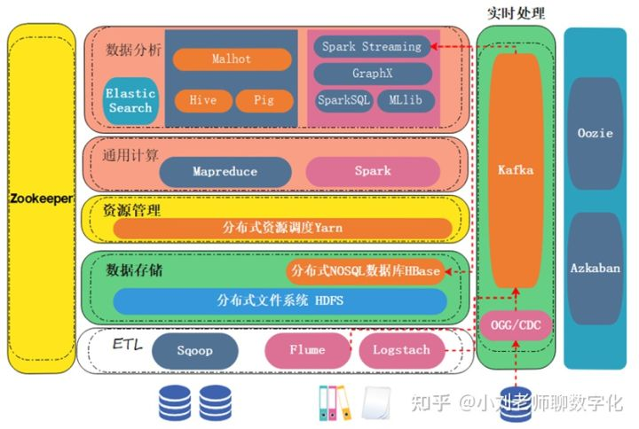
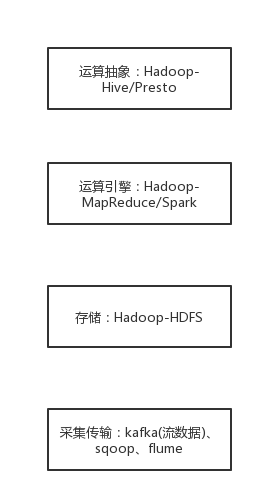
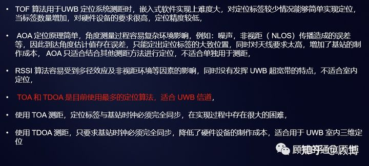
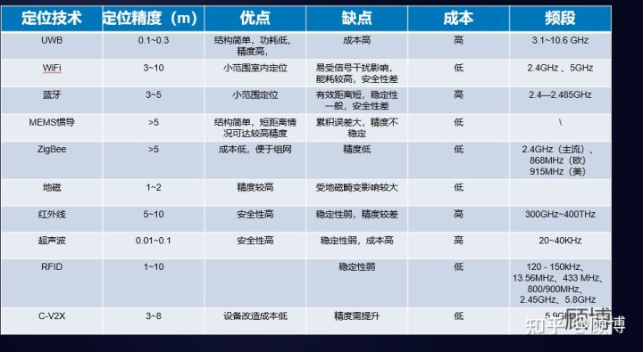

# 基础

数据采集、传输、存储、计算(挖掘、监控、显示)。

## 计算

原理：

技术：

## 存储

## 通信

### 蓝牙

- 原理

蓝牙是一种无线技术标准，可实现固定设备、移动设备和楼宇个人域网之间的短距离数据交换（使用2.4---2.485GHz的ISM波段的UHF无线电波）。蓝牙可连接多个设备，克服了数据同步的难题。

蓝牙技术是世界著名的5家大公司--爱立信（Ericsson）、诺基亚（Nokia）、东芝（Toshiba）、国际商用机器公司（IBM）和英特尔（Intel），于1998年5月联合宣布的一种无线通信新技术。蓝牙设备是蓝牙技术应用的主要载体，常见蓝牙设备比如电脑、手机等。蓝牙产品容纳蓝牙模块，支持蓝牙无线电连接与软件应用。蓝牙设备连接必须在一定范围内进行配对。这种配对搜索被称之为短程临时网络模式，也被称之为微微网，可以通纳设备最多不超过8台。蓝牙设备连接成功，主设备只有一台，从设备可以多台。蓝牙技术具备射频特性，采用了TDMA结构与网络多层次结构，在技术上应用了跳频技术、无线技术等，具有传输效率高、安全性高等优势，所以被各行各业所应用。

- 特点

    优缺点：

- 场景

    汽车领域：①蓝牙免提通讯，利用手机作为网关，打开手机蓝牙功能与车载免提系统，只要手机在距离车载免提系统的10米之内，都可以自动连接，控制车内的麦克风与音响系统，从而实现全双工免提通话。利用车载免提应用框架作为蓝牙免提通讯技术的基础，很好的规范蓝牙设备，并且汇集蓝牙功能集，这样就可以控制蓝牙技术。②车载蓝牙娱乐系统，主要包括USB技术、音频解码技术、蓝牙技术等，将上述技术相融合，利用汽车内部麦克风、音响等，播放储存在U盘中的各种音频以及电话簿等，还增添了流行音乐等播放功能。以CAN为基础连接车载系统中的网络，这样就可以实现车载信息娱乐系统的运行，同时也为系统保留了可扩展性。③蓝牙车辆远程状况诊断，车载诊断系统主要依靠蓝牙远程技术，及时进行车辆检修，尤其对汽车发动机进行实时监测，帮助车辆时刻掌握不同功能模块的具体运行情况，一旦发现系统运行不正常，利用设定好的计算方法准确判断出现故障的原因与故障类型，将故障诊断代码上传到车载运行系统存储器中。在蓝牙远程车辆系统中安装系统运行监测功能，确保车辆的安全行驶。在此基础上，蓝牙远程车辆状况诊断系统中还加入了车载监控系统，以通信接口为基础，诊断系统及时读取车辆状况诊断故障码，同时还要观察车辆的油耗记录与电池使用情况等，包括空燃比、爆震数量以及节气门开度等。利用数据线及时读取数据，将数据显示到相应对的显示屏中，为数据记录分析提供方便。④汽车蓝牙防盗技术，如果汽车处于设防状态，蓝牙感应功能将会自动连接汽车车主手机，一旦车辆状态出现变化或者遭受盗窃，将会自动报警。

    - 工业生产：①技术人员对数控机床的无线监控，利用蓝牙技术安装相应的监控设施，为数控机床用户生产提供方便，同时也维护了数控机床生产的安全。②零部件磨损程度的检测，利用蓝牙检测软件结合磨损检测材料进行实验研究，可以具体到耐磨性优劣，及时利用蓝牙无线传输将磨损检测程度数据传输到相关设备中，相关设备进行智能分析。③功率输出标准化，调节设备利用蓝牙技术传输生产功率变化，将其与标准运行功率对比，如果存在功率变化异常，便会及时调整。④蓝牙监控系统对数控系统运行状态的实时和完整的记录，蓝牙传输设备作为监控系统主要组成，随时记录数控系统运行状态，并且将数控系统运行期间的任何波动全部传输到储存设备中，利用通信端口上传信息，为数控生产管理人员提供更多参考资料。

    - 医药领域：①诊断结果输送，以蓝牙传输设备为依托，将医院诊断结果及时输送到存储器中。蓝牙听诊器的应用以及蓝牙传输本身耗电量较低，传输速度更加快速，所以利用电子装置及时传输诊断结果，提高医院诊断效率，确保诊断结果数据准确。②病房监护，蓝牙技术在医院病房监护中的应用主要体现在病床终端设备与病房控制器，利用主控计算机，上传病床终端设备编号以及病人基本住院信息，为住院病人在配备病床终端设备，一旦病人有什么突发状况，利用病床终端设备发出信号，蓝牙技术以无线传送的方式将其传输到病房控制器中。

- 蓝牙工具

蓝牙抓包工具：Wireshark

蓝牙无线开发平台Ubertooth：UbertoothOne是由Ubertooth项目组设计提供的一款用于蓝牙研究的硬件。

### RFID

### NFC

### WiFi、HiFi

### 卫星通信

铱星手机：

10元/分钟

### 移动通信

终端A-基站A-交换中心-基站B-终端B：多数光缆传输，部分无光缆条件的场景为微波传输。

# 硬件

- 内存堆和栈的区别

数据结构的栈和堆

栈：一种具有后进先出性质的数据结构。

堆：一种经过排序的树形数据结构，每个结点都有一个值。通常我们所说的堆的数据结构，是指二叉堆。堆的特点是根结点的值最小（或最大），且根结点的两个子树也是一个堆。由于堆的这个特性，常用来实现优先队列，堆的存取是随意，这就如同我们在图书馆的书架上取书，虽然书的摆放是有顺序的，但是我们想取任意一本时不必像栈一样，先取出前面所有的书，书架这种机制不同于箱子，我们可以直接取出我们想要的书。

内存分配中的栈和堆

然而我要说的重点并不在这，我要说的堆和栈并不是数据结构的堆和栈，之所以要说数据结构的堆和栈是为了和后面我要说的堆区和栈区区别开来，请大家一定要注意。

下面就说说C语言程序内存分配中的堆和栈，这里有必要把内存分配也提一下，大家不要嫌我啰嗦，一般情况下程序存放在Rom（只读内存，比如硬盘）或Flash中，运行时需要拷到RAM（随机存储器RAM）中执行，RAM会分别存储不同的信息，如下图所示：

内存中的栈区处于相对较高的地址以地址的增长方向为上的话，栈地址是向下增长的。

栈中分配局部变量空间，堆区是向上增长的用于分配程序员申请的内存空间。另外还有静态区是分配静态变量，全局变量空间的；只读区是分配常量和程序代码空间的；以及其他一些分区。

0. 申请方式和回收方式不同

不知道你是否有点明白了。

堆和栈的第一个区别就是申请方式不同：栈（英文名称是stack）是系统自动分配空间的，例如我们定义一个
char
a；系统会自动在栈上为其开辟空间。而堆（英文名称是heap）则是程序员根据需要自己申请的空间，例如malloc（10）；开辟十个字节的空间。

由于栈上的空间是自动分配自动回收的，所以栈上的数据的生存周期只是在函数的运行过程中，运行后就释放掉，不可以再访问。而堆上的数据只要程序员不释放空间，就一直可以访问到，不过缺点是一旦忘记释放会造成内存泄露。还有其他的一些区别我认为网上的朋友总结的不错这里转述一下：

1. 申请后系统的响应

栈：只要栈的剩余空间大于所申请空间，系统将为程序提供内存，否则将报异常提示栈溢出。

堆：首先应该知道操作系统有一个记录空闲内存地址的链表，当系统收到程序的申请时，会遍历该链表，寻找第一个空间大于所申请空间的堆结点，然后将该结点从空闲结点链表中删除，并将该结点的空间分配给程序，另外，对于大多数系统，会在这块内存空间中的首地址处记录本次分配的大小，这样，代码中的
delete语句才能正确的释放本内存空间。另外，由于找到的堆结点的大小不一定正好等于申请的大小，系统会自动的将多余的那部分重新放入空闲链表中。 

也就是说堆会在申请后还要做一些后续的工作这就会引出申请效率的问题。

2. 申请效率的比较

根据第0点和第1点可知。

栈：由系统自动分配，速度较快。但程序员是无法控制的。

堆：是由new分配的内存，一般速度比较慢，而且容易产生内存碎片,不过用起来最方便。

3. 申请大小的限制

栈：在Windows下,栈是向低地址扩展的数据结构，是一块连续的内存的区域。这句话的意思是栈顶的地址和栈的最大容量是系统预先规定好的，在
WINDOWS下，栈的大小是2M（也有的说是1M，总之是一个编译时就确定的常数），如果申请的空间超过栈的剩余空间时，将提示overflow。因此，能从栈获得的空间较小。 

堆：堆是向高地址扩展的数据结构，是不连续的内存区域。这是由于系统是用链表来存储的空闲内存地址的，自然是不连续的，而链表的遍历方向是由低地址向高地址。堆的大小受限于计算机系统中有效的虚拟内存。由此可见，堆获得的空间比较灵活，也比较大。

4. 堆和栈中的存储内容

由于栈的大小有限，所以用子函数还是有物理意义的，而不仅仅是逻辑意义。

栈：
在函数调用时，第一个进栈的是主函数中函数调用后的下一条指令（函数调用语句的下一条可执行语句）的地址，然后是函数的各个参数，在大多数的C编译器中，参数是由右往左入栈的，然后是函数中的局部变量。注意静态变量是不入栈的。 

当本次函数调用结束后，局部变量先出栈，然后是参数，最后栈顶指针指向最开始存的地址，也就是主函数中的下一条指令，程序由该点继续运行。 

堆：一般是在堆的头部用一个字节存放堆的大小。堆中的具体内容有程序员安排。

5. 存取效率的比较

char s1[] = "aaaaaaaaaaaaaaa"; char *s2 = "bbbbbbbbbbbbbbbbb";

aaaaaaaaaaa是在运行时刻赋值的；放在栈中。 

而bbbbbbbbbbb是在编译时就确定的；放在堆中。 

但是，在以后的存取中，在栈上的数组比指针所指向的字符串(例如堆)快。 

关于堆和栈区别的比喻

堆和栈的区别可以引用一位前辈的比喻来看出： 

使用栈就象我们去饭馆里吃饭，只管点菜（发出申请）、付钱、和吃（使用），吃饱了就走，不必理会切菜、洗菜等准备工作和洗碗、刷锅等扫尾工作，他的好处是快捷，但是自由度小。 

使用堆就象是自己动手做喜欢吃的菜肴，比较麻烦，但是比较符合自己的口味，而且自由度大。比喻很形象，说的很通俗易懂，不知道你是否有点收获。

# 软件

编程原则：SOLID原则

数据埋点

AB测试

## 数据

数据存储系统：最常见的就是分布式文件系统HDFS；如果需要使用NoSQL数据库功能，HBase是基于HDFS实现的一个分布式NoSQL数据库。

大数据ETL工具：负责把业务数据从前端搬运到后台的大数据平台，Sqoop是常见的结构化数据抽取工具；Flume和Logstach是用于抽取非结构化、半结构化数据工具。

基础层大数据引擎：所有大数据应用的底层核心引擎，主要是MapReduce和Spark。

分布式协调服务： Zookeeper，协调多个机器一起"友好"
高效工作的分布式调度工具。

分布式调度服务：任务顺序和时间（Azkaban、Oozie）

应用层大数据引擎：直接用MapReduce或Spark写程序比较困难，因此对基础层大数据引擎封装简化，提供一系列简易编程应用工具。

Pig/Hive/Spark SQL：面向SQL查询的编程工具。

Malhot：面向机器学习的分布式工具。

GraphX：面向图计算的分布式工具。

Elastic
Search：面向搜索应用的分布式工具，不依赖基础层大数据引擎，比较独立。

大数据实时处理：实时采集数据，实时分析， Spark
Streaming（大数据准实时计算）、Flink
（大数据实时计算）、CDC或者OGG（结构化数据的实时抽取）。

趋势：HDFS让位于由AWS
S3领导的对象存储。MapReduce已被Spark取代，随着时间的推移，它也减少了对Hadoop的依赖。Yarn正在被Kubernetes等技术所取代。而Hive
的查询引擎组件在性能和采用方面已经被Presto/Trino超越。

### 数据仓库hive和数据库MySQL

数据库是面向事务的设计，一般存储在线交易数据，数据仓库是面向主题设计的，存储的一般是历史数据；数据库设计是尽量避免冗余，一般采用符合范式的规则来设计，数据仓库在设计是有意引入冗余，采用反范式的方式来设计；数据库是为捕获数据而设计，数据仓库是为分析数据而设计，它的两个基本的元素是维表和事实表。

查询语言   |HQL   |SQL
-------|------|---
数据存储位置    |HDFS   |Local FS
数据格式     |用户自定      |系统决定
数据更新       |hive(0.14)后支持         |支持
索引        |无                  |有
执行   |MapReduce       |Executor
执行延迟   | 高         | 低
可扩展性  | 高         | 低
数据规模   |大        | 小

## 应用
### NLP
- 解决方案
    - 痛点
        > 输入瑕疵
        分词困难：基于字典、词库匹配的分词方法；基于词频统计的分词方法；基于知识理解的分词方法。
        词义消歧：需上下文
        句义消歧：需上下文
        回答更准确合理
        
    - 解决方案
        > 第一种：机器学习的方法，也包括深度学习。收集海量的文本数据，建立语言模型，解决自然语言处理的任务。
        
        > 第二种，基于规则和逻辑的方法。人工智能最早的研究方法，90年代之后始更多的采用机器学习的方法。现在基本上在自然语言处理研究当中，逻辑和规则占20%，机器学习占80%，也有两者结合。

        > 第三种，语言学的方法。把自然语言处理看成语言学下面的一个分支，所有对人类语言现象的研究都可以归为语言学，语言学家也就是很多自然语言处理任务的设计师，由他们提出问题，把框架勾勒出来；当然解决问题则要靠研究人员用机器学习、规则和逻辑的方法把这个框架填上，把问题解决掉。

# 网络

## Web

Web趋势：应用程序web化、web应用移动化、web操作系统化（基于web构建纯粹的操作系统；web的底层结构趋向于操作系统结构）

# 应用

## 定位技术

(1) 市场需求

    企业：生产过程、仓库调度的自动化需要定位信息

个人：地下停车场寻车导航、智慧大楼人员/访客定位管理、会展位置导航等

(2) 定位能力

    系统定位：系统(IOS、安卓、WP)都提供了一套系统级定位能力，对应系统级API，能综合GPS卫星、WIFI定位、基站定位确定位置。

    第三方SDK定位：对于可以公开读取基站、WIFI信息的Android手机系统(IOS和WP系统上没有开放出读取基站和WIFI的接口)，百度、高德等地图厂商自行实现了定位SDK。SDK通过系统接口读取到原始定位信息，然后借助于各家自行部署维护的数据库，查询到当前扫描到的基站、WIFI的位置，最终计算出更准确的定位结果，通过SDK的接口，返回给开发者。让APP的定位能力脱离对手机系统的依赖。

    自建定位系统：地磁、RFID

(3) 定位算法

常见的定位方法：TOF（time of flight）、AOA（angle of
arrival）、RSSI（Received Signal Strength Indication）、TOA（time of
arrival）、TDOA（time difference of arrival）。

(4) 常见技术方案

1.  卫星定位：GPS、GNSS

-   原理

    -   利用至少4颗卫星进行测距交会定位，定位过程中存在着三部分误差，一部分是每个接收机所公有的，例如，卫星钟误差、星历误差、电离层误差、对流层误差等；第二部分为不能由用户测量或由校正模型来计算的传播延迟误差；第三部分为各用户接收机所固有的误差，例如内部噪声、通道延迟、多径效应等。

    -   差分GPS定位使用基准站和用户接收机(移动站)，利用实时或事后处理技术，就可以使用户测量时消去公共的误差源---卫星轨道误差、卫星钟差、大气延时、多路径效应。应用最广泛的伪距差分DGPS技术，精度亚米级；实时动态定位技术(RTK)，即载波相位差分技术，将基准站采集的载波相位发给用户接收机，进行求差解算坐标，以前的静态、快速静态、动态测量都需要事后求解才能获得厘米级的精度，而RTK是能够在野外实时得到厘米级定位精度。

-   精度

    -   民用：3m-200m

    -   军用：1m内

-   优缺点

    -   优点：定位范围广

    -   缺点：耗电大，需要手机为GPS模块提供高压供电；信号源、信号传输、信号接收、信号解析过程中存在误差，信号源受美国SA政策、卫星数影响；信号传输中受天气(阴天、对流层)、电气电磁(电离层)、遮蔽物干扰。

-   场景

    -   普通定位：室外大多数场景。

    -   RTK：测绘各种比例尺地形图和用于施工放样。

2.  基站定位

-   原理

    -   基于基站与手机之间通信时差来计算你当前的大概位置的一种通信服务，不需要开通GPRS：查找附近信号最好的三个基站，计算手机位置。

-   精度：20-2000m

-   优缺点

    -   优点：耗电小，基站采集数据即可，不消耗手机电量

    -   缺点：精度不高，常见100m左右；受移动手机网络覆盖区域限制。

-   场景

    -   补充定位

3.  WiFi定位

-   原理：根据Wi-Fi网络接入点和移动接收设备的信号强度确定位置。

-   精度：3-15m

-   优缺点

    -   优点：室内WiFi设备普遍；

    -   缺点：WiFi热点间相互干扰

-   场景：室内定位

4.  蓝牙定位

-   原理

    -   蓝牙Beacon室内定位：在室内应用场合定点布置Beacon基站，通过广播蓝牙信号，用户终端接收定位Beacon的信号确定自己的位置。

    -   蓝牙道钉室外定位：根据蓝牙信号强弱划定禁停或可停区域，50元/个，感应范围1m左右，正常可使用3年。

-   精度：1-3m

-   优缺点

    -   优点：Beacon模块体积小、易部署、成本低；功耗远低于WiFi定位；多数终端都有蓝牙模块，具有定位的基础。

    -   缺点：蓝牙道钉需要人工安装维护，无法在道路上普遍铺设。

-   场景：局域定位

5.  RFID定位

-   原理：RFID定位一般采用刷卡方式，被定位人员携带绑定自身信息的RFID标签，当进入RFID阅读器读卡范围内，阅读器读取标签ID信息并将自己绑定的区域信息上传至后台，后台根据标签的ID信息确定被定位人员，根据收到的绑定区域信息确定位置信息。

-   精度

-   优缺点：短距通信，10cm，较为安全；便捷、迅速。

-   场景：广泛使用在医院、工厂、企事业单位和公司等场所的货物和人员考勤上。

6.  UWB定位(ultra wide band)

    

-   原理：标签卡对外发送一次UWB信号，在标签无线覆盖范围内的所有基站都会收到无线信号。如果有两个已知坐标点的基站收到信号，标签距离两个基站的间隔不同，那么这两个基站收到信号的时间点是不一样的。

-   精度：厘米级

-   优缺点

    -   优点：传输速率高（最高可达1000Mbps以上），发射功率较低，穿透能力较强。

    -   缺点：定位应用范围较小，需对网络重新进行部署，并且使用者需要使用专用的信号测量设备，实现成本较高(基于信号时间的定位系统，例如UWB，一旦遇到墙体遮挡的情况就需要重新部署，同等面积，房间数量增加一倍，基站用量也将增加一倍，其在空旷场景基站更易部署)。

-   场景：隧道、化工厂、监狱、医院、养老院、矿井等行业。

1.  其他定位：ZigBee定位、UWB定位、低频触发定位、声波定位、光定位、地磁定位等。

就抗多径和抗干扰方面，UWB明显好于WiFi、蓝牙；就传输距离来看，WiFi是最远的，UWB次之，蓝牙传输距离最近；在建设成本方面，UWB的成本要远远高于WiFi和蓝牙。

