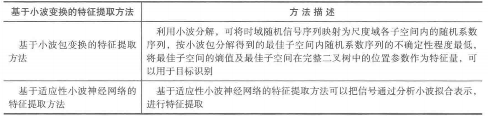
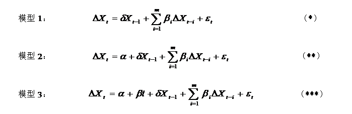
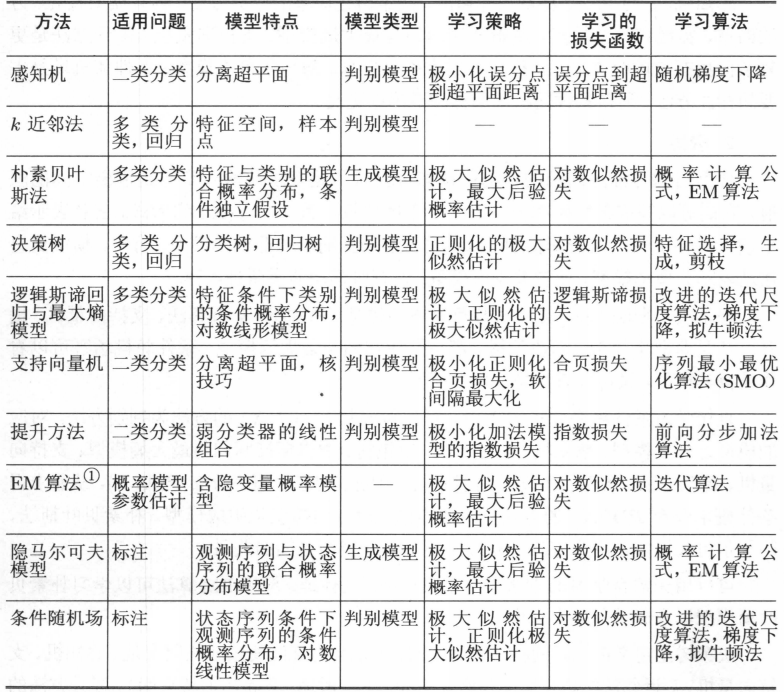

# 建模步骤

思想：客观世界是联系和发展的统一整体，但我们的认识却具有局限性，我们对任何事物的解释和预测都无法通过穷尽整体世界实现，只能在一定条件下、一定范围内、一定程度上隔离研究对象，从而可以忽略次要因素和次要规律，基于有限的主要因素和主要规律进行研究。

方法：通过对问题进行抽象抓住主要因素，对主要规律进行推测，建立理论模型；根据现实样本，用理论模型拟合、解释、预测现实。

问题：理想的模型应该反映这些主要因素和规律，因此其解释和预测能力在特定范围内满足要求。但从整体世界隔离研究对象，到获取局部样本信息，到建立模型的过程中难以避免出现偏离，导致欠拟合和过拟合：①受限于认知，在对研究对象进行隔离和对主要因素规律进行抽象的过程中可能会遗漏重要变量，导致模型在样本内欠拟合；②样本不满足随机抽样，样本分布和整体分布不一致，导致模型无法获得整体规律；③抓取了过多的次要变量和规律，将样本自身的一些特点当做整体的一般性质，导致泛化性能下降。

欠拟合：重要解释变量缺失导致大部分解释被归结到误差里，可以通过在决策树学习中扩展分支、在神经网络中增加训练轮次等解决；

过拟合：次要因素过多导致样本自身的特征被错误地泛化到整体，可以通过一些手段进行缓解。

## 确定目的和方法

### 确定目的
根据最终目的抽象出真正要解决的问题

### 评价方法
- 性能度量：衡量模型的泛化能力
 
    - 分类问题

        -   错误率、精度
            > 错误率 = 分类错误样本/总样本
            精度 = 1 - 错误率
            
        -   查准率、查全率、P-R曲线、F(β)
            
            >   查准率、查全率：一般根据模型预测结果可以得到样本为正的可能性的排序，依照该顺序逐次设置判断为正的阈值，可以基于混淆矩阵得到不同的查准率、查全率，且查准率和查全率一般负相关；
            P-R图：查准率-查全率为纵-横轴的曲线，曲线下的面积在一定程度上表征了学习器在查准率、查全率上取得相对双高的比例；
            F(β)：P-R图面积较难估算，一般使用对查准率和查全率赋予不同权重的F(β)值进行综合评价。

        -   ROC、AUC：学习模型为测试样本产生实值或概率预测，然后设置阈值(threshold)，大于阈值为分为正类，其他分为反类，因此可以通过设置阈值权衡查准率、查全率。在这里排序质量的好坏体现了模型一般情况下泛化性能的好坏。

            >   ROC：即真正例率-假正例率为纵-横轴的曲线，对角线对应随机猜测模型。
            > > 真正例率：正确判断为正的样例在所有实际为正的样例中的占比
            假正例率：错误判断为正的样例在所有实际为负的样例中的占比

            >   AUC：ROC下的面积，AUC测度的是样本预测的排序质量，因此和排序误差联系紧密。

        -   代价敏感错误率：根据先验认知两类错误的代价可能不一样，可基于二分类代价矩阵计算性能度量指标的代价敏感版本。

        -   比较检验：不同模型的泛化性能优劣在统计上是否显著

            >   在同一个数据集上比较两个算法：交叉验证t检验、McNemar检验(基于列联表)
            在一组数据集上比较多个算法：通过Friedman检验+Nemenyi检验，判断所有算法性能是否相同，以及不同的话平均序值有差异的临界阈值

        -   偏差-方差分解：泛化误差=偏差+方差+噪声，对学习算法的期望泛化错误率进行拆解，来解释泛化性能

            >   偏差：学习算法的期望预测与真实结果的偏离程度，表征学习算法本身的拟合能力；
            方差：同样大小的训练集的变动所导致的学习性能的变化，表征数据扰动的影响；
            噪声：期望泛化误差的下界，表征学习问题本身的难度
            总结：因此泛化性能由算法的能力；数据的充分性；学习任务本身的难度共同决定。偏差-方差窘境，给定学习任务，假定我们能控制学习算法的训练程度，则在训练不足时，学习器的拟合能力不够强，训练数据的扰动不足以使学习器产生显著变化，此时偏差主导了泛化错误率；随着训练程度的加深，学习器的拟合能力逐渐增强，训练数据发生的扰动渐渐能被学习器学到，方差逐渐主导了泛化错误率；在训练程度充足后，学习器的拟合能力已非常强，训练数据发生的轻微扰动都会导致学习器发生显著变化，若训练数据自身的、非全局的特性被学习器学到了，则将发生过拟合。

    - 一般问题：K-fold Cross Validation(K折交叉验证)，其是评估机器学习算法性能的标准方法。

        - 训练误差(经验误差)：训练集上的误差

        - 泛化误差：新样本上的误差

### 确定建模方案

根据目的的实现，确定研究范围和对象，抽象出理论模型；通过现实可获取的数据确定理论模型适用现实的方法。

1.  得到一个有限的训练数据集合；
2.  确定包含所有可能的模型的假设空间，即学习模型的集合；
3.  确定模型选择的准则，即学习的策略；
4.  实现求解最优模型的算法，即学习的算法；
5.  通过学习方法选择最优模型；
6.  利用学习的最优模型对新数据进行预测或分析。

## 数据收集

### 数据收集
- 数据观：数据是历史，是对部分事物部分方面部分过程的记录，是全量信息的子集，在一定程度上反映了客观事实。

- 数据采集范围：根据问题及子问题、理论模型确定几个可能实现的具体模型方案和需要收集的数据。

- 数据采集方法
    - 问卷：问卷受众确定；问卷问题设定（填写的意愿、可靠性）；
    - 实验：受控实验；自然实验。
    - 田野调查：样本的筛选
    - 现代技术：感知技术、互联网商业模式
        - 互联网时代之前：数据采集专业要求高（采集源选择、采集方式、记录方式、质控），采集成本高，数据垄断在咨询寡头、政府部门手里。
        - 互联网时代：数据分布线上化，互联网巨头积累了大量数据资源，专业数据人才逐渐从传统咨询、政府部门流入互联网巨头。
        - 移动互联网时代：数据量级爆炸式提升，存储成本、计算成本提升，saas出现。

- 数据传输：通信技术驱动速度提升、成本降低，邮寄→无线电→互联网
- 数据存储：电子技术驱动成本降低，实体介质→数字介质
- 数据计算：电子技术驱动成本降低，个人也能进行数据分析，但对于大数据，计算能力要求很高，成本也高。

### 数据组织

数据类型：数字、文字、图像、视频、音频 数据以及它们的组合

数据结构：数组和链表、栈和队列、哈希表、堆、树和图、字符串

-   张量：深度学习算法中常用。标量-0D张量；向量-1D张量；图像矩阵-2D张量；视频-5D张量。

    -   张量属性

        -   阶数：轴的个数（阶），数据张量的第一个轴（0轴）通常都是样本轴（有时也叫样本维度）。

        -   形状：表示张量沿每个轴的维度大小（元素个数），矩阵的形状包含2个元素，比如(4,5)，向量的形状只包含一个元素，比如(5)，而标量的形状为空。一般向量数据表示为2D张量，形状为(samples, features)；时间序列数据或序列数据表示为3D张量，形状为(samples, timesteps, features)；图像表示为4D张量，形状为(samples, height, width, channels)或(samples, channels, height, width)；视频表示为5D张量，形状为(samples, frames, height, width, channels)或(samples, frames, channels, height, width)。

        -   数据类型：张量的类型可以是float32、uint8、float64等，在极少数情况下可能会遇到字符（char）张量。注意，Numpy（以及大多数其他库）中不存在字符串张量，因为张量存储在预先分配的连续内存段中，而字符串的长度是可变的，无法用这种方式存储。

    -   张量运算

        -   变形：reshape

        -   逐元素运算

        -   广播：向较小的张量添加轴（叫作广播轴），使其ndim与较大的张量相同；将较小的张量沿着新轴重复，使其形状与较大的张量相同。

        -   点积：仿射变换、旋转、缩放等基本的几何操作

        -   乘积：法向

-   栈和队列：栈（LIFO）；队列（FIFO）。

-   链表：简单灵活地表示动态集合，效率可能不高。

-   散列表：

-   树：有根树、二叉查找树、红黑树、B树、二项堆、斐波那契堆

-   图：邻接表，适合表示稀疏图；邻接矩阵，适合快速判别定点邻接情况或表示稠密图；

## 数据分析

### 数据清洗

- 数据清洗
    - 重复样本：去重
    - 错误样本：容忍偏差；纠正；删除。
        - 自相矛盾错误：逻辑矛盾、口径矛盾
        - 不同数据源交叉验证：注意统一口径
        - 利用外部标准信息判断：理论或经验标准，注意统一口径
    - 缺失值：容忍缺失；插补（均值|众数|中位数|K近邻）；删除；专门处理缺失值的算法(随机森林|梯度提升树|K近邻)。
        
        - 信息获取成本过高；
        - 数据实际不存在：未婚者不存在配偶工作；
        - 遗漏

- 数据分布特征
    - 基本统计特征
        - 代表性：均值、中位数、众数
        - 分散性：标准差、3$\sigma$外占比、变异系数、极差、四分位数间距
        - 其他：min、max、偏度Skewness、峰度Kurtosis
    - 绘图观察
        - 直方图：直方分布图、累计分布图
        - PP图、QQ图：pp图比较的是真实的数据和待检验分布的累计概率，而qq图比较的是真实数据和待检验分布的分位点数。PP图中间敏感，QQ图尾巴敏感。用QQ图还可获得样本偏度和峰度的粗略信息，推荐使用QQ图进行正态分布的图示法判断。
    - 正态分布检验：根据样本量确定方法
        |检验方法|工具|说明|
        |-|-|-|
        |Kolmogorov-Smirnov test|scipy.stats.kstest|即D检验，大样本(>100，SAS推荐>2000)下若累计频数分布与指定分布差异很小，则推论该一元样本服从该指定分布。|
        |Anderson—DarIing test|scipy.stats.anderson|A-D检验主要通过计算数据的累积分布曲线与理想正态分布的累积分布曲线之间的差异来进行检验，该方法考虑了两条累积分布曲线之间的所有差异，因此它比K-S检验效果更好，也是检验正态性最好的方法之一。但该方法的缺点是仅适用于小样本，origion中推荐样本量为26个以下，但有些超过200的工业数据也有可能诵过A-D检验，该方法还可用于检验其他分布。|
        |Shapiro—Wilk test|scipy.stats.shapiro|S-W检验是正态性检验最为有效的方法之一，一种在频率统计中检验正态性的方法，但其测试基础较难理解。该方法在每一个样本值都是唯一时的检验效果最好，但若样本中存在几个值重复的情况下该方法便会大打折扣，因此该方法只适用于小样本，推荐样本量为7-2000，当样本量超过5000时不再适用。|
        |D'Agostino-Pearson test|scipy.stats.normaltest||
        |贝叶斯统计方法||通过贝叶斯因子比较|
    - 非参数检验
        - Pearson's chi-squared test：卡方独立性检验和卡方拟合度检验。χ2检验可适用多元分布。
        - 置换检验：随机化t检验。其适用于假定数据成正态分布并不合适、担心离群点的影响、对于标准的参数方法来说数据集太小的情况。
    - 时间序列平稳性检验、白噪声检验

- 异常数据分析：高维复杂情形下识别较为困难
    - 识别
        - 基于先验认知直接判断：明显超过理论范围；定性数据分布明显和认知不符；数据之间定量关系或定性关系不符合认知。
        - 基于统计学的Z-score法：3σ原则，超出3σ。
        - IQR法：InterQuartile Range，四分位距即Q3-Q1。该离群点定义为异常值被定义为小于Q1－1.5IQR或大于Q3+1.5IQR的值。
        - 基于距离的方法：如DBSCAN；
        - 箱型图、直方图、散点图肉眼判断：min、min2、max、max2，直到能接受。
    - 处理
        
        - 容忍异常：模型对异常数据敏感程度小，不处理
        - 纠正：wiserize、其他估计插补方法。
        - 删除异常样本
    - 股票数据处理
        - 剔除金融类公司：金融和非金融公司的会计处理差异较大；
        - 剔除ST股：ST涨跌幅限制为5%，且业绩连续亏损，股价表现相对普通股差异较大；
        - 剔除公司IPO一年内的数据：上市后经历一个市场定价过程，波动较大且没有参考意义。

### 数据变换

- 数据变换
    - 简单函数变换：平方、求根、取对、差分、反双曲线函数变换，实现序列平稳化、分布区间压缩、百分比变化表征等非线性表征。
        - 取对：取对数会剔除为0的观测，因此可以用反双曲线函数替代取对数处理；0或负值可做平移变换，一般可以+1，参考"陆铭，陈钊.城市化、城市倾向的经济政策与城乡收入差距[J].经济研究.2004（6）：50-58."第6页（实际页码第55）下面的注释。
    - 规范化
        - 线性规划化：极差规范化，除以极差映射到[0,1]；标准差规范化，Z-score标准化/均值标准化；小数定标规范化，根据绝对值的最大值确定小数点移动几位——除以10的几次方，使得全体映射到[-1,1]。
        - 非线性规范化：Sigmoid函数映射到[0,1]
    - 离散化
        - 等距法
        - 等频法
        - 聚类
    - 正态化：目的有稳定方差、直线化、使分布接近正态3大类，注意变换会导致方差传播和分布变化，例如Box-Cox变换、对数变换、平方根变换、倒数、logit、Fisher变换；
    - 正则化：将每个样本缩放到单位范数，适合计算样本相似性
    - 属性构造：根据原子指标构造复合指标表征一些想要表达的内涵
    - 小波变换
        
        

- 数据规约：在原数据集上产生规模更小但保持原数据完整性的新数据集，降低无效、错误数据的影响，降低存储成本，缩短挖掘时间成本。
    - 属性规约：属性合并或删除不相关属性
        
    - 数值规约：选择替代的、较小的数据来减少数据量
        - 有参数方法：用模型评估数据，只存放模型参数，例如回归（一元、多元等），对数线性模型（近似离散属性集中的多维概率分布）
        - 无参数方法：直方图、聚类、抽样

### 初步挖掘
- 对比分析
    - 同类绝对数比较：实际和计划、目标、预期、经验的对比；
    - 总体比重：部分/总体，说明事物的性质、结构、质量；
    - 结构比例：部分A/部分B，内部部分间的比例关系；
    - 强度类复合指标：表征强度、密度、覆盖度、普遍性；
    - 同类比较：相同性质的指标在同一时期不同空间条件（不同地区、不同行业、不同企业）下的对比；
    - 时序对比：同一指标在不同时间的增速。时间序列回归分析影响之前要先去除趋势、季节性、周期性，评价这些特征的来源以及对解决问题的影响。
- 贡献度分析：即基于帕累托法则的帕累托分析——二八法则（80%的B由20%的A贡献）。
- 相关性分析
    - 检验：Pearson相关系数、Spearman等级相关系数和Kendall秩相关系数。
    - 评价：可以衡量变量之间的线性或非线性关系。相关性并不能说明因果关系，只是指示变量之间的关联程度。
- 离群点价值挖掘：识别、解释

## 训练集、验证集和测试集的拆分

- 训练集：用于模型参数估计

- 验证集：用于模型选择和调参(超参)

- 测试集：用于估计泛化误差

- 拆分方法：留出法、交叉验证法、自助法

## 特征工程
### 变量构造
- 降维技术
    - 主成分分析：把主成分表示成各变量的线性组合；
    - 因子分析，把变量表示成各公因子的线性组合，对于因子分析，可以使用旋转技术，使得因子更好的得到解释，因此在解释主成分方面因子分析更占优势；
    - 泛化，使用概念分层，用高层概念替换低层或原始数据。例如将街道属性泛化到城市属性，A市1街、A市2街均泛化为A市

- 偏最小二乘(PLS)

- 二次提取：光滑化，利用分箱、回归、聚类等技术去噪或者滤波分解趋势和波动；聚集，例如将日度数据聚集为月度、年度。
### 变量选择
- 参考
    - [Deep Lasso](https://cloud.tencent.com/developer/article/2358324)
    - [特征工程系列：特征筛选的原理与实现（上）](https://cloud.tencent.com/developer/article/1469820)
    - [特征工程系列：特征筛选的原理与实现（下）](https://cloud.tencent.com/developer/article/1469822)
    - 过滤式特征筛选：根据特征的个体特性和与目标变量的相关性对特征进行排序，而不考虑任何具体的学习算法。过滤方法包括单变量统计测试、方差过滤和互信息分数。
        - 方法：方差阈值法（移除方差较小的特征）；相关性分析（计算特征与目标变量之间的相关系数）；互信息。
        - 缺点：可能忽略特征之间的交互作用，可能忽略出现反转关系的复杂非线性作用，导致一些重要特征被误删
    - 包裹式特征筛选：这种方法将特征选择过程与模型训练过程相结合，通过评估不同特征子集对模型性能的影响来选择特征。
        - 方法：递归特征消除（通过递归地考虑越来越小的特征集来选择特征）；基于模型的特征重要性评估（如使用随机森林或梯度提升机等模型来评估特征的重要裹式特征筛选的优点是能够考虑特征之间的交互作用，选择出对模型性能贡献最大的特征；
        - 缺点：特征数量较多时计算成本较高
    - 嵌入式特征筛选：这种方法在模型训练过程中自动进行特征选择。一些机器学习算法（如决策树、随机森林和深度学习模型等）具有内置的特征重机制，可以在训练过程中自动评估每个特征的重要性。
        - 优点：计算效率高且能够考虑特征之间的交互作用；
        - 缺点：需要依赖于特定的算法，并且不同算法可能给出不同的特征重要性评估结果。

- 变量选择方法
    - 完全子集法
    - 向前回归法（每步只能增加）
    - 向后回归法（每步只能剔除）
    - 逐步回归法
- 变量选择标准
    - AIC
    - BIC
- 现代变量选择方法：LASSO

- 深度学习自选
    - 神经网络：解释性问题，因子重要性及相对重要性问题

- GBM决策树选择：随机森林模型在小数据量、特征维度较小的场景下非常适用，而且性能结果较好。但每次训练的时候需要全量数据，没法以流的方式类似梯度下降那种可以分批训练，而且其调优方式比较局限。

- 惩罚因子选择法
    - Lasso回归及其衍生版本
    - Smoothly Clipped Absolute Deviation(SCAD)
    - Dantzig Selector(DS)：主要针对变量数大于样本量的高维变量选择问题

统计学方法：最大似然比检验、得分检验、wald检验

其他方法：信息增益、互信息

## 建立模型
### 线性回归探测
- 注意内生问题
    - 因果倒置
        - $y=\beta x+u \rArr x=\beta^{-1}y+(-\beta^{-1}u)$：解释变量$y$和随机扰动项$-\beta^{-1}u$相关。
    - 控制变量缺失：缺失的控制变量被归入误差，当该缺失的控制变量和其他控制变量或解释变量相关时，误差和控制变量或解释变量相关
        - 例如交叉项的一阶项缺失，缺失的一阶项被归入误差，使得误差和交叉项相关

- 分段线性拟合：相较于类神经网路和支持向量机等黑箱演算法，白箱演算法更容易用于研究结果的解释上。
    - numpy.piecewise()+scipy.optimize.curve_fit()：需要知道段数，分段用piecewise手动实现。
    - pwlf库：可以手动指定断点位置fit_with_breaks；也可以只指定最大可能段数快速拟合数据并自动确定最佳的断点位置pwlf.PiecewiseLinFit.fitfast；全局寻优pwlf.PiecewiseLinFit.fit。
    - linear-tree库：LinearTreeRegressor是一个决策树回归模型，它不是一个直接的线性模型。
    - m5py库：https://smarie.github.io/python-m5p/。In 1996 R. Quinlan introduced the M5 algorithm, a regression tree algorithm similar to CART (Breiman), with additional pruning so that leaves may contain linear models instead of constant values. The idea was to get smoother and simpler models. The algorithm was later enhanced by Wang & Witten under the name M5 Prime (aka M5', or M5P), with an implementation in the Weka toolbox.

- Logistic Regression：仅能用于线性问题，只有在feature和target是线性关系时，才能用Logistic Regression（不像SVM那样可以应对非线性问题）。这有两点指导意义，一方面当预先知道模型非线性时，果断不使用Logistic Regression； 另一方面，在使用Logistic Regression时注意选择和target呈线性关系的feature。LR分类器（Logistic Regression Classifier），在分类情形下，LR分类器其实就是找出一组权值，形成计算样本数据出现概率密度的回归方程。

- Lasso回归：对不重要的变量施加惩罚，从而可以实现特征选择的功能。

- 超参调参：Keras Tuner库
    - 网络搜索：穷举所有可能，适合超参空间较小情况。
    - 随机搜索：从超参空间随机抽取样本选择最优。
    - 贝叶斯优化(推荐)：BO、SMAC、TPE、与多保真度结合。
    - 其他优化算法：模拟退火、基于种群的优化、基于梯度的优化(需要满足训练标准的一些可微性条件)

## 检验修改
- 异常值信息挖掘
    - 识别：Cook距离法、残差图
    - 评价：参数敏感性、模型鲁棒性；
    - 异常值归因和处理
        - 检查原始数据是否有误，如有，改正后重新计算；否则，剔除对应的数据
        - 如果没有足够理由剔除影响大的数据，就应该采取收集更多的数据或者采用更加稳健的方法以降低强影响数据对估计和推断的影响，从而得到比较稳定的回归方程
- 模型迭代或重构（因子选择）、解释、预测、评价

# 计量模型

## 概述

### 评价指标

- 无偏性：估计值的期望等于真值。
    - 渐近无偏性：当样本容量n趋于无穷大时，估计值的期望等于真值。

- 有效性：无偏估计值中相对真值方差最小的估计。
    - 渐近有效性：某些估计值在中小样本时可能不是最有效的，但随着样本数的增加，慢慢变得有效（没有其它无偏估计可以得到更小的方差）。

- 相合性(一致性)：随着样本的增加，估计值与真值的差的绝对值趋近于零。无偏但是标准差不收敛到0也不一定相合。
    - 强相合：a.s.收敛
    - 弱相合：依概率收敛
    - Lp相合

### 基本方法

-   最小二乘法(OLS)

    -   原理：当从模型总体随机抽取n组样本观测值后，最合理的参数估计量应该使得模型能最好地拟合样本数据

    -   适用：误差项需要满足一些假设，例如要求正态分布、解释变量与误差项不相关

-   最大似然法(ML)

    -   原理：当从模型总体随机抽取n组样本观测值后，最合理的参数估计量应该是使得从模型中抽取该n组样本观测值的概率最大

    -   适用：误差项分布已知

-   矩方法(MM)：工具变量估计(采用工具变量法，当工具变量多于待估计参数个数，则工具变量估计具有信息上损失，不是有效估计)、GMM。

    -   原理：由辛钦大数定律知，简单随机样本的原点矩依概率收敛到相应的总体原点矩，总体原点矩又是分布中未知参数的一个函数，因此用样本矩估计总体矩，进而可以找出未知参数的估计。

    -   适用：允许随机误差项存在异方差和序列相关；不需要知道随机误差项分布

    -   优点

        -   可以克服随机解释变量问题

        -   可以充分利用多个工具变量的信息，进而克服过度识别问题

        -   不需要对模型随机项分布进行事先的设定

    -   局限

        -   对总体原点矩不存在的分布不能用：如柯西分布

        -   只涉及总体的一些数字特征，并未用到总体的分布，因此矩法估计量实际上只集中了总体的部分信息，这样它在体现总体分布特征上往往性质较差，只有在样本容量n较大时，才能保障它的优良性，因而理论上讲，矩法估计是以大样本为应用对象的。

-   从计量经济学模型方法论角度看，三个问题成为广义矩估计方法发展的导向。

    -   一是解释变量的内生性问题。计量经济学模型中变量的内生或者外生、随机或者确定，并不是变量本身所固有的绝对的属性，而是相对于模型的研究对象、模型系统，甚至模型中的参数而言的。经济变量，如果一定要给出它们的固有属性，只能说它们都是内生的和随机的，因为它们都是在社会经济系统中，在互相影响和作用的过程中生成的。同一个经济变量，相对于不同的研究对象、不同的模型系统，甚至不同的关注参数，可能有不同的设定。所以，如何克服解释变量的内生性问题，成为任何一项计量经济学应用研究回避不了的一个重要的问题。

    -   二是模型的过度识别问题。经济系统是复杂的，系统所包含的变量之间存在错综复杂的关系，有直接影响，也有间接影响。任何一个计量经济学结构模型，所包含的解释变量总是有限的，即对被解释变量产生显著的直接影响的变量。大量的对被解释变量产生间接影响的变量的存在，一方面造成了解释变量的内生性，另一方面带来了模型的过度识别问题。建立联立方程模型系统，可以解决过度识别问题。但是，研究者所关注的往往只是系统的一个局部，为了一个局部而建立庞大的模型系统，不仅耗费巨大，而且系统中误差的传递和积累，往往会得不偿失。所以，解决单方程计量经济学模型的过度识别问题，也是计量经济学应用研究中回避不了的一个重要的问题。

    -   三是模型随机项分布的设定问题。计量经济学模型通过对随机抽取的样本的一次观测值估计总体的参数，最常用的估计方法都需要首先对总体的分布进行设定，例如假设模型随机项服从正态分布或其它某一已知分布。在应用研究中，由于不可能实现对某一样本的"重复抽样"，所以该分布是不可能准确设定的。

## OLS

### 基本假设

-   保证无偏估计的基本假设

    -   假设1线性模型假设：线性于参数

    -   假设2随机抽样假设：样本之间相互独立，保证误差项之间不相关。

        -   混合横截面数据一般也可认为满足独立抽样假设，关键问题是相互之间的关系有多大、前后结构变化有多大：空间回归中的样本相关性问题

        -   一般来说，时间系列数据不满足独立抽样假设，不同时间之间样本具有相关性：如果样本是弱相关的，即$(x_t,y_t)$和$(x_{t-s},y_{t-s})$随着时间推移渐进不相关，则依然可以使OLS估计一致

    -   假设3非完全共线性

    -   假设4外生性假设：解释变量均是外生的，保证解释变量和误差项不相关

-   保证OLS BLUE的假设

    -   假设1~4

    -   假设5同方差性假设：样本估计的方差是条件方差，没有无条件方差。$Var(\hat{\beta}|X) =( X'X )^{-1}\sigma^2$
        > $$
        \begin{aligned}
        \hat{\beta} &= {(X'X)}^{-1}X'Y \\
        &= (X'X)^{-1}X'(X\beta + \varepsilon) \\    
        &= \beta + (X'X)^{-1}X'\varepsilon \\ \\
        Var(\hat{\beta}|X) &= Var[(X'X)^{-1}X'\varepsilon|X] \\
        &= E[(X'X)^{-1}X'\varepsilon\varepsilon'X(X'X)^{-1}|X] \\
        &= (X'X)^{-1}X'E(\varepsilon\varepsilon'|X)X(X'X)^{-1} \\
        &= (X'X)^{-1}\sigma^2
        \end{aligned}
        $$

### 参数估计
- 矩方法

### 残差分析
- 残差独立服从同一正态分布：$u \stackrel{iid}{\sim} N(0,\sigma^2)$
    - 小样本下需要检验是否服从正态分布
    - 大样本下基本会近似服从正态分布，只需要检验是否独立同方差

- 残差图：$u-\hat{Y}$，以残差为纵坐标，其他的量（一般为拟合值）为横坐标的散点图。
    - 误差随着横坐标的增加而增加
    - 误差随着横坐标的增加而减少
    - 误差中间大，两端小
    - 误差规律变动：回归函数可能非线性，或者误差相关或者漏掉重要的自变量。可适当增加自变量的二次项或者交叉项，具体问题具体分析。

- 残差图中显示误差方差不相等(方差非齐性)：可以对变量做适当的变换，使得变换后的相应变量具有近似相等的方差(方差齐性)。最著名的方法是Box-Cox变换。

### 推断
- 显著性推断
    - F检验
    - t检验
- 解释能力评价
    - 调整R2

## 常见问题

### 奇异值问题

-   产生的原因

    -   数据采集错误；

    -   可能是上帝疯狂了几次，奇异值中可能包含了重要的信息。

-   带来的问题

    -   会导致模型的估计不稳定：删除少数非奇异值，对估计的影响不大，而删除几个奇异值，则会显著地改变结果；如何定义奇异值，也可以用这个是否显著改变估计结果来判断。

-   处理

    -   是否处理：依赖于产生奇异值的原因

        -   数据错误：应该处理。

        -   上帝无意的疯狂：属于小概率事件，应该处理，因为计量经济学是看平均；

        -   上帝有意的疯狂：需要进一步分析奇异值的原因。实际上，研究人员一般不清楚奇异值产生的原因，而在金融领域，一般认为应该进行处理。

    -   处理方法

        -   删除；

        -   winsorize，即把大（小）于某一阀值的观测值改为等于阀值。

### 多重共线性

-   产生原因

    -   样本量相对待估参数量太少

    -   "虚拟变量陷阱"的错误

    -   多重交叉变量

-   多重共线性显然是样本的问题，而不是总体的问题

    -   参数不可估计（完全共线性时）

    -   不影响无偏性，但影响估计精度

-   多重共线性的表象

    -   几个参数的F检验很显著，但单个参数的t检验不显著

    -   估计非常不稳健，对样本的微小变化变得高度敏感

    -   参数估计的符号与直观相反

    -   Correlation matrix of regressors, >0.75 (say)

-   Formal test: VIF

    -   方差为$\sigma^2/(SST_j*(1-R^2))$

    -   $VIF=1/(1-R^2)$

-   处理

    -   增大样本

    -   删除共线性的变量

### 异方差问题

-   原因：主要是模型设置问题

    -   比如正确的模型应该是二次型，但错误地设为线性

    -   比如缺失关键控制变量

    -   同时可能有内生问题，也可能没有

    -   最可能产生的情况：在横截面数据中，与规模有关的被解释变量，特别是以货币为单位的变量，比如R&D支出、投资等。大的y往往有大的拟合误差

-   影响

    -   没有方差的正确估计，从而不能做假设检验

    -   但估计本身还是无偏的和一致的

    -   不是BLUE的

-   Testing for heteroskedasticity

    -   Detecting Heteroscedasticity (I)

        -   Graphical method --good starting point

        -   Plot the squared value of estimated error term with explanatory variables or fitted dependent value

        -   Any systematic pattern suggests heteroscedasticity

    -   Detecting Heteroscedasticity (II): statistical test

        -   method

        

    -   White test

        
        Or
        

    -   BP test

-   处理

    -   在同方差的情况下$\sigma_i^2 = \sigma^2$，我们可以估计$\sigma^2$，在异方差的情况下，不可能估计$\sigma_i^2$，OLS下可以估计β的方差：

        

    -   大多数情况下，方差的稳健估计会比标准的估计大些，Robust estimate of variance: multivariate case
        
        
        heteroskedasticity-robust t statistic.
        heteroskedasticity-robust F test.

    -   Generalized Least Square Estimation

    -   Case I: The heteroskedasticity is known up to a multiplicative constant

        

    -   Case II: The Heteroskedasticity Function Is Unknown

        -   Feasible GLS

        -   First guess the heteroskedasticity function form and estimate it

            
            
            

    -   Special case for FGLS

        

    -   GLS is BLUE，How about FGLS? Is FGLS consistent?

-   FGLS or OLS with robust variance estimator?

    -   the FGLS estimator is consistent and asymptotically more efficient than OLS, but OLS is unbiased FGLS estimator is biased.

        -   For large sample size, FGLS is often better

        -   For small sample size, it is not clear which one is better

### 内生问题
- [内生问题根源](https://blog.csdn.net/celine0227/article/details/120770535)：致使自变量和误差项相关的因素
    - 双向因果：Y、X互为因果
    - 样本选择偏差：样本选择不随机。Hansen在《ECONOMETRIS (V2021)》第27章第9小节给出了推导，并且还介绍了一种流行的解决方法一一Heckman两步法。
    - 自选择偏差：解释变量选择不随机，即可能存在其他因素影响解释变量，这些无法观测或遗漏的因素若被归入干扰项，造成内生。
    - 缺失关键控制变量：X1同时影响X和Y，需要控制X1——也就是对X1进行分层，才能判断X对Y的因果效应；若要判断X1对Y的因果效应，则不能控制X——也就是不能对X分层，因为X只是X1影响Y的一条路径，并不代表X1对Y的全部影响；否则会导致辛普森悖论。
    - 观测误差
        - 如果误差发生在被解释变量上，一般没问题，误差可以归入模型误差
        - 如果误差发生在解释变量上，这时就有问题。看下面一般情况：
            
            

- 影响
    - 有偏
    - 不一致
    - 对预测来说，没有问题：
        - $Y = X\beta + \varepsilon，E( \varepsilon | X) \neq 0$
        - 可以假设$\varepsilon = Xb + \mu$
        - 所以Y对X的回归等价于$Y = X\beta + Xb + \mu = X(b + \beta) + \mu$
        - 估计出$b+\beta$，有偏，但预测反而更好
        - $\hat{Y} = E( Y | X = X_0) = X_0\beta + E( \varepsilon | X = X_0 )=X_{0}(\beta + b)$

- 处理
    - 工具变量法
    - FE
    - PSM

### 时间序列里的问题

-   违背独立随机抽样：Durbin-Watson Test，D-W statistic symmetrically distributed around 2, if it is far from 2, there is autocorrelation.没有DW统计量的分布，但知道DL<DW<DU, DW与DL（DU）的误差很小，并且知道DL和DU的分布。

    

    -   影响：无偏的、一致的？、not BLUE

    -   处理：

        -   As in heterskedasticity, two approaches
            > -   Correlation-robust variance estimator
            > -   Correct it while do estimation: FGLS
            > > -   若已经知道相关模式，则直接进行GLS不需要FGLS了
            > > -   若不知道相关模式，则用FGLS：先估计相关模式+再进行GLS

    -   FGLS vs. OLS with robust variance estimator

    -   FGLS is not BLUE

    -   FGLS is asymptotically more efficient than the OLS estimator when the AR(1) model for serial correlation holds (and the explanatory variables are strictly exogenous).

    -   these assumptions are stronger than the requirement for OLS to be consistent.

    -   In fact, it can be shown that the weakest assumption that must hold for FGLS to be consistent, in addition to comtemporary exogenous (required for OLS)，is that the sum of $x_{t+1}$ and $x_{t-1}$ is uncorrelated with $u_t$:

-   确定性趋势模型能否可以用OLS估计

    -   解释变量不再是随机的，而是确定的时间，它本质上是缺少关键控制变量问题

    -   经典假设讨论的其实是更广的问题，确定性的变量可以看做退化的随机变量，因此经典假设没有问题

    -   只要模型是正确设定的，OLS就可以用

    -   对这些确定性趋势数据，有可能的伪回归问题，而更好的处理方法是首先去趋势，再做OLS，至少这样的好处在于R2有意义

-   面板回归

    -   FE：面板数据的优势：减少由于缺少关键控制变量导致的内生问题。固定效应模型可以解决未知个体特征问题，这导致了解释变量x中不能有不随时间变化的因素。即估计不出那些不随时间变化的因素对y的影响。

        -   从技术的角度看，这里不随时间变化的因素变量与个体特征变量完全共线性.

        -   从经济学的角度看，个体特征变量不随时间变化，它包括了所有的不随时间变化的因素，因此没法区分它们。

    -   RE：

        -   如果ui 与 Xit 之间不相关，并且对y的拟合优度不是我们的关注度，而beta的估计与检验是我们的关注度，这时估计FE那么多的虚拟变量的系数显然不是最优的。

        -   模型误差的目的是为了那些没法包括进来的因素（或结构），或者不想包括进来的因素，我们可以把这些ui归入模型误差，而用GLS来估计模型会更有效率，毕竟我们对ui不感兴趣。

        -   这时我们要假设ui 是服从一个均值为零随机变量： ui ~ IID(0, σ2u)。但对一个具体的个体观测值， ui 会有一个具体的实现，并且保证组内不变。这样的模型称作Random effect。但是，如果 ui and Xit 相关，这个模型会有内生问题.

        -   RE模型满足线性回归模型经典假设的前四条，可以用OLS估计，但有误差系列相关的问题：因此需要用RE的FGLS估计。

    -   选择过程

        -   FE or RE：Hausman 检验，H0：RE。

        -   FGLS（RE） or OLS：BP test （Breusch & Pagan， 1980），H0：没有组内系列相关，用pooled OLS。

    -   FE VS RE VS OLS

        -   Fixed effect, the most general model: Allow Ui; Allow possible correlation between xi and Ui

        -   Random effect: Allow Ui, but no correlation between xi and Ui; Can be treated as random variable with zero mean

        -   Pooled cross-sectional model, the most restricted model: No Ui

        -   从模型的要求看，RE处在FE和OLS之间

    -   其他问题

        -   FE不能估计那些不随时间变化的因素对y的影响，如果这些不随时间变化的因素正好是我们的目标，这时FE就有问题，即完全共线性问题。

        -   甚至有时我们感兴趣的变量在不同时间有变化，但组内变化非常小，这时FE估计有多重共线性问题。

## 面板模型

### 面板数据

相对于一维的截面数据和时间序列数据进行经济分析而言，面板数据有很多优点。(1)由于观测值的增多，可以增加自由度并减少了解释变量间的共线性，提高了估计量的抽样精度。(2)面板数据建模比单截面数据建模可以获得更多的动态信息，可以构建并检验更复杂的行为模型。(3)面板数据可以识别、衡量单使用一维数据模型所不能观测和估计的影响，可以从多方面对同一经济现象进行更加全面解释。

-   二维面板数据

    -   平衡面板数据

    -   非平衡面板数据：某些公司i在某些年份t没有观测值

-   广义的面板数据

    -   $x_{i,j}，i = 1,2,\ldots,n, j = 1,2, \ldots, m$。比如i为公司系列，j为分析师系列，$x_{i,j}$为j分析师为公司i做的EPS预测报告

    -   广义面板数据与严格的面板数据，在计量经济学上没有差别

-   高维面板数据

    -   $x_{i,j,t}，i = 1,2,\ldots,n, j = 1,2, \ldots, m, t = 1,2, \ldots, T$。比如i为公司系列，j为分析师系列，t为时间系列，$ x_{i,j,t}$为j分析师为公司i做的第t年的EPS预测报告

-   伪面板数据（类聚数据）

    -   $x_{i,j}，i = 1,2,\ldots,n, j = 1,2, \ldots, m$。比如i为公司系列，j为公告系列，$x_{i,j}$为公司i的第j次公告。与前面的核心差别在于j不是一个指标，而是一个观察值排序，没有实际含义。本质上是混同横截面数据

### 面板模型

- 面板数据模型的选择通常有三种形式：

    -   一种是混合估计模型（Pooled Regression Model）。如果从时间上看，不同个体之间不存在显著性差异；从截面上看，不同截面之间也不存在显著性差异，那么就可以直接把面板数据混合在一起用普通最小二乘法（OLS）估计参数。

    -   一种是固定效应模型（Fixed Effects Regression Model），包含个体固定效应模型、时刻固定效应模型和个体时刻固定效应模型三种。如果对于不同的截面或不同的时间序列，模型的截距不同，则可以采用在模型中添加虚拟变量的方法估计回归参数。

    -   一种是随机效应模型（Random Effects Regression Model）。如果固定效应模型中的截距项包括了截面随机误差项和时间随机误差项的平均效应，并且这两个随机误差项都服从正态分布，则固定效应模型就变成了随机效应模型。

    
    

-   拟合优度：Panel模型中有三个R2的定义，它们反映的都是x对y的解释力度，但具体计算上有差别，SAS报告的是within effect的R2。

    -   Overall R2

    -   Between effect R2

    -   Within effect R2

    -   固定效应模型的系数估计是within effect模型的，所以，固定效应模型的R2中最相关的是within effect R2

    -   Overall R2表示x在总体上对y的解释力度（除开个体ui）

    -   Between effect R2 与 within effect R2的对比告诉我们x在总体上对y的解释主要来自组间变化还是组内变化

### 面板模型回归步骤

步骤一分析数据的平稳性（单位根检验）：避免伪回归。

步骤二协整检验或模型修正：协整检验是考察变量间长期均衡关系的方法，通过了协整检验，说明变量之间存在着长期稳定的均衡关系，其方程回归残差是平稳的。因此可以在此基础上直接对原方程进行回归，此时的回归结果是较精确的。

或许还想进一步对面板数据做格兰杰因果检验（因果检验的前提是变量协整）。但如果变量之间不是协整（即非同阶单整）的话，是不能进行格兰杰因果检验的，不过此时可以先对数据进行处理。引用张晓峒的原话，"如果y和x不同阶，不能做格兰杰因果检验，但可通过差分序列或其他处理得到同阶单整序列，并且要看它们此时有无经济意义。"

步骤三：面板模型的选择与回归

### Fama-MacBeth回归

-   Fama-MacBeth回归：另一种处理面板数据的方法，即先在每个时间点做横截面回归，再把所有时间上的回归估计结果计算平均值并简单t检验。这样的处理方法，不但能处理面板数据，还能处理伪面板数据(混同横截面数据)。

    -   完全控制了时间固定效应

    -   可能部分解决了X与个体效应直接的相关性

    -   没有考虑RE中的组内误差相关性，不像前面Hausman & Taylor 1981的IV方法

## 时间序列模型

### Stationarity——平稳的时间序列才能基于历史序列预测未来

-   Weak stationary

    

-   Strong stationary

    

-   序列平稳性检验

    -   Dickey-Fuller检验

        > 检验带有截距项的一阶自回归模型 $Y_t= a_0+ρY_{t-1}+e_t$中的参数ρ是否小于1，H0：ρ =1，意味不平稳；H1：ρ <1。等价于检验它的变换形式$Y_t-Y_{t-1}=a_0+ (ρ-1)Y_{t-1}+e_t，即 ∆Y_t=a_0+δY_{t-1}+e_t $中的参数δ是否小于0

    -   ADF（Augment Dickey-Fuller ）检验

        
        检验的假设都是针对H1: δ<0，检验H0：δ=0，即存在一单位根。

### Identifying ARMA model

$$y_t = \alpha + \beta_1y_{t-1} + \cdots + \beta_py_{t-p} + \varepsilon_t + \theta_1\varepsilon_{t-1} + \cdots + \theta_q\varepsilon_{t-q}$$

-   讨论这个模型有以下几个理由：AR（自回归）和MA（移动平均）

    -   帮助了解时间系列模型及数据的平稳性问题

    -   帮助了解时间系列模型的参数估计，模型选择及预测

    -   本身是一个预测模型，特别是用于季节性问题

    -   是随机波动率模型（GARCH）的基础

    -   是多元线性时间系列模型（VAR）的基础

-   阶数确定：ACF，比较自相关系数与偏自相关系数，可以看见是什么控制了更近的历史

    -   原则1：在大样本时，BIC比AIC更准确些，而小样本时，AIC比BIC准确程度高些

        -   Akaike information Criterion:

            > $AIC(p)= -\{2/T (max log-likelihood )- 2/T (No. parameters)\}$
            The first part measures the lack of fit and the second part penalizes the complexity of the model. Prefer smaller AIC model.

        -   Bayesian information criterion (or SBC):

            > $BIC(p)= -2/T (max log-likelihood )+ Log(T)/T (No. parameters)$
            Similar to AIC，BIC penalize more on the complexity of model than AIC，所以BIC偏好BIC更小的模型。

    -   原则2：Model checking based on forecasting

    -   SAS实操：minc命令输出所有自相关延迟数小于设定值的ARMA模型的BIC的信息量，并指出其中信息量最小的模型阶数

### GARCH

-   横截面模型中，(条件)异方差的处理方法：GLS

    -   $y_i = \alpha + \beta x_i + \varepsilon_i$

    -   $\varepsilon_i = \sigma_i\mu_i$

    -   $\ln\sigma_i = a_0 + a_1x_i$

-   GARCH的基本思路：直接对条件异方差进行模型化；与GLS不同的是，这里方差不是直接可观察变量的函数，而是滞后的拟合误差的函数

-   一种导致不收敛的原因是outliers的存在

    -   简单地去掉

    -   如果不能去掉outlier，如何解决模型的收敛问题（包括其他不能收敛的情况）

        -   改变参数估计的初始值

        -   改变最大化似然函数的数值方法

        -   改变模型，用简单些的模型

-   Volatility estimate and forecast in GARCH

    -   Recursive

    -   Depends on initial condition

        -   The error term at time 0 is assumed to be 0 or a to-be-estimated parameter

        -   the volatility at time 0 is assumed to be sample variance, or long-term variance, or a to-be-estimated parameter

-   数据选择问题

    -   一般来说，大多金融市场的GARCH模型都是用日度或高频数据，很少有用月度或更低频的数据。这是因为低频数据中的GARCH effect比较弱。

    -   做GARCH模型，用多长时间的数据？一般原则是：应该用几年（日度数据）的数据，样本大到使得当进行样本窗口滚动前移时，参数估计相对稳定（肯定是越多越稳定），但又没有多到包括直观认为以前没有影响的"outliers"。

-   Comments on GARCH

    -   Advantages

        -   Simplicity

        -   Generates volatility clustering

        -   Heavy tails (high kurtosis)

    -   Weaknesses

        -   Provides no explanation, a pure statistical model

        -   Not sufficiently adaptive in prediction

        -   Symmetric btw positive & negative prior returns

        -   Restrictive on parameters

-   Other GARCH models：GARCH, EGARCH or IGARCH, which one to use?

    -   AIC/BIC要考虑

    -   还要考虑是否有非对称效应存在，如有较强的非对称效应，要考虑用EGARCH

### VAR

-   ARMA是一个有力的预测模型，但是VAR：

    -   同时利用x和y，能获得更好的预测效果。

        -   比如学生数量及结构数据对培训市场的预测作用

    -   理解几个变量的动态关系。

        -   货币政策放松，要几个月后，CPI、就业才会有影响？

        -   现货价格与期货价格，谁影响谁？

        -   横截面回归模型不能解决这类问题。

-   Building a VAR model：同一元模型，要利用VAR模型进行分析预测，首先要从数据中得出一个模型

    -   Three steps

        -   Order selection

        -   Model estimation

        -   Model checking

    -   Because order selection is usually based on estimated model, so we discuss estimation first

    -   Estimation:

        -   One-by-one if no concurrent dependence：OLS or MLE

        -   Jointly if there is concurrent dependence：MLE (similar to univariate AR)

    -   Order selection

        -   Method I: a stepwise Chi-2 test

        -   Method II: use AIC , BIC, or others

    -   Model checking

        -   similar to the univariate case

        -   The predictability test (Q test) of the residual vectors

        -   SAS does it in the estimation procedure

    -   Forecasting: similar to the univariate case

    -   VAR预测经常比ARMA好，但有时不一定：这是由于ARMA模型可以有很复杂的结构，而VAR不能太复杂

-   Pros. and Cons. of VAR modeling

    -   VARs are very popular because:

        -   Easy to implement and estimate

        -   allow the data to talk about themselves (almost) without any binding constraints imposed by the theory

        -   often lead to better results than theory-based systems of simultaneous equations

        > the true relations among economic variables are usually unknown, thus dealing with their lags might overcome the misspecification error problem

    -   Cons:

        -   So many coefficients! n vars, k lags → n + k*n^2：由于这个原因，我们一般先做单变量的季节调整，VAR就可以简单很多

        -   no theory to choose appropriate variables
    
- VAR使用场景

    - 预测

    - 脉冲分析

        -   在时间t时，$y_t$的值会比预期的高一个单位，或者说在时间t时$y_t$会受到一个单位的正向冲击，那预期在时间t+s时，$y_{t + s}$会比原来的预期的差别为$d_{s}，d_{s}$作为s的函数，被称作脉冲反应函数

            > $$d_s = \frac{dE(y_{t + s}|F_t)}{dy_t}$$

        -   VAR(p)比较复杂，需要用VMA形式。

        -   Variance decompositions is check how does the variance of forecast error for future y depend on the variance of current x

            
            
            

    - Granger Causality

        -   Granger因果关系是一种定性讨论两个系列的关系的方法

        -   多数情况下，因在前，果在后：但如何判断谁在前，谁在后？

            > 都只动一次的情况简单

            > 如果都在不断的运动中？
            > > futures market and the 
            > > underlying market:谁先动？谁后动？A-H market？

            > 如何判断谁先动？
            > > x能够预测y，x先动
            > > 但要控制y的过去！ Given the past information of y, the past information of x may not provide any help to predict y.
            > > Granger Causality 中的 close to close,open to open.

    -   panel data VAR model：对Granger测试加以修改、扩充，将可能的其他变数纳入测试，扩充版可以产生更有效的估计结果。

    -   panel data GARCH model：将其他变量纳入GARCH

    -   panel data VAR+GARCH model?

    -   一个信息对市场的影响，不仅依赖于信息本身，还依赖于信息的受众与信息的发布者之间的信任关系。

## 事件研究

-   事件研究法是研究某一类事件对市场的影响

-   事件研究法的基本步骤

    -   事件的定义

        -   事件要是同一类的，特别是应该考虑市场反应的方向。比如，M&A研究中，并购方与被并购方的反应可能会有不一样，故应该只看并购方（或被并购方）。分析师报告，有调高的，有调低的，应该分开来。

        -   事件相对于股票市场价格的变化是外生的：是事件影响股价，还是股价触发事件？

        -   For endogenous event, can we do event study? yes, but the explanation is different. The result shows correlation, not causality.

    -   事件样本准备

    -   估计正常与异常收益率

    -   Statistical test and/or regression analysis

        -   t-检验，是通过样本均值除样本标准差（调整样本规模）进行。这个公式要求观测值不相关，这里的观测值是各个事件的异常收益，因此要求各个事件不相关、计算AR的过程不相关！

        -   因此，事件在时间上要分散，要不然，异常回报之间存在高度的相关性。

-   宏观事件的问题：央行调整利率对个股的市场影响？

    -   变化，不是归因分析

    -   DID

-   事件发生时间大量重叠问题

    -   What if events happens in the consecutive days？

    -   对相关的AR情况，有两种处理方法

        -   Bootstrapping

        -   pseudo-portfolio

-   除了t-检验，还有基于回归的方法

    -   考察那些因素影响异常收益的大小

    -   但一般是先做t-检验

## 其他线性模型
- Lasso回归：一种既进行变量选择又进行正则化的方法，以提高其生成的统计模型的预测精度和可解释性。Lasso虽然是有偏估计，但是在引入一定的偏差的同时，可能可以大量降低估计的方差，从而降低整体的MSE。Lasso的优点不言而喻：如果我们拥有的样本信息是有限的，那么我们想要用有限的信息去估计过多的系数，此时信息很可能会出现不够用的情况，所以筛选变量提高估计效果十分必要。
    - 超参$\lambda$选取准则：
        - CV（Cross Validation）：可以选择平均误差最小的那个lambda，也可以选择平均误差在一个标准差以内的最大的lambda。
        - AIC, BIC等：当存在真模型的假设下，常常选取BIC准则。
    - 求解：LARS算法
- 岭回归
- 弹性网络回归
- 偏最小二乘法回归：一种统计学方法，与主成分回归有关系，但不是寻找响应和独立变量之间最小方差的超平面，而是通过投影预测变量和观测变量到一个新空间来寻找一个线性回归模型。
- 分位数回归：是统计和计量经济学中使用的一种回归分析。而最小二乘法估计条件均值跨预测变量的值的响应变量的，位数回归估计条件中值(或其它位数的响应可变的)。分位数回归是在不满足线性回归条件时使用的线性回归的扩展。

# 因果推断模型
- 参考
    - [csdn1书籍论文综述](https://blog.csdn.net/weixin_44177594/article/details/120162204)
    - [csdn2](https://blog.csdn.net/tszero/category_11120345.html)
    - [zhihu1](https://zhuanlan.zhihu.com/p/33860572)
    - [zhihu2](https://www.zhihu.com/people/c-ome/posts)
    - [A Survey on Causal Inference](https://www.cnblogs.com/caoyusang/p/13518354.html)
    - Theoretical Impediments to Machine Learning With Seven Sparks from the Causal Revolution
        - 第一层是关联：X条件下Y会怎么样，也就是现在机器学习中常用的方式，尽可能通过深层次的网络去拟合X和Y的关系。
        - 第二层是干预：如果改变了X，Y会怎么样。
        - 第三层是反事实推断：相当于对结果来考虑原因，如果希望Y变化，那么需要对X做出什么样的改变。

- 因果推断和政策评价的理论框架和基本思想：
    - 倍分法 (DID, Difference in Difference)
    - 倾向得分匹配分析 (PSM, Propensity Score Matching)
    - 合成控制法 (SCM, Synthetic Controls Methods)
    - 回归调整法 (RA, Regression Adjustments)
    - 工具变量法 (IV, Instrumental Variable)
    - 断点回归设计 (RDD, Regression Discontinuity Design)
    - 局部平均处理效应 (Local Average Treatment Effects)
    - 边际处理效应 (Marginal Treatment Effects)

- 因果效应推断框架
    - Rubin Causal Model (RCM)
    - 结构因果模型(SCM)

## 随机试验

- 原理
Y1(x)、Y0(x)表示个体i接受treatment的个体因果作用，但是对于单个个体来说，要么接受treatment，要么不接受，Y1(x)，Y0(x)中必然会缺失一个，但在T做随机化的前提下，我们可以识别总体的ATE：

这是因为：

其中第一个等式用到了期望算子的线性性(非线性的算子导出的因果度量很难被识别)；第二个等式用到了随机化，即T⊥(Y(1),Y(0))，⊥表示独立性；最后一个等式表明ATE可以由观测的数据估计出来。

- 局限：下述情形导致难以实现随机化

    -   无法控制"treatment"

    -   控制"treatment"成本太高，只能进行小样本实验

## 倾向得分匹配分析

- Exact matching
T⊥(Y(1),Y(0))一般很难实现，一般会收集足够多的X，使得T⊥(Y(1),Y(0))\|X，即Conditional Independence Assumption (CIA)，这样ATE通过下面的Exact matching的方法进行识别：Exact matching要求对于每一个T=1的用户，我们都能从T=0的分组里找一个变量X一模一样的用户，在X的条件下，满足T与Y相互独立，此时直接比较两组用户观察结果的差异就可以得到结论。

- Propensity Score Matching 
Exact matching要求匹配用户的变量X完全相等过于严格，不实用。由此衍生了用倾向性得分进行匹配的方式，简称PSM。PSM方法中，首先对每一个用户计算一个倾向性得分，定义为e(x)=Pr(T=1|X=x)，这里面的假定由T⊥(Y(1),Y(0))|X变为了T⊥(Y(1),Y(0))|e(x)，接着我们根据倾向性得分对于用户进行匹配。

- 局限性在于treatment group和control group的用户需要足够齐全且维度较高，实际应用的时候我们会发现本身两个group的用户有较明显的差异，想要找到倾向性得分相近程度达到要求的用户非常难。相关的处理方法非常多：

    -   用倾向性得分来对用户进行分组，称为subclassification

    -   用倾向性得分来对用户进行加权抽样，称为Inverse Propensity Score Weighting (IPSW)，权重为
        

- 树模型
代表的算法有BART，Causal Forest，upliftRF：训练一棵预测treatment的树，用这棵决策树进行分组，然后在树的叶子结点做因果推断(处理组的平均减去对照组的平均)。

- 其他因果推断方法：重加权方法、表示学习方法、对抗学习方法、doubly robust方法、元学习方法等(参考综述文章《A Survey on Causal Inference》)

## 断点回归设计法

断点回归设计法(RDD)是一种利用随机性进行因果推论的统计方法，在狭义上也可以看作是一个局部随机实验。断点回归设计（regression discontinuity design，RDD）之所以能做因果推断是因为控制了非观测因素。在断点回归设计法中，我们主要关注的是一个截断点。

假设我们想估计通过一门技术课程对收入的影响。由于存在一些非观测因素与通过课程和收入都相关（例如先天能力和内在动机），因此使用控制回归法是不够准确的。在这种情况下，我们可以设置一个及格"门槛"来给用户分类：系统判定成绩在70分或以上的用户为通过，而成绩在70分以下的用户则为不通过。假设在截断点70分附近有一个极度狭窄的区间，并且假设分数是连续的，那么分数落在这个区间内的学生其实是非常相似的（例如69分没通过和70分通过的学生），也就是说，其他的非观测因素已经被控制住了。所以，既然没有干扰因素的影响，如果我们有足够的用户在70分附近的这个狭窄的范围内，我们可以使用这个截断点来估计通过课程对收入的因果影响。RDD可以图形显示如下：

## 倍差法

- 原理

在趋势平行假设下，比较实验组和对照组之间在处理前后结果的差异，即差异中的差异。
以定价示例：假设我们想知道应该提高价格还是降低价格来增加收入。如果价格弹性大于1，降低价格会增加购买量，从而增加收入；如果弹性小于1，提高价格将增加收入。那么我们如何知道我们的价格弹性呢？最直接的方法是对价格进行A/B测试。但我们是否愿意进行定价A/B测试，则取决于我们平台的性质、开发阶段以及用户的敏感性。如果价格变化对我们的用户来说很容易察觉，例如他们会在网站上或在现实生活中相互交流，那么价格测试很可能会给我们带来风险。因为定价上的差异会降低用户的信任度，在某些情况下甚至会导致负面的公关风暴。这时候，A/B测试的一个不错的替代方法是将准实验设计与因果推理方法相结合，我们选择使用倍差法。我们选择更改某些地理区域（例如州或国家/地区）的价格，而不更改其他地理区域的价格。这些价格没有变化的地理区域为实验提供了自然的"控制"。通过比较"控制"地区和非"控制"地区更改价格前后的收入变化，我们可以较为准确地估计出价格变化对收入的因果影响。

- DOD

    -   适用样本：混合数据

    -   检验各组样本的均值之差的差(DOD)：常见的政策评估的方法，需要控制其它因素，故用回归方法，而不是直接的t-检验。要求

        -   有不受政策影响的样本

        -   要控制其它因素，这些其它因素在各组样本之间分布差不多。否则这些因素的表征变量会和政策变量共线性

    -   其他问题：不可观测因素的影响；抽样质量的改变。因此如果能在不同条件下保证抽样的对象是同一个就可以解决这些问题。

- DID

    -   适用：DID要求的结构称作自然试验。当某个外生事件，比如政府政策变化或者自然环境变化，导致有些个体受影响，而有些个体不受影响，中国政府经常实施"试点"，为政策评估提供了良好的自然试验。

        -   如果所有事件发生在同一时间点，即使有反应，那反应不一定是特指事件导致的：比如中国各地先后都进行了某种改革，如果都在同一时点上就没有control group，没法做DID；但如果时间不在同一时点上，就可以做。

        -   前面的DOD回归要求四个样本差不多，DID样本只保证了前后一样，没有保证treatment和control的差别，这时除了尽量选择接近的两组样本外，就是用控制变量，即把那些因素加入到回归中。

    -   步骤

        -   先取变化值

        -   再做虚拟变量回归

    -   DID与交叉虚拟变量的差别

        -   DID先求差分，再比较两组差分的均值的差；

        -   交叉虚拟变量法先求均值，再求差，最后比较两组差值的差。

## 工具变量法

我们想估计X对Y的因果影响，但存在既与X又与Y相关的干扰变量C，使得我们判断X和Y的因果关系时出现误差。要想解决这个问题，我们想做的就是找一个过滤器，把X中和C相关的部分过滤掉，只剩下正交的部分。工具变量法就是实现这样一个过滤作用的方法。引入一个新的工具变量Z，它具有以下性质：

（1）强第一阶段：Z的变化与X的变化相关

（2）排除限制的第二阶段：除了Z会间接的通过影响X来影响Y之外，Z的变化不会导致Y的变化

关系如下图所示：

-   IV估计的性质

    -   参数估计：不是无偏的，但是一致的；

    -   模型误差的方差估计：一致的

-   选取标准：相关性和外生性

    -   相关性

        要用OLS而不是简单的相关系数，并且这个OLS必须是多元回归，必须是在包括其它所有外生变量的多元回归（包括用于其它内生变量的工具变量）。

        

        

        

        判断IV与内生变量相关性的大小：t-test显然是一个，但更一般的是回归模型增加z带来的F检验，一般要求F值大于10（P208， Greene）

    -   外生性

        经济含义：z 不直接影响y，它只通过x影响y。类似于回归模型的假设4。（很多情况下，滞后变量可以用作IV）

-   选取方法

    -   基本原则还是：与内生变量高度相关，而本身不直接影响被解释变量

    -   在互为因果的联立方程组中，IV的选择已经在模型设置中了：联立方程组的IV，是由模型本身决定，但模型本身如果要能用IV法估计，那么必须两个方程中必须有一些变量不出现在其它方程中。

-   如果工具变量也内生$(Cov(z,u) \neq 0)$会如何?

    -   IV估计将也不一致

    -   甚至可能比OLS偏离更远

        

-   只有在$|Corr(z,u)/Corr(z,x)| < |Corr(x,u)| $时IV比OLS好

-   即使IV满足外生条件， IV 一定比 OLS好

    -   如果工具变量与解释变量的Cov(z,x)接近零：估计误差非常大，有时会得到比OLS更差的结果

-   Two Stage Least Squares

    -   注意，第一步回归应该包含所有的外生变量.如同我们在检查IV的合适性时的回归

    -   系数估计一样

    -   方差估计不一样，需要调整

        
        
        

## 结构方程组法

## 安慰剂检验

检验基本原理与医学中的安慰剂类似，即使用「假的政策发生时间或实验组」进行分析，以检验能否得到政策效应，如果依然得到了政策效应，则表明基准回归中的政策效应并不可靠。进一步，经济结果可能是由其他不可观测因素导致的，而非关注的政策所产生。

替换变量法在稳健性检验和安慰剂检验中的异同：替换变量进行安慰剂检验主要分为替换被解释变量和替换解释变量。与稳健性检验有所不同的是，稳健性检验希望在替换变量后结果依然稳健，而安慰剂检验希望替换变量后结果不再显著。

-   因果推断方法对应的安慰剂检验

    -   工具变量：替换样本；

    -   双重差分：改变政策发生时间与随机生成实验组；

    -   断点回归：改变断点和查看控制变量是否有跳跃；

    -   合成控制：将控制组看做实验组进行分析。

## 控制回归法（Controlled Regression）

控制回归背后的思想是，我们可以直接控制Y对X的回归中的干扰变量C。控制回归的统计要求是，给定干扰变量C，潜在结果Y的分布应该有条件地独立于自变量X。

假设我们想要了解一个现有产品特性的影响，例如在线聊天使用对产品销量的影响。我们很容易发现聊天使用量与用户级销量间存在正相关关系（也就是原始相关性），于此同时，我们也感觉到可能会有一些干扰变量。比如说，年轻人会更多地使用在线聊天且愿意为聊天付费，因为他们比其他人更适应这种聊天技术。由于年轻人与在线聊天使用量和销售量都呈现正相关关系，所以直接对聊天使用量和销售量进行回归会夸大它们之间的因果关系。因此，我们可以通过控制年龄，再对聊天使用量和销售量进行回归以获得更加准确的因果关系估计。

(1) 面板模型POLS

局限：允许反向因果关系存在时，只有当所有同时对X和Y都产生影响的变量被捕捉到时，参数估计才是有效的。但这样严格的条件在实证研究中往往难以满足，估计偏误也由此产生。

(2) 面板模型FE&RE

FE：固定效应回归法是控制回归法的一种特殊类型，通过在模型中纳入个体效应固定项以及时间效应固定项控制非观测因素。要怎么理解呢？假设我们要研究基本药物政策对基本药物供应保障的影响。回归模型可以这样设计：Y为"药品在不同医疗机构的配送率"，X为因变量"是否为基本药物"。当然，我们知道，其他因素例如药品本身属性（是否容易保存、生产规模等）以及医疗机构本身属性（机构级别、地理位置等）都会对药品的配送率Y产生影响，但是在面板数据（Panel Data）中，我们可以把这些因素"打包"全部放在个体固定效应项中，这些因素只随个体改变而不随时间改变。同理，宏观政策环境也会对药品配送产生影响，而这类因素只随时间改变而不随个体改变，所以也可以"打包"放进时间固定效应项中。在固定效应模型的估计中，这些固定因素都是可以抵消的（原理类似于一阶差分），所以因变量X"是否为基本药物"系数的参数估计就是政策的直接效果，也就是因果效应了。

局限：尽管FE模型和RE模型在处理个体特征的方式上有所不同，但都需要满足严格外生性的假设，当反向因果关系存在时，严格外生性的假设往往不能满足，模型的估计结果也会产生偏误。

(3) 一阶差分FD

与FE模型和RE模型相比，FD模型放松了个体特征的外生性假设，但仍需要满足严格外生性假设。因此，与FE模型和RE模型类似，反向因果关系的存在仍会使FD模型的估计结果出现偏误。

## 应用
### Uplift模型
- 参考
    - [csdn](https://blog.csdn.net/TSzero/article/details/118495175)
    - [因果推断笔记](https://cloud.tencent.com/developer/article/1913905)
    - [智能营销增益](https://cloud.tencent.com/developer/article/1913510)
    - [Causal Tree](https://www.cnblogs.com/zhouyc/p/18134498)

- 评价指标：AUUC

|类型|模型|说明|优点|缺点|
|-|-|-|-|-|
|元学习模型|T-Learner: Two Model|对各个实验组和对照组分别建模，最后模型预测结果做差即为lift|简单直观可以复用常见的机器学习模型(LR、Tree Model、NN)|数据利用不充分，没有很好地拟合两个群体之间的差异(也即lift信号)；模型误差容易累积。|
|元学习模型|*S-Learner: Single Model|将处理变量T当做输入特征进行训练|相比T-Learner：数据利用更充分；建模更加简单只需要一个简单的逻辑回归或树模型(随机森林、Xgboost、Lightgbm)；能对处理变量或者其他变量进行强制的单调约束。||
|元学习模型|X-Learner|在T-Learner基础上交叉预测，各组以交叉差值为目标再分别新建模型拟合，最后加权各部分的Uplift得到最终Uplift|解决了T-Learner对照组和实验组不平衡问题|增加了模型，计算复杂；误差累积|
|元学习模型|R-Learner|将问题转化为定义损失函数(R-loss)的形式进行学习训练，更关注"残差"。||模型效果依赖于模型预测和倾向得分估计的精度|
|元学习模型|Class Transformation Method|适用于treatmen和outcome均为二分类情形|||
|Tree-Based算法|Uplift-Tree|与普通的随机森林的主要的区别就是分裂指标的不同：分布散度可以度量两个概率分布之间的差异，因此我们可以将treatment组和control组理解为两个(关于Y的)概率分布，以此为分裂依据，若分裂后差异变大，则说明这个分裂有区分能力且有益于描述Treatment对Outcome的影响。|||
|Tree-Based算法|CausalForest|CausalForest是指由多个CausalTree模型集群，(对于标准的CART树，用叶子节点的Y的均值表示其中样本的结果，这个策略的依据是认为叶子节点足够小，使得结果其中近似同分布的。)对于CausalTree，我们类比认为叶子节点足够小，使得叶子节点内近似取自随机试验。分层分到足够细，近似认为消除了Confounder。|||
|Tree-Based算法|CTS|Uplift-Tree的得分用的是分布散度，而这里的目标是分裂能够最大化结点内各个Treatment中最大的Y值期望。任务目标是选择何种treatment(包括control组)能带来最大收益，因此分裂出期望最大即可。|||
|NN-Based|DragonNet|将propensity score估计和uplift score估计合并到一个网络实现。|||

### 其他
- 条件logistic回归：增加配对id
- Cox回归分析：以生存结局和生存时间为因变量，可同时分析众多因素对生存期的影响，能分析带有截尾生存时间的资料，且不要求估计资料的生存分布类型。

# 学习模型

## 算法

### 基本算法

- 递归/迭代

- 分治/回溯

- 随机算法

- 贪心算法

    - 问题特征

        -   贪心选择性质

        -   最优子结构

        -   无后效性

    - 步骤

        ①决定问题的最优子结构：将优化问题转化成这样的一个问题，即先做出选择，再解决剩下的一个子问题；证明原问题总是有一个最优解是做贪心选择得到的，从而说明贪心选择的安全；说明在做出贪心选择后，剩余的子问题具有这样的一个性质------即如果将子问题的最优解和我们所作的贪心选择联合起来，可以得出原问题的一个最优解。

        ② 证明在递归的任一阶段，最优选择之．总是贪心选择。

        ③ 证明通过做贪心选择，所有子问题（除一个以外〕都为空。

        ④ 设计出一个实现贪心策略的递归算法。

        ⑤ 将递归算法转换成迭代算法。

- 动态规划

    - 问题特征

        -   最优子结构

        -   子问题重叠

        -   无后效性

    - 步骤

        ①描述最优解的结构：划分状态，将问题划分为子问题；状态表示，子问题的表示和解决；状态转移，从子问题最优到父问题最优的推导结构；确定边界，初始最小子问题和最终父问题的界定。

        ② 递归定义最优解的值。

        ③ 按自底向上的方式计算最优解的值。

        ④ 由计算出的结果构造一个最优解。

### 优化问题

- 问题要素: 目标；约束；变量。

- 算法

    - 精确算法

        - 线性规划、非线性规划、动态规划、整数规划和分支定界法等运筹学中的传统算法，其算法计算复杂性一般很大，只适合于求解小规模问题，在工程中往往不实用。

    - 近似算法

        - 一种根据经验规则进行发现的启发式方法。其特点是在解决问题时,利用过去的经验,选择已经行之有效的方法，而不是以确定的步骤系统地寻求答案。

    -   个体启发：爬山算法（局部）、禁忌算法（全局）；贪婪算法（全局）；模拟退火（全局）

    -   群体智能（全局）：群体包括粒子群算法(PSO)、蚁群算法(ACO)、人工蜂群算法(ABC)、人工鱼群算法(AFSA)、混洗蛙跳算法(SFLA)、烟花算法(FWA)、细菌觅食优化(BFO)、萤火虫算法(FA)；智能包括进化算法（EC）、模糊逻辑、群智能(SI)算法、人工免疫系统(AIS)、人工神经网络(ANN)；

- 算法的计算方法

    -   梯度下降法（一阶收敛）：批量梯度下降法、随机梯度下降法

    -   牛顿法和拟牛顿法：使用函数f(x)的泰勒级数的前面几项来寻找方程f(x)=0的根。

        -   牛顿法：二阶收敛，相对梯度下降法收敛速度快；缺点是作为迭代算法每一步都需要求解目标函数的Hessian矩阵的逆矩阵，计算比较复杂。

        -   拟牛顿法：改善牛顿法每次需要求解复杂的Hessian矩阵的逆矩阵的缺陷，使用正定矩阵来近似Hessian矩阵的逆，从而简化了运算的复杂度。拟牛顿法和最速下降法一样只要求每一步迭代时知道目标函数的梯度。通过测量梯度的变化，构造一个目标函数的模型使之足以产生超线性收敛性。另外，因为拟牛顿法不需要二阶导数的信息，所以有时比牛顿法更为有效。

    -   轭梯度法：介于最速下降法与牛顿法之间的一个方法，它仅需利用一阶导数信息，但克服了最速下降法收敛慢的缺点，又避免了牛顿法需要存储和计算Hesse矩阵并求逆的缺点，共轭梯度法不仅是解决大型线性方程组最有用的方法之一，也是解大型非线性最优化最有效的算法之一。在各种优化算法中，共轭梯度法是非常重要的一种。其优点是所需存储量小，具有步收敛性，稳定性高，而且不需要任何外来参数。

    -   拉格朗日乘数法：解决约束优化问题

### 排序问题

冒泡、选择、插入、希尔、归并、快速、堆、计数、桶、基数

### 搜索问题

回溯、递归；深度/广度优先；二叉搜索树

### 图问题

- 图表示

- 图搜索：深度/广度优先

- 图算法：

    -   最小生成树：Kruskal算法、Prim算法

    -   最短路径

        -   单源最短路径：Bellman-Ford算法、Dijkstra算法

        -   每对顶点间最短路径：Floyd-Warshall算法、Johnson算法

    -   最大流：Ford-Fulkerson算法

### NP问题

- P类问题：多项式时间内可解
所有可以在多项式时间内求解的判定问题构成P类问题。判定问题：判断是否有一种能够解决某一类问题的可行算法的研究课题。

- NP类问题：多项式时间内可验证
所有的非确定性多项式时间可解的判定问题构成NP类问题。非确定性算法：非确定性算法将问题分解成猜测和验证两个阶段。算法的猜测阶段是非确定性的，算法的验证阶段是确定性的，它验证猜测阶段给出解的正确性。设算法A是解一个判定问题Q的非确定性算法，如果A的验证阶段能在多项式时间内完成，则称A是一个多项式时间非确定性算法。有些计算问题是确定性的，例如加减乘除，只要按照公式推导，按部就班一步步来，就可以得到结果。但是，有些问题是无法按部就班直接地计算出来。比如，找大质数的问题。有没有一个公式能推出下一个质数是多少呢？这种问题的答案，是无法直接计算得到的，只能通过间接的"猜算"来得到结果。这也就是非确定性问题。而这些问题的通常有个算法，它不能直接告诉你答案是什么，但可以告诉你，某个可能的结果是正确的答案还是错误的。这个可以告诉你"猜算"的答案正确与否的算法，假如可以在多项式（polynomial）时间内算出来，就叫做多项式非确定性问题。

- NPC问题
NP中的某些问题的复杂性与整个类的复杂性相关联。这些问题中任何一个如果存在多项式时间的算法，那么所有NP问题都是多项式时间可解的。这些问题被称为NP-完全问题(NPC问题)。
顶点覆盖、集合覆盖、旅行商问题等：小规模的问题直接在指数时间内求解；规模大的问题进行问题隔离，找到多项式时间内的解决方案；一般只能求近似解。

## 学习模型

### 基本概念
- 人工智能、机器学习、深度学习

人工智能：思想的自动化，既包括很基本的内容，比如Excel电子表格，也包括非常高级的内容，比如会走路和说话的人形机器人。
机器学习：人工智能的一个特殊子领域，其目标是仅靠观察训练数据来自动开发程序［即模型（model）］。将数据转换为程序的这个过程叫作学习（learning）。
深度学习：机器学习的众多分支之一，它的模型是一长串几何函数，一个接一个地作用在数据上。这些运算被组织成模块，叫作层（layer）。深度学习模型通常都是层的堆叠，或者更通俗地说是层组成的图。这些层由权重（weight）来参数化，权重是在训练过程中需要学习的参数。模型的知识（knowledge）保存在它的权重中，学习的过程就是为这些权重找到正确的值。更合适的名称应该是分层表示学习（layered representations learning）或层级表示学习（hierarchical representations learning），甚至还可以叫深度可微模型（deep differentiable model）或链式几何变换（chained geometric transform），以强调其核心在于连续的几何空间操作。将意义转换为向量，转换为几何空间，然后逐步学习将一个空间映射到另一个空间的复杂几何变换。

- 统计学习、机器学习

    -   区别：统计学习是theory-driven，对数据分布进行假设，以强大的数学理论支撑解释因果，注重参数推断（Inference）；机器学习是data-driven，依赖于大数据规模预测未来，弱化了收敛性问题，注重模型预测（Prediction）。

    -   联系：机器学习是建立在统计学习的基础之上。

    -   优劣势

        -   统计学习：估计精度和估计可信度之间需要做出平衡，要得到偏离度很小的估计量必然会牺牲一部分可信度。

        -   在小样本下，逻辑回归作为基础的线性分类器预测效果通常不比神经网络和其他算法差，且解释能力更强。当数据量越大，神经网络的预测能力就越强大，类似回归的统计推断方法越力不从心：在样本量不大的情况下，我们往往会比较重视模型的解释能力，因为数据量有限，特征之间是否有相关性不难发现，特征选择也只是在较少的维度下进行，模型的预测能力在我们的可控范围内不难做到最好。而在样本量大到超过我们的可控范围的情况下，预测能力是我们更看重的。因为这时，特征选择和特征间的相关性检测超过了我们的能力并且会极大伤害到我们的运算速度，牺牲特征的相关性检测，间接地等于放弃了模型的解释能力。从这个角度来讲，现在这个阶段，我们并没有一个很好的同时满足上帝函数两个必要条件(解释过去因果和预测未来演变)的并且逼近上帝函数的统计或机器学习模型。模型的选择没有最好的，只有最合适的。脱离业务背景和业务需求，单纯追求算法速度或者拟合精度，就都是舍本逐末。

### 常见模型对比

-   解析方程模型：关系明确

    -   微/积分方程模型：确定系统变量参数，根据变量变动规律建立微元方程和定解条件。

    -   差分方程模型：离散状态转移

    -   随机方程模型：引入不确定性，包括马氏链模型、随机微分、随机差分等。

    -   稳定均衡模型：动态过程的变化规律一般要用微分方程建立的动态模型来描述，但是对于某些实际问题，建模的主要目的并不是要寻求动态过程每个瞬时的性态，而是研究某种意义下稳定状态的特征，特别是当时间充分长以后动态过程的变化趋势。分析这种稳定与不稳定的规律常常不需要求解微分方程，而可以利用微分方程稳定性理论，直接研究平衡状态的稳定性就行了。

    -   目标规划模型：目标函数+约束

-   层次分析模型：关系不明，依赖专家经验

    - 特点

        > pros1：系统性。按照分解、比较判断、综合的思维方式进行决策，可用于对无结构特性的系统评价以及多目标、多准则、多时期等的系统评价。
        pros2：简洁实用的决策方法。把多目标、多准则又难以全部量化处理的决策问题化为多层次单目标问题；从评价者对评价问题的本质、要素的理解出发，比一般的定量方法更讲求定性的分析和判断，所需定量数据信息较少；
        cons1：基于已有方案进行选择，无法提供新方案。
        cons2：定性成分多，主观性影响。

    - 步骤

        > 1.建立层次结构模型
        2.构造判断(成对比较)矩阵
        3.层次单排序及其一致性检验
        4.层次总排序及其一致性检验

-   灰色系统模型：关系不明，依赖少量样本

    - 灰色系统特征：部分信息已知，部分信息未知。灰色系统理论是基于关联空间、光滑离散函数等概念定义灰导数与灰微分方程，进而用离散数据列建立微分方程形式的动态模型，由于这是本征灰色系统的基本模型，而且模型是近似的、非唯一的，故这种模型为灰色模型，记为GM（Grey Model），即灰色模型是利用离散随机数经过生成变为随机性被显著削弱而且较有规律的生成数，建立起的微分方程形式的模型，这样便于对其变化过程进行研究和描述。

    - 灰色系统目标：根据具体灰色系统的行为特征数据，充分开发并利用不多的数据中的显信息和隐信息，寻找因素间或因素本身的数学关系。

    - 3类系统对比：

        > 工程技术等系统：从信息的完备性与模型的构建上看，具有较充足的信息量，其发展变化规律明显，定量描述较方便，结构与参数较具体，称为白色系统；
        社会系统、经济系统、农业系统、生态系统等：系统内部因素难以辨识或之间关系隐蔽，元素间作用原理不明确，很难准确了解这类系统的行为特征，因此对其定量描述难度较大，带来建立模型的困难。这类系统内部特性部分已知的系统称之为灰色系统。
        黑箱：一个系统的内部特性全部未知，则称之为黑色系统。

    - 分析方法

        > 关联分析：实际上是动态过程发展态势的量化比较分析，辨别系统的主要因素。
        优势分析：当参考数列不止一个，被比较的因素也不止一个时，则需进行优势分析。
        生成数：灰色系统理论把一切随机量都看作灰色数------即在指定范围内变化的所有白色数的全体。对灰色数的处理不是找概率分布或求统计规律，而是利用数据处理的办法去寻找数据间的规律。通过对数列中的数据进行处理，产生新的数列，以此来挖掘和寻找数的规律性的方法，叫做数的生成。数的生成方式有多种：累加生成、累减生成以及加权累加等等。

-   机器学习模型：关系不明，依赖大量样本

-   模糊数学模型：定义不明

    - 适用：定量处理概念和对立概念没有明确界限的模糊问题。模糊和随机的区别------随机是指事件概念本身是含义明确的，发生的概率具有不确定性，而模糊是指事件概念本身是模糊的。

    - 应用：模糊分类、模糊相似选择、模糊聚类分析、模糊层次分析、模糊综合评判、模糊神经网络

-   其他模型

    -   混合模型：模糊神经网络

    -   集合模型：图

    -   博弈模型：基于参与者特征、策略空间、支付空间、信息空间的动态系统模型。系统的动态演变，即参与者基于信息禀赋、偏好特征、理性程度的策略制定和策略执行。参与者可能会通过其他的模型（目标规划方程、灰色系统、学习模型）指定和执行策略。

### 实用模型

分类与预测：回归分析、决策树、神经网络；

聚类分析：

关联规则：

时序模型：

离群点检测：异常的数据可能包含着重要的信息

## 统计学习

### 基本假设

- 统计学习基础------模型、策略和算法

    -   模型的假设空间：①对于给定的、有限的、用于学习的训练数据集合，假设数据是独立同分布产生的；②假设要学习的模型属于某个函数的集合，称为假设空间。

    -   模型选择的准则：从假设空间中选取一个最优模型，使它对己知的训练数据及未知的测试数据在给定的评价准则下有最优的预测。

    -   模型学习的算法：最优模型的选取由算法实现。

### 分类

- 基本分类

    -   监督学习：学习输入到输出的映射的统计规律，应用在分类问题、标注问题(分类序列)、回归问题。

        -   生成方法：生成方法由数据学习联合概率分布P(X,Y)，然后求出条件概率分布P(YIX)作为预测的模型。生成方法可以还原出联合概率分布，而判别方法则不能；生成方法的学习收敛速度更快；当存在隐变量时，仍可以用生成方法学习，此时判别方法就不能用。

        -   判别方法：判别方法直接学习的是条件概率P(YIX)或决策函数f(X)，直接面对预测，往往学习的准确率更高；由于直接学习P(YIX)或f(X)，可以对数据进行各种程度上的抽象、定义特征并使用特征，因此可以简化学习问题。

            

    -   无监督学习：学习数据中的统计规律或潜在结构

        

    -   半监督学习：利用未标注数据中的信息，辅助标注数据，进行监督学习

- 其他分类方法

    -   强化学习：学习最优的序贯决策，智能系统在与环境的连续互动中学习最优行为策略的机器学习问题。

    -   主动学习：通常的监督学习使用给定的标注数据，往往是随机得到的，可以看作是"被动学习"，主动学习的目标是找出对学习最有帮助的实例让教师标注，以较小的标注代价，达到较好的学习效果。

    -   参数化模型和非参数化模型：参数化模型假设模型参数的维度固定，模型可以由有限维参数完全刻画；非参数化模型假设模型参数的维度不固定或者说无穷大，随着训练数据量的增加而不断增大。

- 统计学习方法技巧

    -   贝叶斯方法

    -   核方法

### 模型-策略-算法

-   模型：模型的假设空间包含所有可能的条件概率分布或决策函数

-   策略

    -   经验风险最小化：会有过拟合问题

    -   结构风险最小化：引入正则化或者交叉验证；正则化（模型参数向量的范数）；交叉验证（样本充足时随机地将数据集切分成训练模型的训练集、选择模型的验证集、评估学习方法的测试集：样本不足时切分数据反复训练，比如简单交叉验证、常用S折交叉验证、留一交叉验证）

-   算法

    -   线性回归：Lasso、Ridge、Elstic Net、prophet周期分解

    -   SVM

    -   聚类、判别、主成分、因子

    -   神经网络

## 深度学习：多层神经网络

- 输入模式与适用的网络架构：三种基本网络架构（密集连接网络、卷积网络和循环网络）组合起来，很容易实现更大的多模式网络

    -   向量数据：密集连接网络（Dens层）。

    -   图像数据：二维卷积神经网络。

    -   声音数据（比如波形）：一维卷积神经网络（首选）或循环神经网络。

    -   文本数据：一维卷积神经网络（首选）或循环神经网络。

    -   时间序列数据：循环神经网络（首选）或一维卷积神经网络。

    -   其他类型的序列数据：循环神经网络或一维卷积神经网络。如果数据顺序非常重要（比如时间序列，但文本不是），那么首选循环神经网络。

    -   视频数据：三维卷积神经网络（如果你需要捕捉运动效果），或者帧级的二维神经网络（用于特征提取）+循环神经网络或一维卷积神经网络（用于处理得到的序列）。

    -   立体数据：三维卷积神经网络。

- 深度学习模型和人类学习对比

比较项 |深度学习 |人类学习
--- | --- | ---
定义   |多层链式可微连续几何变换模型     | 感性体验+理性思考
学习资料 |通过观察显式的训练样例来学习 | 从具身体验中自我学习
学习过程 |密集采样，执行从输入到输出的映射，类似昆虫从即时刺激映射到即时反应 |少量样本+抽象和推理，得到抽象模型
学习效果 |局部泛化的即时映射  |极端泛化的抽象模型
局限性 |一般来说，任何需要推理（比如编程或科学方法的应用）、长期规划和算法数据处理的东西，无论投入多少数据，深度学习模型都无法实现。即使是排序算法，用深度神经网络来学习也是非常困难的。这是因为深度学习模型只是将一个向量空间映射到另一个向量空间的简单而又连续的几何变换链。它能做的只是将一个数据流形 X 映射到另一个流形 Y，前提是从 X 到 Y 存在可学习的连续变换。深度学习模型可以被看作一种程序，但反过来说，大多数程序都不能被表示为深度学习模型。对于大多数任务而言，要么不存在相应的深度神经网络能够解决任务，要么即使存在这样的网络，它也可能是不可学习的（learnable）。后一种情况的原因可能是相应的几何变换过于复杂，也可能是没有合适的数据用于学习。 | 经验主义错误；受个人认知和情绪局限；                                                                                                                                                  
### 深度学习的步骤

1. 定义问题：预测的目标，有哪些可用数据？是否需要收集更多数据和信息输入？
2. 评估方法：找到能够可靠评估目标成功的方法。对于简单任务，可以用预测精度，但很多情况都需要与领域相关的复杂指标。
3. 准备用于评估模型的验证过程：训练集、验证集和测试集是必须定义的。验证集和测试集的标签不应该泄漏到训练数据中。举个例子，对于时序预测，验证数据和测试数据的时间都应该在训练数据之后。
4. 数据处理：将数据转换为向量并预处理。
5. 开发初始模型：它要打败基于常识的简单基准方法，从而表明机器学习能够解决你的问题。事实上并非总是如此！
6. 改进模型架构：调节超参数和添加正则化。仅根据模型在验证集（不是测试集或训练集）上的性能来进行更改。请记住，你应该先让模型过拟合（从而找到比你的需求更大的模型容量），然后才开始添加正则化或降低模型尺寸。
7. 调节超参数时要小心验证集过拟合，即超参数可能会过于针对验证集而优化。我们保留一个单独的测试集，正是为了避免这个问题！

### 深度学习未来方向

- 当前的学习方法
    - 通过硬编码把我们设计的模型表示出来
    - 机器只通过学习参数实现局部泛化能力
- 未来可能的方向：
    - 基于程序原语，融合算法模块与几何模块的模型。程序原语如if分支、while语句、变量创建、长期记忆的磁盘存储、排序运算符、高级数据结构（如列表、图和散列表）等，算法模块提供正式的推理、搜索和抽象能力，几何模块提供非正式的直觉和模式识别能力。从而得到有效地训练不可微系统的方法，例如代替硬编码的自动代码生成模型。
        > 这种模型的特征：模型在全局上是不可微的（但部分是可微的），我们使用一种有效的搜索过程（不使用梯度）来训练（生长）模型，而可微的部分则利用更高效版本的反向传播得到的梯度进行训练，其训练速度更快。因此我们需要找到能够有效地训练不可微系统的方法。目前的方法包括遗传算法、进化策略、某些强化学习方法和交替方向乘子法（ADMM）。当然，梯度下降也不会被淘汰，梯度信息对于可微的参数化函数的最优化总是很有用的。
        > 模型抽象能力举例：随着元学习系统识别出经常出现的问题解决模式，这些模式将会被转化为可复用的子程序（正如软件工程中的函数和类），并被添加到全局库中。这样就可以实现抽象。通过使用存储在可复用子程序的全局库（这个库随着在数千个先前任务和数据集上学习高性能模型而不断进化）中的模块化部件，这种模型可以自动成长（grow），而不需要人类工程师对其硬编码。这个全局库和相关的模型成长系统能够实现某种形式的与人类类似的极端泛化：给定一个新任务或新情况，系统使用很少的数据就能组合出一个适用于该任务的新的有效模型，这要归功于丰富的类似程序的原语，它具有很好的泛化能力，还要归功于在类似任务上的大量经验。按照同样的方法，如果一个人具有很多以前的游戏经验，那么他可以很快学会玩一个复杂的新视频游戏，因为从先前经验得到的模型是抽象的、类似程序的，而不是刺激与行动之间的简单映射。

    - 模块化子程序复用：训练同一个模型同时完成几个几乎没有联系的任务，这样得到的模型在每个任务上的效果可能都更好。看似无关的任务之间总是存在一些信息重叠，与仅在特定任务上训练的模型相比，联合模型可以获取关于每项任务的更多信息。
        > 对于不同任务之间的模型复用，我们使用执行通用功能（比如视觉特征提取）的模型的预训练权重。重复使用程序的子程序，就像重复使用人类编程语言中的函数和类那样，元学习系统能够在高级可复用模块的全局库中筛选，从而组合成新程序。如果系统发现自己对几个不同的任务都开发出了类似的子程序，那么它可以对这个子程序提出一个抽象的、可复用的版本，并将其存储在全局库中。这一过程可以实现抽象，抽象是实现极端泛化的必要组件。如果一个子程序在不同任务和不同领域中都很有用，我们可以说它对解决问题的某些方面进行了抽象化（abstract）。这些子程序可能是几何子程序（带有预训练表示的深度学习模块），也可能是算法子程序（更接近于当代软件工程师所操作的库）。
        > 如下图所示，元学习器能够使用可复用原语（包括算法原语和几何原语）来快速开发针对任务特定的模型，从而实现极端泛化：
        

    - 未来机器学习工程师的工作将放在更有价值的地方：设计可以真实反映业务目标的复杂的损失函数；深入理解模型如何影响它们所部署的数字生态系统（比如，消费模型预测并生成模型训练数据的用户）。

## 问题
### 解释问题
- shap理论

# Virtual World
## 基本思想
- 原则
    - 自动化：识别、抽象、推理路径搜索
    - 多维度
    - 多粒度
    - 并行化

- 模型架构
Lin 等人 (2013) 提出了网络中的网络 (Network In Network,NIN)。NIN 以具有复杂结构的微神经网络代替传统卷积神经网络 (CNN) 的卷积层。它使用多层感知器 (MLPConv) 处理微神经网络和全局平均池化层，而不是全连接层。深度 NIN 架构可以由 NIN 结构的多重叠加组成。

## 模型实现方案