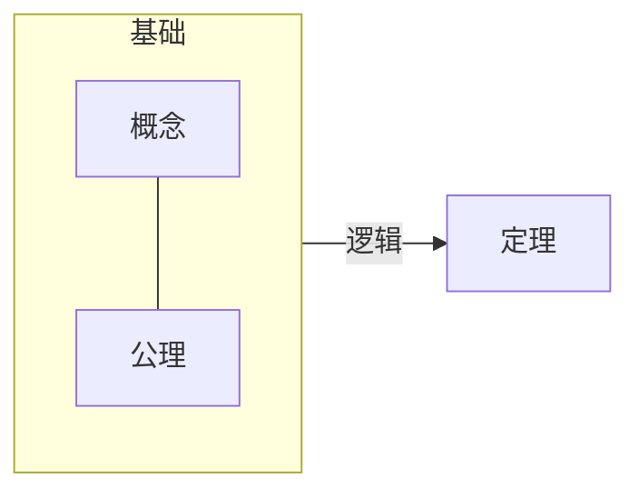
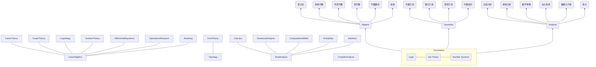

# 框架

## 形式

- 概念定义
    - 集合：集合(set)，关系(relation)，函数(function)，等价(equivalence)。
    - 数系：正数、自然数、整数、小数、实数、虚数。一元数、二元数、四元数、八元数
- 自然逻辑系统：四大定理
    - 同一律：事物只能是其本身。
    - 排中律：对于任何事物而言，在一定条件下的判断都要有明确的“是”或“非”，不存在中间状态。
    - 充足理由律：任何事物都具有其存在的充足理由。
    - 矛盾律：在同一时刻，某个事物不可能在同一方面既是这样又是那样。
- 数学逻辑系统
    - 模型论
    - 证明论
    - 递归论：可计算性理论
    - 集合论：互斥、递推、包含关系（充分必要关系）
    - 其他：独立性问题、大基数、逻辑系统的强度、可计算性层次结构的可简化性、可定义性、稳定性和最小化概念
- 定理

## 内容



- 最底层：逻辑(Logic)、集合理论(Set Theory)、数系统(Number Systems)  
    - 逻辑  
        - 自然逻辑：自然逻辑系统的四大定理
            > 同一律，事物只能是其本身；
            排中律，对于任何事物而言，在一定条件下的判断都要有明确的“是”或“非”，不存在中间状态；
            充足理由律，任何事物都具有其存在的充足理由；
            矛盾律，在同一时刻，某个事物不可能在同一方面既是这样又是那样。  
        
        - 数学逻辑：属于形式逻辑，充分条件、必要条件等等和结论之间的递推关系。下面以三段论为例进行说明，其中的逻辑本质用符号表示就是B⇒A⇒C。
        
            |三段论：	|语言逻辑：	|符号逻辑：|
            |---|---|---|
            |大前提（大多来自公理、定理）	|如果A则C	|A⇒C|
            |小前提（大多来自概念定义）	|因为B属于A	|B⇒A|
            |结论（新定理或新命题产生）	|所以由B可得到C	|B⇒C|

    - 集合理论
        - 概念：集合、元素
        - 集合和元素之间的关系：属于、不属于
        - 集合和集合之间关系：包含、互斥、交叉、相等，和各类条件（充分条件、必要条件、等价条件或者叫充要条件、充分非必要、必要非充分、非必要非充分）之间的联系
        - 集合和集合之间的映射关系：函数、空间变换
    - 数系统
        - 一元
        - 二元
        - 四元
        - 八元
- 中间层：代数(Algebra)、分析(Analysis)两大分支和他们相互交叉形成的各个细分学科。几何(Geometry)、概率论(Probability)等在古典数学时代是和代数并列的，在现代都是建立在代数、分析的基础上。
    - 分析：极限是分析的根基
        - 微积分：微分和积分的关键发展历程是牛顿的古典分析→柯西的极限概念→黎曼积分
        - 实分析：基于实数理论和测度理论的现代分析。黎曼可积的函数空间不是完备的，但是勒贝格可积的函数空间是完备的，一个黎曼可积的函数列收敛到的那个函数不一定是黎曼可积的，但是勒贝格可积的函数列必定收敛到一个勒贝格可积的函数。勒贝格积分是傅立叶变换的基础，傅里叶变换是信号处理等工程的基础；测度理论是现代概率论的基础。
        - 拓扑学：分析从实数轴推广到一般空间，现代分析的抽象基础。
        - 微分几何：流形上的分析，即在拓扑空间上引入微分结构。微分几何的应用比如Machine Learning一些流形算法；再比如建立在微分几何上的李群和李代数属于分析和代数的结合。
    - 代数：代数是从某种具体的运算体系中抽象出一些基本规则，建立一个公理体系，然后在这基础上进行研究，即一个集合再加上一套运算规则，就构成一个代数结构。代数只关心运算规则的演绎，而不管参与运算的对象，基于几条最简单的规则，比如结合律，就能导出非常多的重要结论——这些结论可以应用到一切满足这些简单规则的地方。
        - 线性代数：线性代数最核心的两个概念是向量空间和线性变换。线性变换在线性代数中的地位，和连续函数在分析中的地位，或者同态映射在群论中的地位是一样的，线性变换是保持基础运算（加法和数乘）的映射。其应用比如在Machine Learning中用到的一些变换无论是线性的还是非线性的，都需要线性代数作为基础；再比如分析中的线性运算，微分、积分、傅立叶变换、拉普拉斯变换、还有统计中的均值，都是线性的。
        - 抽象代数：研究有限的离散代数结构（比如有限群和有限域），这部分内容通常用于数论，编码，和整数方程这些地方；另外一个流派是研究连续的代数结构，通常和拓扑与分析联系在一起（比如拓扑群，李群）。
    - 分析和代数的结合
        - 泛函分析：研究的是无限维空间，也就是无限个自由度的问题。普通函数是数集和数集之间的映射，例如求函数最大值时的x是多少（x是一维空间）；泛函是函数集合和函数集合之间的映射，例如求最大化某个目标对应的函数是什么（函数的路径是无限维空间）。
        - 调和分析：研究函数展开成傅立叶级数或傅立叶积分，以及有关这种级数和积分的各种问题。
        - 李群(Lie Group)和李代数(Lie Algebra)：在一定条件下，通过李群和李代数的联系，它让几何变换的结合变成了线性运算，让子群化为线性子空间，这样就为Machine Learning中许多重要的模型和算法的引入到对几何运动的建模创造了必要的条件。  
- 最顶层：建模(Modeling)
    - 数学模型分类——从建模者的认知程度出发
        - 关系明确：方程解析模型
            > 微/积分方程模型：确定系统变量参数，根据变量变动规律建立微元方程和定解条件。
            差分方程模型：离散状态转移
            随机方程模型：引入不确定性，包括马氏链模型、随机微分、随机差分等。
            稳定均衡模型：动态过程的变化规律一般要用微分方程建立的动态模型来描述，但是对于某些实际问题，建模的主要目的并不是要寻求动态过程每个瞬时的性态，而是研究某种意义下稳定状态的特征，特别是当时间充分长以后动态过程的变化趋势。分析这种稳定与不稳定的规律常常不需要求解微分方程，而可以利用微分方程稳定性理论，直接研究达到平衡状态时的稳定性就行了。
            目标规划模型：目标函数+约束
            其他……
        - 关系不明，依赖专家经验：层次分析模型
        - 关系不明，依赖少量样本：灰色系统模型。社会系统、经济系统、农业系统、生态系统等系统内部因素难以辨识或之间关系隐蔽，很难准确了解这类系统的行为特征，因此对其定量描述难度较大，这类系统内部特性部分已知的系统称之为灰色系统。根据具体灰色系统的行为特征数据，充分开发并利用不多的数据中的显信息和隐信息，寻找因素间或因素本身的数学关系。
        - 关系不明，依赖大量样本：统计学习模型。线性回归、线性回归、神经网络、聚类、分类
        - 定义不明：模糊数学模型。适用于定量处理概念和对立概念没有明确界限的模糊问题。模糊和随机的区别——随机是指事件概念本身是含义明确的，发生的概率具有不确定性，而模糊是指事件概念本身是模糊的。实际应用包括模糊分类、模糊相似选择、模糊聚类分析、模糊层次分析、模糊综合评判、模糊神经网络
        - 其他模型：组合模型（多类模型组合成一个综合模型）、集合模型（图论问题）、博弈模型
    - 数学模型分类——从建模的颗粒度出发
        - 宏观粒度建模：对研究对象进行直观建模，以Graphical Model为代表，可对复杂现象进行建模，但大多数这类模型只是重复一些标准的流程，并没有很大的价值。
        - 微观粒度建模：研究对象是由大量“原子”相互约束构成，微观意义下的单个原子运动和宏观意义下的整体分布的变换存在着深刻的联系，因此通过在“原子”粒度上建模，根据原子群的运动发掘研究对象在宏观呈现的规律——也就是直观规律。
            > 如何建立一个稳定并且广泛适用的原子表达
            如何描述一个一般的运动过程
            如何刻画微观运动和宏观变换的联系
    
    <details>
    <summary>现实世界和数学模型</summary>

    ```mermaid
    flowchart BT
    subgraph h["个人"]
        direction RL
        h1("建模<br>(概念模型、数学模型)") --"一般化严谨化动态化量化"---> h2("认知<br>(事实认知、方法认知)")
        h2 --"迭代模型系统的形式、元素、逻辑"---> h1
    end  
    n("现实世界<br>(自然、人)") --"评价模型<br>证伪认知"---> h
    h --"仿真现实：解释过去、预测未来<br>理解现实、制定策略、知行合一"---> n
    ```
    - 现实世界
        - 自然：物质、规律，
        - 自然人：群体层面的社会、政治、法律、军事、经济、文化，个体层面的需求、心理、行为。
    - 个人
        - 认知：事实认知，即现实世界的实际情况的掌握，包括自然规律、自然资源，以及人类行为、个人行为；方法认知，包括归纳演绎、分析综合、历史逻辑、具体抽象，以及具体的理论，自然科学、社会科学、经济学；工农医文娱；
        - 模型世界：概念模型、数学模型

    - 现实世界和数学模型对比

    |现实世界|模型世界|
    |---|---|
    |完整、精确的信息|信息根据模型设定具有选择性：模型设定问题、偏见等导致失真|
    |未知的结构|已知的结构|
    |动态的复杂性|复杂性可以控制|
    |时间延迟|时间可以控制|
    |无法进行受控的实验|实验可以控制|
    |策略实施有偏差|知行合一的理性人|

    - 认知沉淀

        - 目标
            > 模型认知沉淀：模型和现实情况的误差和导致误差的原因、各类模型原理及其适用场景；
            事实认知沉淀：通过已有专业理论形成的概念、模型、机制、结论相关的初步认知，通过观察采样实验等方式获得的一手数据信息，通过购买、交流、网络搜索等各类渠道获得的二手数据信息，通过建立新模型形成的对现实的解释、演变预测等新认知（现象的组成元素、关键元素、元素之间的逻辑关系、关键逻辑关系、元素行为、整体行为）；
            方法认知沉淀：思考工具的沉淀（数学能力沉淀、计算机能力沉淀），研究框架的迭代沉淀，观察现实-形成认知-建立模型-深化认知-形成策略-策略执行-结果评价的全程方法论沉淀，实现目标的策略方法沉淀。
         - 障碍
            > 客观的信息输入障碍：信息输入障碍第一个原因是由于现实世界的动态性、复杂性、不完全受控导致信息源暴露不完全，信息暴露的节点有限甚至完全是黑箱。信息输入障碍第二个原因是信息源暴露后在进行观察采集时产生误差和时滞，由于方法技术等原因观察采集的信息和真实信息之间具有误差。信息输入障碍第三个原因是在信息采集后传输途中出现缺损和错误。
            主观的信息利用障碍：主观的信息利用障碍第一个原因是信息筛选、处理具有主观性，犯了经验主义错误，导致信息遗漏、失真，最终得到的认知也比较片面。主观的信息利用障碍第二个原因是使用了不恰当的理论、模型等研究框架，得到的结论没有反应信息的全部内涵，这样形成的认知沉淀也不可靠。       

    </details>


## 数学资料
### roadmap
1. 逻辑和分析；线代回顾和抽代快速入门
    > Rene Cori, Daniel Lascar, Donald H. Pelletier: Mathematical Logic-A course with exercise
    > 张筑生的《数学分析新讲》+谢惠民的《数学分析习题课讲义》
    > 姚慕生、谢启鸿的绿皮《高等代数学》+白皮习题集《高等代数》，今年年末就出第四版了。[谢启鸿高等代数官方博客](https://www.cnblogs.com/torsor/)
    > 李炯生的《线性代数》写的虽好，但是竞赛风太重，可以参考，现在更推荐在学过一遍抽象代数之后看看gtm135 Steven Roman的《Advanced Linear Algebra》直接从模的角度再学一遍线性代数，比无聊的竞赛风强多了。
    > Artin的Algebra：代数学很经典的一本教材了，涵盖了高代和抽代的内容。


ICM国际数学家大会内容：
1. 逻辑：数学逻辑源于对数学事业中的坚实基础和严谨性的追求，但在非基础问题上也有重要应用。其主流的形成始于 19 世纪后期康托尔通过希尔伯特的基础纲领创建集合论，并在 20 世纪初经由根岑、哥德尔、塔斯基和图灵的工作达到顶峰。当前的主要主题包括独立性问题、大基数、逻辑系统的强度、可计算性层次结构的可简化性、可定义性、稳定性和最小化概念。该主题是数学基础问题、数学内部发展和（包括代数、代数几何和复几何、组合学、计算机科学、数论和分析的各个部分的）应用的丰富共生。最近，同伦型理论也作为一种与拓扑有关的新型证明论而出现。
2. 代数：代数是数学的基础学科，与代数几何、拓扑学、组合学和数论有着特别密切的联系。它的许多传统学科非常活跃（例如，有限群及其表示、代数 K 理论、域算术等），并且在其他主题中与其他领域的相互作用非常重要（例如，代数群、李理论、代数几何、组合群论、范畴论等）。专家组应特别密切注意该领域这两个方面之间的适当平衡。
3. 数论：数学中最古老的分支之一，它刺激了许多其他分支的发展，包括复数和 p 进分析、代数和代数几何......并且它今天仍然蓬勃发展。代数数论的研究集中在伽罗瓦表示和 L 函数的基本性质，一方面与格罗滕迪克关于动形(motive，又译母体)的猜想所设想的代数几何有着深刻的联系，另一方面与李群的表示和自守表示有着深刻的联系（正如朗兰兹猜想所明确要求的）。解析数论，传统上关注素数的分布，近年来经历了巨大的复兴，解决了长期存在的问题，并与组合学和概率建立了新的联系。由于数论问题的具体性质，计算数论也非常活跃，并且与理论计算机科学有着密切的联系。
4. 代数和复数几何：代数、算术和解析几何处于许多数学进展的十字路口。它与代数、数论、拓扑、微分几何和数学物理有着特别密切的联系。这一领域的许多现代发展都深受这些相关领域的影响，并反过来影响它们。在该领域工作所需的工具多种多样，从复分析到有限域和 p进 技术。该主题中的一些基本思想是深刻的，例如动形、模数或从复数到有限域并返回的方法。近年来，在双有理几何、模理论、D-模和等晶理论、丢番图几何、导出范畴的几何研究、枚举几何和动形问题方面取得了许多惊人的进展。
5. 几何：几何在数学的发展中发挥着核心作用，尤其是在 20 世纪末和 21 世纪初。非线性偏微分方程在几何中的应用始于上个世纪，并且仍在继续扩展（例如，辛几何和切触几何中的伪全纯曲线产生新的不变量）。黎曼几何和度量几何传统上是几何学的中心主题，并且在其他领域也有应用（例如，群论、3-流形拓扑、刚性、概率等）。流形上的几何结构（不一定是度量的，例如，射影、仿射和伪黎曼结构）最近取得了重要进展，几何方法在离散群和局部紧群的研究中变得突出。
6. 拓扑：根据使用的方法，该主题分为代数拓扑、微分拓扑和几何拓扑。它以各种形式对许多数学核心领域至关重要，包括几何、算术、分析、代数几何、动力系统和数学物理，其方法被广泛用于越来越多的数学应用领域。近年来，在 3 和 4 流形理论、等变稳定同伦理论（Kervaire 不变量）和模空间研究等一些经典问题上取得了重大进展。与此同时，诸如几何群论、拓扑量子场论和派生代数几何等较新的学科领域也出现了重要的发展，这些发展塑造了拓扑景观。主要主题包括流形理论、同伦理论（包括动形同伦和 K 理论）、运算子（Operad）和高阶范畴、弗洛尔和规范理论、低维流形（包括结理论、模空间、辛流形和切触流形）以及量子场论的各个方面.
7. 李理论和推广：李群和李代数是数学的主轴之一，捕捉了连续对称的概念。它们在各个方向上扩展和推广，例如无限维李代数、赫克代数、量子群或顶点算子代数。它们的结构和表示通常通过 D 模或范畴等价以深层方式相互关联。它们在代数几何、数学物理、调和分析、数论和其他领域有大量应用。李群的结构结果也扩展到局部紧群。另一个重要方向是研究李群的离散子群及其对几何对象的作用。除了其内在的兴趣之外，该领域还发现了与数学物理、几何、数论、遍历理论、动力学甚至计算机科学的联系和应用。
8. 分析：广义上的分析是数学的主要领域之一。本组包括复分析、调和分析（实变量和抽象）、泛函分析、算子代数、几何测度论和高维几何。该主题将定量估计与定性结果相结合，可应用于连续和离散情况。诸如冯·诺依曼代数和C*代数等算子代数的分类和分析与几何群论、描述集论和遍历论等不同的数学领域有着深刻的联系。积分算子（奇异、振荡、势、傅里叶等）和相关对象（如伪微分算子）的分析在偏微分方程、指标理论、几何、数学物理和数论中有许多应用。分析与其他领域（如动力系统、概率、组合学、信号处理和理论计算机科学）之间还有许多富有成效的互动。
9. 动力学：来自共形几何和非线性泛函分析的强大工具促成了一维动力学的令人印象深刻的发展（实、复皆如此）。重整化理论在理解这些动力系统的小尺度结构方面发挥了至关重要的作用。最近，重整化也被用于研究 类Henon映射的二维动力学。与重整化相关的动力学思想也是解决薛定谔算子谱相关问题的基础。混沌动力学、非均匀双曲系统和偏双曲动力学系统也出现了重要的发展。近年来获得了许多在 C 拓扑中鲁棒和通用的动力系统的新特性。在高阶群作用的刚性上得到了一些结果，并且关于齐次空间的动力学思想被成功地用于解决像Littlewood猜想这样的数论问题。在保守动力学领域，使用来自 KAM 理论的分析工具以及来自辛几何的拓扑-分析不变量获得了重要结果。
10. 偏微分方程：偏微分方程 (PDE) 用于模拟极其丰富的科学、概率和几何现象，这些现象受波传播、反应、扩散、色散、平衡、守恒等支配。因此，偏微分方程在科学和工程中无处不在，包括物理科学、生物学、经济学以及最近的社会科学。偏微分方程在数学中的关键作用是通过与其他领域的富有成效的互动来实现的，这些领域包括分析、几何、数学物理、概率、控制、数值分析、科学计算和建模。近年来开发了重要的新工具，以更好地理解非线性偏微分方程。仍然有许多具有挑战性的开放问题推动当前的研究，包括可压缩和不可压缩的欧拉 和 Navier-Stokes 方程的全局行为理论、Yang-Mills 方程和爱因斯坦方程、奇异摄动问题的多尺度分析、变分问题、以及有或没有随机数据的控制和逆问题。
11. 数学物理：数学物理位于数学和物理的交界处。物理学中的想法和问题继续对许多数学领域产生巨大影响，仅举几例，如几何、算子代数、拓扑、概率论和偏微分方程。数学物理学非常广泛，无论是它使用的和贡献的数学，还是通过它处理的物理系统。
12. 概率：在过去的几十年里，概率论对数学的其余部分以及我们社会的重要方面的影响一直在稳步增长。与数学和统计物理学的联系一直非常密切，双方都取得了丰硕的成果。在数学中，与偏微分方程和泛函分析的关系一直很重要。最近，与几何（通过几何分析和几何群论）、共形场论和复分析（通过共形不变模型）、表示论和组合学（通过可积概率）以及数论（通过随机矩阵理论）的亲密交互在增长。
13. 组合学：在整个数学中，离散结构（例如图论、集合系统、拟阵或其他图和组态Configuration）表现出高度的组合复杂性。无论是作为本身感兴趣的对象，还是作为代数、几何、分析或理论计算机科学中的重要对象的模型。组合学的主题设法解决与这些结构有关的许多问题，从枚举问题（例如计算存在多少特定大小的对象）到极端问题（例如与这些对象相关的各种统计数据的最大值和最小值），再到结构问题（关心给定组合结构类别中的一般对象的性质），以及更多的代数问题，例如如何在表示论、交换代数或代数几何等数学领域解释这些对象。现代组合学使用来自数学中（概率、分析、拓扑、代数等）的技术，相反，它正在成为许多不同学科（计算机科学、数论、表示论、逻辑等）新进展中越来越重要的组成部分。
14. 计算机科学数学：计算理论负责奠定所有计算系统的数学基础。它已经发展出并继续发展支持计算机科学和技术指数级扩展的理论，为它们提供必要的建模、算法以及分析它们扩展的资源的工具。在许多理论中，这些理论包括描述中列出的领域。这项工作创建了一个与许多数学领域相互作用的网络。使数学主体成为算法的基本元问题（例如，用有效的程序替换存在性定理以找到这些对象）已经导致与几乎所有数学领域的更多合作，极大地丰富了许多领域，解开了更精细的结构，解决了重要的问题，并提出新的挑战。使（自然和社会）科学算法化的类似元问题，即用计算复杂性方法将自然（通常是物理）过程作为信息过程研究，正在与大多数科学建立互利合作。这种观点已经引发了许多合作、正式模型、新见解（例如，将难以处理的结果考虑到建模中）、结果和问题，并且将来可能会引发更多。
15. 数值分析和科学计算：数学模型的使用在科学中有着悠久的传统。每个模型都需要用计算机模拟一个数值对应物，并且通常构建这样的数值模型是一个挑战，它既有数学方面也有实践方面。例如，数值不稳定性可能会大大降低解的质量，需要被理解和得到解决，或者全尺度数值模型的模拟可能不可行，因此需要简化技术。事实上，为复杂问题设计有效的数值方法需要使用复杂的数学工具，以及对手头问题和模拟中涉及的许多实际方面的深刻理解。
16. 控制论和最优化：控制和最优化具有很强的数学基础，在许多工程学科中也发挥着重要作用。最优化一直为许多数学分支提供动力，从微积分开始。控制论提供了主题的最理论性方面（动力系统的几何理论）和更多的数值、实际方面（数值优化）之间的联系。在现代环境中，一系列学科正在利用和发展这些领域。应用示例包括装船自动化系统、机翼形状优化、石油生产逆问题的解。传统行业对认证、虚拟实验的要求越来越高，因此最优化仍然是一个非常活跃的话题。此外，还出现了新的应用领域：生命科学（医学、力学、计算机辅助手术）、智能材料、分子进化的激光控制（分子电子学）、大型航线调度和运营问题以及现代搜索引擎。
17. 统计和数据分析：过去几十年见证了统计和数据科学对我们社会和日常生活的基本方面的加速影响。重要的算法开发、可扩展的方法、数值实验以及数据的实际验证和非参数建模，在大多数行业和服务业以及物理科学、医学、工程、社会科学和艺术领域都变得不可或缺。广泛的数学领域已被证明可以为理解和利用数据提供见解，包括高维统计、最优化、信息论、理论计算机科学、调和分析、代数、几何、随机分析和概率。
18. 随机和微分建模：牛顿，然后是伊藤，引进了将我们的社会建模为微分系统的关键工具——他们的工作产生了非凡的影响。该领域技术丰富性和建模多样性继续以相当大的速度发展，对我们社会的重要性也在不断提高。此外，大多数在没有严格数学方法的情况下发展起来的重要科学领域，例如生物学和医学，如今正经历着对数学理解的巨大需求，并为微分系统提供了数学挑战的主要来源。事实上，就 MathSciNet 中的出版物而言，该领域是最大的内容之一。  


# 数学研究

## AI与数学研究