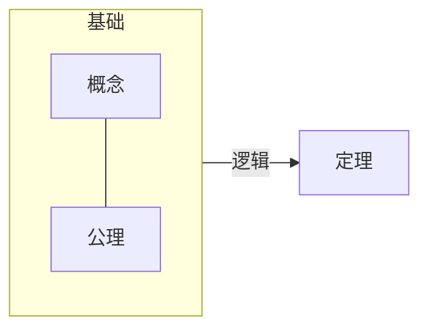
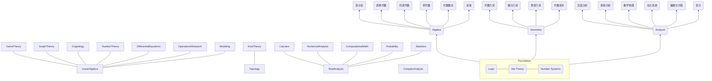

# 杂项
超函数：元函数作用一次、作用多次、作用不定次、作用无限次。

反例：eierstrass函数，对分析学产生了重要的影响；Russell即是构造了一个在概括公理下的“反例”。

# 框架

## 形式

- 概念
    - 集合：集合(set)，关系(relation)，函数(function)，等价(equivalence)。
    - 数系：正数、自然数、整数、小数、实数、虚数。一元数、二元数、四元数、八元数
- 自然逻辑系统：四大定理
    - 同一律：事物只能是其本身。
    - 排中律：对于任何事物而言，在一定条件下的判断都要有明确的“是”或“非”，不存在中间状态。
    - 充足理由律：任何事物都具有其存在的充足理由。
    - 矛盾律：在同一时刻，某个事物不可能在同一方面既是这样又是那样。
- 数学逻辑系统
    - 模型论
    - 证明论
    - 递归论：可计算性理论
    - 集合论：互斥、递推、包含关系（充分必要关系）
    - 其他：独立性问题、大基数、逻辑系统的强度、可计算性层次结构的可简化性、可定义性、稳定性和最小化概念
- 定理

## 内容



- 最底层：逻辑(Logic)、集合理论(Set Theory)、数系统(Number Systems)  
    - 逻辑  
        - 自然逻辑：自然逻辑系统的四大定理
            > 同一律，事物只能是其本身；
            排中律，对于任何事物而言，在一定条件下的判断都要有明确的“是”或“非”，不存在中间状态；
            充足理由律，任何事物都具有其存在的充足理由；
            矛盾律，在同一时刻，某个事物不可能在同一方面既是这样又是那样。  
        
        - 数学逻辑：属于形式逻辑，充分条件、必要条件等等和结论之间的递推关系。下面以三段论为例进行说明，其中的逻辑本质用符号表示就是B⇒A⇒C。
        
            |三段论：	|语言逻辑：	|符号逻辑：|
            |---|---|---|
            |大前提（大多来自公理、定理）	|如果A则C	|A⇒C|
            |小前提（大多来自概念定义）	|因为B属于A	|B⇒A|
            |结论（新定理或新命题产生）	|所以由B可得到C	|B⇒C|

    - 集合理论
        - 概念：集合、元素
        - 集合和元素之间的关系：属于、不属于
        - 集合和集合之间关系：包含、互斥、交叉、相等，和各类条件（充分条件、必要条件、等价条件或者叫充要条件、充分非必要、必要非充分、非必要非充分）之间的联系
        - 集合和集合之间的映射关系：函数、空间变换
    - 数系统
        - 一元
        - 二元
        - 四元
        - 八元
- 中间层：代数(Algebra)、分析(Analysis)两大分支和他们相互交叉形成的各个细分学科。几何(Geometry)、概率论(Probability)等在古典数学时代是和代数并列的，在现代都是建立在代数、分析的基础上。
    - 分析：极限是分析的根基
        - 微积分：微分和积分的关键发展历程是牛顿的古典分析→柯西的极限概念→黎曼积分
        - 实分析：基于实数理论和测度理论的现代分析。黎曼可积的函数空间不是完备的，但是勒贝格可积的函数空间是完备的，一个黎曼可积的函数列收敛到的那个函数不一定是黎曼可积的，但是勒贝格可积的函数列必定收敛到一个勒贝格可积的函数。勒贝格积分是傅立叶变换的基础，傅里叶变换是信号处理等工程的基础；测度理论是现代概率论的基础。
        - 拓扑学：分析从实数轴推广到一般空间，现代分析的抽象基础。
        - 微分几何：流形上的分析，即在拓扑空间上引入微分结构。微分几何的应用比如Machine Learning一些流形算法；再比如建立在微分几何上的李群和李代数属于分析和代数的结合。
    - 代数：代数是从某种具体的运算体系中抽象出一些基本规则，建立一个公理体系，然后在这基础上进行研究，即一个集合再加上一套运算规则，就构成一个代数结构。代数只关心运算规则的演绎，而不管参与运算的对象，基于几条最简单的规则，比如结合律，就能导出非常多的重要结论——这些结论可以应用到一切满足这些简单规则的地方。
        - 线性代数：线性代数最核心的两个概念是向量空间和线性变换。线性变换在线性代数中的地位，和连续函数在分析中的地位，或者同态映射在群论中的地位是一样的，线性变换是保持基础运算（加法和数乘）的映射。其应用比如在Machine Learning中用到的一些变换无论是线性的还是非线性的，都需要线性代数作为基础；再比如分析中的线性运算，微分、积分、傅立叶变换、拉普拉斯变换、还有统计中的均值，都是线性的。
        - 抽象代数：研究有限的离散代数结构（比如有限群和有限域），这部分内容通常用于数论，编码，和整数方程这些地方；另外一个流派是研究连续的代数结构，通常和拓扑与分析联系在一起（比如拓扑群，李群）。
    - 分析和代数的结合
        - 泛函分析：研究的是无限维空间，也就是无限个自由度的问题。普通函数是数集和数集之间的映射，例如求函数最大值时的x是多少（x是一维空间）；泛函是函数集合和函数集合之间的映射，例如求最大化某个目标对应的函数是什么（函数的路径是无限维空间）。
        - 调和分析：研究函数展开成傅立叶级数或傅立叶积分，以及有关这种级数和积分的各种问题。
        - 李群(Lie Group)和李代数(Lie Algebra)：在一定条件下，通过李群和李代数的联系，它让几何变换的结合变成了线性运算，让子群化为线性子空间，这样就为Machine Learning中许多重要的模型和算法的引入到对几何运动的建模创造了必要的条件。  
- 最顶层：建模(Modeling)
    - 数学模型分类——从建模者的认知程度出发
        - 关系明确：方程解析模型
            > 微/积分方程模型：确定系统变量参数，根据变量变动规律建立微元方程和定解条件。
            差分方程模型：离散状态转移
            随机方程模型：引入不确定性，包括马氏链模型、随机微分、随机差分等。
            稳定均衡模型：动态过程的变化规律一般要用微分方程建立的动态模型来描述，但是对于某些实际问题，建模的主要目的并不是要寻求动态过程每个瞬时的性态，而是研究某种意义下稳定状态的特征，特别是当时间充分长以后动态过程的变化趋势。分析这种稳定与不稳定的规律常常不需要求解微分方程，而可以利用微分方程稳定性理论，直接研究达到平衡状态时的稳定性就行了。
            目标规划模型：目标函数+约束
            其他……
        - 关系不明，依赖专家经验：层次分析模型
        - 关系不明，依赖少量样本：灰色系统模型。社会系统、经济系统、农业系统、生态系统等系统内部因素难以辨识或之间关系隐蔽，很难准确了解这类系统的行为特征，因此对其定量描述难度较大，这类系统内部特性部分已知的系统称之为灰色系统。根据具体灰色系统的行为特征数据，充分开发并利用不多的数据中的显信息和隐信息，寻找因素间或因素本身的数学关系。
        - 关系不明，依赖大量样本：统计学习模型。线性回归、线性回归、神经网络、聚类、分类
        - 定义不明：模糊数学模型。适用于定量处理概念和对立概念没有明确界限的模糊问题。模糊和随机的区别——随机是指事件概念本身是含义明确的，发生的概率具有不确定性，而模糊是指事件概念本身是模糊的。实际应用包括模糊分类、模糊相似选择、模糊聚类分析、模糊层次分析、模糊综合评判、模糊神经网络
        - 其他模型：组合模型（多类模型组合成一个综合模型）、集合模型（图论问题）、博弈模型
    - 数学模型分类——从建模的颗粒度出发
        - 宏观粒度建模：对研究对象进行直观建模，以Graphical Model为代表，可对复杂现象进行建模，但大多数这类模型只是重复一些标准的流程，并没有很大的价值。
        - 微观粒度建模：研究对象是由大量“原子”相互约束构成，微观意义下的单个原子运动和宏观意义下的整体分布的变换存在着深刻的联系，因此通过在“原子”粒度上建模，根据原子群的运动发掘研究对象在宏观呈现的规律——也就是直观规律。
            > 如何建立一个稳定并且广泛适用的原子表达
            如何描述一个一般的运动过程
            如何刻画微观运动和宏观变换的联系
    
    <details>
    <summary>现实世界和数学模型</summary>

    ```mermaid
    flowchart BT
    subgraph h["个人"]
        direction RL
        h1("建模<br>(概念模型、数学模型)") --"一般化严谨化动态化量化"---> h2("认知<br>(事实认知、方法认知)")
        h2 --"迭代模型系统的形式、元素、逻辑"---> h1
    end  
    n("现实世界<br>(自然、人)") --"评价模型<br>证伪认知"---> h
    h --"仿真现实：解释过去、预测未来<br>理解现实、制定策略、知行合一"---> n
    ```
    - 现实世界
        - 自然：物质、规律，
        - 自然人：群体层面的社会、政治、法律、军事、经济、文化，个体层面的需求、心理、行为。
    - 个人
        - 认知：事实认知，即现实世界的实际情况的掌握，包括自然规律、自然资源，以及人类行为、个人行为；方法认知，包括归纳演绎、分析综合、历史逻辑、具体抽象，以及具体的理论，自然科学、社会科学、经济学；工农医文娱；
        - 模型世界：概念模型、数学模型

    - 现实世界和数学模型对比

    |现实世界|模型世界|
    |---|---|
    |完整、精确的信息|信息根据模型设定具有选择性：模型设定问题、偏见等导致失真|
    |未知的结构|已知的结构|
    |动态的复杂性|复杂性可以控制|
    |时间延迟|时间可以控制|
    |无法进行受控的实验|实验可以控制|
    |策略实施有偏差|知行合一的理性人|

    - 认知沉淀

        - 目标
            > 模型认知沉淀：模型和现实情况的误差和导致误差的原因、各类模型原理及其适用场景；
            事实认知沉淀：通过已有专业理论形成的概念、模型、机制、结论相关的初步认知，通过观察采样实验等方式获得的一手数据信息，通过购买、交流、网络搜索等各类渠道获得的二手数据信息，通过建立新模型形成的对现实的解释、演变预测等新认知（现象的组成元素、关键元素、元素之间的逻辑关系、关键逻辑关系、元素行为、整体行为）；
            方法认知沉淀：思考工具的沉淀（数学能力沉淀、计算机能力沉淀），研究框架的迭代沉淀，观察现实-形成认知-建立模型-深化认知-形成策略-策略执行-结果评价的全程方法论沉淀，实现目标的策略方法沉淀。
         - 障碍
            > 客观的信息输入障碍：信息输入障碍第一个原因是由于现实世界的动态性、复杂性、不完全受控导致信息源暴露不完全，信息暴露的节点有限甚至完全是黑箱。信息输入障碍第二个原因是信息源暴露后在进行观察采集时产生误差和时滞，由于方法技术等原因观察采集的信息和真实信息之间具有误差。信息输入障碍第三个原因是在信息采集后传输途中出现缺损和错误。
            主观的信息利用障碍：主观的信息利用障碍第一个原因是信息筛选、处理具有主观性，犯了经验主义错误，导致信息遗漏、失真，最终得到的认知也比较片面。主观的信息利用障碍第二个原因是使用了不恰当的理论、模型等研究框架，得到的结论没有反应信息的全部内涵，这样形成的认知沉淀也不可靠。       

    </details>


## 数学资料
### roadmap
1. 逻辑和分析；线代回顾和抽代快速入门
    > Rene Cori, Daniel Lascar, Donald H. Pelletier: Mathematical Logic-A course with exercise
    > 张筑生的《数学分析新讲》+谢惠民的《数学分析习题课讲义》
    > 姚慕生、谢启鸿的绿皮《高等代数学》+白皮习题集《高等代数》，今年年末就出第四版了。[谢启鸿高等代数官方博客](https://www.cnblogs.com/torsor/)
    > 李炯生的《线性代数》写的虽好，但是竞赛风太重，可以参考，现在更推荐在学过一遍抽象代数之后看看gtm135 Steven Roman的《Advanced Linear Algebra》直接从模的角度再学一遍线性代数，比无聊的竞赛风强多了。
    > Artin的Algebra：代数学很经典的一本教材了，涵盖了高代和抽代的内容。


ICM国际数学家大会内容：
1. 逻辑：数学逻辑源于对数学事业中的坚实基础和严谨性的追求，但在非基础问题上也有重要应用。其主流的形成始于 19 世纪后期康托尔通过希尔伯特的基础纲领创建集合论，并在 20 世纪初经由根岑、哥德尔、塔斯基和图灵的工作达到顶峰。当前的主要主题包括独立性问题、大基数、逻辑系统的强度、可计算性层次结构的可简化性、可定义性、稳定性和最小化概念。该主题是数学基础问题、数学内部发展和（包括代数、代数几何和复几何、组合学、计算机科学、数论和分析的各个部分的）应用的丰富共生。最近，同伦型理论也作为一种与拓扑有关的新型证明论而出现。
2. 代数：代数是数学的基础学科，与代数几何、拓扑学、组合学和数论有着特别密切的联系。它的许多传统学科非常活跃（例如，有限群及其表示、代数 K 理论、域算术等），并且在其他主题中与其他领域的相互作用非常重要（例如，代数群、李理论、代数几何、组合群论、范畴论等）。专家组应特别密切注意该领域这两个方面之间的适当平衡。
3. 数论：数学中最古老的分支之一，它刺激了许多其他分支的发展，包括复数和 p 进分析、代数和代数几何......并且它今天仍然蓬勃发展。代数数论的研究集中在伽罗瓦表示和 L 函数的基本性质，一方面与格罗滕迪克关于动形(motive，又译母体)的猜想所设想的代数几何有着深刻的联系，另一方面与李群的表示和自守表示有着深刻的联系（正如朗兰兹猜想所明确要求的）。解析数论，传统上关注素数的分布，近年来经历了巨大的复兴，解决了长期存在的问题，并与组合学和概率建立了新的联系。由于数论问题的具体性质，计算数论也非常活跃，并且与理论计算机科学有着密切的联系。
4. 代数和复数几何：代数、算术和解析几何处于许多数学进展的十字路口。它与代数、数论、拓扑、微分几何和数学物理有着特别密切的联系。这一领域的许多现代发展都深受这些相关领域的影响，并反过来影响它们。在该领域工作所需的工具多种多样，从复分析到有限域和 p进 技术。该主题中的一些基本思想是深刻的，例如动形、模数或从复数到有限域并返回的方法。近年来，在双有理几何、模理论、D-模和等晶理论、丢番图几何、导出范畴的几何研究、枚举几何和动形问题方面取得了许多惊人的进展。
5. 几何：几何在数学的发展中发挥着核心作用，尤其是在 20 世纪末和 21 世纪初。非线性偏微分方程在几何中的应用始于上个世纪，并且仍在继续扩展（例如，辛几何和切触几何中的伪全纯曲线产生新的不变量）。黎曼几何和度量几何传统上是几何学的中心主题，并且在其他领域也有应用（例如，群论、3-流形拓扑、刚性、概率等）。流形上的几何结构（不一定是度量的，例如，射影、仿射和伪黎曼结构）最近取得了重要进展，几何方法在离散群和局部紧群的研究中变得突出。
6. 拓扑：根据使用的方法，该主题分为代数拓扑、微分拓扑和几何拓扑。它以各种形式对许多数学核心领域至关重要，包括几何、算术、分析、代数几何、动力系统和数学物理，其方法被广泛用于越来越多的数学应用领域。近年来，在 3 和 4 流形理论、等变稳定同伦理论（Kervaire 不变量）和模空间研究等一些经典问题上取得了重大进展。与此同时，诸如几何群论、拓扑量子场论和派生代数几何等较新的学科领域也出现了重要的发展，这些发展塑造了拓扑景观。主要主题包括流形理论、同伦理论（包括动形同伦和 K 理论）、运算子（Operad）和高阶范畴、弗洛尔和规范理论、低维流形（包括结理论、模空间、辛流形和切触流形）以及量子场论的各个方面.
7. 李理论和推广：李群和李代数是数学的主轴之一，捕捉了连续对称的概念。它们在各个方向上扩展和推广，例如无限维李代数、赫克代数、量子群或顶点算子代数。它们的结构和表示通常通过 D 模或范畴等价以深层方式相互关联。它们在代数几何、数学物理、调和分析、数论和其他领域有大量应用。李群的结构结果也扩展到局部紧群。另一个重要方向是研究李群的离散子群及其对几何对象的作用。除了其内在的兴趣之外，该领域还发现了与数学物理、几何、数论、遍历理论、动力学甚至计算机科学的联系和应用。
8. 分析：广义上的分析是数学的主要领域之一。本组包括复分析、调和分析（实变量和抽象）、泛函分析、算子代数、几何测度论和高维几何。该主题将定量估计与定性结果相结合，可应用于连续和离散情况。诸如冯·诺依曼代数和C*代数等算子代数的分类和分析与几何群论、描述集论和遍历论等不同的数学领域有着深刻的联系。积分算子（奇异、振荡、势、傅里叶等）和相关对象（如伪微分算子）的分析在偏微分方程、指标理论、几何、数学物理和数论中有许多应用。分析与其他领域（如动力系统、概率、组合学、信号处理和理论计算机科学）之间还有许多富有成效的互动。
9. 动力学：来自共形几何和非线性泛函分析的强大工具促成了一维动力学的令人印象深刻的发展（实、复皆如此）。重整化理论在理解这些动力系统的小尺度结构方面发挥了至关重要的作用。最近，重整化也被用于研究 类Henon映射的二维动力学。与重整化相关的动力学思想也是解决薛定谔算子谱相关问题的基础。混沌动力学、非均匀双曲系统和偏双曲动力学系统也出现了重要的发展。近年来获得了许多在 C 拓扑中鲁棒和通用的动力系统的新特性。在高阶群作用的刚性上得到了一些结果，并且关于齐次空间的动力学思想被成功地用于解决像Littlewood猜想这样的数论问题。在保守动力学领域，使用来自 KAM 理论的分析工具以及来自辛几何的拓扑-分析不变量获得了重要结果。
10. 偏微分方程：偏微分方程 (PDE) 用于模拟极其丰富的科学、概率和几何现象，这些现象受波传播、反应、扩散、色散、平衡、守恒等支配。因此，偏微分方程在科学和工程中无处不在，包括物理科学、生物学、经济学以及最近的社会科学。偏微分方程在数学中的关键作用是通过与其他领域的富有成效的互动来实现的，这些领域包括分析、几何、数学物理、概率、控制、数值分析、科学计算和建模。近年来开发了重要的新工具，以更好地理解非线性偏微分方程。仍然有许多具有挑战性的开放问题推动当前的研究，包括可压缩和不可压缩的欧拉 和 Navier-Stokes 方程的全局行为理论、Yang-Mills 方程和爱因斯坦方程、奇异摄动问题的多尺度分析、变分问题、以及有或没有随机数据的控制和逆问题。
11. 数学物理：数学物理位于数学和物理的交界处。物理学中的想法和问题继续对许多数学领域产生巨大影响，仅举几例，如几何、算子代数、拓扑、概率论和偏微分方程。数学物理学非常广泛，无论是它使用的和贡献的数学，还是通过它处理的物理系统。
12. 概率：在过去的几十年里，概率论对数学的其余部分以及我们社会的重要方面的影响一直在稳步增长。与数学和统计物理学的联系一直非常密切，双方都取得了丰硕的成果。在数学中，与偏微分方程和泛函分析的关系一直很重要。最近，与几何（通过几何分析和几何群论）、共形场论和复分析（通过共形不变模型）、表示论和组合学（通过可积概率）以及数论（通过随机矩阵理论）的亲密交互在增长。
13. 组合学：在整个数学中，离散结构（例如图论、集合系统、拟阵或其他图和组态Configuration）表现出高度的组合复杂性。无论是作为本身感兴趣的对象，还是作为代数、几何、分析或理论计算机科学中的重要对象的模型。组合学的主题设法解决与这些结构有关的许多问题，从枚举问题（例如计算存在多少特定大小的对象）到极端问题（例如与这些对象相关的各种统计数据的最大值和最小值），再到结构问题（关心给定组合结构类别中的一般对象的性质），以及更多的代数问题，例如如何在表示论、交换代数或代数几何等数学领域解释这些对象。现代组合学使用来自数学中（概率、分析、拓扑、代数等）的技术，相反，它正在成为许多不同学科（计算机科学、数论、表示论、逻辑等）新进展中越来越重要的组成部分。
14. 计算机科学数学：计算理论负责奠定所有计算系统的数学基础。它已经发展出并继续发展支持计算机科学和技术指数级扩展的理论，为它们提供必要的建模、算法以及分析它们扩展的资源的工具。在许多理论中，这些理论包括描述中列出的领域。这项工作创建了一个与许多数学领域相互作用的网络。使数学主体成为算法的基本元问题（例如，用有效的程序替换存在性定理以找到这些对象）已经导致与几乎所有数学领域的更多合作，极大地丰富了许多领域，解开了更精细的结构，解决了重要的问题，并提出新的挑战。使（自然和社会）科学算法化的类似元问题，即用计算复杂性方法将自然（通常是物理）过程作为信息过程研究，正在与大多数科学建立互利合作。这种观点已经引发了许多合作、正式模型、新见解（例如，将难以处理的结果考虑到建模中）、结果和问题，并且将来可能会引发更多。
15. 数值分析和科学计算：数学模型的使用在科学中有着悠久的传统。每个模型都需要用计算机模拟一个数值对应物，并且通常构建这样的数值模型是一个挑战，它既有数学方面也有实践方面。例如，数值不稳定性可能会大大降低解的质量，需要被理解和得到解决，或者全尺度数值模型的模拟可能不可行，因此需要简化技术。事实上，为复杂问题设计有效的数值方法需要使用复杂的数学工具，以及对手头问题和模拟中涉及的许多实际方面的深刻理解。
16. 控制论和最优化：控制和最优化具有很强的数学基础，在许多工程学科中也发挥着重要作用。最优化一直为许多数学分支提供动力，从微积分开始。控制论提供了主题的最理论性方面（动力系统的几何理论）和更多的数值、实际方面（数值优化）之间的联系。在现代环境中，一系列学科正在利用和发展这些领域。应用示例包括装船自动化系统、机翼形状优化、石油生产逆问题的解。传统行业对认证、虚拟实验的要求越来越高，因此最优化仍然是一个非常活跃的话题。此外，还出现了新的应用领域：生命科学（医学、力学、计算机辅助手术）、智能材料、分子进化的激光控制（分子电子学）、大型航线调度和运营问题以及现代搜索引擎。
17. 统计和数据分析：过去几十年见证了统计和数据科学对我们社会和日常生活的基本方面的加速影响。重要的算法开发、可扩展的方法、数值实验以及数据的实际验证和非参数建模，在大多数行业和服务业以及物理科学、医学、工程、社会科学和艺术领域都变得不可或缺。广泛的数学领域已被证明可以为理解和利用数据提供见解，包括高维统计、最优化、信息论、理论计算机科学、调和分析、代数、几何、随机分析和概率。
18. 随机和微分建模：牛顿，然后是伊藤，引进了将我们的社会建模为微分系统的关键工具——他们的工作产生了非凡的影响。该领域技术丰富性和建模多样性继续以相当大的速度发展，对我们社会的重要性也在不断提高。此外，大多数在没有严格数学方法的情况下发展起来的重要科学领域，例如生物学和医学，如今正经历着对数学理解的巨大需求，并为微分系统提供了数学挑战的主要来源。事实上，就 MathSciNet 中的出版物而言，该领域是最大的内容之一。
19. 


# 数学基础
## 初等数学
### 技巧
- 积和转换：取对、因式分解
- 变元转换
    - 同构待定系数：$例如x=k_1u\pm k_2, k_1为待定常数，u为换元，k_2为u的函数$
    - 
    - 


### 不等式
- 均值不等式
    > $$
    \begin{aligned}
    & \forall x_1,x_2,\dots,x_n \in \reals \\
    & \frac{1}{\frac{1}{x_1}+\frac{1}{x_2}+\dots+\frac{1}{x_n}}<\sqrt[n]{x_1x_2 \dots x_n}<\frac{x_1+x_2+\dots +x_n}{n}
    \end{aligned}
    $$
- 其他不等式
    > $$
    \begin{aligned}
    & 柯西不等式 \rarr 赫尔德不等式  \\
    & 闵可夫斯基不等式  \\
    & 贝努利不等式  \\
    & 契比雪夫不等式  \\
    & 排序不等式  \\
    & 绝对值不等式  \\
    & 琴生不等式  
    \end{aligned}
    $$
- 平面几何
    - 艾尔多斯—莫迪尔不等式

## 逻辑
### 基本概念
- 哥德尔不完备定理：对给定公理体系有限的系统
    - 完备性：任何形式系统都不能完全刻画数学理论，总有某些问题从形式系统的公理出发不能解答。
    - 自洽性：任一自洽的形式系统均无法证明其本身的自洽性
    - 可决性：否定自指无法判定结果(例如物理世界中一般体系下谱隙的有无不可判定，即使完美地描述了2个粒子之间的微观相互作用，通常也不足以推断宏观性质，会面临图灵机停机问题)
    > 命题真伪_GYQ：可能命题真实发生时为真命题，可能命题未发生或不可能命题为否命题。自洽性、完备性、可决性？有限公理不能描述全部现实，那么给定有限现实，最小公里体系是什么？
- 类：令Wi为一超穷基数域，f为定义在Wi上的一个性质，那么所有符合f的对象u构成一个“类”。类的问题：
    - 是不是C中的所有对象u都具有性质f？特别是，C本身具有性质f吗？（同一性判定）
    - 是不是C中的所有对象u，都有f(u)或者﹁f(u)成立吗？（完备性判定）
    - 是不是C中的所有对象u，都有f(u)和﹁f(u)不能同时成立吗？（一致性判定）
- 集合
    - 基本符号
        - 定义："=:"，如果一个表达式或一系列操作无歧义地确定了一个数学对象, 与一切辅助资料的选取无关, 则称该对象为 “良好定义”或 “确切定义” 的, 简称良定.
        - 集合内操作：$属于\in、等价\sim、商集S/\sim$
            > $等价：\forall n\ge 1, 集合X上的n元关系R是X^n=X\times X \cdots \times X的一个子集。例如二元关系xRy表示(x,y)\in R。满足以下性质的 (二元) 关系 ∼ 称作等价关系:$ 
            > > $反身性 x ∼ x \\
            对称性 x ∼ y \Rarr y ∼ x \\
            传递性 (x ∼ y) ∧ (y ∼ z) \Rarr (x ∼ z)$
            
            > $[x]:= \{y\in X:y\sim x\} \\
            X/\sim:=\{[x]:x\in X\}$
        - 集合间操作：$包含\sub、交\cap、并\cup、差\setminus、积\times、积\prod、无交并\sqcup、元素个数或者基数|S|$
        - 映射：$集合间映射f:A\rarr B、元素间映射f:a\mapsto b、单射\hookrightarrow、满射\twoheadrightarrow、双射\xleftrightarrow{1:1}、同构\simeq、f的像im(f)、f的原像f^{-1}(b)$、集合S到自身的恒等映射$\mathrm{id}_S$
        - $X^Y:=\{f:Y\xrightarrow{f} X\}$
    - 序结构
        -  偏序集意指资料 (P, ≤), 其中 P 是集合而 ≤ 是 P 上的二元关系 (偏序), 满足于。(仅满足反身性与传递性的结构称为预序集)
            > $反身性：\forall x\in P,x\le x \\
            传递性：(x\le y)\land(y\le z)\Rarr x\le z \\
            反称性：(x\le y)\land(y\le x)\Rarr x=y$
        - 确界：对于偏序集 P, 根据反称性, 其子集 P' 的上确界或下确界若存在则是唯一的, 分别记为 sup P' 和 inf P'.
        - 偏序集 P, Q 之间的同构$\phi: 其中\phi:P\rarr Q是双射且\phi,\phi^{-1}皆保序$
        - 全序集：若偏序集 P 中的任一对元素 x, y 皆可比大小 (即: 或者 x ≤ y, 或者 y ≤ x),则称 P 为全序集. 全序集又称作线序集或链.
        - 良序集：每个全序集 P 的非空子集都有极小元.
        - 序数：如果一个集合 α 的每个元素都是 α 的子集 (换言之, α ⊂ P(α)), 则称 α 为传递的. 若传递集 α 对于 $x<y\xLeftrightarrow{定义}x\in y$ 成为良序集, 则称 α 为序数.
        - On：序数构成的类。
            > 对序数定义 β < α 当且仅当 β ∈ α, 则这定义了 On 上的一个全序, 而且对任意序数 α 都有 α = {β : β < α}.
            若 C 是一个由序数构成的类, C $\neq$ ∅, 则 inf C := $\cap$C 也是序数, 而且 inf C ∈ C; 我们有 α $\sqcup$ {α} = inf{β : β > α}.
            若 S 是一个由序数构成的集合, S $\neq$ ∅, 则 sup S := $\cup$ S 也是序数.
        - 后继：给定序数 α, 置 α + 1 := α $\sqcup$ {α} > α, 称为 α 的后继; 它是大于 α 的最小序数. 若α 不是任何序数的后继, 则不难看出 α = sup{β : β < α}, 这样的 α 称为极限序数.
        - 极限序数：若 α 不是任何序数的后继, 则不难看出 α = sup{β : β < α}, 这样的 α 称为极限序数. 约定空 sup 为 ∅ 使得 “零序数” ∅ 是极限序数.
    - 基数：描述集合大小的一种标杆
        - 等势：若两集合 X, Y 之间存在双射 φ : X → Y , 则称 X, Y 等势.
    - ZFC公理: ZFC处理的所有对象x, y等都为集合; 特别地, 集合的元素本身也是一个集合.
        - A.1 外延公理: 若两集合有相同元素, 则两者相等.
            > 空集 ∅ 的形式定义: $\{u\in X: u\neq u \}$, 其中 X 是任意集合, ∅ 无关 X 的选取, 前提是集合X确实存在. 
        - A.2 配对公理: 对任意 x, y, 存在集合 {x, y}, 其元素恰好是 x 与 y.
            > 有序对 (x, y) 的概念可用配对公理来实作: (x, y) := {{x}, {x, y}}, 由此定义积集 X × Y := {(x, y) : x ∈ X, y ∈ Y }.
        - A.3 分离公理模式: 设 P 为关于集合的一个性质, 并以 P(u) 表示集合 u 满足性质 P, 则对任意集合 X 存在集合 Y = {u ∈ X : P(u)}.
        - A.4 并集公理: 对任意集合 X, 存在相应的并集$\cup X:= \{u : ∃v ∈ X 使得 u ∈ v\}$. 公理中的 X 通常视作一族集合, $\cup X$也相应地写成$\cup_{v\in X}v$.
        - A.5 幂集公理: 对任意集合 X, 其子集构成一集合 P(X) := {u : u ⊂ X}.
        - A.6 无穷公理: 存在无穷集, $\exist x[(\empty\in x)\land \forall y\in x(y\cup\{y\}\in x)]$.
        - A.7 替换公理模式: 设 F 为以一个集合 X 为定义域的函数, 则存在集合 F(X) ={F(x) : x ∈ X}.
            > 分离和替换公理模式里的性质 P 和函数 F 并非集合论意义下的寻常定义, 故无循环论证之虞, 它们实际是由一阶逻辑的合式公式定义的: 以函数$x\mapsto y$为例, 这可以诠释为一阶逻辑中带有两个自由变元 x, y 的合式公式 ϕ, 适合于 ∀x ∃!y ϕ(x, y). 由于对每个 P 或 F 都产生一条相应的公理, 它们被称作公理模式.
        - A.8 正则公理: 任意非空集都含有一个对从属关系 ∈ 极小的元素.
            > 正则公理的一个重要推论是对于任意集合 x, 不存在无穷的从属链$x\owns x_1\owns x_2\owns\cdots$, 特别地$x\notin x$. 由之可建立集合的层垒谱系.
        - A.9 选择公理: 设集合 X 的每个元素皆非空, 则存在函数$g:X\rarr\cup X$使得∀x ∈ X, g(x) ∈ x (称作选择函数).
    - 宇宙-集合U: 对于集合 X, 若 X ∈ U 则称为 U-集; 若 X 和一个 U-集等势, 则称为 U-小集.这套概念的神髓在于在 U 内部可以实行大部分常见的数学操作而不涉及真类, 这就为棘手的集合论问题建起一道防火墙. 然而是否有充分多、充分大的宇宙可资调用则是另一个问题.
        - U的性质
            > U.1 u ∈ U ⇒ u ⊂ U, 即: U 是传递集;
            U.2 u, v ∈ U ⇒ {u, v} ∈ U;
            U.3 u ∈ U ⇒ P(u) ∈ U;
            U.4 若 I ∈ U, 一族集合 $\{u_i: i ∈ I\}$ 满足 ∀i, ui ∈ U, 则$\cup_{i∈I}u_i ∈ U$;
            U.5 $\Bbb{Z}_{≥0} ∈ U$, 换言之: ∅ ∈ U.
        - U的推论
            > u ⊂ v ∈ U ⇒ u ∈ U;
            $u ∈ U ⇒\cup u =\cup_{x∈u}x ∈ U$;
            u, v ∈ U =⇒ u × v ∈ U;
            若 I ∈ U, 一族集合 $\{u_i: i ∈ I\}$ 满足 ∀i, ui ∈ U, 则$\prod_{i∈I}u_i ∈ U$.
- 范畴：对象+对象间的态射. 序结构连同拓扑和代数结构一道组成了数学结构的三大母体.映射不保持运算，还要运算有何用？所以在研究带结构的集合的时候，当然要配套地把映射，单射，满射，双射通通换成同态，单同态，满同态和同构
    ```mermaid
    flowchart LR
        subgraph A[范畴A]
            direction TB
            X(对象X) --->|态射f|Y(对象Y)
            X --->|态射g|Z(对象Z)
        end
        subgraph B[范畴B]
            direction TB
            U(对象U) --->|态射h|V(对象V)
        end
        A --- F("函子F<br>F(X)→U<br>F(Y)→V<br>F(f):F(X)→F(Y)") --> B
        A --- G(函子G) -->B
        A --- H(函子H) -->B
        G -->|"自然变换η:<br>G→H"| H
    ```
    $$
    \begin{CD}
        F(x) @>F(f)>> F(y) \\
        @V\eta_x VV @V\eta_y VV \\
        G(x) @>G(f)>> G(y)
    \end{CD}
    $$
    - 范畴系C
        - 集合Ob(C), 其元素称作 C 的对象.
        - 集合 Mor(C), 其元素称作 C 的态射. 对于 X, Y ∈ Ob(C), 一般习惯记$Home_c(X,Y):=s^{-1}(X)t^{-1}(Y), $或简记为 Hom(X, Y), 称为 Hom-集, 其元素称为从 X 到 Y 的态射, 其中 s 和 t 分别给出态射的来源和目标.
        - 对每个对象 X 给定元素 $id_X ∈ Hom_C(X, X)$, 称为 X 到自身的恒等态射.
        - 一般也将 $f ∈ Hom_C(X, Y )$ 写作 f : X → Y 或 $X\xrightarrow{f} Y$. 对于态射 f : X → Y , 若存在 g : Y → X 使得 $fg = id_Y, gf = id_X$, 则称 f 是同构 (或称可逆, 写作 $f : X\xrightarrow{\sim} Y$), 而 g 称为 f 的逆, 从恒等态射的性质易见逆若存在则唯一. 从 X 到 Y 的同构集记为 $Isom_C(X, Y )$.
        - 记 $End_C(X) := Hom_C(X, X), Aut_C(X) := Isom_C(X, X)$, 分别称作 X 的自同态集和自同构集.
        - 若一个范畴 C 中的所有态射都可逆, 则称之为广群.
        - 反范畴 $C^{op}$
            > $Ob(C^{op}) = Ob(C)$
            对任意对象 X, Y , $Hom_{C^{op}}(X, Y ) := Hom_C(Y, X)$
            态射$ f∈ Hom_{C^{op}}(Y, Z) , g ∈ Hom_{C^{op}}(X, Y ) $在$C^{op}$中的合成$f◦^{op}g$定义为C中的反向合成g◦f
            恒等态射定义同C.
    - 函子
        - $一个函子F:C' → C, C', C为范畴. 从 C'到C和从(C')^{op}到C^{op}的函子是一回事. 为资区分, 对于函子F:C' → C, 反范畴间的相应函子记为 F^{op}: (C')^{op} → C^{op}.$
            > 1、 称 F 是本质满的, 若 C 中任一对象都同构于某个FX;
            2、 称F是忠实的, 若对所有 X, Y ∈ Ob(C') 映射 $Hom_{C'}(X, Y ) → Hom_C(FX, FY )$都是单射;
            3、 称 F 是全的, 如果上述映射对所有 X, Y ∈ Ob(C') 都是满射.
            *两种等价命题：F 是范畴等价$\Lrarr$F 是全忠实, 本质满函子
        - 等价：如果一对函子 $C_1{\xrightarrow{F}\atop \xleftarrow[G]{}} C_2$满足以下性质: 存在函子之间的同构$θ : FG\xrightarrow{\sim}id_{C_2}, ψ : GF\xrightarrow{\sim}id_{C_1}$, 则称 G 是 F 的拟逆函子, 并称 F 是范畴 C1 到 C2 的等价.
        - 如果进一步有 $FG = id_{C_2}, GF = id_{C_1}$, 则称 F 是范畴间的同构, 而 G 是 F 的逆.
        - 函子范畴：设 C1, C2 为 U-范畴, 定义函子范畴 Fct(C1, C2): 其对象是 C1 到C2 的函子, 任两个对象 F, G 间的态射是自然变换 θ : F → G; 态射 θ : F → G 与ψ : G → H 的合成是自然变换的纵合成 ψ ◦ θ : F → H.有时也把 Fct(C1, C2) 写作 $C_2^{C_1}$.
        - 自然变换：函子间的态射
        - 一个范畴 C 的中心定义为 $Z(C) := End(id_C)$ 
            > 中心是范畴是一种极有用的不变量, 其元素无非是一族自同态.
            中心 Z(C) 对二元运算 ◦ 总是交换的.
            范畴等价 F : C1 → C2 诱导中心的同构 Z(C1) ' Z(C2).
    - 子范畴：若C'对象、态射、态射合成都受C限制，则C'为C的子范畴。如果 $Hom_{C'} (X, Y ) = Hom_C(X, Y )$ 则称 C' 是全子范畴.
    - 逗号范畴：对于函子 $\mathcal{A}\xrightarrow{S}\mathcal{C}\xleftarrow{T}\mathcal{B}$, 定义逗号范畴 (S/T) 如下
        - 对象: 形如 $(A, B, f)$, 其中 $A ∈ Ob(\mathcal{A}), B ∈ Ob(\mathcal{B}), f : SA → T B$;
        - 态射: 从 (A, B, f) 到 (A' , B' , f' ) 的态射形如 (g, h), 其中 g : A → A' , h : B → B'分别是 $\mathcal{A, B}$ 中的态射
    - 注意
        - 范畴未必由搭建在集合上的结构组成;
        - 对于其他建基在集合上的范畴, 双射同态也未必可逆: 标准的反例是范畴 Top (对象 = Hausdorff 拓扑空间, 态射 = 连续映射), 其中的同构是拓扑空间的同胚, 然而连续的双射未必是同胚.
    - 范畴实例：群Grp、交换群Ab、R-模R-Mod
        - 同态集合：$\mathrm{Hom_{Grp}}(X,Y)$
        - 自同态$\mathrm{id}_X$对态射合成构成幺半群：End(X)
        - 可逆的自同态称为自同构：Aut(X)
        - 幺半范畴
- 
- 研究对象
    > (I) logic is a branch of mathematics; 
    (2) the goal of logic is to study mathematics itself. 
- 研究方法：
    > proof by induction & define by induction
### Propositional calculus
- basic notions
    > $set$: E、F

    > $f$: a map defined on a subset of E with values in F
    > > $dom(f)$: the domain of f
    $im(f)$: the image of f

    > $f \restriction A: A \subseteq E$, the restriction of f to A is the map from A into F. 

    > $f[A]$: The image of the map $f \restriction A$ is also called the direct image of A under f and is denoted by f[A].

    > $\overline{f} (A)$: $\overline{f}$ denotes the 'direct image' map, with any subset A of E, associates f[A]. 
    
    > $w$: Let E be a set, which we will call the alphabet. A word, w, on the alphabet E is a finite sequence of elements of E.

    > $lg[w]$: the length of the word

    > $\mathcal{W}(E)$: the set of words on E

    > $P=\{A_1,A_2,\dots A_n\}$: the finite set of propositional variables.

    > $\neg \land \lor \Rarr \Lrarr$: symbols for propositional connectives

    > $\mathcal{A}=P \cup \{\neg, \land, \lor, \Rarr, \Lrarr \} \cup \{(,) \}$: Certain finite sequences composed of propositional variables, symbols for propositional connectives, and parentheses will be called propositional formulas (or propositions). Propositional formulas are thus words formed with the alphabet $\mathcal{A}$.

- Definition the set $\mathcal{F}$ of propositional formulas constructed from P is the smallest subset of $\mathcal{W(A)}$ which
    - includes P; 
    - whenever it contains the word F, it also contains the word $\neg F$; 
    - whenever it contains the words F and G, it also contains the words: $(F \land G), (F \lor G), (F \Rarr G), (F \Lrarr G)$.
    > In other words, $\mathcal{F}$ is the smallest subset of W(A) which includes P and which is closed under the operations:
    $F \mapsto \neg F$
    $(F,G) \mapsto (F\land G)$
    $(F,G) \mapsto (F\lor G)$
    $(F,G) \mapsto (F\Rarr G)$
    $(F,G) \mapsto (F\Lrarr G)$

- $F=F[A_1,A_2,\dots,A_n]$: every $F \in \mathcal{F}$ has its variables among $A_1,A_2,\dots,A_n$

-  For any assignment of truth values $\delta \in \{0, 1\}^P$, there exists a unique map $\overline\delta: \mathcal{F} \Rarr \{0, 1\}$ which agrees with $\delta$ on P (i.e. it extends $\delta$) and which satisfies the following properties:
    > (1) for any formula F, 
    $\overline\delta(\neg F) = 1$ if and only if $\overline\delta(F) = 0$;
    (2) for all formulas F and G, 
    $\overline\delta(F \land G) = 1$ if and only if $\overline\delta(F) =\overline\delta(G) = 1$; 
    (3) for all formulas F and G, 
    $\overline\delta(F \lor G) = 0$ if and only if $\overline\delta(F) =\overline\delta(G) = 0$; 
    (4) for all formulas F and G, 
    $\overline\delta(F \Rarr G) = 0$ if and only if $\overline\delta(F) =1 \ and \ \overline\delta(G) = 0$; 
    (5) for all formulas F and G, 
    $\overline\delta(F \Lrarr G) = 1$ if and only if $\overline\delta(F) =\overline\delta(G)$. 
    > > On the two-element field $\mathbb{F}_2=\Z/2\Z$, (1)~(5)can be denoted by: 
    $\overline\delta(\neg F) = 1+\overline\delta(F)$;
    $\overline\delta(F \land G) =\overline\delta(F) \overline\delta(G)$; 
    $\overline\delta(F \lor G) =\overline\delta(F)+\overline\delta(G)+\overline\delta(F) \overline\delta(G)$; 
    $\overline\delta(F \Rarr G) =1+\overline\delta(F)+\overline\delta(F) \overline\delta(G)$; 
    $\overline\delta(F \Lrarr G) =1+\overline\delta(F)+\overline\delta(G)$; 
    
    > Recapitulate conditions above in tables which we call the truth tables for negation, for conjunction, for disjunction, for implication and for equivalence:   

    |$F$|$\neg F$||
    |---|---|---|
    |0|1||
    |1|0||
    |$F$|$G$|$(F \land G)$|
    |0|0|0|
    |0|1|0|
    |1|0|0|
    |1|1|1|
    |$F$|$G$|$(F \lor G)$|
    |0|0|0|
    |0|1|1|
    |1|0|1|
    |1|1|1|
    |$F$|$G$|$(F \Rarr G)$|
    |0|0|1|
    |0|1|1|
    |1|0|0|
    |1|1|1|
    |$F$|$G$|$(F \Lrarr G)$|
    |0|0|1|
    |0|1|0|
    |1|0|0|
    |1|1|1|
    
    关于$F\Rarr G$的真值：本身只是定义的基本运算，没有现实因果逻辑含义。之所以定义成这种形式，是考虑了当F是G的充分条件时，当F出现，Q一定出现 $(i.e. \ \overline{\delta}(F\Rarr G)=1 且 \overline{\delta}(F\Rarr\neg G)=0)$；当F不出现，G可出现，G可不出现，因为可能存在其他前提推出结论G $(i.e. \ \overline{\delta}(\neg F\Rarr G)=1 且 \overline{\delta}(\neg F\Rarr \neg G)=1)$。

- Satisfy: If F is a formula and $\delta$ is an assignment of truth values, we will say that F is satisfied by $\delta$, or that $\delta$ satisfies F, when $\overline{\delta}(F)=1$.

- Tautologies and logically equivalent formulas
    - $\vdash^*F$: F is a tautology. A tautology is a formula that assumes the value 1 under every assignment of truth values.
    - $F \sim G$: F is logically equivalent to G. Given two formulas F and G, F is logically equivalent to G ifand only if the formula $(F \Lrarr G)$ is a tautology.
        > Some tautologies(see Rene's book 1.2.3)
        (1) $((A\land A)\Lrarr A)$: idempotence of conjunction
        (2) $((A\lor A)\Lrarr A)$: idempotence of disjunction
        (3) $((A\land B)\Lrarr (B\land A))$: commutativity of conjunction
        (4) $((A\lor B)\Lrarr (B\lor A))$: commutativity of disjunction
        $\dots$

- cl(F): denotes the equivalence class of the formula F under the equivalence relation $\sim$. The number of equivalence classes for the relation $\sim$ on $\mathcal{F}$ is at most equal to the number of mappings from $\{0,1\}^n$ into $\{0,1\}$, which is to say $2^{2^n}$.

- $\delta_{\epsilon_1,\epsilon_2,\dots,\epsilon_n}$: denotes the distribution of truth values defined by $\delta_{\epsilon_1,\epsilon_2,\dots,\epsilon_n}(A_i) = \epsilon_i$ for each $i \in \{1, 2,\dots , n\}$, in which n-tuple $(\epsilon_1,\epsilon_2,\dots,\epsilon_n) \in \{0,1\}^n$.

- $\epsilon A$: denote the formula that is equal to A if $\epsilon=1$ and to $\neg A$ if $\epsilon=0$.

- $\Delta(F)=\{\delta \in \{0,1\}^P:\overline{\delta}(F)=1\}$: denote the set of distributions of truth values that satisfy F

- $\varphi_F(\epsilon_1,\epsilon_2,\dots,\epsilon_n)=\overline{\delta(\epsilon_1,\epsilon_2,\dots,\epsilon_n)}(F)$: map from $\{0,1\}^P \ into \ \{0,1\}$, the truth table of F.

- complete set of connectives: A set of connectives is called complete if it generates, under composition, the set of all propositional connectives. A complete set of connectives is called minimal when no proper subset is a complete set of connectives. The set $\{\neg,\land,\lor \}$ is a complete set but not a minimal, while $\{\neg,\land \}$ is a minimal complete set.

- Interpolation lemma: 
    - Let F and G be two formulas having no propositional variable in common. Thefollowing two properties are equivalent:
        > (1) Theformula $(F \Rarr G)$ is a tautology. 
        (2) At least one of the formulas $\neg$F or G is a tautology.
    - Let n be a non-zero integer, $A_1,A_2,\dots,A_n$ pairwise distinct propositional variables, and F and G two formulas that have (at most) the propositional variables $A_1,A_2,\dots,A_n$ in common. The following two properties are equivalent:
        > (1) Theformula $F \Rarr G$ is a tautology.  
        (2) There is at least one formula H, containing no propositional variables other than $A_1,A_2,\dots,A_n$, such that the formulas $(F \Rarr H)$ and $(H \Rarr G)$ are tautologies.
    - A corollary of the interpolation lemma, the definability theorem: Let $A,B,A_1,A_2,\dots,A_n$ be pairwise distinct propositional variables and $F=F[A,A_1,A_2,\dots,A_n]$ be aformula (whose variables are therefore among $A, A_1,A_2,\dots,A_n$). We assume that theformula $$((F[A,A_1,A_2,\dots,A_n] \land F[B,A_1,A_2,\dots,A_n])\Rarr (A \Lrarr B))$$ is a tautology. Then there exists a formula $G=G[A_1,A_2,\dots,A_n]$, whose only variables are among $A_1,A_2,\dots,A_n$ and is such that theformula $$(F[A,A_1,A_2,\dots,A_n]\Rarr (A \Lrarr G[A_1,A_2,\dots,A_n]))$$ is a tautology.

- The compactness theorem
    - Satisfaction of a set of formulas: Let $\mathcal{A}$ and $\mathcal{B}$ be two sets of formulas of the propositional calculus on the set of propositional variables P, let G be aformula and let $\delta$ be a distribution of truth values on P.
        > $\mathcal{A}$ is satisfied by $\delta$ (or $\delta$ satisfies $\mathcal{A}$) if and only if $\delta$ satisfies all the formulas belonging to $\mathcal{A}$.

        > $\mathcal{A}$ is satisfiable (or consistent, or non-contradictory) if and only if there exists at least one distribution of truth values that satisfies $\mathcal{A}$.

        > $\mathcal{A}$ is finitely satisfiable if and only if every finite subset of $\mathcal{A}$ is satisfiable. 

        > $\mathcal{A}$ is contradictory if and only if it is not satisfiable.

        > G is a consequence of $\mathcal{A}$ (which we denote by: $\mathcal{A}\vdash^*G$) if and only if every distribution of truth values that satisfies $\mathcal{A}$ satisfies G. (The notation for 'G is not a consequence of A' is: $\mathcal{A}\nvdash^*G$). 
        
        > $\mathcal{A}$ and $\mathcal{B}$ are equivalent if and only if every formula of $\mathcal{A}$ is a consequence of $\mathcal{B}$ and every formula of $\mathcal{B}$ is a consequence of $\mathcal{A}$.
    - For all sets offormulas $\mathcal{A}$ and $\mathcal{B}$, integers m and p >=1, and formulas $G,H,F_1,F_2,\dots,F_m$ and $G_1,G_2,\dots,G_p$, the following properties are verified:(see in Rene's book 1.5)
        > $\mathcal{A}\vdash^*G$ if and only if $\mathcal{A}\cup \{\neg G\}$ is contradictory.
        If $\mathcal{A}$ is satisfiable and if $\mathcal{B} \sube \mathcal{A}$, then $\mathcal{B}$ is satisfiable. 
        If $\mathcal{A}$ is satisfiable, then $\mathcal{A}$ is finitely satisfiable. 
        If $\mathcal{A}$ is contradictory and if $\mathcal{A} \sube \mathcal{B}$, then $\mathcal{B}$ is contradictory.
        ...
    - The compactness theorem for propositional calculus:
        > The compactness theorem, version 1: For any set $\mathcal{A}$ of formulas of the propositional calculus, $\mathcal{A}$ is satisfiable if and only if $\mathcal{A}$ is finitely satisfiable.
        
        > The compactness theorem, version 2: For any set $\mathcal{A}$ of formulas of the propositional calculus, $\mathcal{A}$ is contradictory if and only if at least one finite subset of $\mathcal{A}$ is contradictory.

        > The compactness theorem, version 3: For any set $\mathcal{A}$ of formulas of the propositional calculus and for any formula F, F is a consequence of $\mathcal{A}$ if and only if F is a consequence of at least one finite subset of $\mathcal{A}$.

### Boolean algebras


## 代数


高代复习；
抽代：第一遍中文教材快速入门，之后细看gtm73 Hungerford的《Algebra》（David S. Dummit 的 《Abstract Algebra》例子丰富但太厚，适合作为参考）；李文威的《代数学方法》是绝世好书，强烈推荐。范畴语言最好尽早掌握！
### 线性代数

### 抽象代数

## 分析
### 特殊映射
- Direchlet 函数
    > $D(t)=\left\{ 
        \begin{aligned} 
        1 &,t是有理数\\
        0 &,t是无理数
        \end{aligned} 
        \right. $


# 研究
## 研究方法
数学问题中各要素所处的概念粒度，直接进行证明或构造更小粒度生成结构然后从小粒度的性质进行证明。


## 数论问题
实数：1
复数：i
三元数：$j^2=i$

素数结构：
