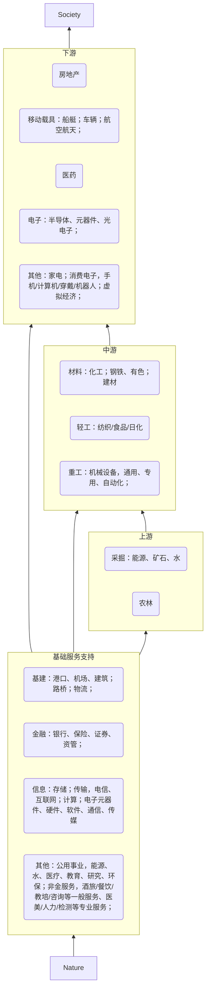
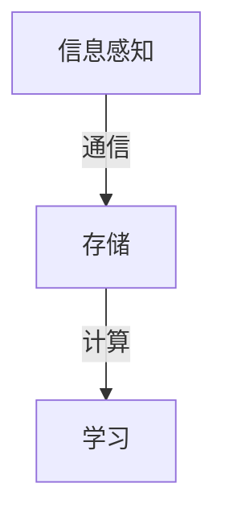
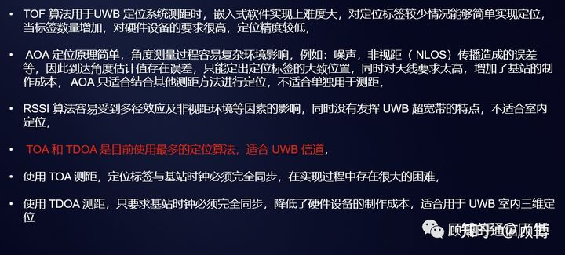
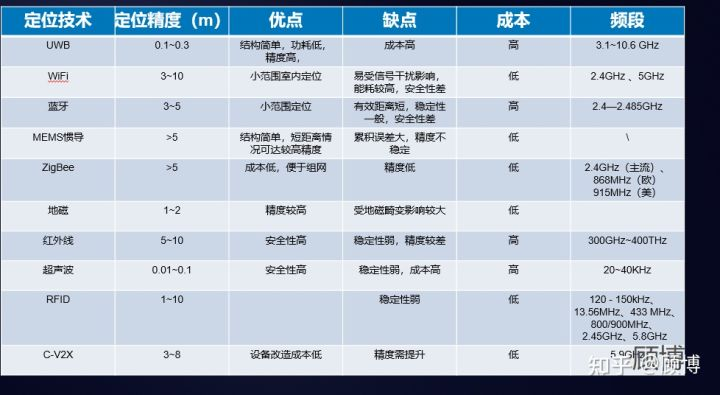

# Practice

# 信息

- 信息采集
    - 一手数据
        - 人工记录：感官
        - 传感探测
        - 互联网采集：数据埋点
    - 二手数据

## 传感技术
- 传感探测：光电效应、热电效应、霍尔效应、光敏效应、压电效应
    |分类|物理|化学|生物|
    |-|-|-|-|
    |位置传感器|浮球阀、麦克风、霍尔传感器...|||
    |力敏/磁敏|电阻式、电容式、电感式、压电式、电流式|||
    |光敏|光电管、光敏电阻、红外摄像、红外辐射温度计、激光雷达|胶片、光刻胶||
    |声敏|声敏转力敏、声呐|||
    |气敏||离子敏半导体传感器、酒精传感、瓦斯气体传感||
    |压敏||||
    |热敏|液体温度计、热电偶传感器、其他热阻式...|||
    |湿敏|电容式湿敏元件与湿度传感器|||
    |专用|||酶、抗体、激素等分子试纸...|

## 定位技术
- 位置信息
    - 定位技术：常见的定位算法有TOF（time of flight）、AOA（angle of arrival）、RSSI（Received Signal Strength Indication）、TOA（time of arrival）、TDOA（time difference of arrival）。
        - 系统定位：系统(IOS、安卓、WP)都提供了一套系统级定位能力，对应系统级API，能综合GPS卫星、WIFI定位、基站定位确定位置。
        - 第三方SDK定位：对于可以公开读取基站、WIFI信息的Android手机系统(IOS和WP系统上没有开放出读取基站和WIFI的接口)，百度、高德等地图厂商自行实现了定位SDK。SDK通过系统接口读取到原始定位信息，然后借助于各家自行部署维护的数据库，查询到当前扫描到的基站、WIFI的位置，最终计算出更准确的定位结果，通过SDK的接口，返回给开发者。让APP的定位能力脱离对手机系统的依赖。
        - 自建定位系统：地磁、RFID
    - 定位方案
        |定位方案|原理|精度|优缺点|适用|
        |-|-|-|-|-|
        |卫星定位——GPS/GNSS|利用至少4颗卫星进行测距交会定位，定位过程中存在着三部分误差，一部分是每个接收机所公有的，例如，卫星钟误差、星历误差、电离层误差、对流层误差等；第二部分为不能由用户测量或由校正模型来计算的传播延迟误差；第三部分为各用户接收机所固有的误差，例如内部噪声、通道延迟、多径效应等。差分GPS定位使用基准站和用户接收机(移动站)，利用实时或事后处理技术，就可以使用户测量时消去公共的误差源——卫星轨道误差、卫星钟差、大气延时、多路径效应。应用最广泛的伪距差分DGPS技术，精度亚米级；实时动态定位技术(RTK)，即载波相位差分技术，将基准站采集的载波相位发给用户接收机，进行求差解算坐标，以前的静态、快速静态、动态测量都需要事后求解才能获得厘米级的精度，而RTK是能够在野外实时得到厘米级定位精度。|民用：3m-200m；军用：1m内；|优点：定位范围广。缺点：耗电大，需要手机为GPS模块提供高压供电；信号源、信号传输、信号接收、信号解析过程中存在误差，信号源受美国SA政策、卫星数影响；信号传输中受天气(阴天、对流层)、电气电磁(电离层)、遮蔽物干扰。|普通定位适合室外大多数场景；RTK定位适合测绘各种比例尺地形图和用于施工放样。|
        |基站定位|基于基站与手机之间通信时差来计算你当前的大概位置的一种通信服务，不需要开通GPRS：查找附近信号最好的三个基站，计算手机位置。|20-2000m|优点：耗电小，基站采集数据即可，不消耗手机电量。缺点：精度不高，常见100m左右；受移动手机网络覆盖区域限制。|备用定位方法|
        |WiFi定位|根据Wi-Fi网络接入点和移动接收设备的信号强度确定位置。|3-15m|优点：室内WiFi设备普遍。缺点：WiFi热点间相互干扰。|室内定位|
        |蓝牙定位|蓝牙Beacon室内定位：在室内应用场合定点布置Beacon基站，通过广播蓝牙信号，用户终端接收定位Beacon的信号确定自己的位置。蓝牙道钉室外定位：根据蓝牙信号强弱划定禁停或可停区域，50元/个，感应范围1m左右，正常可使用3年。|1-3m|优点：Beacon模块体积小、易部署、成本低；功耗远低于WiFi定位；多数终端都有蓝牙模块，具有定位的基础。缺点：蓝牙道钉需要人工安装维护，无法在道路上普遍铺设。|局域定位|
        |RFID定位|RFID定位一般采用刷卡方式，被定位人员携带绑定自身信息的RFID标签，当进入RFID阅读器读卡范围内，阅读器读取标签ID信息并将自己绑定的区域信息上传至后台，后台根据标签的ID信息确定被定位人员，根据收到的绑定区域信息确定位置信息。||优缺点：短距通信，10cm，较为安全；便捷、迅速。|广泛使用在医院、工厂、企事业单位和公司等场所的货物和人员考勤上。|
        | UWB定位(ultra wide band)|标签卡对外发送一次UWB信号，在标签无线覆盖范围内的所有基站都会收到无线信号。如果有两个已知坐标点的基站收到信号，标签距离两个基站的间隔不同，那么这两个基站收到信号的时间点是不一样的。|厘米级|优点：传输速率高（最高可达1000Mbps以上），发射功率较低，穿透能力较强。缺点：定位应用范围较小，需对网络重新进行部署，并且使用者需要使用专用的信号测量设备，实现成本较高(基于信号时间的定位系统，例如UWB，一旦遇到墙体遮挡的情况就需要重新部署，同等面积，房间数量增加一倍，基站用量也将增加一倍，其在空旷场景基站更易部署)。|隧道、化工厂、监狱、医院、养老院、矿井等行业。|

    > 定位算法
    

    > 定位对比：ZigBee定位、UWB定位、低频触发定位、声波定位、光定位、地磁定位等。
    就抗多径和抗干扰方面，UWB明显好于WiFi、蓝牙；就传输距离来看，WiFi是最远的，UWB次之，蓝牙传输距离最近；在建设成本方面，UWB的成本要远远高于WiFi和蓝牙。
    

- 计算：数据挖掘、AB测试
    - 位置信息：调度导航、监控