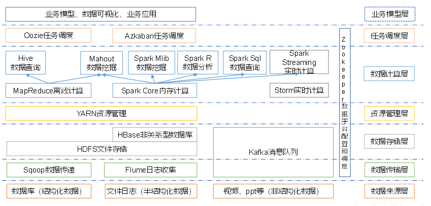
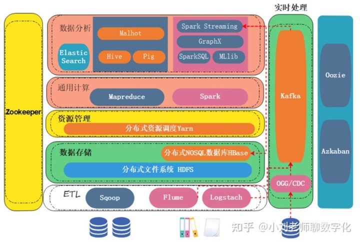
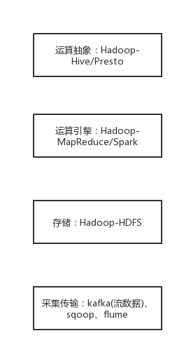

# 基础
## 概念
- 数据库和数据仓库
    - 数据库是面向事务的设计，一般存储在线交易数据，数据仓库是面向主题设计的，存储的一般是历史数据；
    - 数据库设计是尽量避免冗余，一般采用符合范式的规则来设计，数据仓库在设计是有意引入冗余，采用反范式的方式来设计；
    - 数据库是为捕获数据而设计，数据仓库是为分析数据而设计，它的两个基本的元素是维表和事实表。
- 事务：访问和更新数据库的程序执行单元，事务中可能包含一个或多个sql语句，这些语句要么都执行，要么都不执行。事务应该具有4个属性，原子性、一致性、隔离性、持久性，通常称为ACID特性。
    - 隔离性：锁机制来保证事务的隔离性
    - 一致性：事务执行前后，数据的改变都合法，且各方数据都是一致的。
        - 强一致性：适用于对数据一致性要求非常高的场景，如金融交易系统、订单管理系统等
        - 最终一致性：适用于对数据一致性有一定要求，但可以容忍一定的时间延迟的场景，如电子商务平台、电子邮件系统等。
- 处理场景
    - 流式-实时-在线：流式计算处理的是动态、无边界的流数据，适用于实时低延迟场景，如实时推荐、业务监控等。
        - hive-pig：流式
        - Flume：流式数据采集框架
        - Kafka：一个持久化的分布式消息队列系统，高吞吐量、高负载，适合多消费者的场景，如日志数据的缓存。
        - 实时监控：splunk
    - 批量-延时-离线：批量计算处理的是静态、有边界的离线数据，适用于需要离线分析的场景，如历史数据查询、报表生成等。

## 范式
- 基本原则
规范化原则：旨在消除数据冗余、避免数据更新异常等问题，常见范式有 1NF、2NF 和 3NF。
数据完整性原则：数据完整性关乎数据的可靠性与可用性，涵盖实体完整性、域完整性和参照完整性三个重要方面。
最小冗余原则
减少数据冗余既能优化存储空间利用，又能降低数据不一致的风险，这在数据库设计中不容忽视。

- 索引设计？

# 数据库方案
## PostgreSQL
- 数据模型
- 数据库系统架构
- 使用
## redis

## mongodb

## 图数据库
- 对比：https://cloud.tencent.com/developer/article/2381494
- 结构模型
    - Property Graphs
    - RDF Graphs

近年来，以 Neo4j 为代表的图数据库系统发展迅猛，使用图数据库管理 RDF三元组也是一种很好的选择;但目前大部分图数据库还不能直接支持RDF三元组存储，对于这种情况，可采用数据转换方式，先将RDF 预处理为图数据库支持的数据格式 (如属性图模型)，再进行后续管理操作。 目前，还没有一种数据库系统被公认为是具有主导地位的知识图谱数据库。

Neo4j并不是完全不能表示RDF和做推理，之前从网上也看到了一些方法，或许可以帮助开发思路： Neo4有一个插件，neosemantics（n10s），可以在Neo4j中使用RDF及其关联的词汇，具体方可以参考官方文件，里面还有一些大佬们的视频，讲怎么使用。 2. 还可以通过Neo4j的查询，结合逻辑推理和图计算，来规定一些推理方法。
### RDF三元组库
RDF4J，RDF-3X，gStore

### Property Graphs
Neo4j
NebulaGraph
HugeGraph

# 常见方案
## hadoop

数据存储系统：最常见的就是分布式文件系统HDFS；如果需要使用NoSQL数据库功能，HBase是基于HDFS实现的一个分布式NoSQL数据库。

大数据ETL工具：负责把业务数据从前端搬运到后台的大数据平台，Sqoop是常见的结构化数据抽取工具；Flume和Logstach是用于抽取非结构化、半结构化数据工具。

基础层大数据引擎：所有大数据应用的底层核心引擎，主要是MapReduce和Spark。

分布式协调服务： Zookeeper，协调多个机器一起"友好"
高效工作的分布式调度工具。

分布式调度服务：任务顺序和时间（Azkaban、Oozie）

应用层大数据引擎：直接用MapReduce或Spark写程序比较困难，因此对基础层大数据引擎封装简化，提供一系列简易编程应用工具。

Pig/Hive/Spark SQL：面向SQL查询的编程工具。

Malhot：面向机器学习的分布式工具。

GraphX：面向图计算的分布式工具。

Elastic
Search：面向搜索应用的分布式工具，不依赖基础层大数据引擎，比较独立。

大数据实时处理：实时采集数据，实时分析， Spark
Streaming（大数据准实时计算）、Flink
（大数据实时计算）、CDC或者OGG（结构化数据的实时抽取）。

趋势：HDFS让位于由AWS
S3领导的对象存储。MapReduce已被Spark取代，随着时间的推移，它也减少了对Hadoop的依赖。Yarn正在被Kubernetes等技术所取代。而Hive
的查询引擎组件在性能和采用方面已经被Presto/Trino超越。

## RDF图库

