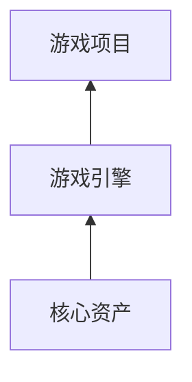
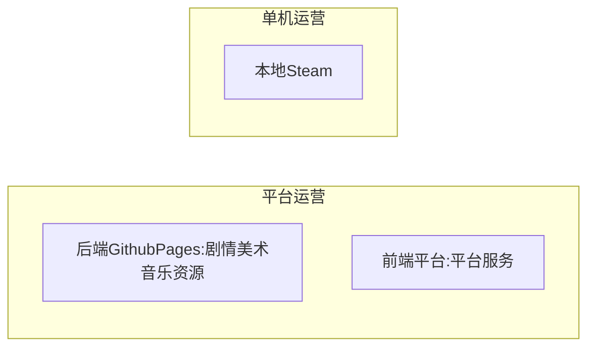

# 基础
## 引擎
- [Laya](./laya.md)
- [UE](./ue.md)
## 用户心理
- [八角行为分析](https://www.woshipm.com/ucd/6182509.html)：足够新奇、控制能力和失控复杂度平衡
① 史诗意义与使命感
② 进步与成就感 
③ 创意授权与反馈
④ 所有权与拥有感  
⑤ 社交影响与关联性
⑥ 稀缺性与渴望
⑦ 未知性与好奇心
⑧ 亏损与逃避心

- [优雅的设计——通过简单的规则，创造多种不同的体验](https://www.jianshu.com/p/85f98bff7350)
    - 棋牌类游戏只需要极简单的数条规定，就可以让玩家很快掌握玩法，但几乎每一局游戏都是全新的经历，需要不同的战术和打法。这就是变化的、不同的游戏体验。

- [优雅2](https://zhuanlan.zhihu.com/p/143301011)

- [微观个体遵循基本规则，在宏观上涌现出复杂行为](https://www.gameres.com/877322.html)

- 其他参考书籍
> 体验引擎：游戏设计全景探秘
游戏设计的艺术
游戏机制——高级游戏设计技术

# 开发方案
## 策划
1. 游戏定位
    - 游戏类型：2.5D/3D；ARPG/FPS；风格；
    - 市场定位：市场大小、特点；典型游戏对比；开发收益成本分析，资源需求/收益预期/进程规划/可行性。
2. 游戏设定
    - 世界观：背景/规则/元素；
        - 元素：天空、地图、动植人物、技能、属性、装备；
3. 游戏内容
    - 目标：积分/等级/排名/成就；
    - 玩法
        - 操作：主线任务/副本任务；
        - 社交；
4. 游戏系统设计
    - 注册登陆模块；
    - 网络模块；
    - 游戏内容模块
        - 地图场景设计
        - 元素设计：角色创建/NPC/动植物/道具；
        - UI交互：提示、触发
        - AI交互
        - 玩家网络交互
        - 交互规则：数值系统设计

## 实现

- 核心资产：美术、音乐、剧情
    - 美术：Blender是一款免费开源三维图形图像软件，提供从建模、动画、材质、渲染、音频处理、视频剪辑等一系列动画短片制作解决方案。
    - 动画：Spine和DragonBones是专门用于制作2D骨骼动画的软件。这些动画可以用于游戏中的角色动作和特效。
    - 音效：Audacity是一款免费的音频编辑软件，可用于录制、编辑和混合游戏中的音效。
    - 其他
        - Tiled:开源的2D地图编辑器。
        - Krita:数字绘图软件,适合2D游戏绘制与动画。
        - Aseprite:开源像素动画制作。
- 技术：渲染、网络
    - UE
    - 美术：[Blender](http://blender.org/)、Cycles(作者：Mr__Kin https://www.bilibili.com/read/cv2350089/)
        - [图片一键变成无缝平铺纹理](https://www.uisdc.com/unity-grenoble#:~:text=1.%20%E5%B0%86%E5%9B%BE%E7%89%87%E7%9A%84%E8%87%AA)
        - [Unity](https://unity-grenoble.github.io/website/demo/2020/10/16/demo-histogram-preserving-blend-make-tileable.html)

# 行标
- 游戏网站：taptap
## 单体游戏项目
minidayz 2.5D
《末世旅人》
金铲铲之战
搬砖：火炬之光无限、修仙家族模拟器2
## 开发架构
美术：blender+python+AI，直接pip安装的blender模块是2.8待官网更新最新的方案
音乐：？
引擎：Laya、UE

## 运营架构

后端：(sqlite)
前端：平台+代码