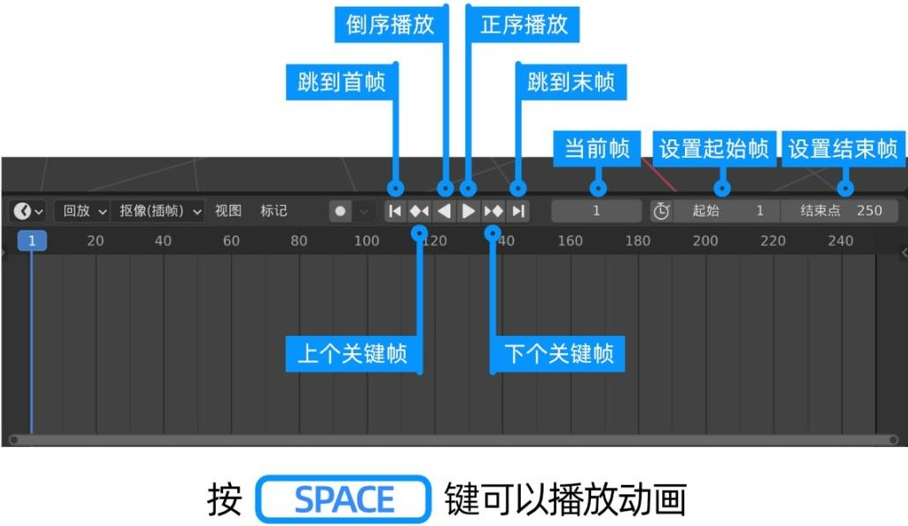

# Blender
## 基础
|操作|快捷键|说明|
|-|-|-|
|视角切换|~+鼠标停放||
|视角缩放|中键滚动||
|视角旋转|中键拖动||
|视角平移|Shift＋中键拖动||
|新建物体|Shift＋A||
|物体删除|X||
|物体全选|A||
|物体平移|G(+XYZ)|尺度通过鼠标拖放控制或具体数字控制|
|物体旋转|R(+XYZ)|尺度通过鼠标拖放控制或具体数字控制|
|物体缩放|S(+XYZ)|尺度通过鼠标拖放控制或具体数字控制|
|物体复制|Shift+D(+XYZ)||
|编辑模式|Tab|再次按Tab返回上个模式|
|细分|右键Subdivide|编辑模式下|
||||
||||

- 着色
    自动光滑着色比光滑着色更合理

- 修改器：阵列、倒角、边框

- 着色

- 属性编辑器
    - 变换属性
        - 位置
        - 旋转
        - 缩放
    - 物理属性
        - 碰撞
        - 布料效果
    - 渲染属性
    - 世界属性
    - 材料属性

- 着色编辑器——材料属性面板的加强版

## 建模
- 导入图像
    > Texture > Image Texture > 
mesh

## 动画
- 时间轴
    

- 插入关键帧：属性参数右侧标记改变
    > 属性参数右键>插入关键帧(针对一组参数)/插入单项关键帧(针对一个参数)
    > 单击属性参数右侧点

- 添加骨骼

- 骨骼绑定

- 添加动作

## 材质

## 渲染
- 属性编辑器>渲染属性>渲染引擎
    - Eevee：速度快
    - Cycles：速度慢、更真实

- 其他设置
    - 相机
    - 灯光
    - 输出属性