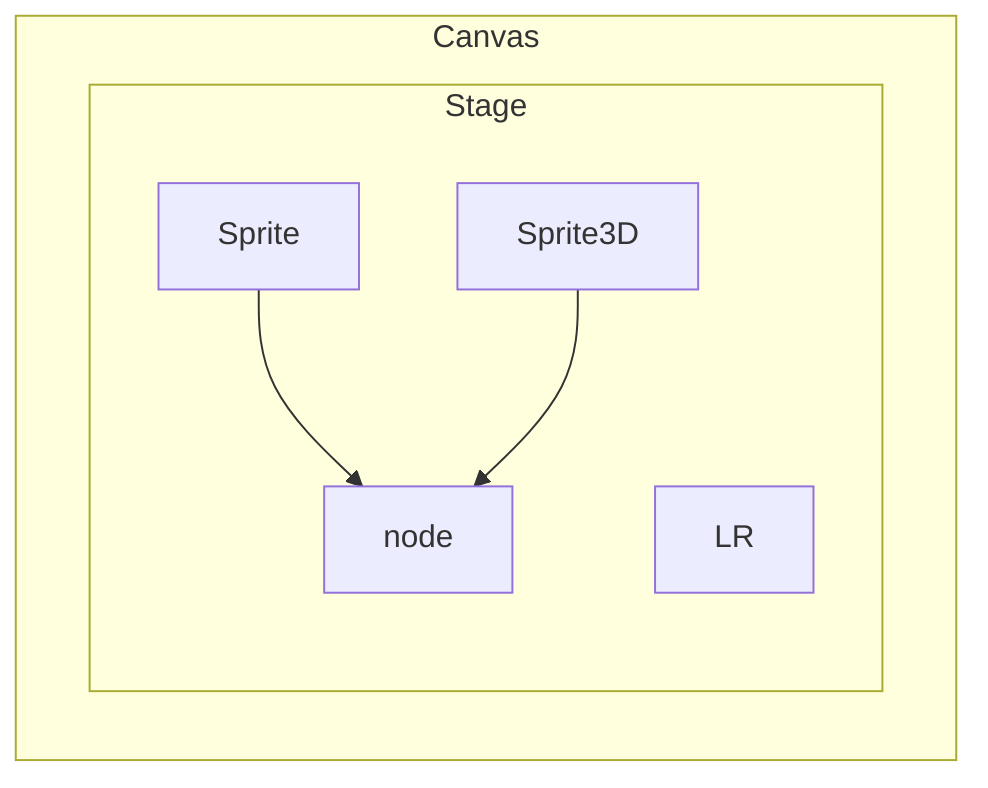

# 基础
- [官方文档](https://layaair.layabox.com/#/doc)
## 流程
1. 环境搭建
- LayaAir IDE
- TS开发环境：安装Node.js，再安装TSC `npm install -g typescript`；
- 编码工具VSCode：安装完成VSCode编码工具后，IDE通常会自己关联该编码工具，也可以通过首选项内进行手动指定。
- 浏览器：推荐采用Chromium内核的浏览器作为LayaAir运行与调试环境，例如windows自带的Edge浏览器或谷歌的chrome浏览器。

2. 开发
- 创建项目
- 创建场景：场景类继承自Sprite，新项目自带场景Scene2D和Scene3D。入口是IDE里设置的启动场景，启动场景绑定的runtime类或脚本，会跟随启动场景运行，作为项目的入口。
    - 入口场景：LayaAir3引擎是基于场景运行的，无法设置一个纯粹的代码作为项目入口。无论是测试运行，还是正式上线，必须要有一个入口的场景，作为项目运行首先启动的场景。
        - 启动场景设置：启动场景是整个项目的入口场景，通常是用于加载页，在该界面中实现游戏资源的加载，以及进度条的展示。`构建发布 -> 通用 -> 启动场景`
    - 场景脚本：跟随场景的运行而执行的脚本逻辑
        - UI组件脚本：UI运行时，仅支持2D UI场景的根节点上使用
        - 自定义组件脚本：适用于任意场景和节点上使用
        - 动画脚本
- 添加：摄像机、光照


- 脚本设置
    - 添加：属性面板直接添加；资源拖动绑定
    - 编辑：双击属性面板的脚本或资源面板的脚本，均会打开Vscode编码工具

- 资源加载

- 调试
    - IDE内调试：控制台打印日志
    - 浏览器调试：按F12键在DevTools中查看日志，调试工具有DevTools或LayaTree

4. 打包发布

## 项目结构
```markmap
- 项目
    - 文件结构
        - assets：项目资源目录，场景Scene中在assets里引入的资源会自动复制到发布目录。
            - ls文件：包括了Scene3D场景和Scene2D场景
        - src：项目源码目录
        - bin：本地运行目录，仅是测试运行的index.html首页的入口，以及IDE内置的代码入口。
        - engine：项目库目录，引擎库的声明文件。
        - .laya：工程文件
        - tsconfig.json：TS编译选项配置
    - 生命周期
```



显示列表用于管理LayaAir运行时显示的所有对象。需要注意的是，继承自Node的两个子类Sprite与Sprite3D分别是2D的基础显示对象和3D的基础显示对象。两者不能混合添加，也就是说Sprite及其子节点不能作为Sprite3D的子节点，Sprite3D及其子节点不能作为Sprite的子节点。

3D节点的根节点是Scene3D，2D节点的根节点是Scene2D。2D与3D节点之间不可以混合形成父子层级关系。

- 3D UI

- 后端射击
    

## 实体组件系统
- ECS(Entity-Component-System 实体-组件-系统)：一种基于数据驱动的游戏设计模式。开发者通过继承引擎的组件脚本类`Laya.Script`，可以实现组件系统脚本的完整功能，然后通过IDE或者代码的方式添加到实体上，实现完整的ECS功能。
    - 实体：每一个有着唯一ID的显示对象节点，每一个实体都可以为其添加一个或多个不同的组件系统脚本
    - 组件：实体的数据部分，是系统与外界的数据接口，LayaAir通过装饰器将接口暴露在IDE中，方便开发者直观的传入数据
    - 系统：实体的逻辑控制部分，引擎为组件系统提供的生命周期方法与事件方法可以作为系统逻辑控制的入口。

- 装饰器
    |装饰器|作用|说明|
    |-|-|-|
    |`@regClass()`|组件脚本在类定义之前使用该装饰器才会被IDE识别|一个TS文件只能有一个类使用@regClass()。标记了@regClass()的类，在IDE环境内都会被编译，但最终发布时，如果这个类没有被其他类引用，也没有被添加到节点上，或者所在的预制体/场景没有发布，则这个类会被裁剪。|
    |`@property()`|类属性定义之前使用该装饰器将会通过IDE暴露给外界编辑来传入数据|类型是装饰器属性标识必须携带的参数|
    |`@runInEditor`|通过装饰器标识@runInEditor来让组件在IDE内加载时也可以触发生命周期方法|不建议|
    |`@classInfo()`|加入IDE的组件列表；属性分组||

- 组件属性
    - 读写：通过属性访问器(getter)和属性设置器(setter)来控制属性的读写行为
    - 序列化：默认状态下，属性名与值都会被序列化保存到组件被添加的场景文件或预制体文件里。在运行阶段，也可以直接使用序列化存储的值，对于结构复杂的数据，直接使用序列化的值还可以节省数据结构生成带来的开销。
    - IDE显示：在默认情况下，装饰器属性规则只会对非下划线的类属性标记为IDE的组件属性。对于有下划线的属性，其实是不会被显示到IDE里，此时该组件属性的价值只剩下将值保存到场景文件中了。
    - 

## 换装