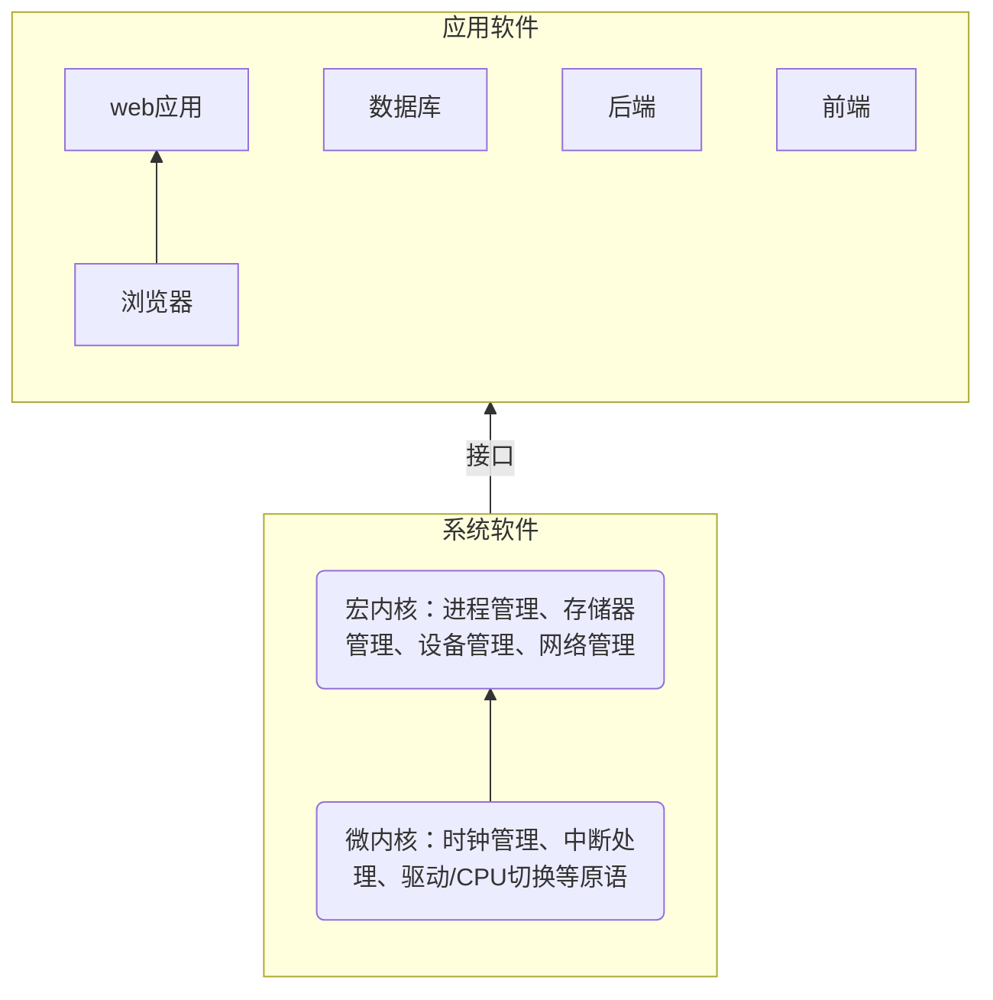
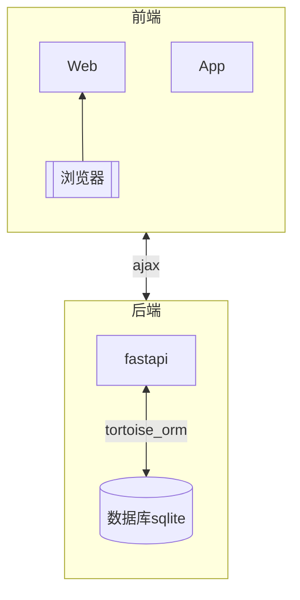

# 软件

# 系统软件
- 常用
    |系统|特点|场景|
    |-|-|-|
    |Win|pros: 生态丰富 <br>cons: 闭源|个人桌面|
    |Linux|pros: 开源；兼容性和跨平台能力 <br>cons: 生态一般|个人桌面、服务器|
    |BSD|pros: 开源；安全稳定精简性能高效，能对硬件进行比Linux更彻底的控制<br>cons: 驱动和应用生态不如Linux，不支持docker等|服务器：NAS数据库、路由器、web服务器、防火墙...|

- Linux: [系统架构](https://zhuanlan.zhihu.com/p/293011437)、[安装更新](https://cn.ubuntu.com/download/desktop)、[Linux to go](https://www.bilibili.com/video/BV1tb4y1u77k/?spm_id_from=333.337.top_right_bar_window_default_collection.content.click&vd_source=2a823ce6073f9ac24d39aaa3c97831d4)、[o1](https://zhuanlan.zhihu.com/p/618018275)
    |发行版|类型|优点|缺点|场景|说明|
    |-|-|-|-|-|-|
    |Debian Stable|Debian系|极其稳定；相对Ubuntu极简；软件包丰富|软件包相对更旧；不会包含最新的软件|个人桌面、服务器|社区驱动；除了Stable还有Testing、Unstable版|
    |Ubuntu|Debian系|使用相对友好；驱动和软件包相对丰富且新|过多的预安装；内部报错问题；Snap问题|个人桌面、服务器||
    |Mint|Debian系|||个人桌面|Ubuntu主线替代|
    |Kali|Debian系|||渗透测试、网络安全、逆向||
    |Armbian|Debian系|||嵌入式操作系统|树莓派、ArmSoM、香蕉派、机顶盒等|
    |Rocky|Redhat系|企业级稳定|软件包可能不如Ubuntu最新|服务器||
    |Alma|Redhat系|企业级稳定|软件包可能不如Ubuntu最新|服务器||
    |CentOS|Redhat系|企业级稳定|软件包可能不如Ubuntu最新|服务器|停止维护|
    |Fedora|Redhat系|使用非常友好；最新的技术和软件包|更新频繁不稳定|个人桌面|社区驱动|
    |Arch/Manjaro|Arch系|高度自定义、Linux内核最新、Archwiki、用户社区AUR|稳定性一般：滚动更新经常会滚挂|个人桌面||
    |openSUSE||||||
    |Alpine、CoreOS|基于容器优化的操作系统|轻量级、安全||||
    
    > 推荐方案：Ubuntu(快速迭代部署)；Debian(长期稳定运行)
    > 桌面选择：xfce实用，lxde配置要求低，kde花哨，gnome玄幻
    
- BSD
    - FreeBSD
    - 其他：OpenBSD、NetBSD


# 应用软件
Web趋势：应用程序web化、web应用移动化、web操作系统化（基于web构建纯粹的操作系统；web的底层结构趋向于操作系统结构）
## 开发
### 基本范式
- 架构设计：先分析、再综合。性能收益(强、稳定)-维护成本(纠错、复用、扩展)。
    - 分层思想
        - MVC三层架构、MVP、MVVM
        - 四层/七层网络模型
        - 添加缓存层提升系统性能：CPU缓存；浏览器缓存；网络缓存(CDN缓存/反向代理缓存)；服务端缓存(内存级缓存/分布式缓存)；数据库缓存
        - 前后端分离
    - 平衡思想：ACID是传统数据库常用的设计理念，追求强一致性模型。BASE支持的是大型分布式系统，提出通过牺牲强一致性获得高可用性。 ACID和BASE代表了两种截然相反的设计哲学，基于根据ACID与BASE提出了酸碱平衡理论，即在不同场景下，分别使用ACID与BASE解决分布式一致性问题。
    ```mermaid
    flowchart LR
    c0[单体架构] --> c1[有中心服务端] & c2[无中心服务端]
    c1 --> B/S & C/S
    c2 --> 主机终端 & P2P
    c3[分布式集群架构：多层次多粒度] --> 分布式架构 & SOA架构 & c4[微服务架构] 
    c4 --> c5[Spring Cloud] & c6[Dubbo] & c7[kubernetes]
    c[软件架构] --> c0 & c3
    ```

- [开发](https://cloud.tencent.com/developer/article/2368574)
    - 编程范式
        - 面向过程：过程分解为步骤
        - 面向对象：封装、继承、多态和抽象。面向接口的改进。
        - 面向函数：无副作用的纯函数和数据不可变性
    - 设计模式：编程中类和对象的组织和交互
        - 创建型
        - 结构型
        - 行为型

- 原则
    - 可观测原则：识别评价运行情况
    - SOLID七原则
    - [复用](https://www.cnblogs.com/JaxYoun/p/14982768.html)：组合优于继承
    - 全流程统一的版本管理
        - 产品设计
        - 开发测试
        - 发布更新

### 技术栈
- [技术栈参考](https://github.com/TeamStuQ/skill-map)
    - 后端技术：服务器、数据库
    - 前端：web、桌面、移动、IoT
    - 网络通信

- 语言和架构选择
    - 语言：解释型语言、编译型语言
        - 动态编译解决方案：自动修改源码，python使用exec()、eval()、compile()
    - 架构：整体应用架构、局部AI算法架构

## 服务器(S)
- Python
    - [ ] Flask: 不推荐
    - [x] FastAPI: fastapi+tortoise_orm方案适合高性能API服务和数据密集型应用，异步特性和自动生成文档大大提升了开发效率。
    - [x] Django-ninja: Django适合快速构建中小型项目和需要全面功能的场景，但在性能和灵活性上不如FastAPI。
- Node.js: 占用内存小，启动迅速，不用处理多线程问题，非阻塞高并发，少了Setter Getter和Java各种List/ArrayList/HashMap等...代码编写更简易。适合构建依赖于大量I/O的应用程序（FinTech，预订系统，媒体应用程序等）。
    - [ ] Koa: 类似python的flask，不推荐。
    - [ ] Express: Express框架 + Prisma的ORM。不推荐，express多数是用来当前端的dev server。
    - [x] Fastify: 适合快速构建 API、微服务等 Web 应用程序。具有丰富的插件库，而且具有非常良好的文档支持。
    - [x] Nest.js(nestjs里也可以使用Fastify): 基于 Express、socket.io 封装的 nodejs 后端开发框架，对 Typescript 开发者提供类型支持，也能优雅降级供 Js 使用，拥有诸多特性。
    - [ ] 其他: Swagger 是用于描述、生成、使用、测试和可视化 RESTful API的规范。
- Java: 后端微服务体系
    - [x] Spring Boot: 适合执行大量的计算场景（物联网，电子商务平台，大数据）。
- go: 分布式网络、云原生
    - [x] gin
- 其他
    - [ ] PHP: Laravel、ThinkPHP
    - [ ] react: Next.js
    - [ ] Vue.js: Nuxt.js
## [数据库](./database/database.md)
- 关系型: 小型可嵌入sqlite、大型独立MySQL和PostgreSQL
- Nosql: MongoDB、基于内存的高性能Redis
- 大数据: 基于Hadoop架构的HDFS-HBase、Yearn-MR、Hive/Spark
- 图数据库: Neo4j
## 前端(B&C)
- web: 用`<template>、<view>、<canvas>`比较多，其它的，都是用框架封装好的视图组件，uni-ui 啥的，很方便，效率高，传统的元素块淘汰？
    - [x] 基础: html+css+JavaScript < +jQuery+Bootstrap >，UI可参考jQueryUI、Bootstrap。
    - [x] Vue.js: Vue3、Nuxt.js
    - [ ] React.js
    - [x] Angular: 代码相对冗余，文件体积较大；提供完整的MVC框架，适用于大型企业级应用。
- 移动app
    - [ ] jQuery Mobile: 用于创建移动端web应用的的前端框架
    - [ ] React Native
    - [ ] Flutter
- 桌面app
    - [ ] Qt: QT、PyQt、Pyside
    - [ ] Electron: 基于web、js
- 跨端
    - [x] uniapp

## 通信
- Open System Interconnection
    |层级|处理设备|功能|数据格式|协议|
    |-|-|-|-|-|
    |应用层|终端设备-PC/手机|网络和应用程序之间的接口|ATPU|HTTP、FTP、SMTP、POP3、P2P、Telnet|
    |表示层|终端设备-PC/手机|数据解码加密压缩|PTPU|LPP、NBSSP|
    |会话层|终端设备-PC/手机|建立维护管理应用间的会话连接|DTPU|SSL、TLS、DAP|
    |传输层|终端设备-PC/手机|标识应用程序端口号|数据段Segment|TCP、UDP|
    |网络层|网关、路由器|基于IP的路由和寻址|分割重组数据包Packet|IP、RIP|
    |数据链路层|网桥、交换机|基于物理层的寻址、建立撤销标识链接|比特信息封装成的数据帧Frame|以太网、PPTP|
    |物理层|网卡、光纤电缆、中继器|物理连接|0-1比特流Bit||
    > Socket: 工作在OSI模型会话层的TCP/IP网络的API。  
    > MQTT: 构建于TCP/IP协议上，基于客户端-服务器的消息发布/订阅传输协议。轻量、简单、开放和易于实现，这些特点使它适用范围非常广泛，包括受限的环境中，如：机器与机器（M2M）通信和物联网（IoT）。  
    > 物联网: 需要芯片模组硬件支持的物理层协议，NB-IoT，LORA，WIFI，蓝牙，zigbee，4G。需要服务器软件支持的应用层协议，MQTT，COAP，HTTP。

- web基本通信
    |类型|技术|通信方向|适用场景|
    |-|-|-|-|
    |http|通过httpRequest对象请求服务器并接受返回数据，先请求再响应、响应后断连、一次请求即结束。+cookie：服务器设置cookie返回给浏览器，浏览器保存cookie到本地，下次浏览器携带cookie发起请求，服务器可根据cookie识别浏览器，并维持对话。+session|单向（客户端到服务端）|需要刷新页面|
    |ajax|通过xmlHttpRequest对象，在浏览器与服务器之间使用异步通信机制进行数据通信：是多种技术的综合，Javascript、Html、Css、Dom、Xml、XMLHttpRequest等技术按照一定的方式在协作中发挥各自的作用就构成了Ajax。|单向（客户端到服务端）|允许浏览器向服务器获取少量信息而不是刷新整个页面|

- web即时通信
    > - [ ] Ajax短轮询
    > - [ ] Comet技术：通过Ajax长轮询或者HTTP流实现
    > - [x] SSE: 服务器到客户端的单向实时数据推送，例如新闻更新、实时股票报价、天气预报等。
    > - [x] WebSocket: 建立在TCP之上的应用层双向通信协议。适用低延迟的场景，例如在线游戏、实时聊天应用等。
    > - [x] Socket.IO: 基于websocket协议进行的上层封装，同时在websocket不可用时，提供长轮询作为备选方式获取数据。Socket.IO不是Websocket的实现，Socker.IO有自己的协议说明，因此和websocket的server不兼容。

- [web流媒体通信](https://zhuanlan.zhihu.com/p/496823042)：流媒体协议RTP、RTSP、RTMP、HLS、SRT、WebRTC(WebRTC的协议栈是几个协议的集合)
    ```markmap
        - Internet IP
            - UDP
                - RTP
                - RTCP
                - SRT
            - TCP
                - RTSP
                - RTMP
                - HTTP
                    - HLS
                    - DASH(MPEG-DASH)
                    - MP4/FLV
    ```


## 选择方案
|端点|微型|中型|大型|微服务|
|-|-|-|-|-|
|后端:服务器+数据库|Fastapi/Fastify/Gin+Sqlite|Nest.js+MySQL+Redis|Spring boot+Hadoop|微后端|
|前端:web/app|jquery/Uniapp|Vue|angular+flutter|微前端Qiankun|



> fastapi
>> [基础](https://www.yuque.com/gengdiniu/vt4aq6/gygwu471ql38nzaq?singleDoc#)  
>> [基础2](http://www.yuan316.com/post/FastAPI%E6%A1%86%E6%9E%B6/)  
>> [awesome-fastapi](https://github.com/mjhea0/awesome-fastapi)  
>> [fastapi-best-practices](https://github.com/zhanymkanov/fastapi-best-practices?tab=readme-ov-file)  

> 部署
>> 本地部署  
>> 云上部署：cloudfare


# 常用工具
## CMS
- node.js: Strapi
- Django-CMS

## 通信
- 数据、文件、实时音视频
    - B/C: Jitsi Meet 、Nextcloud Talk
    - P2P: [Jami](https://jami.net/)，原Ring messenger，一个 GNU 项目。无需服务器，跟磁力链接一样难以封杀，坏处是收不到不在线时的群组消息。
    - Matrix: 类似 email 分布式的开源聊天工具：matrix.org
## 数据处理(声音图像)
- 声音处理
    - ffmpeg: 音视频处理
    - whisper: python离线语音识别库

- 图处理
    - Pillow：图像处理
    - 其他
        - OpenCV：图像处理和机器学习库
        - YOLO：位置和类别
        - YOLO-World：实时开集目标检测
        - SAM

## 开源模型
- LLM
    - bert
    - GPT-3
    - deepseek v3
- Small Language Models
    - Phi
    - Gemma-2B/7B
    - OLMo-7B

- NLP
    - 痛点
        > 输入瑕疵
        分词困难：基于字典、词库匹配的分词方法；基于词频统计的分词方法；基于知识理解的分词方法。
        词义消歧：需上下文
        句义消歧：需上下文
    - 解决方案
        > 第一种：机器学习的方法，也包括深度学习。收集海量的文本数据，建立语言模型，解决自然语言处理的任务。
        > 第二种，基于规则和逻辑的方法。人工智能最早的研究方法，90年代之后始更多的采用机器学习的方法。现在基本上在自然语言处理研究当中，逻辑和规则占20%，机器学习占80%，也有两者结合。
        > 第三种，语言学的方法。把自然语言处理看成语言学下面的一个分支，所有对人类语言现象的研究都可以归为语言学，语言学家也就是很多自然语言处理任务的设计师，由他们提出问题，把框架勾勒出来；当然解决问题则要靠研究人员用机器学习、规则和逻辑的方法把这个框架填上，把问题解决掉。

## 在线工具
pix2tex网页版：图片公式识别
https://p2t.behye.com
https://simpletex.cn/ai/latex_ocr