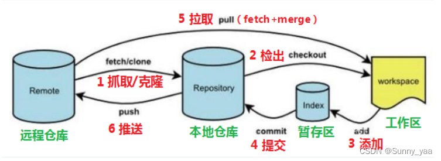

- [软件工具](../software.md#常用工具)

# 系统
- U盘启动盘：Ventory作为引导可把系统镜像、其它PE镜像直接放到U盘里使用。
    - 系统：将iso文件直接放到U盘
    - 其他PE：转iso镜像再放到U盘
- NUC M15装机
    - 制作系统安装引导盘
    - DG格式化系统盘
    - 从U盘启动安装程序(不拔)完成系统安装
    - 安装驱动：安装NUC M15官方驱动，新win11版也适合win10系统，旧win11+10版camera驱动有问题；系统更新；Nvida官网显卡驱动；尽量避免第三方补充的驱动。
- cmd查看盘符
    1. 进入diskpart：```diskpart```
    2. 查看分区：```list vol```；
    3. 查看磁盘：```list disk```、```select disk 0```、```detail disk```；
- cmd切换目录
    - 切换盘符：```D:```
    - 切换文件目录
        - 同一盘符下：```cd C:\gyq\topush```
        - 不同盘符下：```cd /d C:\gyq\topush```
- 程序搜索顺序
    - 当然如果cmd命令中带路径，很明显只在指定目录中寻找文件，而不会到环境变量中去找，如果文件名不带后缀，则跟第一种情况一样，在指定目录中寻找这个名称的可执行文件或批处理文件执行，找不到报错；如果带后缀，若存在，则执行或用默认程序打开，若不存在，寻找该文件名+可执行文件或批处理文件后缀的文件来执行，找不到报错。
    - 输入的命令不带后缀（不带路径）
        1. 先会在无后缀的系统命令（如cd、dir等）中搜索，如果找到了就执行该命令
        2. 如果在无后缀的系统命令中找不到，则在当前目录中查找该命令+.exe、.msc、.bat等后缀的可执行文件或批处理文件，如果找到了则执行
        3. 如果没找到，最后再在环境变量那些目录中按上述规则搜索
     - 输入的命令带后缀（不带路径）
        1. 首先在当前目录中搜索该文件，若存在，如果该文件是一个可执行文件或批处理文件，则执行之，如果是其他一般文件则用与该类型文件关联的默认程序打开它； 
        2. 若当前目录不存在该文件,则在当前目录中查找是否存在以该文件名+可执行文件或批处理文件后缀（.exe、.bat、.msc等）命名的文件，如果找到了则执行之;
        3. 如果在当前目录中上述两种情况都未找到，才在环境变量所设置的那些目录中按上述顺序搜寻。先是按cmd命令所给的准确文件名查找，如果有，是程序或批处理则执行，是其它文件就用默认程序打开;
        4. 如果在环境变量目录中未找到该文件，再在环境变量目录中查找是否存在该文件名+可执行文件或批处理文件后缀（.exe、.bat、.msc等）的文件，如果找到了则执行之;
        5. 如果还是没有，则报错.

# 关于目录
- vscode打开文件：该文件即为根目录
    - 以"./"开头，代表当前目录和文件目录在同一个目录里，“./”也可以省略不写！
    - 以"../"开头：向上走一级，代表目标文件在当前文件所在的上一级目录；
    - 以"../../"开头：向上走两级，代表父级的父级目录，也就是上上级目录，再说明白点，就是上一级目录的上一级目录
    - 以"/"开头，代表根目录
- 不同文件的执行
    - .md
        - `[](./)`: 文件链接vscode里"./"有效，docsify里所有链接处理均从根目录开始拼接，无效因此要使用`[](/)`或设置相对目录。
        - ``: 图片链接由于直接渲染，在vscode和docsify均有效
    - .py .ipynb：根目录为执行器powershell所指向的目录，一般同vscode

# 软件安装
- PC
    |类型|Win &cross;|Linux|
    |-|-|-|
    |浏览器Edge|&check;|&check;|
    |社交: 微信(安装后文件保存位置设置为C:\xxx\mydocuments)；QQ(安装前数据文件位置选择C:\xxx\mydocuments)；腾讯会议；|&check;_官网|&check;_官网|
    |Office|WPS;MSOffice|LibreOffice|
    |百度云|&check;_官网|&check;_官网|
    |[Zotero](https://zhuanlan.zhihu.com/p/689468632)|&check;|&check;_snap|
    |git|&check;|&check;|
    |[VSCode](#vsc)|&check;|&check;_snap|
    |Node.js|&check;|&check;|
    |Docker|&check;|&check;|
    |conda;Anaconda;|&check;|&check;|
    |blender|&check;|&check;_snap|
    |下载|迅雷|aMule(&check;_snap);Tranmission;|
    |基本工具|网易有道词典、winrar、鲁大师、剪映、ShareX免费OCR、Ditto同网共享粘贴板|Vim;|
    |其他: Picgo图床、Epic、VS、steam、steamVR、VD|87VR助手、SunloginClient(远程控制)；PDF Password Remover；优启通；Fiddler、SAS、mysql、appium、Android Studio、wkhtmltox（可用python调用html转pdf）; Calibre/CAJViewer/ABBYY FineReader破解;||
    |免安装|Pandoc; ffmpeg; 科学上网(winXray、v2rayN、Clash、Qv2ray)；硬件管理(图吧工具箱；CrystalDiskInfo；3DMark)；网站视频下载(flvcd_youtube)。|
    |个人站点gg-yq.github.io:github+giscus+docsify|
    |学术研究|researcher-app|

- Mobile
    淘宝、支付宝、UC、高德地图、咸鱼、拼多多、京东、多点、美团、滴滴、58；  
    微信、QQ、腾讯会议、订阅号助手；  
    百度网盘、网易公开课、网易云音乐；  
    bilibili、抖音、小红书、微博；  
    中国建设银行、中国农业银行、新网银行、买单吧、个人所得税；  
    知乎、萝卜投研、雪球股票、中信证券交易app、涨乐财富通、涨乐期赢通；  
    chinadaily、多次元托福、流利说；  
    其他：中国电信、WIFI万能钥匙、wps office、华为运动健康

# pandoc：docx2md
1. 先进入文档所在路径：转的文档需要和pandoc.exe在同一层级，否则路径错误执行是不会成功的。
2. 执行命令
    ```
    //在当前目录创建.md和media文件夹
    pandoc -f docx -t markdown --extract-media ./ -o aaa.md aaa.docx
    //在当前目录创建.md，在当前目录创建xxx/media文件夹
    pandoc -f docx -t markdown --extract-media ./xxx -o aaa.md aaa.docx
    ```

# VSCode
- 基本使用——代码调试
    - 安装编译器/解释器
    - 安装相关插件辅助编写和调试
        - (可选)Code Runner：支持运行多种编程语言的代码
    - 调试
        - F5/`Run`：配置默认的解释器或在`.vscode > launch.json`文件里配置，然后`run`，在`OUTPUT`查看结果
        - 在内置终端运行：终端输入解释器和程序文件路径的命令，执行后在`TERMINAL`查看结果
    - 其他
        - tasks.json：定义开发流程，编码、构建、运行/调试、测试、打包
        - launch.json：定义运行调试

- 基本设置
    - 用户设置 (User Settings)
        - 用户属于全局设置
        - 设置存储在一个特定的文件中，通常位于用户目录下。
    - 工作区设置 (Workspace Settings)
        - 工作区设置仅适用于特定的工作区或项目，这些设置可以覆盖用户设置。
        - 设置存储在项目目录下的 .vscode/settings.json 文件中。
- 插件安装：推荐登陆账号使用Settings Sync功能同步设置、插件<a id="vsc"></a>
    |插件类型|插件名称|
    |-|-|
    |c++/c#|.NET Install Tool;|
    |python|python;jupyter|
    |web|open in browser; Live Server|
    |笔记|markdown all in one; markdown preview enhanced;[markmap](https://markmap.js.org/repl);[marp](https://marp.app/)|
    |AI|ChatGPT; copilot;|

- python环境设置
    1. conda新建环境
    2. 激活环境：cmd(prompt)激活环境，powershell无法激活.
    3. 指定环境：ctrl+shift+p指定该环境下的解释器.
- vscode内github新旧库连接：
    1. 前置：git全局设置以及github连接key设置
    2. 连接
       -  直接clone会自动建立连接：github新建repository,设置.ignore模板为python,设置license模板。
       - 或者git add设置远程连接并pull。
    
- 代码目录下生成的".vscode"文件夹只对阅读代码有影响而对编译器无影响，并且这个文件夹产生的数据极大，远超出github仓库允许的容量(100M)，一般不push。
- 切换python虚拟环境
    > 1、分别在venv Folders 和 venv Path中添加虚拟环境文件目录路径，重启VScode设置生效
    2、查看——命令面板——Python: Select Interpreter——选择要使用的环境的python解释器

- 常见问题
    - 安装包存在依然提示"import cannot resolved..."：python.analysis.extrapaths设置参考https://blog.csdn.net/weixin_43937790/article/details/128039587 https://learnscript.net/zh/python/development-tools/vscode/pylance/
    - 自动格式化需设置忽略排序：可能会产生import依赖问题
    - marp预览问题: MPE冲突
        - To use Marp preview while using MPE, open the command palette via Ctrl (Cmd) + Shift + P and choose "Markdown: Open Preview to the Side" for VS Code built-in preview, instead of "Markdown: Markdown Preview Enhanced: Open Preview to the Side".
        - To restore a VS Code original preview button from the toolbar, disable markdown-preview-enhanced.hideDefaultVSCodeMarkdownPreviewButtons the MPE extension setting.
    - marp在vscode中html支持选项：`Markdown > Marp: Enable HTML` from preference.
    - marp：图片引用'/'可预览但不能导出，需要改为'../../'

# git



- 基本用法
    - 用vs打开项目文件夹，进入项目目录：所有git命令都要在项目空间下进行，如果需要新建或进入其他目录则需要执行下面的代码
        ```
        $ pwd  //mac中查询当前目录，windows当前目录在命令头展示  
        $ mkdir git-tutorial  
        $ cd git-tutorial  
        ```  
    - 主分支设置为main: github把master默认分支改为了main，git要做相应调整，把本地git的master改成main。
        - 把默认分支改为main
        ```
        \\使用git init初始化项目时, 默认使用main做为主分支
        $ git config --global init.defaultBranch main
        \\或者在执行git init时指定初始分支名称
        $ git init -b main
        ```
        - 修改已创建并push过的项目的主分支为main
        ```
        \\把当前master分支改名为main；删除远程master分支，该分支为远程主分支时无法删除，只需在远程修改default branch为其他分支；推送本地分支到远程仓库。
        $ git branch -M master main  或直切换到主分支master，执行$ git branch -M main
        $ git push origin --delete master
        $ git push -u origin main
        ```  

    - 远程库的连接和解除：直接clone会自动创建连接
        ```
        //第一次通过git去使用GitHub需要全局设置：--global针对系统上所有仓库有效；-e针对当前仓库有效
        $ git config --global user.name "xxxx" 
        $ git config --global user.email "xxxx@xxx"
        $ git config --global --list //查看操作是否完成
        $ ssh-keygen -t rsa -C "xxxx@xxx" //邮箱和上述邮箱一致，一直回车可略过密码等设置，找到id_rsa.pub，复制内容，添加到github的ssh keys。提示"unknown key type -rsa"时，直接使用$ ssh-keygen -C"xxxx@xxx"
        $ ssh -T git@github.com //选择yes，验证是否成功
        //建立连接：Git支持多种协议(包括https)，但ssh协议速度最快
        $ git remote add origin git@github.com:username/reponame.git
        不推荐 $ git remote add origin https://github.com/username/reponame.git
        //远程库的查询和删除：先用git remote -v查看远程库信息；然后用git remote rm根据名字删除，比如删除origin，即解除远程关联。
        $ git remote -v  
        $ git remote rm name
        ```  
    - 提交到库：rm删除文件、add添加文件到暂存区；commit通过暂存区的指针将暂存区的快照提交到本地git库；push同步到远程库，第一次推送main分支时加上了-u参数，Git不但会把本地的main分支内容推送到远程新的main分支，还会把本地的main分支和远程的main分支关联起来，在以后的推送或者拉取时就可以简化命令。
        ```
        $ git rm <file>
        $ git add xxxx.xxx
        $ git commit -m "first commit or some note"
        $ git push -u origin main
        ```  
    - 远程库操作详解
        ```
        //clone：切换到目标文件目录，clone仓库到本地让自己能够查看修改，有无仓库权限均可，适用本地为空
        $ git clone git@github.com:username/reponame.git

        //pull：切换到目标文件目录，pull从远程获取代码并合并本地的版本，必须有仓库权限。pull相当于$ git fetch +$ git merge FETCH_HEAD的简写，命令格式为"$ git pull <远程主机名> <远程分支名>:<本地分支名>"，如果远程分支是与当前分支合并，则冒号后面的部分可以省略。
        $ git pull origin main
        //如果pull报错"refusing to merge unrelated histories"，原因是两个仓库不同而导致的，要添加参数--allow-unrelated-histories将两个项目合并。
        $ git pull origin main --allow-unrelated-histories

        //push：本地推送分支，格式为"$ git push <远程主机名> <本地分支名>:<远程分支名>"；如果本地分支名和远程分支名一样，可以省略":<远程分支名>"；如果远程主机中不存在该分支，那么会被创建；如果本地分支已经跟远程分支建立了追踪关系，那么可以省略"<远程主机名>"和":<远程分支名>"。push如果报错"Updates were rejected because the tip of your current branch is behind"，则需先通过pull更新本地版本再push。
        $ git push origin main

        //在本地创建和远程分支对应的分支：本地和远程分支的名称最好一致
        $ git checkout -b branch-name origin/branch-name
        //建立本地分支和远程分支的关联
        $ git branch --set-upstream branch-name origin/branch-name

        //git sparse checkout (稀疏检出)：切换到目标目录初始化init；建立连接；设置稀疏检出为true；echo指定要检出的部分；pull将指定的部分拉取到本地。后续push操作将只影响远程的该部分。
        $ git init <project> 
        $ git remote add origin https://*****.git
        $ git config core.sparsecheckout true
        $ echo "path1/" >> .git/info/sparse-checkout
        $ echo "path2/" >> .git/info/sparse-checkout
        $ git pull origin [branch]   //这里指定远程的分支
        ```  
    - git忽略文件设置：[模板参考](https://github.com/github/gitignore)；[忽略规则参考](https://www.cnblogs.com/kevingrace/p/5690241.html)
        ```
        1. 创建.gitignore文件
        在版本管理的根目录下（与.Git文件夹同级）创建一个 .gitignore，命令为：touch .gitignore
        2. 直接用vscode打开编辑，写入要忽略的文件或文件夹并保存
        .gitignore
        .vscode/
        **/__pycache__
        3. 强制添加一个被.gitignore忽略了的文件xxxx.xxx到Git
        $ git add -f xxxx.xxx
        4. 检查哪个规则忽略了文件xxxx.xxx
        $ git check-ignore -v xxxx.xxx
        5. 未生效原因排查：.gitignore只能忽略那些原来没有被track的文件，如果某些文件已经被纳入了版本管理中，则修改.gitignore是无效的。解决方法就是先把本地缓存删除（改变成未track状态），然后再提交
        git rm -r --cached .
        git add .
        git commit -m 'update .gitignore'
        ```  
- 分支管理
    - 分支查看
        ```
        //git branch命令会列出所有分支，当前分支前面会标一个*号
        $ git branch
        //git branch -vv命令，可以查看本地分支跟远程分支是否存在追踪关系
        $ git branch -vv
        ```  
    - 版本恢复
        ```$ git reset --hard <commit_id>```
    - 回退到上一个版本：
        ```$ git reset --hard HEAD^```
    - 回退到commit_id以xxxx开头的版本
        ```$ git reset --hard xxxx```
    - git log可以查看提交历史，以便确定要回退到的左侧版本，HEAD指向当前版本
        ```
        $ git log
        $ git log --pretty=oneline
        $ git log --graph --pretty=oneline --abbrev-commit
        ```
    - 用git reflog查看历史命令，以便确定右侧版本
        ```$ git reflog```
    - 创建并切换到分支bname
        ```
        $ git checkout -b <bname>  
        $ git switch -c <bname>
        ```
    - 创建新分支newbname
        ```$ git branch <newbname>```
    - 切换到分支bname
        ```
        $ git checkout <bname>
        $ git switch <bname>
        ```
    - 合并某分支到当前分支：通常，合并分支时，如果可能，Git会用Fast forward模式，但这种模式下，删除分支后，会丢掉分支信息。如果要强制禁用Fast forward模式，Git就会在merge时生成一个新的commit，这样，从分支历史上就可以看出分支信息。
        ```
        $ git merge <name>
        $ git merge --no-ff -m "merge with no-ff" dev
        ```
    - 删除分支：如果要丢弃一个没有被合并过的分支，可以通过git branch -D <name>强行删除
        ```
        $ git branch -d <name>
        $ git branch -D <name>
        ```
    - bug分支：修复bug时，我们会通过创建新的bug分支进行修复，然后合并，最后删除；当手头工作没有完成时，先把工作现场```$ git stash```一下，然后去修复bug，修复后，再```$ git stash pop```，回到工作现场；在master分支上修复的bug，想要合并到当前dev分支，可以用```$ git cherry-pick <commit>```命令，把bug提交的修改“复制”到当前分支，避免重复劳动。

- 标签：tag是一个有意义的名字，跟某个commit绑在一起
    - 新建一个标签：默认为HEAD，也可以指定一个commit id；-a指定标签名，-m指定说明文字
        ```
        $ git tag <tagname> <commit id>
        $ git tag -a <tagname> -m "blablabla..." <commit id>
        ```
    - 查看所有标签
        ```$ git tag```
    - 推送一个本地标签
        ```$ git push origin <tagname>```
    - 推送全部未推送过的本地标签
        ```$ git push origin --tags```
    - 删除一个本地标签
        ```$ git tag -d <tagname>```
    - 删除一个远程标签
        ```$ git push origin :refs/tags/<tagname>```

- 优化
    - 彻底删除commit和大文件提交：git branch-filter删除所有记录中的大文件并强制推送远程库
    - git rebase commit整理：旧提交依然存在于隐藏分支
    - 只保留最新的版本
        - 本地方案一：设置--depth==1然后克隆，从而实现本地只有最后一个版本的记录
        - 本地和远程方案二：创建并切换到lastest_branch分支git checkout --orphan latest_branch; 添加所有文件git add -A; 提交更改git commit -am "删除历史版本记录，初始化仓库"; 删除分支git branch -D main; 将当前分支重命名git branch -m main; 强制更新远程库git push -f origin main.

- FQ
    - 在git bash命令行git commit -m "messages"可以正常commit，但是使用vscode工具栏commit一直卡住：vs code升级后，原来提交代码时，是在vscode里直接填写message的，升级之后没有了，会直接对代码进行提交，这样的话导致服务器拒绝。
        ```
        解决办法：在设置里改回旧版本的提交方式。file>>preferences>>settings，取消勾选“use editer as commit input”。
        ```
    - 其他：diff在commit前查看区别；status查看工作目录和暂存区域状态
        ```
        $ git diff
        $ git status
        ``` 
# Node.js
[安装docsify-cli](https://cloud.tencent.com/developer/article/1943482?from_column=20421&from=20421)


# Anaconda
## 常用命令
- 基本工具
    > anaconda：python发行版，包含了python解释器、conda包管理器、常用的科学计算包。
    conda：环境管理和包管理。conda可以跨环境安装包；可以安装一些pip无法安装的包。
    pip：包管理。如果想在指定环境中使用pip进行安装包，则需要先切换到指定环境中，再使用pip命令；pip无法更新python，因为pip并不将python视为包；pip可以安装一些conda无法安装的包。
    spyder：python IDE

- 基本命令
    ```
    帮助
    conda -v  #查看conda 版本
    conda search <模糊词>  #模糊查找包
    conda -help
    conda -h
    conda update -h
    
    更新
    conda update conda：更新conda，可能要以管理员身份运行。升级anaconda前需要先升级conda。环境指定？？？
    conda update --all：更新所有包，包括anaconda发行版本身
    conda update anaconda：升级anaconda
    conda update spyder：升级spyder
    conda update <package_name>：升级指定的包

    包管理
    conda list  #显示当前环境中所有的安装包
    conda install <package name>  #当前环境中安装指定的包
    conda remove <package name>  #当前环境中删除指定的包
    pip install <package_name>  #当使用conda install无法进行安装时，可以使用pip进行安装
    conda install --name <env_name> <package_name>  #在指定环境中安装包

    环境管理
    conda env list：查看已经安装成功的所有环境
    conda create -n <envname> <python版本>：创建环境，比如 conda create -n py2 python=2.7创建python2.7版本的环境，命名为py2。若没有指定python则只创建一个空conda环境。
    conda activate <env name>：进入环境
    conda deactivate：退出当前环境
    conda remove -n <env name> --all  #删除环境
    
    环境迁移
    直接复制envs目录下的虚拟环境文件夹进行迁移：需要在目标电脑上配置环境路径。
    使用conda-pack工具离线迁移：适用于断网环境。
    使用conda环境文件environment.yml进行迁移：适用于跨平台和操作系统共享项目环境，需要联网。移植过来的环境只是安装了原环境里用conda install命令直接安装的包，用pip装的东西没有移植过来，需要重新安装。
    使用pip要求文件requirements.txt进行迁移：不推荐，因为只会导出使用pip安装的依赖包，不适用于虚拟环境的迁移。
    .yml和.txt结合进行迁移：从原环境导出.yml并将需要pip补充安装的包编进requirements.txt，在新环境中依次安装conda环境和pip要求。使用conda环境文件管理项目的大部分依赖，使用pip安装某些不包含在conda索引中的包。
    ```

- 切换安装源
    - 切换镜像：pip3 install numpy scipy matplotlib -i https://pypi.tuna.tsinghua.edu.cn/simple
    - 切换本地whl：cd到whl目录，运行pip install xxx.whl

## 常用库
|功能|库|
|-|-|
|pdf处理|pdf2docx|
|markdwon处理|mistune|
|生成requirements.txt|pipreqs|
|生成UML类图和包依赖关系图|graphviz+pyreverse|
|生成函数调用图|graphviz+pycallgraph|
|Turn your data scripts into shareable web apps|streamlit|
|测试库|pytest|

# Docker
相对conda的包依赖层环境隔离，docker可以实现系统层环境隔离

# Zotero
- [基础](https://pkmer.cn/Pkmer-Docs/11-zotero/zotero%E5%9F%BA%E6%9C%AC%E4%BD%BF%E7%94%A8/zotero%E5%9F%BA%E6%9C%AC%E4%BD%BF%E7%94%A8/)
    - 设置存储路径：在首选项中设置数据存储位置，存储路径下的zotero.sqlite 文件存储的是文献条目的信息，笔记以及标签；\storage 目录下存放的是文献的附件，对应生成一个以 8 个字符命名的子文件夹。
    - 关闭自动检索元数据：避免pdf导入卡顿
    - 设置引用样式
    - 设置第三方云平台同步：坚果云、微软的 OneDrive。
    - 设置插件：注意版本兼容
        > Sci-Hub Plugin for Zotero：下载文献；  
        Jasminum：兼容中文文献，在安装 Jasminum 插件时，如果想为知网下载的文献添加书签，还需要下载软件 PDFtk，同时在 首选项 中配置 PDFtk 的安装路径；  
        Zotero PDF Translate：翻译文献；  
        Zotero Better Notes：记笔记，Better Notes 提供了一些笔记模板，可以在这里下载。请注意，在命名模板时需要在名称前方加上关键词 [Item]。

- 导入条目：建议先根据DOI等信息创建条目，然后将pdf等资源添加到条目附件；不建议直接根据PDF文件识别文献元数据，可能识别失败或混乱。如果直接保存PDF至Zotero，Zotero会自动为其抓取相关书目信息并创建条目。但如果Zotero无法成功抓取到PDF的相关信息，则不会创建条目，使得该PDF成为一个独立附件。因此可以通过其他方式为独立附件创建条目（如通过网页保存、通过识别符等方式），或者直接将其拖拽到某个条目中。
    > 1. 在浏览器中点击右上角 Zotero 插件导入；
    > 2. 复制文献的 DOI 到 Zotero 中的通过标识符添加条目 。
    > 3. 这样导入的文献条目可能没有相应的 PDF 附件，这时候有两种办法：
    >> 下载好对应的 PDF 文件，右键条目 > 添加附件；  
    >> 下载 Sci-Hub 插件，通过插件下载 PDF 文件并添加到附件当中。

- 条目更新
    - 从分类移除条目：从分类中移除条目不影响其他分类，条目不会进入回收站，不会被删除。如果一个条目不属于任何分类，将在未分类条目一栏显示。
    - 删除条目(delete)：删除条目，然后在回收站一栏彻底删除。如果附件是以链接形式存储，彻底删除条目的同时不会从磁盘删除附件。

- 添加附件
    - 副本附件(直接拖拽或从网页保存快照)：副本附件是Zotero处理附件的默认方式，Zotero会自动复制文件，并将文件副本存进Zotero数据文件夹中作为附件进行管理。
    - 链接附件(拖拽时按住 Ctrl+Shift (Windows/Linux) 或 Cmd+Option (Mac))：链接附件指的是Zotero只保存附件在本地上的路径，而不是将附件复制进Zotero的数据文件夹中。由于链接附件使用的是本地路径，而本地路径并不能保证协作时其他成员能够成功访问附件，因此链接附件不支持Zotero的协作功能。如果您选择使用以链接形式保存附件，第三方插件ZotFile可以帮助您实现更高效的工作流。

- 一些问题
    |操作|问题|备注|
    |-|-|-|
    |批量导入|使用浏览器插件批量导入文献出现错误提示：保存此条目时出错。|尝试逐条导入|

# WPS
1. 显示格式TEXT()函数
=text(A1,”h小时mm分”)
=text(A1,”yyyy年mm月dd日”)
=text(A1,”aaaa”) #长星期格式”aaaa”，短星期格式”aaa”
=text(A1,”000”) #填入多位数序列
2. 日期格式yyyy-mm-dd转yyyy/m/d
- 使用text()
- 选中，分列-默认分隔符号选择tab-列数据类型选择日期-完成
3. 条件格式
选定区域-条件格式-公式-录入公式-格式设置
4. 显示分位和单位
自定义格式：0!.0,
5. 条件匹配
- 条件匹配单值、多值、最大值、最小值
- 单条件匹配单值：index+match
- 多条件匹配单值：将多条件通过&转化为单条件，然后使用index+match
- 单条件匹配多值：idnex+small+if
- 多条件匹配数字：averageifs()、sumifs()、sumproduct()
6. 维度转换
- 一维转二维：法一，透视表；法二，全量行标签进行条件匹配。
- 二维转一维：透视表
7. 切片器
8. 数组操作
- 公式法：适合少量计算，公式完成后需要同时Alt+Enter或Ctrl+Shift+Enter
    ```
    例如：根据B、A列条件，合并C列文本
    {=TEXTJOIN("；",1,IF(($B$2:$B$27=F$1)*($A$2:$A$27=$E2),$C$2:$C$27,""))}
    ```
- 透视表：自定义函数、Power Pivot


# SQL
1. Hive SQL
- Null：sum、count会忽略null、count(1)不会，或者嵌套nvl
- Union all
- 堆叠变二维：自身join求笛卡尔积，然后where或on过滤
- 窗口函数：sum()over()、row_number()over()
- 日期处理date_format()、date_add()、date_sub()、last_day()
- 时间戳和其他格式转换
- 多类聚合：grouping sets、rollup
- 空值：判断is null、=’\\N’；和’’空字符串不一样，空字符串需要用=’’判断；和’ ’空格也不一样；处理，nvl、nullif、coalesce()
- 随机选择num个：row_number()over(order by rand()) as rn where rn<=num
- 拆分：split、explode
- 字符串处理：concat()、concat_ws()、substr()、trim、rtrim、ltrim、Lpad()、Rpad()
- 格式转换：cast()
- 日期提取小时2位字符：.z_hour
2. Nosql
- 图表示

# SAS
数据导入：Excel只能用proc，不能用data步导入。
```
PROC IMPORT
DATAFILE="filename" | DATATABLE="tablename" (Not used for Microsoft Excel files)
<DBMS=data-source-identifier>
<OUT=libref.SAS data-set-name> <SAS data-set-option(s)>
<REPLACE;>
<file-format-specific-statements>;
```
- 必选参数只有一个，即DATAFILE|DATATABLE，其中DATAFILE可以用别名file代替，DATATABLE可以用别名table代替。
- DBMS=data-source-identifier：导入的数据的类型
- SAS data-set-option(s)： SAS data set的选项，比如可以使用where data set option.
- OUT=<libref.>SAS data-set：数据集的名子
- REPLACE：如果数据集已经存在，是否替换。
- file-format-specific-statements：文件格式说明，比如，对于Excel文档，GETNAMES=YES | NO可以规定是否使用文档中的第一行来产生SAS 变量，SHEET=sheet-name来指定文档中sheet的名子，每个语句是以逗号作为分割符。