# 综合资源搜索
- [Google]()
    > [Wikipedia]()
    [Wolfram mathworld]()：数学百科
- 书籍
    > 各学科概论
    > 豆瓣：书籍评论、影音评论
    > [Library Genesis](https://libgen.gs/)([其他镜像](http://libgen.rs/))
    > [Open text books](https://open.umn.edu/opentextbooks/): 高质量的开放教科书
    > [Anna’s Archive](https://annas-archive.org/): 中英文图书均有
- 自媒体：前沿专家作者、信息整合作者、活跃机构
    > B站
    公众号：经纬、FREES
    博客
    其他：知乎、百度资讯、微博、官网
- 学术论文
    > [Web of Science]()
    [Sci-Hub]()
    [Arxiv](https://arxiv.org/)([中科院Arxiv镜像](http://xxx.itp.ac.cn/))：免费，时效性强
    [Google Scholar](https://0-scholar-google-com.brum.beds.ac.uk/schhp?hl=zh-CN)
    [百度学术](https://xueshu.baidu.com/)
    [知网](https://www.cnki.net/)：文刊会议专利标准
- 标准信息
    > [GB官网](https://std.samr.gov.cn/gb/)：GB、行业、企业、国际
    [中国标准](https://www.biaozhun.org/)：免费下载
    [其他]()：ISO、EN、ANSI

# Practice
## 计算机
- 思想和原则
    > UNIX编程艺术
    > 编译原理、编程珠玑、计算机算法的设计与分析

- js 
    - 红宝书：Matt Frisbie《JavaScript高级程序设计》
    - 犀牛书：David Flanagan《JavaScript权威指南》

|一级标题	|二级标题	|书名	|作者	|说明|
|---|---|---|---|---|
|计算机	|网络系统原理	|计算机网络	|Andrew S.Tanenbaum，潘爱民翻译	|计算机网络通信的主要原理|
|计算机	|网络系统原理	|TCP/IP详解卷一：协议	|W.Richard Stevens	|网络之术，即TCP/IP协议簇的工作过程|
|计算机	|网络系统原理	|计算机网络与因特网	|Douglas E.Comer	|更广泛意义上解答“计算机网络和因特网是如何工作的”这一基本问题，解释了协议是如何使用硬件和应用是如何使用协议来满足用户的需求。|
|计算机	|网络系统设计	|Network Systems Design Using NPs	|Douglas E.Comer	|此书从包处理算法开始，引导我们了解发生在包上的每一件事。本书的独特之处是以一种“与应用无关”的方式描述各种系统结构和设计思路。|
|计算机	|网络系统设计	|Network Algorithmics：An Interdisciplinary Approach to Designing Fast Networked Devices	|George Varghese	|此书对网络系统实现模型进行分析，抽象出设计网络系统的一般规则，同时分析在真实网络系统实现中如何运用这些规则。|
|计算机	|网络系统设计	|“亲自动手，从零开始构建一个网络系统”		| |选择一款合适的硬件平台，Learn by doing|
|算法	|理论	|算法导论	|CLRS	|算法百科全书|
|算法	|理论	|Algorithm Design 算法设计|		| |经典|
|算法	|理论	|SICP 计算机程序的构造和解释|	|	|深入理解什么是递归|
|算法	|理论	|Concrete Mathematics 具体数学|		|||
|算法	|理论	|Introduction to The Design and Analysis of Algorithms 算法设计与分析基础|		||大开眼界，面试装逼的必备佳作|
|算法	|实践	|编程之美--微软技术面试心得		||基本的算法设计思想是如何得到运用以解决实际问题的，使算法应用能力得到一定的提高。|
|算法	|实践	|Fundamentals of Algorithmics 算法基础|		||动态规划章节犹为出彩|
|算法	|实践	|How to solve it 怎样解题		||二十世纪最伟大的数学思想家之一波利亚的力作，讲一般性的解题方法：怎么认识问题，怎么转换问题，怎么解决问题，如何在问题中得到启发，如何找到一个通往答案的方向。|
|算法	|实践	|Programming interviews exposed 程序员面试攻略		||一本消遣之作，比国内的某“XXX面试宝典”纯粹一些，至少也有一些启发性的内容，而不单单是面试题解库。|
|算法	|实践	|Programming Pearls 编程珠玑		||学习算法不仅需要像Alogrithms，算法导论这样的重量级的内功心法，像《编程之美》、《编程珠玑》这样的轻量级的轻功身法也必不可少。|
|算法	|实践	|算法艺术与信息学竞赛 ||ACM比赛算法“黑书”	|	
|算法	|实践	|Numerical Analysis 数值分析	|Richard L. Burden,J. Douglas Faires||	
|算法	|实践	|TAOCP 计算机程序设计艺术		||传说中的TAOCP。TAOCP四卷堪称是算法藏经阁中的易筋经或者是少林七十二绝技。|
|数据分析	|python	|Pyhton科学计算	|张若愚	||
|数据分析	|python	利用python进行数据分析	|Wes Mckinney	|||

- 竞赛
    > [datafountain](https://www.datafountain.cn/)
    [阿里天池赛](https://tianchi.aliyun.com/)
    [kaggle](https://www.kaggle.com/competitions)
    [赛事汇总Comphub](https://comphub.notion.site/comphub/CompHub-c353e310c8f84846ace87a13221637e8)

- 官方地址
    > [StackOverflow]()

### AI
金融机器学习 马科斯·洛佩斯·德普拉多（Marcos López de Prado）

# 数学
## 常用
- 竞赛
    - [IMO官网](https://www.imo-official.org/)：赛题、资料
    - [丘成桐大学生数学竞赛](http://yau-contest.com/)：大纲和赛题
    - [阿里巴巴全球数学竞赛](https://damo.alibaba.com/)
      
- 机构
    > [国际数学联盟IMU](https://www.mathunion.org/)：ICM会议资料、报告
    [美国数学会AMS](https://www.ams.org/home/page)
    [中国数学会CMS](http://www.cms.org.cn/)：中学-大学数学竞赛
    [北京国际数学研究中心](https://bicmr.pku.edu.cn/)：有课程资源
    [Terence Tao博客](https://terrytao.wordpress.com/)
    [Art of problem solving]()：数学竞赛
    [Mathlinks]()：数学竞赛
    [Cut the knot]()：数学几何

- 期刊
    > [Inventiones Mathematicae]()：
    [Annals of Mathematics]()：
    [Acta Mathematica]()：
    [Jounal of AMS]()：

## 地图
- 北大本科
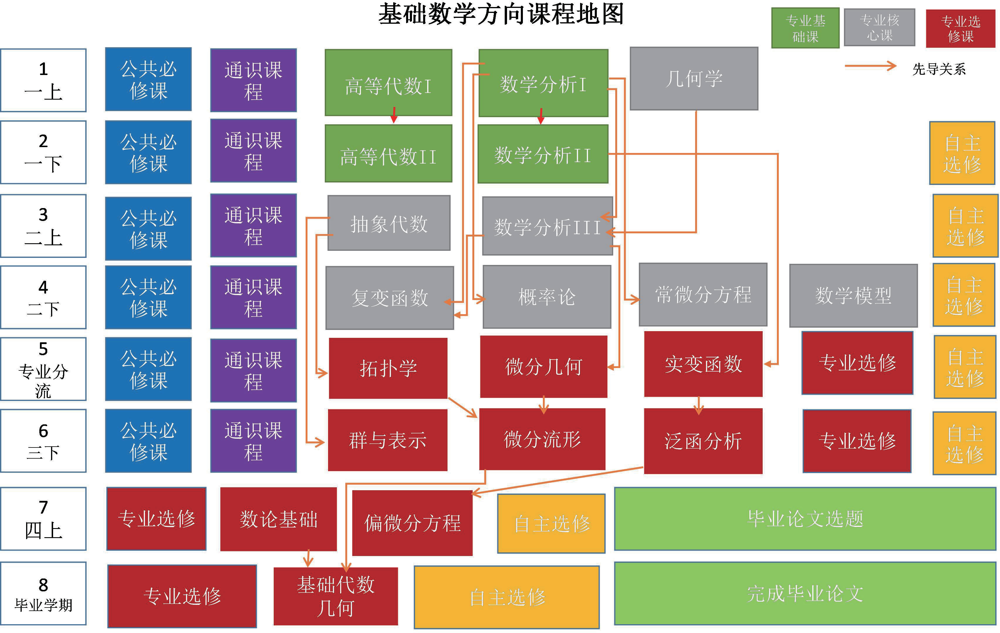
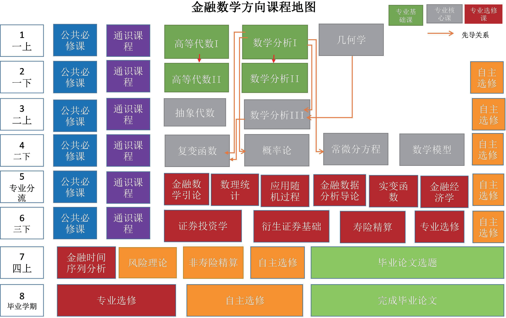
- 山大研究生考试
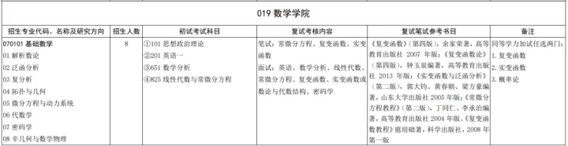
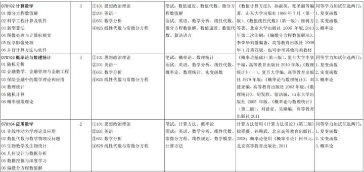
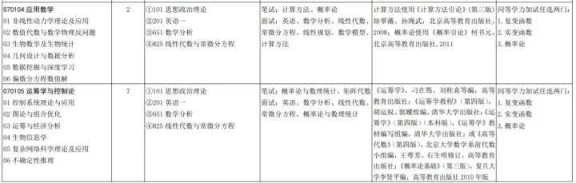

基础数学：《复变函数》（第四版），余家荣著，高等教育出版社2007年版；《复变函数论》（第四版），钟玉泉编著，高等教育出版社2013年版；《实变函数与泛函分析》（第二版），郭大钧、黄春朝、梁方豪编著，山东大学出版社2005年版；《常微分方程教程》（第二版），丁同仁、李承治编著，高等教育出版社2004年版。《复变函数教程 》扈培础著，科学出版社，2008年第一版。

计算数学：《数值计算方法》，孙淑英、张圣丽等编著，山东大学出版社1999年7月（第一版）；《数值线性代数》(第一版)，徐树方等著，北京大学出版社2006年版,2013年第二次印刷；《偏微分方程数值解法》，李荣华刘播编著，高等教育出版社2008年1月第四版，也可参考其他同类教材。

概率论与数理统计：《概率论基础》（第三版），复旦大学李贤平编，高等教育出版社2010年版；《数理统计》（一），复旦大学编，高等教育出版社1979年版；《概率论与数理统计》，刘建亚编，高等教育出版社2003年版；《数理统计》，胡发胜、宿洁编，山东大学出版社2005年版。《概率论与数理统计》（第二版），刘建亚、吴臻编，高等教育出版社2011。

应用数学：计算方法使用《 计算方法引论》(第三版) 徐翠薇、孙绳武，北京高等教育出版社，2008；概率论使用《概率引论》何书元，北京高等教育出版社,2011。

运筹学与控制论：《运筹学》，刁在筠、刘桂真等编，高等教育出版社；《运筹学教程》（第四版），胡运权、郭耀煌编，清华大学出版社；《运筹学》（第四版）（本科版），《运筹学》教材编写组编，清华大学出版社；或《高等代数》（第四版），北京大学数学系前代数小组编，王萼芳、石生明修订，高等教育出版社；《概率论基础》（第三版），复旦大学李贤平编，高等教育出版社2010年版。

- 考研推荐教材
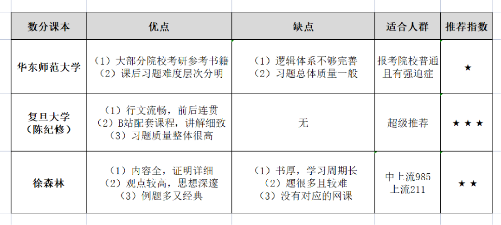
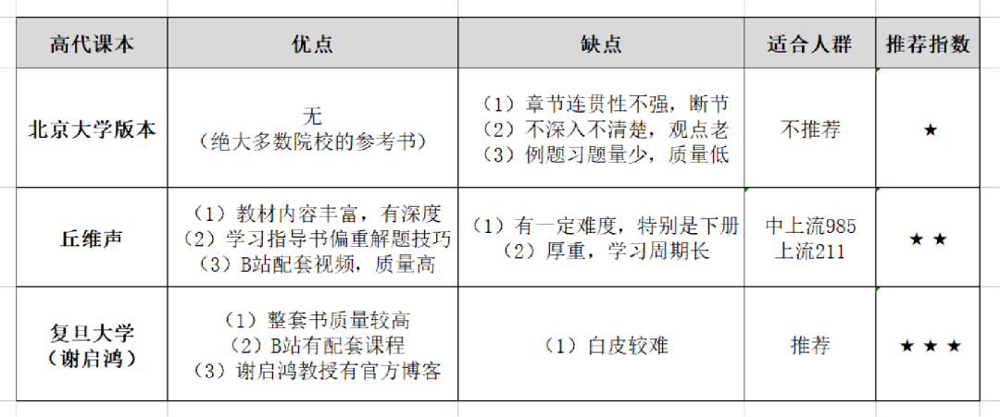

## 经典教材
- GTM系列
- 基础
    - 初等数学
        - An Excursion through Elementary Mathematics (CMN Antonio)
    - 逻辑
        - Heinz-Dieter Ebbinghaus , Jörg Flum , Wolfgang Thomas: 《Mathematical Logic ,Third Edition》
        - Rene Cori, Daniel Lascar, Donald H. Pelletier: Mathematical Logic-A course with exercise, 比Ebbinghaus那本强些.
        - Manin: GTM53

- 分析：https://zhuanlan.zhihu.com/p/563317174
    - 数学分析
        - 张筑生的《数学分析新讲》
        - 谢惠民的《数学分析习题课讲义》
    - 复分析/复变函数：一定不要看Conway的单复变函数论，过于缺少几何直观。
        - EMS的《Complex Analysis》by Joaquim Bruna、Julià Cufí，这书极好，最好在学过点集拓扑以后看
        - Tristan Needham的《复分析：可视化方法》就不用说了，齐民友先生翻译的极好，又是一本绝世好书
        - 升级：gtm287 Richard Beals•Roderick S. C. Wong 的《Explorations in Complex Functions》，讲的主要是由复分析导出的各种现代数学，包括双曲几何，黎曼曲面和代数曲线，值分布理论，包括黎曼zeta函数在内的各种特殊函数，等等，可以一瞥复分析的力量。
    -  实分析/实变函数：不推荐Folland的。
        - 入门：gtm282 Sheldon Axler的《Measure, Integration & Real Analysis》
        - gtm278 William P. Ziemer的《Modern Real Analysis》很好，证明详细 讲的够深。
    - 泛函分析
        - 入门：许全华的《泛函分析讲义》，中文最佳泛函教材
        - 升级：Haim Brezis 的《Functional Analysis, Sobolev Spaces and Partial Differential Equations》
    - 其他
        > 1. Gerald B. Folland: Real Analysis, Modern Techniques and their Applications.
        > 2. Stein 《奇异积分和函数的可微性》前三章、《调和分析》第8-10章
        > 3. Camil Muscalu, Wilhem Schlag: Classical and Multilinear Harmonic Analysis. 
        > 4. Theo Buhler, Dietmar Salamon: Functional Analysis. 
        > 5. Serge Alinhac: Hyperbolic PDE.
        > 6. Serge Alinhac: Geometric Analysis of Hyperbolic PDEs.
        > 7. others:
        > > Courant: Introduction to Calculus and Analysis, Vol.1-2
        Amann: Analysis I-III
        Rudin的书适合做习题集
        > > 习题：李傅山《数学分析中的问题与方法》；裴礼文《数学分析中的典型问题和方法》

- 代数
    - 线性代数
        - 李志慧、李永明《高等代数中的典型问题与方法》
        - 代数几何 GTM52
    - 抽象代数：群与表示、数论
        - gtm73 Hungerford:《Algebra》
        - [李文威:《代数学方法》](https://github.com/wenweili)
        - David S. Dummit: 《Abstract Algebra》
        - [北大代数线上课](http://faculty.bicmr.pku.edu.cn/~lxiao/2021fall/2021fall.htm)

- 几何学：拓扑学、微分几何、微分流形、代数几何
    - 微分方程
        - 偏微分方程Evans
    - Shoshichi Kobayashi: 《Differential Geometry of Curves and Surfaces》
    - 点集拓扑不要看任何中文教材，包括munkres的拓扑学的翻译版，如果在数分里学过度量空间的话，推荐gtm202 John M. Lee 的《Introduction to Topological Manifolds》，点集拓扑内容是二、三、四章，这书不是专门讲点集拓扑的，但是讲的极其清楚明白，而且有拓扑流形作为例子，点集拓扑学起来很有意思，202后面是极好的代数拓扑入门。正经点的点集拓扑教材推荐Marco Manetti的《Topology》，前半部分是点集拓扑，后半部分是代数拓扑入门，而且习题部分有答案。拓扑还有一本书叫做《Topology A Categorical Approach》Tai-Danae Bradley, Tyler Bryson, John Terilla，从范畴角度讲拓扑，很有意思。

- 应用
    - 概率论、数理统计；
    - 数学模型/应用数学导论、数学物理方法、物理数学方法。
    - 金融数学引论、应用随机过程、金融经济学、金融数据分析导论、金融时间序列分析；

# Society
## 历史
时间 -200万~-2000
地点（世界、中国）
- 参考书
    > 考研教材：北大十一本、百度云11册
    中国史：二十四史，资治通鉴，左传，春秋，公羊，战国策，东周列国志，万历十五年
    全球史：全球通史《现代世界史 (豆瓣)》 by R. R. Palmer & Joel Colton中譯版分前,後兩篇，Amazon 四星評價，美國大學世界通史教科書，立論客觀, 有深度, 視野開闊。《世界帝國二千年 (豆瓣)》 by Jane Burbank，2011年世界史協會(WHA)書籍獎，2010年《擇萃》(Choice)傑出學術研究獎"
    各国通史
    张耕华《历史哲学引论》
    沃尔什《历史哲学导论》
    

- 世界史
    > 斯塔夫里阿诺斯：全球通史（第7版）

- 中国史
    > 纪传体：24史
    >> 《史记》、《汉书》、《后汉书》、《三国志》、《晋书》、《宋书》、《南齐书》、《梁书》、《陈书》、《魏书》、《北齐书》、《周书》、《隋书》、《南史》、《北史》、《旧唐书》、《新唐书》、《旧五代史》、《新五代史》、《宋史》、《辽史》、《金史》、《元史》、《明史》
    
    > 编年体
    >> 《资治通鉴》《春秋》《左传》《竹书纪年》《汉纪》《后汉纪》《国榷》
    
    > 国别体
    >> 《战国策》《国语》
        
    > 野史
    >> 《三国演义》《清朝野史大观》《开元天宝遗事》《万历野获编》《清稗类钞》《酌中志》《青泥莲花记》

    > 其他史料
    >> 圣旨、上书、人物墓志铭等

## 宗教
伊斯兰教：《古兰经》
基督教：《旧约圣经》《新约圣经》
道教：《道德经》又称《道德真经》；《庄子》又名《南华经》。
佛教：《楞严经》《法华经》

## 艺术
- 创作
    > 麦基：故事
    救猫咪
    你的剧本逊毙了
    沃格勒，讲公式：作家之旅
    乔瑟夫·坎伯，讲案例：千面英雄
    讲辛酸和花招：史蒂芬金谈写作

- 表演
    > 斯坦尼斯拉夫斯基系列
    > > 《演员的自我修养》
    《演员创造角色》
    《我的艺术生活》
    
    > 其他
    > > 《布莱希特戏剧集》
    《莎士比亚全集》
    《易卜生戏剧集》
    《斯特林堡戏剧选》
    心理学类书籍

- 文学
托尔斯泰：安娜卡列尼娜、战争与和平
陀思妥耶夫斯基：卡拉马佐夫兄弟
马尔克斯：百年孤独
贾平凹：散文、老生，带灯，古炉

## 哲学
### 表达类
> 金字塔原理
学会提问
用图表说话

### 自我管理类
> 高效能人士的七个习惯：持续改进模型PDCA，确定目标（明确是什么为什么）→策略制定（明确路径和所需资源）→执行过程监控→执行结果评价→复盘迭代。
领导梯队

## 经济学

- 期刊
    > 金融,书籍,alphanomics、barra handbook操作手册,推荐
    期刊,经济,光华[GSM](https://www.gsm.pku.edu.cn/graduate/info/1159/6102.htm),推荐
    期刊,经济,American Economic Review (AER),top5-1
    期刊,经济,Econometrica,top5-2
    期刊,经济,Journal of Political Economy (JPE),top5-3
    期刊,经济,Quarterly Journal of Economics (QJE),top5-4
    期刊,经济,Review of Economic Studies (RES),top5-5
    期刊,管理,Management Science (MS),top2-1
    期刊,管理,Operations Research (OR),top2-1
    期刊,管理,Manufacturing & Service Operations Management（MSOM）,top-sub
    期刊,管理,Production and Operations Management（POM）,top-sub
    期刊,管理,Mathematical Programming (MP),top-sub
    期刊,管理,Proceedings of the National Academy of Sciences (PNAS),top-sub
    期刊,经济,UTD24,推荐
    期刊,经济,FT50,推荐
    
- 计量
> Sargent：递归
Greene＋Baltagi：计量
J. M. Wooldridge：计量经济学导论
哈密尔顿，时间序列的巅峰之作：时间序列分析
W. Enders：应用计量经济学：时间序列分析
R. S. Tsay：Analysis of Financial Time Series

- 管理
> 科特勒的《营销管理》
社会心理学
财务会计

## 光华金融教材
### 固定收入证券
固定收入证券是一大类重要金融工具的总称，其主要代表是国债、公司债券、资产抵押证券等。固定收入证券包含了违约风险、利率风险、流动性风险、税收风险和购买力风险。各类风险的回避是固定收入证券被不断创新的根本原因。尽管固定收入证券存在着违约风险和流动性风险，但本课程不涉及这两项内容；利率期限结构理论是固定收入证券课程的重要内容，但本课程只涉及单因素的利率期限结构模型，不涉及多因素利率期限结构模型。本课程主要讲授固定收入证券的计价习惯，零息债券，附息债券，债券持续期、凸性和时间效应，债券投资利率风险管理、利率期限结构模型，含权债券定价，利率期货、期权，回购、互换，住房贷款支撑证券（MBS）等。

1、Bruce Tuckman, Fixed income securities: tools for today's markets, John Wiley & Sons, Inc. 1995. 本书中文版已经由黄嘉斌翻译，由宇航出版社/科文（香港）出版有限公司出版。2、Frank J. Fabozzi, The handbook of fixed income securities, Irwin Professional Publishing, 5th edition, 19973、Suresh Sundaresan, Fixed income markets and their derivatives, southwestern college Publishing, 1996.4、Fixed Income Analysis foe the Chartered Financial Analyst Program, by Frank Fabozzi参考资料：本课程有相当多的资料供大家阅读
### 行业研究中的微观经济学
行业研究中的微观经济学 Microeconomics and Its Application in Industrial Research
本课程是一门用来分析现实经济问题的应用经济理论课，本课将探讨一些微观经济学和产业经济学的经典理论及重要问题，并结合商业案例教学，以有助于学生应用于金融行业中广泛存在的行业研究。通过本课的学习，学生将对微观经济学的一些重要理论和产业经济学的经典模型和分析框架有一个深入的了解；能够运用相关的经济学知识来分析企业行为、市场运行、产业结构演化等实际产业问题，培养学生的理论素养和解决实际问题的能力。本课程主要包括基本微观经济学内容回顾，微观产业组织经典模型和应用以及相应的产业政策组成，具体包括企业理论、市场结构、竞争战略、市场绩效、政府规制与反垄断等产业组织问题。

### 金融科技基础及应用
金融科技基础及应用 - Fintech Basis and Applications

针对目前金融科技（Fintech）对金融市场及金融机构的冲击，开设此课程。课程内容是向学生介绍Fintech有关的概念，以及各种科技创新，包括人工智能，区块链等在金融方面的应用。这门课程属于实践课程，将邀请金融科技领域的业界专家分享Fintech在业界的最新应用与发展。
课程要达到的目标有两重。其一是在量化方向上，让学生学习掌握使用简单的数据分析软件进行大数据分析，智能投顾的操作。理解机器学习的概念； 其二是在对Fintech市场的理解上，了解最新的如加密货币（比特币）市场，区块链的概念，以及其在金融领域的最新应用。
课程内容包括，Fintech简介；学习简单的数据分析软件及进行基本的大数据分析；使用数据编程软件进行最基本的智能投顾操作；大数据在普惠金融方面的应用； 比特币的知识及加密货币市场介绍；利用多个加密货币市场价差寻找套利机会；区块链的知识；区块链在金融领域的几个落地应用的案例讨论。
课程没有闭卷考试。打分分为课堂参与，及小组项目部分。学生将分为几个小组，按组完成一项Fintech相关的应用项目。项目可以在几个题目中选择，包括完成一个计算机编程交易股票的交易策略设计及程序编写；完成一笔跨市场的加密货币套利交易；提供一个区块链的应用场景的计划书；参与到一项人工智能机器学习的项目中并完成一个报告。

The FINTECH Book: The Financial Technology Handbook for Investors, Entrepreneurs and Visionaries， Susanne Chishti, Janos Barberis， ISBN: 978-1-119-21887-6
Blockchain Revolution, Don Tapscott / Alex Tapscott ， ISBN: 9781101980132
《金融科技》重构未来金融生态， 周伟 张健 梁国忠， 中信出版社 / 2017-08
《区块链:从数字货币到信用社会》， 长铗、韩锋等, 中信出版社, 2016-07
《区块链:定义未来金融与经济新格局》， 张健， 机械工业出版社, 2016-6, ISBN: 9787111541097

### 金融3
本课程是金融经济学的高阶课程，目的在于提高金融硕士在金融学领域的学术素养和理论层次。学生应该先学习投资学、公司财务等基础课程。通过本课程，学生能够掌握金融经济学的核心内容，并了解金融经济学领域的最新发展。

Huang, C. and R. H., Litzenberger, Foundations for Financial Economics, Elsevier Science Publishing Co., Inc., 1988.

### 金融市场
金融市场与金融机构的迅速发展是今日社会的热点之一。本课程致力于理解金融市场与金融机构的整体运转，分析这一领域涌现出的大量现象。课程的定位是金融学理论与市场操作的中间点，侧重于以金融学理论分析金融市场与金融机构的组织与结构，以及这一领域发展中出现的各种问题。金融机构部分将讨论商业银行等存款性金融机构，投资基金、投资银行、金融公司等非存款性金融机构，以及中央银行的功能。金融市场部分将讨论一级市场与二级市场的组织与微观结构，重点是股权市场和货币市场。课程的各部分都以美国市场为例开始对一般金融现象的分析，再辅之以中国市场或机构的发展与问题探讨。

1．Madura, Jeff，Financial markets and institutions, 7th  edition, 北京大学出版社，2008。
2．曹凤岐，贾春新，《金融市场与金融机构》，北京大学出版社,2002。
3.法博齐等原书，孔爱国等译，《金融市场与金融机构基础》（原书第4版），机械工业出版社，2010。
4.桑德斯（Saunders，A.）,科尼特（Cornett，M.M.），《金融市场与金融机构》（第3版）双语版，人民邮电出版社，2008。

## 投资
> CPA CFA ACCA
价值线value line
穆迪手册moody's manual

- 思想
> 唐朝：价值投资实战手册
布鲁斯·格林威尔：价值投资 : 从格雷厄姆到巴菲特
詹姆斯·蒙蒂尔：价值投资 : 通往理性投资之路
邱国鹭：投资中最简单的事
邱国鹭：投资中不简单的事
霍华德•马克斯：投资最重要的事
霍华德·马克思：《投资最重要的事》
约翰·博格尔：《共同基金投资法则》、《共同基金常识》、《投资稳赚》Common Sense。
本杰明·格雷厄姆：《聪明的投资者》
安全边际
巴菲特的护城河

> 《巴菲特致股东的信》
《巴菲特之道》
《跳着踢踏舞去上班》
《穷查理宝典—查理芒格智慧箴言录》
《证券分析》（本杰明·格雷厄姆版本）
《聪明的投资者》
《怎么选择成长股》
《彼得林奇的成功投资》

> 思考，快与慢。
彼得·林奇：战胜华尔街。
伯顿•马尔基尔：漫步华尔街（第10版）。
罗伯特•希勒：非理性繁荣（第二版）。
乔治•索罗斯：金融炼金术。
约翰•戈登：伟大的博弈（1653-2011）。
沃尔特•白芝浩：伦巴第街。
迈克尔•刘易斯：说谎者的扑克牌（纪念版）。
詹姆斯·索罗维基：《群体的智慧》。反复证明了群体决策的有效性和高智慧
丹尼尔·卡尼曼：《思考，快与慢》。
丹·艾瑞里：《怪诞行为学》。
大卫·汉德：《不大可能法则》。深刻的统计陷阱认识
理查德·塞勒：《错误的行为》、《助推》。
批判思维。
纳西姆·塔勒布：《黑天鹅》。投资领域的必读经典之一。
迪姆森、马什、斯汤腾：《投资收益百年史》。工具书
罗杰·洛温斯坦：《营救华尔街》。
查尔斯·埃利斯：《高盛帝国》。
莫哈末徳·埃尔-艾里安：《负利率时代》。各国政府面临的挑战，以及可能的应对措施。
罗杰·洛温斯坦：《Origins of the crash（危机起源）》。详细的分析了为什么美国会在2000/2001年发生股灾。
查理·芒格，：《穷查理宝典》。
罗杰·洛温斯坦：《巴菲特传》。
爱德华·索普：《战胜庄家》。“出奇制胜”的“奇书”
杰里米·西格尔：《股市长线法宝》。

> 宏观策略
    >> 高铁梅：经济周期波动分析与预测方法
    张延：中级宏观经济学
    高善文的分析思路

> 固收
    >> 债券理论
    CFA L1、L2：FIXED INCOME
    安东尼·克里森兹：债券投资策略（原书第2版）
    弗兰克·J·法博齐：债券市场 : 分析与策略
    弗兰克·法博齐：《固定收益证券手册》。该书从理论到实践，把整个逻辑链讲的非常清楚。该书的缺点是有一定的专业门槛，不太适合非金融专业的投资小白。

    > 债券进阶
    >> 徐小庆、董德志、屈庆、徐寒飞：专题报告
    人民银行网站：公开市场操作、《货币政策执行报告》
    弗兰克·J·法博齐：固定收益证券手册（上下册） : 第七版
    摩根士丹利分析师：资产配置的艺术
    李超：宏观经济、利率趋势与资产配置
    马丁 J. 普林格：积极型资产配置指南 : 经济周期分析与六阶段投资时钟
    伍戈、李斌的三部曲
    王静波：债券博弈 : 弄潮国际债券市场的中国企业
    董德志红宝书：投资交易笔记 : 2002-2010年中国债券市场研究回眸
    董德志红宝书：投资交易笔记（续） : 2011~2015年中国债券市场研究回眸
    王静波：债券博弈 : 弄潮国际债券市场的中国企业

    >债券公众号
    >> （1）宏观类：中金固收、中信明明债券研究（明晰笔谈、CITICS债券研究 两个公众号）、郭磊宏观茶座、屈庆债券论坛、姜超宏观债券研究
    （2）利率类／银行间：NAFMII资讯、CfetOnline发布、债券小笔记、建行金融市场部
    （3）信用类：ratingdog、阿发喵策略研究、宅基弟、资管九日君、园园ABS研究
    （3）法律类：北大法律信息网（有公众号）、中伦视界
    （4）八卦类：债券圈、债市观察、咩咩说、向小田

- 资产配置和量化
    > Andrew Berkin和Larry Swedroe：《因子投资指导手册》。关于聪明贝塔的最全面，最严谨的专业书籍之一。
    詹姆斯·奥校内西：《华尔街股市投资经典》
    威廉·伯恩斯坦：《有效资产管理》
    大卫·达斯特：《资产配置的艺术》

- 产业研究
    > 郎咸平：产业链研究系列
    发现商业模式
    利润模式
    找到利润源
    小巨人

- 企业研究
    > 波特：竞争战略
    波特：竞争优势
    企业战略博弈：揭开竞争优势的面纱
    星巴克——三本
    华为——三本
    浪潮之巅

- 财务分析
    > 黄世忠：财务报表分析：理论框架方法与案例
    > 夏草：远离财务骗术
    > 夏草：上市公司48大财务迷局
    > 夏草：财务揭黑
    > 夏草：IPO 40大财务迷局
    > 夏草：会计迷局 解
    > 夏草：点睛财务舞弊
    > 夏草：财务侦探返现财务错报
    > 财务骗术
    > 唐朝：《手把手叫你读财报》
    > Business Analysis and Valuation: Using Financial Statements——哈佛分析框架，即从战略分析、会计分析、财务分析、前景分析四个方面建立财务分析的逻辑框架
    > 哈佛大学佩普（Palepu）、希利（Healy）和伯纳德（Bernard）：运用财务报表进行企业分析与评估
    > Financial statement analysis and security valuation——哥伦比亚大学的斯蒂夫佩因曼，适合进阶，重构的分析框架。
    > Stephen H. Penman: Financial Statement Analysis and Security Valuation
    > K. R Subramanyam and John J. Wild: Financial Statement Analysis
    > Krishna G. Palepu and Paul M. Healy: Business Analysis and Valuation: Using Financial Statements
    > Russell Lundholm and Richard Sloan: Equity Valuation and Analysis With eVal
    > 中级财务会计——东北财经大学出版社
    > cpa教材：会计+财管

- 估值建模
    > 价值评估：公司价值的衡量与管理
    > 达摩达兰系列：投资估价(偏传统理论)、估值：难点解决方案及相关案例，简单介绍了一些理论，覆盖了一些未上市或初创企业。
    > 基础类：《财务建模：设计、构建及应用的完整指南》约翰S.提亚，《财务模型与估值：投资银行和私募股权实践指南》保罗·皮格纳塔罗（Paul Pignataro）
    > 进阶类：《投资银行：估值杠杆收购兼并与收购》乔舒亚·罗森鲍姆，乔舒亚·珀尔，保罗·皮格纳塔罗，约翰S.提亚
    > valuation: measuring and managing the value of companies——Tim Koller

- 证券分析
    > 本杰明•格雷厄姆：证券分析 : 第6版（平装上、下）
    杰弗里.C.胡克：华尔街证券分析 : 现代证券估值方法综合指南
    林森池：證券分析實踐 : 從香港經驗認識國企前景
    股市真规则
    华尔街证券分析

    > 机构
    > > Dan Morgan：《Merchants of Grain（粮食商人）》
    西蒙·拉克：《对冲基金暴利真相》
    大卫·斯文森：《机构投资的创新之路》

    > 市场
    > > 《股票大作手操盘术》、《股票作手回忆录》。操盘术中对于市场理解的叙述更多，是整个股市的圣经。
    《看盘细节》。技术分析进阶
    《通向财务自由之路》。交易理解比较深入，全面、深入的市场机理和运作，职业化交易必读。
    大卫·斯文森：《海龟交易法则》。
    张轶译，没有出版：《真正的海龟交易者》。是众多海龟故事和海龟交易版本中最好的一本。
    迈克尔·刘易斯：《说谎者的扑克牌》。
    托马斯·斯丹利和威廉·丹科：《邻家的百万富翁》。
    大卫·斯文森：《不落俗套的成功》。针对广大散户个人投资者的投资智慧
    伯顿·麦基尔：《漫步华尔街》。“证据主义”分析方法，基于严谨的科学研究。
    查尔斯·埃利斯：《赢得输家的游戏》。市场中交易博弈的道理说的非常通透

    > 人性
    > > 乔治·阿克洛夫、罗伯特·席勒：《钓鱼》
    罗伯特·席勒：《非理性繁荣》
    彼得·伯恩斯坦：《与天为敌》
    利亚艾特·艾哈迈德：《金融之王》

- 高瓴推荐
    > 《商界局外人》
    《奈飞文化手册》
    《贝佐斯致股东公开信》
    纪录片《成为沃伦·巴菲特》
    《互联网趋势报告（2016-2019）》

    > 《机构投资的创新之路》
    《共同基金常识》
    《私募的进化》
    《价值之道：公司价值管理的最佳实践》
    《横越未知》

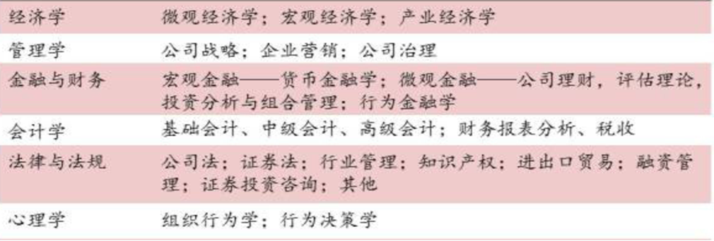
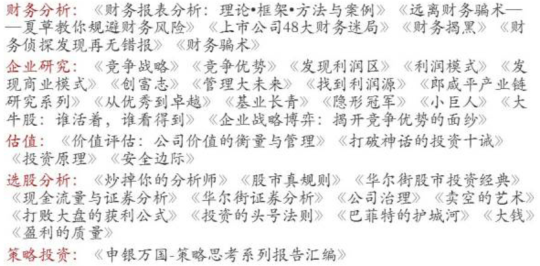
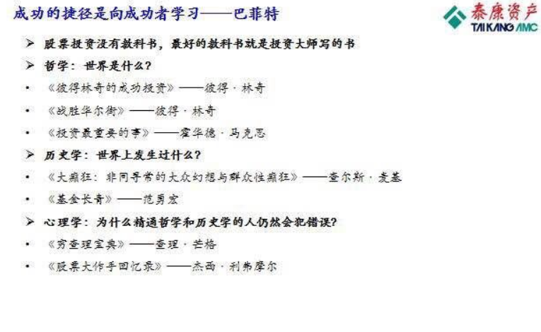

# Nature
## 物理
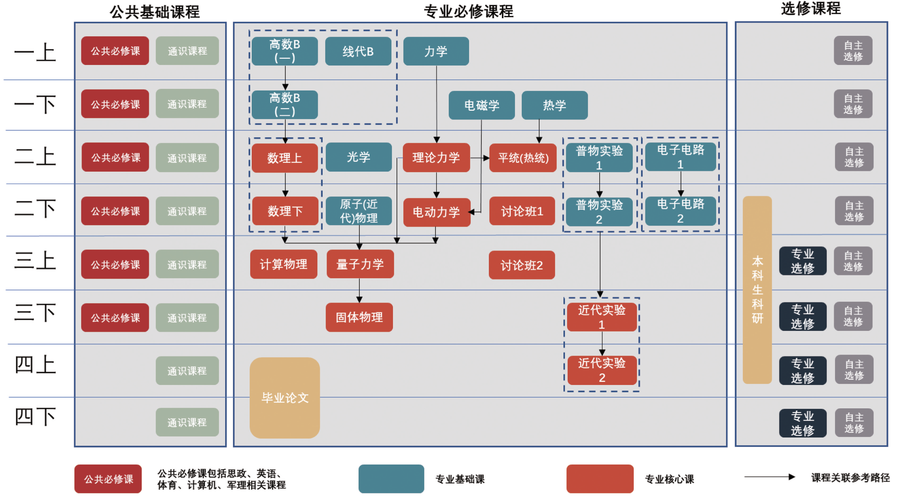
费曼物理学讲义、朗道十卷  费曼的物理三卷
力学、热学、电磁学、光学、原子物理(近代物理)
理论力学、平衡态统计物理(热力学与统计物理)、电动力学、固体物理学、量子力学
计算物理学
天体物理

- 官机构
    > [美国物理协会APS]()：宽泛的物理杂志

- 期刊
    > [Physical Review Letters]()：新文章
    [Reviews of Modern Physics]()：综述文章

# 待分类

高瓴张磊的采访文集、高毅相关的文集
吴军：《浪潮之巅》、《智能时代》、《IT通史》，《美国产业结构》，《现代资本主义》，《看得见的手》
《价值之道：公司价值管理的最佳实践》
巴芒演义pdf

大数据时代宏观经济仿真系统的框架构造 欧阳汉
经济系统建模与仿真  作者：屠仁寿
社会系统动力学	7.8(12人评价)	李旭 / 复旦大学出版社 / 2009-1 / 
现代宏观经济学 : 起源、发展和现状	9.4(132人评价)	[英] 布莱恩·斯诺登 
宏观经济动态学方法	斯蒂芬·J.托洛维斯基
应用经济学：产业经济学、（子行业）产业经济学、农业经济学、工业经济学、建筑经济学、运输经济学、商业经济学

《互联网趋势报告（2016-2019）》
2020中国速消品早期投资机会报告
产业蓝皮书：中国产业竞争力报告（2019）
2019年《全球竞争力报告》
2019年产业竞争力分析报告
一带一路国家产业竞争力分析报告

苏世民 我的经验与教训
吴晓波：《激荡三十年》　《大败局》
高善文：《经济运行的逻辑》、《透视繁荣——资产重估深处的忧虑》、《在周期的拐点上：从数据看中国经济的波动》
李超：宏观经济、利率趋势与资产配置
固定收益证券手册 : 第六版 8.8(79人评价) 弗兰克·J·法博齐
逃不开的经济周期 : 历史，理论与投资现实 8.5(1297人评价) 拉斯·特维德
积极型资产配置指南 : 经济周期分析与六阶段投资时钟 8.0(38人评价) 马丁 J. 普林格

权益类：
娱乐产业经济学 : 财务分析指南	8.6(52人评价)	Harold L.Vogel 
商务动态分析方法 : 对复杂世界的系统思考与建模	8.6(54人评价)	约翰·D.斯特曼
你也可以成为股市天才	8.9(42人评价)	格林布拉特 
股市天才 : 发现股市利润的秘密隐藏之地	8.4(284人评价)	乔尔·格林布拉特(Joel Greenblatt) 
You Can Be a Stock Market Genius : Uncover the Secret Hiding Places of Stock Market Profits	9.2(98人评价)	Joel Greenblatt 
電子產業,懂這些就夠!三十天吸收三十年專業能力 作者: 劉國棟 
西安电子科大 产业经济学 视频

货币政策、通货膨胀与经济周期 : 新凯恩斯主义分析框架引论 8.5(17人评价) 若迪·加利
消费者行为学

银行估值：一是现任央行副行长潘功胜的《上市银行价值分析》;二是杰恩·德米内教授的《银行估值与价值管理》

与中国打交道  亨利 保罗森  henry M. Paulsom  中国的改革本质和中国问题
华尔街证券分析、索罗斯及其机构的书籍：量子投资方法、索罗斯的个人著作、推荐书籍

价值投资 : 从格雷厄姆到巴菲特
證券分析實踐 : 從香港經驗認識國企前景
创新者的处方（医药）、创新者的解答（电信）、创新者的窘境
商业模式新生代 亚历山大 奥斯特瓦
智慧转型：重新思考商业模式
麦肯锡：软件成功的奥秘

IT类
浪潮之巅
光变
激荡三十年：中国企业1978~2008
区块链接智能 : 深入剖析区块链与十大行业深度结合，让你快速入门区块链
医药类
十亿美元分子 作者: [美] 巴里 沃思

零售类
零售管理 作者: [美]迈克尔 利维 
体验式零售 : 传统行业转型新零售实战方法论  
新零售机遇 任何生意都值得重做一遍
零售无界 新零售革命的未来   道格 斯蒂芬斯
创业
如何测试商业模式:创业者与管理者在启动精益创业前应该做什么

华为系列：
枪林弹雨中成长 讲外派员工的故事
厚积薄发 讲通信技术方面的故事
黄沙百战穿金甲 华为系列故事第三本，华为人讲述华为财经团队的故事

