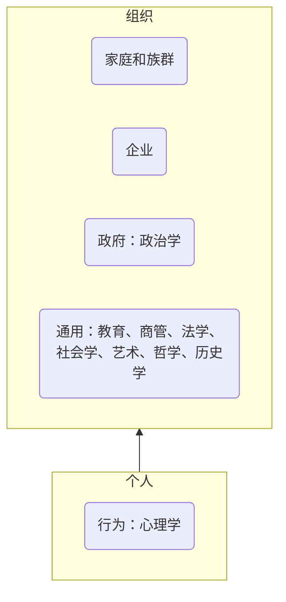

# Society

```mermaid
flowchart BT
    subgraph s1[个人]
    direction LR
    c11("行为：心理学")
    end
    subgraph s2[组织]
    direction LR
    c21("家庭和族群")
    c22("企业")
    c23("政府：政治学")
    c24("通用：教育、商管、法学、社会学、艺术、哲学、历史学")
    end
    s1 --> s2
```

# 个人
- 心理学和行为学

# 组织
- 家庭
- 民族
- 乡土和城市
- 企业
- 政府

# 社会
- 经济学
- 群体行为
- 社会学
- 法律
