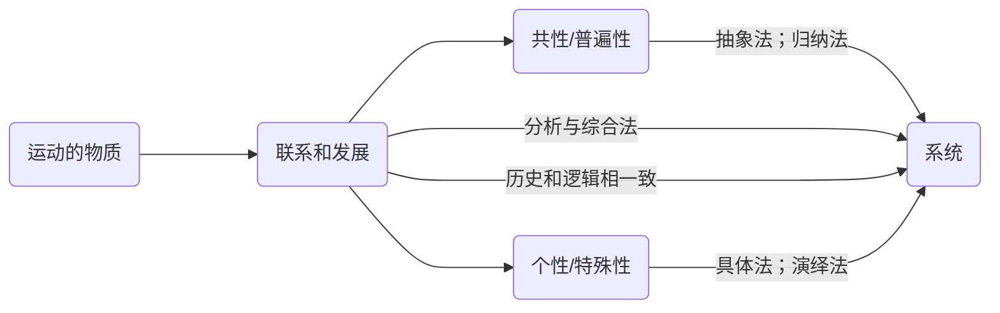
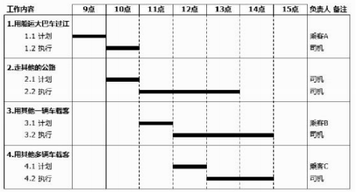
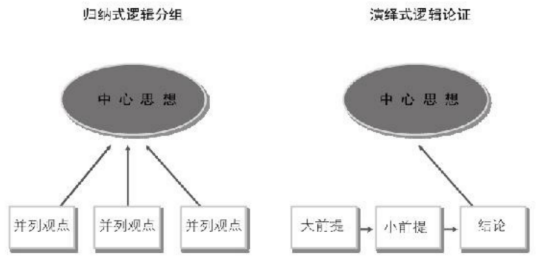
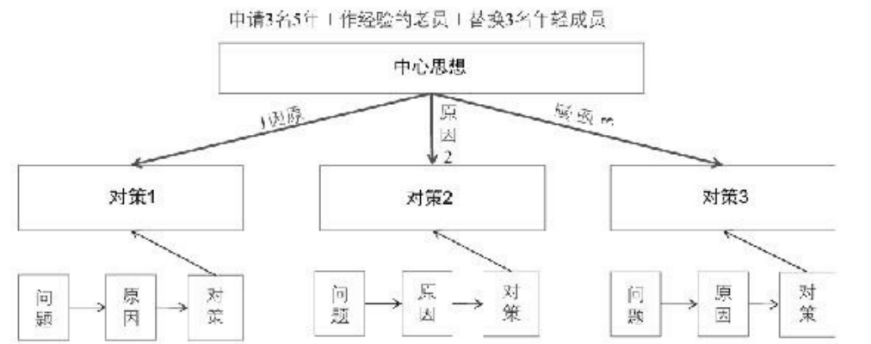
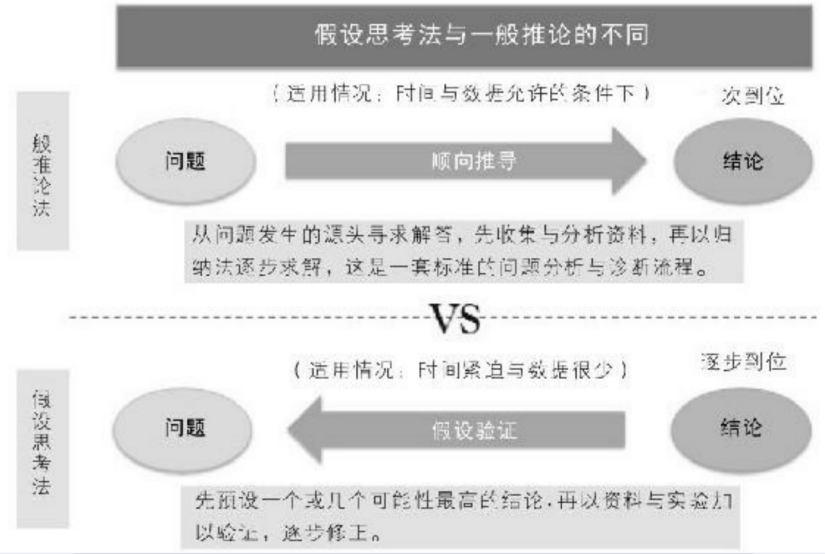
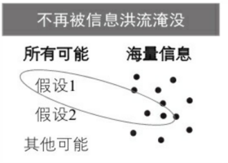
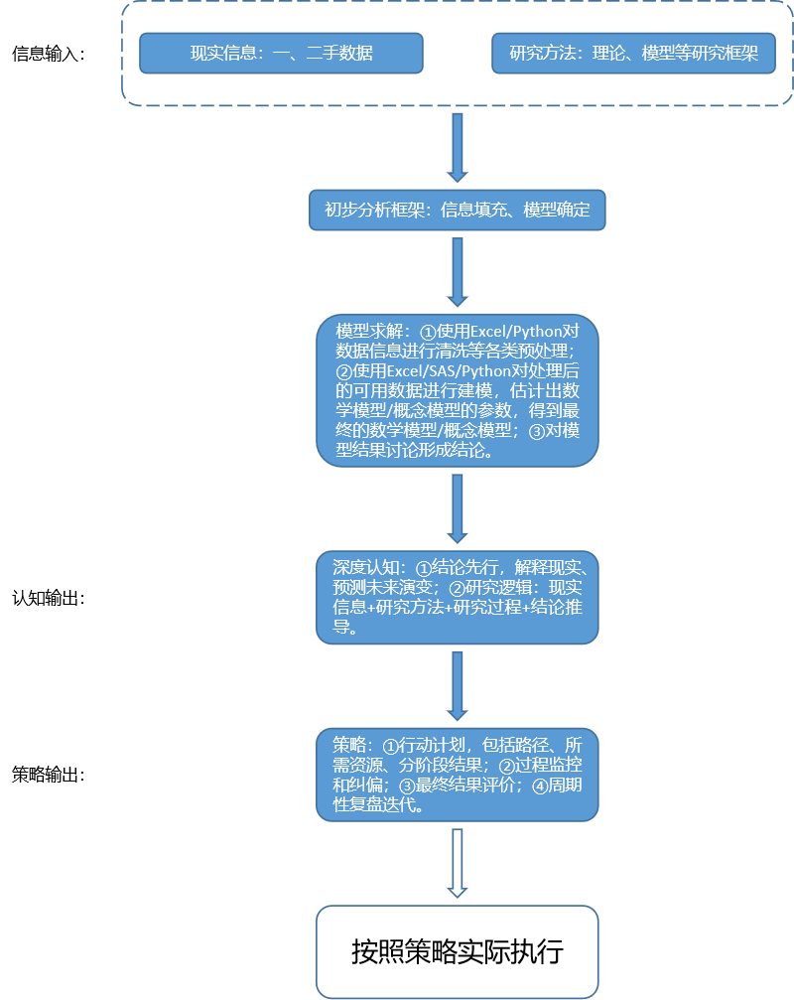
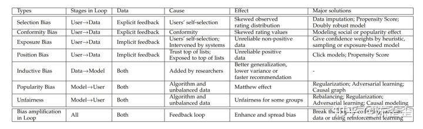

# 总论
世界的本质是运动着的物质，驱动物质运动的力量暂且称之为"矛盾"，这些矛盾是普遍联系的。我们永远不可能通过掌握所有的细节去理解这个普遍联系着的运动着的无限的世界，但"相对静止"的存在为我们理解局部世界创造了条件，我们可以在一定时间、地点、条件下在一定程度上隔离出一个有限的局部世界，通过构建局部系统框架去理解小世界，尽管不能100%仿真还原真实世界，但能够解释最关键的部分就足够了。
-   抽象法/归纳法：概括质和逻辑上的相似性。
-   具体法/演绎法：具体的时间、地点、条件下的质变和量变过程。
-   分析与综合法：两点论和重点论结合下的系统分析方法。
-   历史和逻辑相一致：历史研究法。

# 世界观

## 世界的本质：运动着的物质

(1) 物质：具有客观实在性，是运动的载体。

-   思维方式1任何规律都有物质基础：任何规律都需要物质载体，都能找到其物质条件或物质前提。

(2) 运动：物质的存在方式。运动是绝对的，静止是相对的。

-   思维方式2动态地思考问题：运动是绝对的，一切事物、规律都在不断地演进，需要保持动态思维。

-   思维方式3任何规律都有适用范围：静止是相对的。

    -   第一，我们在探索规律时需要利用相对静止，例如我们通过控制一些干扰变量(Z1、Z2、Z3)，使其处于相对静止的稳定状态，然后才能对剩下的我们关心的变量(Y、X)进行因果推断，得到Y和X之间的因果规律；

    -   第二，我们在利用Y和X之间的规律时需要铭记它是相对静止的，也就是说只有在某些前提条件(Z1、Z2、Z3)下，Y和X之间的规律才是稳定的、可以利用的，否则Y和X之间的规律就会发生改变。

(3) 物质运动的存在形式：空间和时间，空间是物质的广延性或伸张性，常表现为一定的体积和一定的位置；时间是用来描述物质运动的持续性、顺序性，具有一维性(任何一个物质运动的持续性都可以用一个数来表示)，时间总是沿着过去、现在和将来一个方向发展。

-   思维方式4准确定义问题：只有想清楚问题在空间和时间上的边界，才能进一步聚焦出问题的关键所在。

-   思维方式5具体问题具体分析：一切以时间、地点、条件为转移。

-   思维方式6对比分析：在空间上进行对比(不同地域对比、不同行业对比、不同学科对比、年龄性别等维度)；在时间上进行对比(历史和历史对比、历史和现在对比、历史和预测对比)。

(4) 物质运动的多样性和统一性

-   多样性：区别是物质运动之间的质的规定。

-   统一性：物质运动之间具有共性，是推理的基础。

## 世界的表现：普遍联系和发展

(1) 联系和发展：联系指事物间的相互作用关系，事物相互作用导致事物不断向前发展，相互作用的形式主要包括物质交流、能量交流、信息交流(信息交流借助物质和能量)三种。联系具有普遍性和多样性，联系的普遍性指事物内部不同部分和要素之间是相互联系的、事物之间是相互联系的、整个世界是相互联系的统一整体；联系的多样性指联系具有内部联系/外部联系、直接联系/间接联系、必然联系/偶然联系、本质联系/非本质联系之分。

-   思维方式7系统思维：联系的普遍性造成了事物普遍地以系统的形态存在着，系统是指由相互联系、相互作用的若干要素组成的具有稳定结构和特定功能的有机整体，系统具有整体性、结构性、层次性、开放性。系统思维就是要构建出问题所处的系统结构，要避免遗漏或错判系统的主要组成要素，也要避免遗漏或错判系统内各要素之间、系统和环境之间的相互作用关系。

    -   第一整体性观念：将系统作为整体来思考其动态行为；

    -   第二结构性观念：即结构性思维，要明确系统内的不同要素(定义/边界)和要素之间的相互作用关系

    -   第三层次性观念：一个大系统可能由多个子系统组成，每个子系统的要素和结构不同具备的功能也不同，这些不同功能相互配合使整个大系统拥有更强的功能。从不同层次可以隔离出不同的系统级别。

    -   第四开放性观念：系统和外部环境之间的相互作用可能会改变系统的结构和行为，因此需要保持开放性观念。

    -   第四动态性观念：系统的形成、发展、消亡

(2) 联系和发展的基本环节：整体与部分；原因与结果；必然性与偶然性；可能性与现实性；现象与本质；内容与形式。

-   思维方式8全局思维：整体包含部分(整体可以分解成若干部分)，部分反映整体(可以根据各个部分从不同程度和不同角度去认识整体)；整体是另一个更大整体的部分(整体受到外部更大整体的约束)，而部分能在脱离整体后成为新整体(新整体和原来的整体有相似性也有区别)。

    -   综合分析法：分析法是把事物和现象的整体分割成若干部分进行研究，综合法是把剖析过的各个部分及其特征结合为一个整体的思维方法。

    -   统计推断&机器学习：从部分样本特征推断或学习全体特征。

-   思维方式9因果推断思维：因果关系是引起与被引起的关系，在时间上是前后相继的(~~量子纠缠的超距作用是否违背了因果的前后相继性~~)，在空间上是彼此制约的。

    -   因果推断方法：统计推断因果的理论基础。①事物处于一个无限制的因果关系循环之中，因为A，所以B，因为B所以C，这里B既是A的结果又是C的原因，因此因果关系必须在同一时间、同一空间才是确定的，我们控制其他变量不变来模拟同一时空，这时推断出的因果关系才是可靠的。②实际因果关系复杂多样，包括一因多果、一果多因、同因异果、同果异因、多因多果、复合因果，因此我们控制其他原因不变才能锁定唯一的原因。(独立性、相关性、因果性)

    -   因果闭环系统：原因和结果相互作用互为因果，因为A变成A1，所以B变成B1，因为B变成B1，所以A1变成A2，即原因产生结果，结果可能会反过来影响原因。如果结果对原因是促进的，那么这是一个不断增强的闭环，如果结果对原因是抑制的，那么这是一个更复杂的闭环(可能是一个收敛的系统，也可能是一个发散的混沌系统)。

    -   因果预测：因果互相渗透，结果存在于原因之中，原因变现在结果之中。因此可以通过结果反推原因，也可以通过原因预测未来的结果(特别是对一些非线性的拐点预测)。

-   思维方式10归纳演绎法：善于从偶然性的事物中归纳出必然性的趋势。

-   思维方式11情景分析法：可能性被包含在现实中，预示着事物发展的各种趋势。因此需要立足现实，分析事物发展的各种可能的情景。

-   思维方式12通过现象判断本质：任何本质都需要通过现象表现出来，因此可以针对现象设计各类指标，来表征现象背后的本质，然后就可以对这些数字化的指标对本质进行规律分析。

-   思维方式13内容决定形式：电子书和纸质书的演变？内容决定形式，形式反作用于内容，因此要根据内容的需要对形式进行取舍、改造、创新。

(3) 事物发展过程中的质变和量变：事物存在的质、量、度，任何事物都是质和量的统一体，量变是事物数量的增减和次序的变动，是保持事物的质的相对稳定的不显著的变化，体现了事物渐进过程的连续性。质变是事物性质的根本变化，是事物由一种质态向另一种质态的飞跃，体现了事物渐进过程和连续性的中断。区分量变和质变的根本标志是事物的变化是否超出度，在度的范围内的变化是量变，超出度的变化是质变。

-   质是一事物成为自身并区别于它事物的规定性。事物质的规定性是由事物内部矛盾的特殊性所决定的。事物的质是通过属性表现出来的，属性是一物和他物在相互联系中表现出来的质。认识质是认识和实践的起点和基础。只有认识质，才能区别事物。

-   量是事物存在和发展的规模、程度、速度以及它的构成成分在空间上的排列组合等可以用数量表示的规定性。认识量的意义，一是，认识事物的量是认识的深化和精确化，只有认识量才能更深刻地把握质；二是，只有正确了解事物的量，才能正确估计事物在实践中的地位和作用，因为同质的事物由于数量不同，在实践中的地位和作用往往不同。

-   质和量的统一为度：度是事物保持自己质的数量界限，即事物的范围、幅度和限度。它的极限叫关节点，超出了关节点,事物就形成了新的质量统一。认识度才能确切地把握事物的质，不致混淆不同的事物；认识度才能为实践活动提供正确的准则即适度原则，防止"过"或"不及"。

-   事物发展的置变和质变及其辩证关系：做任何事情，既要有质的要求，又要有量的要求，做到心中有数。

    -   第一，量变是质变的必要准备。任何事物的变化都有一个量变的积累过程，没有量变的积累，质变就不会发生。

    -   第二，质变是量变的必然结果。单纯的量变不会永远持续下去，量变达到一定程度必然引起质变。

    -   第三，量变和质变是相互渗透的。一方面，在总的量变过程中有阶段性和局部性的部分质变；另一方面，在质变过程中也有旧质在量上的收缩和新质在量上的扩张。量变和质变是相互依存、相互贯通的，量变引起质变，在新质的基础上，事物又开始新的量变，如此交替循环，形成事物质量互变的规律性。质量互变规律揭示了事物发展的形式和状态，体现了事物发展的渐进性和飞跃性的统一。

(4) 事物发展过程中的肯定和否定：事物内部都存在着肯定因素和否定因素。肯定因素是维持现存事物存在的因素，否定因素是促使现存事物灭亡的因素。

-   辩证否定观的基本内容是：第一，否定是事物的自我否定，是事物内部矛盾运动的结果。第二，否定是事物发展的环节。它是旧事物向新事物的转变，是从旧质到新质的飞跃。只有经过否定，旧事物才能向新事物转变。第三，否定是新旧亊物联系的环节，新事物孕育产生于旧事物，新旧事物是通过否定环节联系起来的。第四，辩证否定的实质是"扬弃"，即新事物对旧事物既批判又继承，既克服其消极因素又保留其积极因素。

-   否定之否定：事物的辩证发展过程经过第一次否定，使矛盾得到初步解决。而处于否定阶段的事物仍然具有片面性，还要经过再次否定，实现对立面的统一，使矛盾得到解决。事物的辩证发展就是经过两次否定，出现三个阶段即"肯定-否定-否定之否定"，形成一个周期。事物的这种否定之否定过程，从内容上看，是自己发展自己、自己完善自己的过程；从形式上看，是螺旋式上升或波浪式前进，方向是前进上升的，道路是迂回曲折的，是前进性和曲折性的统一。前进性体现在每一次否定都是质变，都把事物推到新阶段；每一周期都是开放的，不存在不被否定的终点。曲折性体现在回复性上，其中有暂时的停顿或倒退，但是经过曲折终将为事物的发展开辟道路。

-   否定之否定规律原理的意义：否定之否定规律揭示了事物发展的方向和道路，要正确认识事物发展的曲折性和前进性，要善于洞察事物发展中的各种可能性，充分估计其困难和曲折，经得起困难和挫折的考验，坚定信心，知难而上，开辟前进的道路。

## 世界联系和发展的根本规律

*世界联系和发展的根本规律是对立统一规律。*

(1) 对立统一规律：即矛盾规律，矛盾具有斗争性和同一性两个属性。斗争性是矛盾双方相互排斥、相互分离的性质和趋势，同一性是矛盾双方相互依存、相互贯通的性质和趋势，无条件的绝对的斗争性与有条件的相对的同一性相结合，构成了事物的矛盾运动，推动了事物的发展。

-   矛盾的同一性和斗争性的作用：矛盾推动事物发展是同一性和斗争性共同作用的结果。但在不同的条件下，二者所处的地位会有所不同，在一定条件下，矛盾的斗争性可能处于主要的方面，而在另外的条件下，矛盾的同一性又可能处于主要的方面。

    -   同一性对于事物发展的作用主要表现在：①由于矛盾双方相互依存，互为存在的条件，矛盾双方可以利用对方的发展使自己获得发展；②由于矛盾双方相互包含，矛盾双方可以相互吸取有利于自身的因素而得到发展；③由于矛盾双方彼此相通，矛盾双方可以向着自己的对立面转化而得到发展，并规定着事物发展的方向。

    -   斗争性对事物发展的作用主要表现在：①斗争推动矛盾双方力量对比发生变化，造成事物的量变；②斗争促使矛盾双方地位或性质转化，实现事物的质变。

-   矛盾的普遍性和特殊性：矛盾的普遍性即矛盾的共性，矛盾的特殊性即矛盾的个性。矛盾的共性是无条件的、绝对的，矛盾的个性是有条件的、相对的。任何现实存在的事物都是共性和个性的有机统一，共性寓于个性之中，没有离开个性的共性，也没有离开共性的个性。矛盾的共性和个性、绝对和相对的道理，是关于事物矛盾问题的精髓，人的认识的一般规律就是由认识个别上升到认识一般，再由一般到个别的辩证发展过程。

    -   矛盾的普遍性：矛盾存在于一切亊物中，存在于一切亊物发展过程始终，即所谓矛盾无处不在，无时不有。世界上的一切事物都是包含矛盾的，因而对任何事物都是可以分析也是应该分析的，所谓分析就是分析事物的矛盾；

    -   矛盾的特殊性：具体亊物在其运动中的矛盾及每一矛盾的各个方面都有其特点。在现实生活中，比较复杂的事物都是由诸多矛盾构成的系统，都包含着自身特殊的矛盾，从而与其他事物区别开来。从横向讲，机械、物理、化学、生物、社会各种运动形式相互区别，都是由各自的特殊矛盾规定的。从纵向讲，一个系统的矛盾的展开和逐步解决都要经历或长或短的过程和阶段，都有其特殊矛盾。具体表现为三种情形，一是不同事物的矛盾各有其特点；二是同一亊物的矛盾在不同发展过程和发展阶段各有不同特点；三是构成事物的诸多矛盾以及毎一矛盾的不同方面各有不同的性质、地位和作用。

-   根本矛盾和非根本矛盾、主要矛盾和次要矛盾：在每一对矛盾中又有矛盾的主要方面与矛盾的次要方面，矛盾的性质主要是由矛盾的主要方面决定的。由于矛盾的性质、地位以及条件的复杂性，矛盾解决的形式也是多种多样的，主要有：矛盾一方克服另一方；矛盾双方同归于尽；矛盾双方形成协同运动的新形式；矛盾双方融合成一个新事物。分析矛盾特殊性的意义就在于，它既是科学地认识事物的基础，又是正确地解决矛盾的关键。只有如实地分析矛盾的特殊性，才能认清事物的本质和发展规律，才能采取正确的方针和办法去解决矛盾。所以，具体问题具体分析是马克思主义的活的灵魂。

    -   根本矛盾贯穿事物发展过程的始终，规定着事物的性质。主要矛盾是矛盾体系中处于支配地位，对事物发展起决定作用的矛盾。

    -   非根本矛盾、次要矛盾是处于服从地位的矛盾。

(2) 矛盾分析法包含着广泛而深刻的内容：诸如分析矛盾特殊性的方法，"两点论"与"重点论"相结合的方法，抓关键、看主流的方法，在对立中把握同一与在同一中把握对立的方法，批判与继承相统一的方法等，都是矛盾分析法的具体体现。此外，上述唯物辩证法的各对基本范畴，都具有重要的方法论意义，都可以也应该应用到我们的想问题和办事情中去，化为我们的思想方法和工作方法。

(3) 矛盾分析法的思维启发

-   思维方式14事物演变的内外部分析：矛盾推动事物的发展，说明事物发展的根本原因不在事物的外部，而在于事物内部的矛盾性。事物的内部矛盾是事物发展的内因，内因即内部矛盾是事物存在的基础，是一事物区别于他事物的内在本质，是事物变化的根据，它规定着事物发展的方向，所以它是事物发展的根本原因。外因是事物之间的相互联系、相互影响，是事物变化的条件，它能够加速或延缓甚至暂时改变事物发展的进程，但它必须通过内因而起作用，它是事物发展的第二位的原因。

(4) 对立统一规律的基本应用

-   量变和质变：如何从量变判断拐点，如何摆脱线型外推？

-   否定之否定

(5) 辩证思维的主要方法：辩证思维方法是人们正确进行理性思维的方法，主要有归纳和演绎、分析和综合、从抽象上升到具体、逻辑和历史相一致等方法。其中归纳和演绎、分析和综合是形式逻辑与辩证逻辑所共有的方法，而从抽象上升到具体、逻辑和历史相一致则是辩证思维所特有的方法。

-   归纳与演绎是最初的也是最基本的思维方法：归纳是从个别到一般的方法，即从个别事实中概括出一般原理。演绎是从一般到个别的方法，即从一般原理推论出个别结论。归纳和演绎的客观基础是事物本身固有的个性和共性、特殊和普遍的关系。归纳和演绎是方向相反的两种思维方法，但两者又是互相依赖、互相渗透、互相促进的。归纳是演绎的基础，作为演绎出发点的一般原理往往是归纳得来的；演绎是归纳的前提，它为归纳提供理论指导和论证。在实际的思维过程中，归纳和演绎是相互补充、交替使用的。归纳虽然能概括出同类事物的共性，但不能区分本质属性和非本质属性，所得结论还不是充分可靠的，要由演绎来补充和修正。演绎所依据的前提是事物的共性，但共性只大致地包含个性，个性也不能完全地进入共性，从共性出发不能揭示个别事物的多方面的属性。可见，归纳和演绎都具有局限性，需要借助更为深刻的其他思维方法。

-   分柝与综合是更为深刻的思维方法：分析是在思维过程中把认识的对象分解为不同的组成部分、方面、特性等，对它们分别加以研究，认识事物的各个方面，从中找出基础的部分、本质的方面。综合是把分不同部分、方面按其客观的次序、结构组成一个整体，从而达到对事物整体的认识。分析与综合的客观碁础是事物整体与部分、系统与要素之间的关系。分析和综合是两种相反的思维方法，但它们又是相互联系、相互转化、相互促进的。分析是综合的基础，没有分析就没有综合，综合是分析的完成，没有综合就没有科学的分析。分析与综合的统一是矛盾分析法在思维领域中的具体运用。

-   抽象与具体是辩证思维的高级形式：抽象是对客观事物某一方面本质的概括或规定。思维具体或理性具体是在抽象的基础上形成的综合，它不同于感性具体。感性具体只是感官直接感觉到的具体，而理性具体则是在感性具体基础上经过思维的分析与综合，达到对事物多方面属性或本质的把握。所以，人对事物的认识经历着从（感性）具体到抽象和从抽象到（理性）具体的过程，对辩证思维而言，重要的是从抽象上升到具体。这是一个以抽象为逻辑起点，通过各种形式的逻辑中介，达到以思维具体为逻辑终点的运行过程。

-   抽象与具体的方法同逻辑与历史相统一的方法又有内在关联：从抽象上升到具体的过程同时就是以逻辑必然性再现对象的历史发展的过程，逻辑与历史相统一是从抽象上升到具体的内在要求。逻辑指的是理性思维或抽象思维，它以理论的形态反映客观事物的规律性。历史包括两层意思：一是指客观现实的历史发展过程，二是指人类认识的历史发展过程。真正科学的认识是现实历史发展的反映，要求思维的逻辑与历史的进程相一致。历史是逻辑的基础和内容，逻辑是历史在理论上的再现，是"修正过"的历史。逻辑和历史的一致是辩证思维的一个根本原则。

(6) 辩证思维方法与现代科学思维方法：现代科学研究具有高度分化和高度综合相统一的时代特征，使辩证思维与科学研究的相互依赖性更加密切。

-   一方面，辩证思维方法是现代科学思维方法的方法论前提。首先，辩证思维的基本精神渗透在现代科学研究方法之中，广泛作用于现代科学研究，以致离开辩证思维方法，科学研究就寸步难行；其次，辩证思维方法不仅是实现经验知识向科学理论转化的必要工具，而且已成为沟通跨学科研究的必要桥梁；最后，辩证思维方法为科学创新提供了理论支撑和动力，推动科研工作者以动态和发展的眼光去解决科学认识活动中的新问题，不断开拓创新。

-   另一方面，现代科学研究方法及其成果丰富和深化了辩证思维方法，从各个方面充实了辩证思维中的世界图景；现代科学思维以其特有的方式证实和丰富了马克思主义辩证思维的观点，并进一步促使辩证思维方法具体化、精确化。现代科学思维方法是一个巨大的方法群，包括控制方法、信息方法、系统方法、结构-功能方法、模型化方法和理想化方法等，这些方法都丰富和深化了辩证思维及其方法。当代科学技术的突飞猛进，使哲学思维和科学思维的相互结合日益重要。

(7) 增强辩证思维能力：自觉地坚持和运用辩证唯物主义世界观和方法论，在实际工作中不断增强战略思维能力、历史思维能力、辩证思维能力、创新思维能力和底线思维能力。

-   战略思维能力就是高瞻远瞩、统揽全局，善于把握事物发展总体趋势和方向的能力。

-   历史思维能力就是以史为鉴、知古鉴今，善于运用历史眼光认识发展规律、把握前进方向、指导现实工作的能力。

-   辩证思维能力就是承认矛盾、分析矛盾、解决矛盾，关于抓住关键、找准重点、洞察事物发展规律的能力。

-   创新思维能力就是破除迷信、超越过时的陈规，善于因时制宜、知难而进、开拓创新的能力。

-   底线思维能力就是客观地设定最低目标，立足最低点，争取最大期望值的一种积极的思维能力。

# 认识论

## 认识本质

反映论：物质世界是不依人的主观意志而独立存在的，人的意识是对物质世界的反映。

## 认识能力

可知论：客观物质世界是可知的。人们不仅能够认识物质世界的现象，而且可以透过现象认识其本质。人类的认识能力是无限的，世界上只有尚未认识的事物，没有不可认识的事物。

## 认识过程

*认识的过程是实践-认识-实践。*

(1) 实践论：实践是认识的基础、认识的来源、认识发展的动力、认识的目的和检验认识真理性的唯一标准。

-   实践-认识：认识的发展过程,首先是由实践到认识，即从实践中产生感性认识，然后能动地发展到理性认识，这是认识过程中的第一次飞跃。

    -   感性认识是认识的低级阶段，是人在实践中通过感官对事物外部形态的直接的、具体的反映，它包括感觉、知觉、表象三种形式。感性认识的特点是直接性和具体性。这既是它的优点，也是它的缺点；既是它的可靠性所在，也是它的局限性所在。感性认识的局限性是只反映了事物的现象、各个片面和外部联系。而认识的任务却要求把握事物的本质、全体和内部联系。

    -   理性认识是认识的高级阶段，是人通过思维对事物内部联系的间接的概括的反映。它包括概念、判断、推理以及假说和理论等形式。理性认农的特点是它的间接性和抽象性。理性认识在形式上超越了客观事物，而在内容上则更深刻、更正确、更完整地反映了客观事物。这是它的特点和优点，但也造成认识脱离现实的可能性。

    -   感性认识和理性认识是统一的认识过程中的两个阶段，它们既有区别，又有联系：感性认识和理性认识在内容和形式上都有质的区别。所以，"熟知不等于真知"，"感觉到了的东西，我们不能立刻理解它"。感性认识和理性认识又是相互联系的。首先，感性认识和理性认识互相依存。理性认识依赖于感性认识，这是认识论的唯物论；感性认识有待于发展到理性认识，这是认识论的辩证法。其次，在实际的认识过程中，感性认识和理性认识又是互相交织、互相渗透的。一方面，感性中渗透着理性的因素。人们在获得感性认识时，总是以原有的知识为背景，使用已有的概念和逻辑框架，在理性认识参与和指导下进行。同样接触客观事物，由于理论准备不同，感受就可能大不一样。所谓"只有理解了的东西才能更深刻地感觉它"，就是这个道理。现代科学哲学中所谓"观察渗透理论"的命题，也指明人总是以自己的历史文化为背景进行观察的。另一方面，理性中渗透着感性的因素。理性认识不仅以感性认识为基础，而且要通过感性的认识来说明。感性认识丰富的人与经验贫乏的人相比，对事物理解的深度是不一样的。

    -   感性认识和理性认识是辩证统一的，两者统一的基础是实践：感性认识是在实践中产生的，由感性认识到理性认识的过渡，也是在实践的基础上实现的。如果割裂二者的辩证统一关系，就会走向唯理论和经验论，在实际工作中就会犯教条主义和经验主义的错误。

    -   从感性认识向理性认识的飞跃，必须具备两个基本条件：一是勇于实践，深入调查，获取十分丰富和合乎实际的感性材料。这是正确实现由感性认识上升到理性认识的基础。二是必须经过理性思考的作用，将丰富的感性材料加工制作，去粗取精、去伪存真、由此及彼、由表及里，才能将感性认识上升为理性认识。也就是说，必须运用辩证思维的科学方法，才能获得真正的认识。

-   认识-实践：理性认识到实践的飞跃。由感性认识飞跃到理性认识，是否可靠，能否转化为现实，理性认识本身无法回答。这是认识过程中遇到的又一个矛盾。要解决这个矛盾，就必须实现从理性认识到实践的飞跃。其必要性和重要性在于，从实践的角度看，理性认识向实践的飞跃是一个认识指导实践的过程，认识世界是为了改造世界，理性认识只有回到寒践才能指导实践，使认识物化、对象化，达到改造世界的目的；从认识的角度看，理性认识向实践的飞跃是一个在实践中检验认识的过程，理性认识只有回到实践，才能使认识受到实践的检验而得到修正、补充、丰富和发展。

    -   实现从理性认识到实践的飞跃,必须具备一定的条件。第一，要从实际出发，坚持理论和实践相结合的原则。理性认识反映的是事物的本质和规律，是一般性的东西，实践所要解决的问题则是个别的、具体的事情。一般与个别、理论与实践既有联系又有区别，必须从实际出发，把一般的理论和具体实践结合起来，具体情况具体分析，而不能从理论原则出发，不顾实际情况地生搬硬套。成语中的"量体裁衣"和"按图索骥"，就是两种正反的典型事例。第二，要把关于客观事物本质和规律的认识同主体自身的需要和利益的认识结合起来，形成正确合理的实践观念。理论向实践转化，根本目的是为了改变事物的现存形式，以满足人的需要。为此就必须以对客观事物的事实性认识为基础，对客体的价值即它对人的有用性作出科学的评价，按照客观事物的尺度（外在尺度）和人自身尺度（内在尺度），在观念中建构起实践改造所应达到的理想客体，即形成实践观念。这是由理性认识向实践飞跃、变理论为现实的中介环节，也是决定性的环节。第三，要把理论的正确性与现实的可行性统一起来，寻求实现理想客体的具体途径和工作方法。第四，理论必须被群众掌握，内化为群众的自觉行动。要最终把实践观念和行动方案变为现实，还必须通过人的实践活动。群众是实践的主体，理论只有为群众所掌握，才能变为改造世界的物质力量。

(2) 认识过程的反复性和无限性：认识的发展过程还表现在认识过程的反复性和认识发展的无限性上。

-   认识过程的反复性是指，人们对于一个复杂事物的认识往往要经过甶感性认识到理性认识、再由理性认识到实践的多次反复才能完成。这是因为在认识过程中始终存在着主观和客观的矛盾。从客观方面看，事物的各个侧面及其本质的暴露有一个过程；从主观方面看，人的认识能力有一个提高的过程。人的认识受实践范围、立场、观点、方法、思维能力、工作经验和知识水平等因素的制约。在自然科学的发展中，对于某一自然现象的认识，往往需要经过实践、认识、再实践、再认识的多次反复，才能形成比较科学的理论。认识社会生活更是如此。

-   认识发展的无限性是指，对于事物发展过程的推移来说，人类的认识是永无止境、无限发展的，它表现为"实践、认识、再实践、再认识"的无限循环，由低级阶段向高级阶段不断推移的永无止境的前进运动。这种认识的无限发展过程，在形式上是循环往复，在实质上是前进上升。

(3) 认识和实践的具体的历史的统一：从实践到认识、从认识到实践，实践、认识、再实践、再认识，认识运动不断反复和无限发展，这是人类认识运动的辩证发展过程，也是人类认识运动的基本规律。这一认识运动过程和基本规律决定了主观和客观、认识和实践的统一是具体的和历史的。

-   所谓具体的，即主观认识要同一定时间、地点、条件下的客观实践相符合；

-   所谓历史的，即主观认识要同特定历史发展阶段的客观实践相适应。

-   由于客观实践是具体的、历史的，所以主观认识也应当是具体的、历史的。当事物的具体过程已经向前推移，转变到另一个具体过程的时候，主观认识就应当随之而转变。如果主观认识仍然停留在原来的阶段上，思想落后于实际，就容易犯保守的错误。当事物的具体过程尚未结束，原有的矛盾尚未得到充分的暴露和展开，向另一个具体过程推移、转变的条件还不具备时，如果人们硬要把将来可能做的事情勉强拿到现在来做，企图超越阶段，就容易犯冒进的错误。所以我们的结论是主观和客观、理论和实践、知和行的具体的历史的统一，反对一切离开具体历史的左的或右的错误思想。

## 认识评价

*真理性。*

(1) 真理的绝对性和相对性及其辩证关系：真理是个发展过程，既是绝对的，又是相对的，这是真理问题上的辩证法。

-   真理的绝对性或绝对真理有三层含义：一是就真理的客观性而言，任何真理都是对客观事物及其规律的正确认识，都包含不依赖于人的意识的客观内容，这是无条件的、绝对的。因此，承认客观真理，也就必然承认绝对真理；二是就人类认识的本性来说，完全可以正确认识无限发展的物质世界，每个真理的获得都是对无限发展的物质世界的接近，这也是无条件的、绝对的。因此，承认世界的可知性，也就必须承认绝对真理；三是从真理的发展来说，无数相对真理的总和构成绝对真理。因此，承认认识发展的无限性，也就必然承认绝对真理。

-   真理的相对性或相对真理是指人们在一定条件下的正确认识是有限度的，也有三层含义：一是从广度上说，它只是对客观世界的一定范围、方面的正确认识，有待于扩展；二是从深度上说，它只是对特定事物的一定程度、层次的近似正确的认识，有待于深化；三是从进程上说，它只是对事物的一定发展阶段的正确认识，有待发展。

-   绝对真理和相对真理是同一客观真理的两重属性。任何客观真理都是绝对真理和相对真理的统一。作为真理，就其是对客观事物的正确认识而言，它是绝对真理，是永远不能被推翻的；就其是对客观事物的近似正确认识而言，它是相对真理，是要不断发展的。

-   绝对真理和相对真理是相互依存、相互包含的。一方面，相对之中有绝对，绝对真理寓于相对真理之中，任何相对真理中都包含有绝对真理的颗粒；另一方面，绝对之中有相对，绝对真理通过相对真理表现出来，无数相对真理的总和构成绝对真理。所以，绝对真理和相对真理是不可分的，没有离开绝对真理的相对真理，也没有离开相对真理的绝对真理。

-   绝对真理和相对真理又是辩证转化的。真理是由相对走向绝对的永无止境的过程，任何真理性的认识都是由相对真理向绝对真理转化过程中的一个环节。人们已经获得的每一个真理性的认识，都是绝对真理的一个成分，都是通向绝对真理的一个阶梯。它是以往实践和认识已经达到的成果，又是进一步迈向绝对真理的起点；它是一个个承前启后的中间站，又是一个个由相对向绝对转化的关节点。人们对客观世界的认识，就是这释备相对芣断发展和转化的过程。

-   绝对真理和相对真理的统一，是同人的认识能力、思维能力的至上性和非至上性的辩证统一相一致的。人类的思维，按其本性、能力和可能性来说，是能够认识无限发展着的物质世界的，这就是思维的至上性，亦即思维的无限性和绝对性。但是，每一个乃至每一代人，由于受到客观事物及其本质的暴露程度、社会历史的实践水平、主观条件以及生命的有限性等各方面的限制，他们的思维又是非至上的，亦即有限的和相对的。人的认识能力、思维能力的这种至上和非至上、无限和有限的对立统一，决定了作为认识、思维成果的真理也是绝对和相对的对立统一。

-   承认真理是绝对性和相对性的辩证统一，就必须以科学的态度对待一切真理，既要反对绝对主义，又要反对相对主义。

    -   绝对主义片面夸大真理的绝对性，否认真理的相对性，认为人们可以一下子穷尽绝对真理，把已有的理论看成永恒不变的教条。这种绝对主义在实际生活中表现为教条主义和思想僵化。

    -   相对主义片面夸大真理的相对性，否认真理的绝对性、客观性，怀疑科学理论的可靠性，把真理看成是主观随意的东西。这种相对主义在实际生活中表现为怀疑主义和诡辩论。

-   真理是客观性、绝对性和相对性的统一，表明真理是具体的，而不是抽象的。从内容上讲，真理是运动发展着的事物的多方面规定的综合，是多样性的统一；从形式上讲，真理是由一系列的概念、原理所构成的理论体系。真理的具体性所包含的内容和要求是：真理是全面的,真理是历史的，真理是有条件的。任何真理都是在一定时间、地点、条件下主观与客观的符合，它要受条件的制约，并随条件的变化而变化；离开具体的时间、地点和条件，真理就是抽象的、无意义的。

# 系统思维

## 定义

系统思维的框架是通过把问题或对象抽象、归纳到有限的关键元素上，通过元素之间的关系理解现实中的逻辑。

## 应用

(1) 系统地分析和解决问题

①界定问题：准确地描述问题，将非量化、模煳化、有歧义的问题描述转化为可量化、可例证、语意明确的问题描述。

-   明确问题的构成要素："5W2H"的框架

    -   Why：为什么出现这个问题，即问题的背景和期望目标

    -   What-When-Where-Who：解决问题需要做的事情有哪些-开始时间、阶段性节点、沟通机制、结束时间-分别在哪-分别由哪些角色负责

    -   How-How much：需要哪些工具、资源支持

-   探究问题的本质

    -   5Why分析法：是对一个问题点连续以5个"为什么"自问，探究其根本原因。关键是鼓励解决问题的人努力避开主观或自负的假设和逻辑陷阱，从结果着手，沿着因果关系链条，顺藤摸瓜，直至找出原有问题的根本原因，从根因上解决问题。

    -   区分问题的初步解决方案与问题本身：在现实的工作、生活和学习中，很多时候对方提出的问题都是经过他们初步加工后的解决方案，而非真正的问题。将问题的初步解决方案与问题本身混为一谈是最容易犯的错误之一，也是大量时间和精力浪费的根源之一。你需要找到真正的问题，而不是惯性地将初步解决方案当做问题本身来应对。

-   显性化问题隐含的假设

    -   显性化问题隐含的环境假设：假定在某个区域下要面对的问题，而换个区域就是另一种问题了

    -   显性化问题隐含的时间假设：假定在历史或现在的状态下面对问题，而真正的问题是未来状态下要面对的

    -   显性化理论/工具的应用前提和边界：理论的适用条件

②分析问题：构建框架及明晰关键

-   常用方法：思维导图、逻辑树、MECE

    -   思维导图：侧重于激发大脑的发散思考，常用于个人开拓思路以及团队的头脑风暴

    -   逻辑树：侧重于基于逻辑的层层分解，常用于个人组织思路、简化问题以及团队工作的分派，是一个更突出思考结果的工具。

        -   对问题/议题/假设层层有序分解，有助于理清思路，不做重复和无效的思考

        -   可有效分解复杂问题/议题，从而简化问题/议题的处理

        -   通过将问题/议题分解为更细的问题/议题，有助于团队的协作和分工

    -   MECE：Mutually Exclusive，Collectively
        -   Exhaustive。对复杂的现象分类、归纳时不重不漏。

        -   避免分类相互重叠，防止重复分析或工作

        -   没有遗漏任何项目，涵盖问题的每个方面

-   构建框架

    -   自下而上提炼框架

        -   罗列要点

        -   连线归类：归纳推理活动有且只有三种形式，按照时间先后的逻辑关系归纳、按照整体与部分的逻辑关系归纳和按照同类事物的逻辑关系归纳。
           
            > 时间顺序就是按照发生时间先后所排列的顺序：过去、现在、未来；开始、执行、收尾；前期、中期、后期；童年、青少年、中老年等等。例如PDCA
            结构的逻辑顺序，简称为结构顺序，表示"整体与部分"的逻辑关系：按照构成顺序组织各个部分，这些部分拼起来就是一个整体。结构顺序主要可以分为3类：具体实物的构成；地理位置的构成；抽象概念的构成，一年四季的构成、SWOT模型的各部分构成、演绎逻辑的各部分构成(大前提、小前提、结论；问题、原因、对策)......等。
            重要性的逻辑顺序，简称为重要性顺序，表示"同类事物归为一类"的逻辑关系：找到一类事物的共性特点，再按照共性特点体现的强弱组织论点的顺序。

    -   从已有框架中选择：在思考和表达的时候，优先选择人类已有的优秀框架，不重新发明车轮，从而有效地提高思考和表达的速度及效果。

        -   宏观环境分析：PEST模型

        -   企业财务分析：杜邦分析法

        -   制定目标：SMART原则

        -   营销分析：4P、4C和4R

        -   客户分析(CRM分析)：RFM模型，客户单价、频次、偏好

    -   基于已有框架改善：受限于客观环境和人类发展水平，任何理论模型其实都是对事物系统的近似仿真，都有其应用前提和一定的局限，需要深入了解这些前提和局限。一旦应用情境与所用框架的应用前提不一致，或人类的发展证明该框架错误时，你就需要对已有框架加以改善后再使用。但还是要记住，站在巨人的肩膀上改善已有框架大多数时候好于重新发明车轮，毕竟不是每个人都有能力发现超越前人的框架，而且在人类社会节奏越来越快的趋势下，你很难有足够的时间和成本全新发现事物系统的框架。

    -   全新构建框架：全新构建框架是一个创造性活动，挑战相对较大。应尽量避免重新发明车轮，但当碰到以下两种情况时，就不得不全新创建框架。暂时没有合适的框架适用于你想思考和表达的对象；有合适的框架，但是尚不知道或未能想到。

-   明晰关键：资源有限性和需求无限性的矛盾广泛存在，那么我们应该如何解决这个矛盾？80/20法则，又称"帕累托法则"、"二八定律"，是20世纪初意大利统计学家、经济学家维尔弗雷多帕累托提出的，他指出：在任何特定群体中，重要的因子通常只占少数，而不重要的因子则占多数，因此只要能控制具有重要性的少数因子即能控制全局。

    -   80/20法则的本质是原因和结果、投入和产出、努力和报酬之间存在着无法解释的不平衡。一般来说，原因、投入和努力可以分为两种不同的类型。

        -   多数，但只能造成少许的影响；

        -   少数，但造成主要的、重大的影响。

    -   80/20法则的目标：淘汰非关键的部分

③高效执行及时检查

-   制定计划：star原则

    -   背景、目的：Why(为什么)、What(做什么)

    -   关键步骤：When（要用多少时间，何时开始、何时结束）；Who（谁来做）；Where（在哪儿做）；How（怎么做，需要什么资源）；How Much（预算）。

    -   工作计划：各项活动（预期阶段结果）、开始时间、结束时间、责任人，如下方的甘特图
    

-   执行计划：按计划执行的关键是执行的可见性，即及时公示所有人工作进展。一个简单有效的办法就是做每日回顾和每日总结，一旦发生执行偏差立即说明偏差原因和提出纠偏举措。

    -   引入监控机制：对关键措施和关键节点进行监控，一旦出现偏差，则及时跟进，并提出相应的改进举措，然后更新到新的计划中，再按计划执行、监控和调整，形成一个个PDCA循环。

    -   引入变更机制：如果因客观环境或主观因素的影响，计划执行的偏差较大或预计执行的偏差较大，需要及时对计划基准进行调整，以免计划完全偏离实际，造成计划和实际执行两张皮。

(2) 清楚地表达

-   人类大脑在处理信息时本能地想将其组合为能够被认知的框架，以反映对事物的理解。

    -   如果信息容易被组合为框架，那么大脑就容易理解并产生愉悦感；

    -   如果信息难以被组合为框架，那么大脑就会觉得这些信息晦涩难懂，并进而产生头疼、厌恶等感觉，大脑有时甚至会直接罢工。

    -   这就是为何你觉得有些人的讲话容易懂的原因，因为它们很容易被组合成你能够认知的框架；而另一些人的讲话，虽然每个字你都听得懂，但是你却觉得难以理解，听的时间一长你就会焦躁，原因就是他们的讲话难以被组合成你能够认知的框架。

-   系统思维在表达上应用的核心就是强调要采用自上而下表达的形式，第一时间传递容易认知的框架给受众，从而使受众更轻松、更有效地接收你所传递的信息。

    -   原则一，着重阐明最重要的3\~5点：既然人类大脑在努力记忆情况下，准确的短时记忆数量也只是在5〜9波动，那么为了让别人在一般状态下准确接收你传递的信息，一次性传递的要点不能过多。

    -   原则二，结论先行

        -   步骤一：要点先行。你在开口前需要将要讲的内容在脑中进行归纳，提炼出主要的要点，把它们作为金字塔顶层的起点，并用作表达时提纲挈领的一句话。

        -   步骤二：从左往右、自上而下，依序说明。要点提炼出来后，如果你在脑中想清楚了第一层的论点/论据，就可以直接按照从左往右的顺序依次表述。如果第一层的论点需要进一步论述，你可以分解到第二层，按照自上往下的顺序表述（口头表达时，建议最多不超过两层，否则听众难以记住）。

    -   金字塔结构：一般的金字塔结构就是从顶层的中心论点出发，向下分解成多个论据，每一层的论据又可以作为论点继续向下分解成论据，如此层层延伸成金字塔状，所以被称为"金字塔结构"。金字塔结构根据论证方法又可分为下面三种框架，归纳式逻辑分组、演绎式逻辑论证、综合运用归纳式逻辑分组与演绎式逻辑论证
        > 先归纳后演绎的金字塔结构更多运用于口头表达的场合和受众更关注"怎么做"的场合。先演绎后归纳的金字塔结构更多地应用在读者更关注"为什么"或逻辑有效性的场合，特别是书面表达的场合——因为人脑无法在短时间内一次性记忆这么多的信息。
        
        

        -   规则一：任一层的论点，都必须是下层论点的总结；

        -   规则二：同一层的论点必须具备相同特性；

        -   规则三：同一层的论点必须按照一定的逻辑顺序排列；

        -   规则四：对金字塔结构的每一组论点做是否符合MECE检查

-   形象化表达：通过将时间关系、结构关系、对比关系等内容映射到各类图形形式里，使信息更集中、要点更突出、更富整体性，从而实现全面准确快速地传递信息。

    -   示意图

        -   关联图：关联图由使用文字框和线条箭头构成，它能简要概括出事物间的逻辑关系和因果联系。

        -   流程图：流程图一些图框和流程线组成，表示流程中的操作顺序。其中图框表示各种操作的类型，图框中的文字和符号表示操作的内容，流程线表示操作的先后次序。

        -   系统图：系统图，简单来说，就是将事物进行分解，得到单个元素，单个元素间通过线条联结显示之间从属关系的示意图，如组织架构
            > 图。

    -   统计图表：统计图是根据统计数字，用几何图形、事物形象和地图等绘制的各种图形。它具有直观、形象、生动、具体等特点。统计图可以使复杂的统计数字简单化、通俗化、形象化，使人一目了然，便于理解和比较。表格既是一种可视化交流模式，又是一种组织整理数据的手段。当关注的是数据细节，使用表格是比较好的选择，表格相对于图形，关注的是细节，是一棵一棵小树，而图形关注的是森林。

        -   步骤一：构建表达内容的框架：即前面搭建系统框架的过程。

        -   步骤二：选择图表化结构：即根据系统框架里蕴含的时间顺序、结构顺序、重要性顺序、甚至这三类顺序的组合选择整体的大的图表结构。

        -   步骤三：填充元素：有了图表结构，就可以往里面各个部分填充元素。元素可以分为7类（5W2H：What、Who、Why、When、Where、How、How much），What和Who用几何图形分隔各部分和各人员；Why用箭头表示因果关系；When用甘特图表示时间安排；Where用矩阵或坐标轴进行定位（例如波士顿矩阵等）；How用流程图；How much分情况（当数据与百分比有关，要体现个体与整体的关系，可以用饼图；当你的数据较多，要进行排序比较，可以用条形图；当你要体现随着时间变化的一个发展状况，可以用柱状图或者线图；当你要体现发生的频率分布，也可以用柱状图或者线图，比较典型的例子是分布图；面积堆叠图兼具线图和饼图的特征；当多维比较时，用雷达图；当要体现数据的相关性使用散点图）。

    -   地图：地图，就是依据一定的数学法则，使用制图语言，通过制图综合在一定的载体上，表达地球（或其他天体）上各种事物的空间分布、联系及时间中的发展变化状态绘制的图形。

    -   界面图：各种仪表界面、操作界面等。

    -   历法图：日历、月历、年历等。

(3) 更高效地学习和积累经验

-   系统思维弥补经验上的不足，加速经验积累。

    -   通过构建问题解决框架引入他人的智力和经验，弥补经验上的相对不足。

    -   再运用系统思维构建个人体系化的能力框架，每参与一个项目或完成一项工作，就有目的地、系统地将吸收到的经验填充到这个能力框架中。

-   系统思维提高学习效率，加速知识积累。系统思维指导下的系统学习法会要求你第一时间构建个人完整的知识体系框架，并在这个框架的指导下，有方向、有步骤地主动学习。一个优秀的学习方法至少会在两个方面帮助你的学习：

    -   一是单位学习效率的提高；

    -   二是知识积累速度的加快。

## 其他思维

(1) 水平思维：寻求看待事物的不同方法和不同路径，从而避免认知被局限在事物的某一方面。

-   逆向思维：从反面把握事物

(2) 假设思考法

假设思考的结构：以假设为前提、以事实为基础

① 以框架为基础进行假设：每一步假设验证都要能更接近真实假设

-   在开始就通过假设对问题进行限制并简化，从而能够容易地提出分析结果、解决方案假设的方法。假设的剔除技巧

    -   一是要能提高首次猜中的准确率；

    -   二是每猜错一次都能大大提高下一次猜中的概率。

②再聚焦以上假设并用事实来验证：如果验证通过，则基于假设的分析结果、解决方案是可靠的；如果验证不通过，则继续验证下一条假设，直至问题解决为止。

-   针对性地搜集信息

    

# 系统框架搭建

从明确边界、构建框架、制定策略、执行监控、评价迭代这些基本环节来讨论系统框架搭建全过程所需的技能。

## 明确边界

-   以职业规划为例

    -   联系地看职业规划

        -   职业规划内部元素之间的联系：个人优劣势、个人目标、个人喜好之间的关系

        -   职业规划和外部事物之间的联系：就业政策、城市环境文化、经济环境、行业薪酬、就业竞争者、技术发展情况对本专业就业的影响

        -   所有事物之间的联系：外部事物对职业规划内部元素之间的影响；外部事物之间的影响；

    -   发展地看职业规划

        -   自己的认知、个人优劣势、目标、喜好的变化导致职业规划发生变化

        -   就业政策、就业竞争程度、技术发展情况......的变化导致职业

## 构建框架

根据理解抽象问题，对问题进行恰当的假设简化：①快速搭建起分析现象的精炼框架；②获取现象最重要的轮廓和细节来充实框架；③从众多细节中找到最核心的要素；④基于各要素之间的逻辑建立起动态系统模型：⑤基于模型得到更广泛更长远的深刻结论；⑥根据深化后的认知制定策略。

(1) 方法

矛盾分析法：事物的演变终局可以分为事物A打败事物B、事物A和事物B同归于尽、事物A和事物B以新形式协同并存、事物A和事物B融合成事物C。

内容与形式：内容是构成事物的所有要素；形式是这些要素相互结合的结构和表现方式。市场营销的商品的内容是商品实物和商品信息，形式可能是全线下，也可能是线上线下结合。

量变和质变：认识量是对认知质的深化和精确化；认识量才能认识到各种不同质的事物哪些处于支配地位和起主要作用，哪些处于被支配地位和起次要作用；认识量才能认识到各种不同的联系中哪些是主要联系，哪些是次要联系。事物发展过程中早期的量变中包含着阶段性的和局部的质变迹象，因此可以通过历史的量变、历史的部分质变来预测未来的质变。

否定之否定：任何思想、方法、工具都需要不断迭代，否定之否定就是认知迭代、模型迭代、策略迭代的方法。

归纳和演绎法：归纳是从个别事实出发，概括出共有的一般化原理，得到的结论是大多都是必要条件；演绎是从共性原理出发结合具体的个性因素推导出的个别结论，共性原理加上个性因素得到的结论大多都是充分条件。

分析和综合法：分析是将事物分成不同的组成部分、不同的方面、不用的特性......分别研究；综合是将分析的不同组成部分、不同方面的结论按照按照客观的结构、次序重新组成一个整体，从而对事物整体形成认知。

抽象和具体法：抽象是对客观事物某一方面本质的概况或规定，抽象和具体法的使用过程是感性具体（感官直接感受到的具体）→抽象（概括出事物的本质）→理性具体（以抽象为起点，通过各种逻辑中介形成的对事物多方面属性或本质的认知）。

逻辑和历史法：逻辑是通过理性思维或抽象思维以理论形态展现的客观事物规律，历史是已经发生了的事实情况，逻辑是历史在理论上的再现，是"修正过"的历史，正确的逻辑必须满足逻辑和历史相一致。客观现实的历史发展过程→人类感性历史（人类感官直接感受到的历史发展过程）→理性思维或抽象思维得到的逻辑→人类理性历史（人类通过逻辑更深刻地认识到的历史发展过程）。

其他方法：控制论中的方法；信息论中的方法；系统方法；结构-功能方法；模型化方法；理想化方法......

(2) 常见框架

(3) 明晰关键

(4) 建模

① 根据系统关键要素搜集更加详尽的信息，对系统局部建立量化数学模型

② 搜集信息

信息需求、渠道来源、获取方法（二手方法、一手实验方法）

③ 量化模型

④ 模型讨论

形成关键量化的认知：

待续......

## 制定策略

根据系统框架和量化模型制定策略：可行、可监控、可评价、可迭代

待续......

## 系统框架的偏误

《Bias and Debias in Recommender System: A Survey and Future
Directions》

(1) 数据偏误：对问题抽象后，往往会建立一些指标来表征关键要素，这些指标根据一定的样本数据进行计算。

-   选择性偏误：样本受到其他因素影响，分布不是完全随机的，不能完全反应要表征的要素。例如，商品位置、商品曝光策略、幸存者偏差等导致计算的用户对商品的偏好有误差。

-   一致性偏误：样本同向的偏误，例如用户的从众心理会朝着一个极端方向扭曲我们对其真实偏好的观测。

(2) 模型偏误

-   归纳偏误：归纳偏误指的是模型的基础假设有偏误

# 研究方法

## 数学方法

## 物理方法

## 工程方法

## 经济学方法

(1) 宏观经济

基于消费者和生产者微观行为、政府行为，讨论均衡条件下的经济运行。

(2) 微观经济

消费者行为：理性假定、前景理论

企业行为：组织、管理

## 社会学方法

## 历史学&考古学
史学概论
考古学通论

## 哲学方法
哲学导论

## 艺术学
艺术理论导论、艺术史导论、艺术管理导论、艺术批评导论
电影概论、音乐概论、戏剧艺术概论、美术概论、舞蹈概论
影视理论与批评、剧作法、电影音乐、视听语言(电影语言)、表演理论、影视制作、影视导演、戏曲史与戏曲美学
